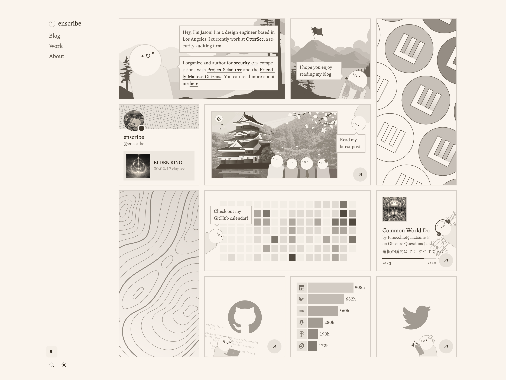
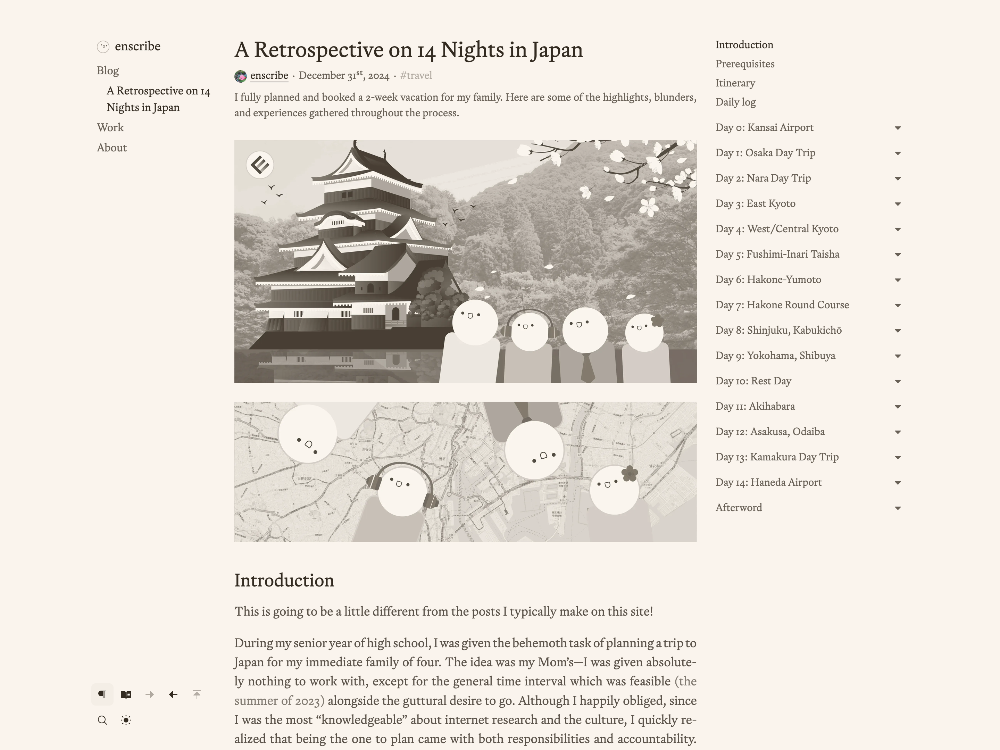
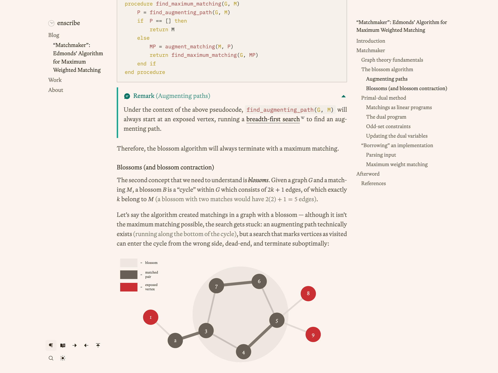
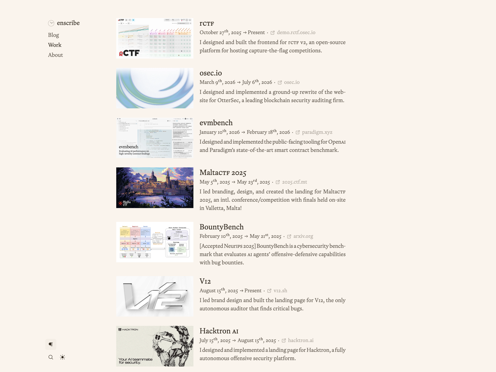
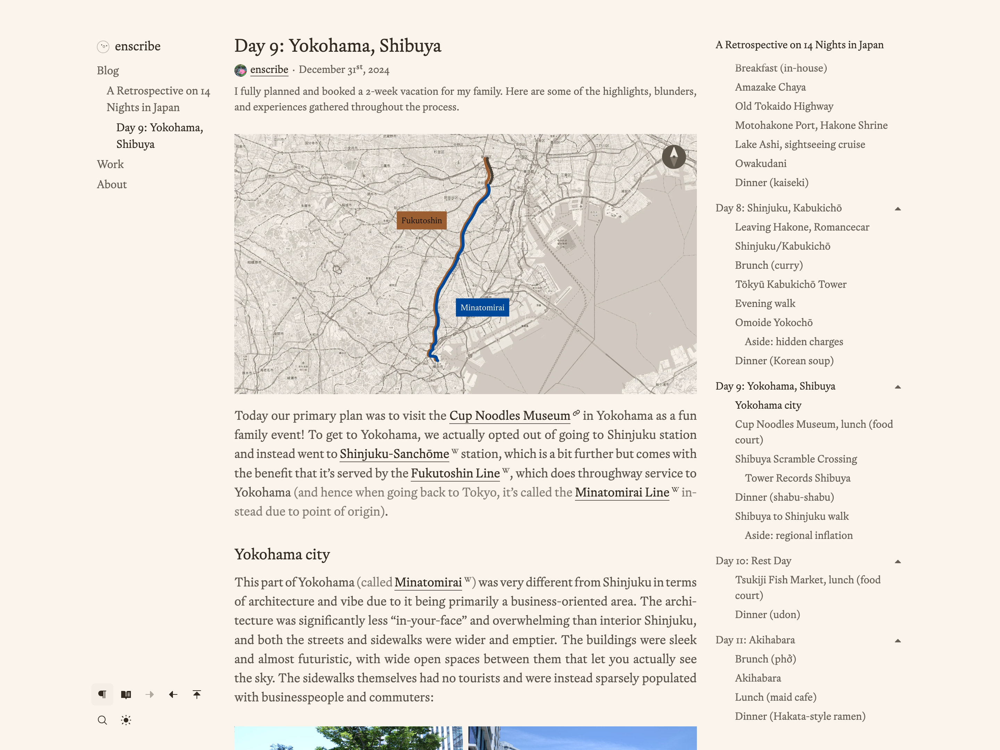

<picture><source media="(prefers-color-scheme: dark)" srcset="public/static/preview-1-dark.png" /></picture>

![Stargazers]
[![Code License]](LICENSE.md)
[![Content License]](LICENSE.content.md)

[enscribe.dev](https://enscribe.dev) is my personal blog and portfolio, built with [Astro](https://astro.build/) and vanilla CSS on top of my personal blogging template, [astro-erudite](https://github.com/jktrn/astro-erudite).

The majority of technology behind this website was designed for the sole purpose of augmenting and enhancing the reader experience without detracting from the content itself. I&rsquo;ve put a lot of care into this:

- I implemented the [Knuth&ndash;Plass line-breaking algorithm](https://en.wikipedia.org/wiki/Knuth%E2%80%93Plass_line-breaking_algorithm) using [Pretext](https://github.com/chenglou/pretext). The algorithm hyphenates and justifies text optimally for beautiful typesetting. This is a rare and experimental feature that I&rsquo;ve made a toggle due to its fragileness.
- The majority of graphics and images on the site are designed in both light and dark mode. If a graphic can be represented entirely as a vector, it is embedded directly onto the page and uses the same color variables as the site. If a graphic has raster elements, its luminance is [quantized](https://en.wikipedia.org/wiki/Quantization_(image_processing)) onto my constrained color scale.
- I use a rich typographic system with [Utopia](https://utopia.fyi/) type scales, old-style numerals, smart punctuation, muted parentheticals, and automatic small caps for acronyms and abbreviations.
- External links receive source-specific favicon glyphs so their destinations are recognizable.
- Posts support rich prose elements including theme-aware syntax-highlighted code, copyable commands, collapsible callouts, tabs, file trees, footnotes, MathML, and responsive tables.
- A &ldquo;reader&rdquo; mode exists to hide navigational elements, inline favicons, and underlined links to improve readability and reduce noise.

It is also designed to imbue as much of myself onto the site as possible. I present a lot of automatically collected data about myself (e.g., my GitHub calendar, my [WakaTime](https://wakatime.com/@jktrn) hours, my Spotify and Discord statuses), and I write with the same voice that I speak with.

You are not allowed to copy this website&rsquo;s source code as your own. Please read [Licensing](#licensing) for more details.

---

| <picture><source media="(prefers-color-scheme: dark)" srcset="public/static/preview-2-dark.png" /></picture> | <picture><source media="(prefers-color-scheme: dark)" srcset="public/static/preview-3-dark.png" /></picture> |
| ---------------------------------------------------------------------------------------------------------------------------------------------------------------------- | ---------------------------------------------------------------------------------------------------------------------------------------------------------------------- |
| <picture><source media="(prefers-color-scheme: dark)" srcset="public/static/preview-4-dark.png" /></picture> | <picture><source media="(prefers-color-scheme: dark)" srcset="public/static/preview-5-dark.png" /></picture> |

---

### Licensing

**enscribe.dev is source-available, not open source.** Unless stated otherwise, its site-specific code and visual design are proprietary and may not be copied, reused, or redistributed without permission. For an MIT-licensed foundation, use [jktrn/astro-erudite](https://github.com/jktrn/astro-erudite).

Original posts, images, and other published material are licensed under [CC BY-NC-ND 4.0](https://creativecommons.org/licenses/by-nc-nd/4.0/), which permits unchanged, attributed sharing for noncommercial purposes.

See [LICENSE.md](LICENSE.md) for the code and design terms and [LICENSE.content.md](LICENSE.content.md) for the content terms. Permission requests may be sent to [jason@enscribe.dev](mailto:jason@enscribe.dev).

[cc-by-nc-nd]: http://creativecommons.org/licenses/by-nc-nd/4.0/
[cc-by-nc-nd-shield]: https://img.shields.io/badge/License-CC%20BY--NC--ND%204.0-lightgrey.svg

[Stargazers]: https://img.shields.io/github/stars/jktrn/enscribe.dev?color=463f37&logo=github&logoColor=fff&style=flat-square
[Code License]: https://img.shields.io/badge/code%20license-proprietary-5d5449?style=flat-square&logo=github&logoColor=fff
[Content License]: https://img.shields.io/badge/content%20license-CC%20BY--NC--ND%204.0-756a5b?style=flat-square&logo=creativecommons&logoColor=fff
