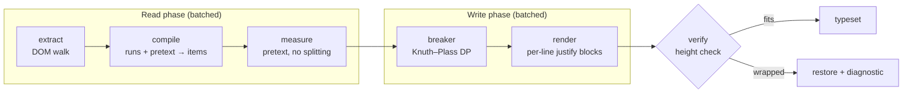
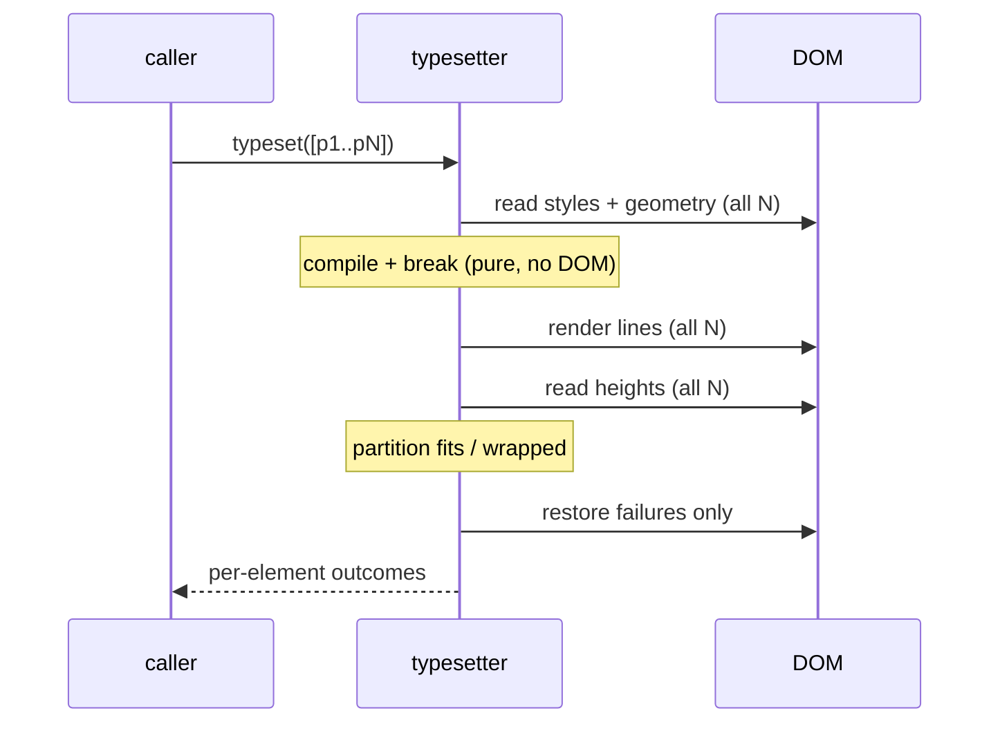

# refactor: Rebuild @enscribe/linebreak on browser-distributed justification - Plan

## Goal Capsule

**Objective.** Replace `packages/linebreak` with a ground-up implementation that chooses line breaks using a faithful Knuth–Plass model and hands intra-line space distribution back to the browser, eliminating the measure→render→correct loop that dominates the current package.

**Product authority.** This plan (`product_contract_source: ce-plan-bootstrap`). Product decisions were settled in session dialogue and are recorded in Key Technical Decisions and Assumptions.

**Open blockers.** None. The load-bearing cross-browser assumption was verified by spike before planning (see KTD-1).

---

## Summary

The current package computes line widths itself, authors `word-spacing` and `letter-spacing` deltas per line, then measures what the browser actually rendered and patches the deltas until they converge. That loop — plus the second measurement backend and retry machinery it needs — is roughly 1,600 of its 3,948 lines and every one of its forced layout reflows.

The rewrite keeps the part that carries typographic quality (choosing where lines break) and gives away the part the browser already does correctly (distributing space within a line). Each line renders as a block with `text-align: justify; text-align-last: justify`. Accuracy required of measurement drops from sub-pixel to roughly one word, which makes the correction loop unreachable rather than merely unnecessary.

---

## Problem Frame

`packages/linebreak` justifies prose on this site. It works, but three structural defects make it expensive to own:

**The cost model is not Knuth–Plass.** `src/layout/knuth-plass.ts` runs a shortest-path DP, but sums raw badness instead of squared demerits, drops the `1 +` line-count term, and adds break penalties linearly rather than inside the square. The squaring is what gives Knuth–Plass its minimax property — without it, one atrocious line hides behind ten good ones. Glue has no identity: `src/layout/line-model.ts:237` computes `r = (maxWidth − naturalWidth) / spaceWidth`, which implies stretch and shrink both equal the space's natural width, so thin spaces, unbreakable spaces and the standard `glue(0, ∞, 0)` finishing glue are all inexpressible. Lines with no spaces are scored on a fill ratio while spaced lines are scored on `r`, so the DP sums two incommensurable cost scales.

**Measurement destroys kerning, then the renderer compensates.** Pretext measures per segment via canvas. `src/text/breaks.ts:96` splits those segments further at every soft hyphen and code-break offset, so `beautiful` is measured as `beau` + `ti` + `ful` and intra-word kerning is lost at every hyphenation point. The resulting widths are systematically too wide, so `src/linebreaker/stabilize.ts` renders, measures the browser's actual output, patches spacing deltas within a 0.25px tolerance, re-measures, and — when that fails to converge — discards the canvas measurement entirely and re-measures through DOM Ranges. Two complete measurement backends that must agree, plus a runtime path to abandon one mid-commit.

**Failure is undiagnosable.** Roughly 20 distinct bail sites return bare `null` and collapse into two user-visible reasons. When a paragraph silently stops justifying there is no way to learn why. This is the mechanism by which the debt accumulated: nothing ever forced a bail to be named or noticed.

The performance cost follows from the second defect. Each `commit()` performs at least four write→read alternations against live DOM; `src/dom/geometry.ts:75` alone issues one `getComputedStyle` per line inside a loop that runs after a write.

---

## Requirements

| ID | Requirement |
|---|---|
| R1 | Line breaks are chosen by a Knuth–Plass optimizer over a real box/glue/penalty item stream, using TeX demerits `(1 + β + p)²` with flagged-penalty and fitness-class transition costs. |
| R2 | The browser performs all intra-line space distribution. The library never authors `word-spacing` or `letter-spacing` values. |
| R3 | Letter-spacing is not used as a justification mechanism anywhere. |
| R4 | Measurement never subdivides a pretext segment. Hyphenation break widths come from pretext's own prefix advances; line-end widths use its line-end advance field. |
| R5 | Every bail site emits a discriminated diagnostic naming the cause and the offending node, through a caller-supplied callback. The library reads no environment variables and logs nothing itself. |
| R6 | Any failure falls back to native browser rendering. A diagnostic never prevents the page from rendering. |
| R7 | Supported inline markup is at parity with the current package: text, `<code>`, links with trailing decorations, inline atoms, nowrap regions, nested wrappers. |
| R8 | A `typeset()` call over N paragraphs performs at most two DOM read phases and two write phases in total, independent of N. |
| R9 | The public API keeps the `plan` / `commit` split, plus `restore`, `invalidate`, `destroy`, `readMetrics`, and `cleanCopiedLinebreaks`. The `stale` result state is removed — `commit` re-solves a paragraph whose width moved since `plan` rather than handing the retry back to the caller. |
| R14 | The consumer contract is the kp-benchmark `opus-5` harness (`runs/opus-5/src/lib/typography/prose-linebreaks.ts`): structural block discovery, `IntersectionObserver` viewport priority, idle-sliced flushes, and resize teardown-and-rebuild. The library serves that shape rather than the site's previous `ProseTypesetter`. |
| R15 | The benchmark's correctness gates hold: rendered text and `Selection.toString()` match the JS-disabled render, and after a 1440→1040 px resize no more blocks overflow than in the JS-disabled control. |
| R10 | The package is private to this repository. No `publishConfig`, keywords, or npm-facing surface. |
| R11 | Justification behavior is verified in CI across Chromium, Firefox and WebKit. |
| R12 | Soft-hyphen hyphenation is preserved, including the rendered trailing hyphen. |
| R13 | Copying justified prose yields the authored text with line breaks resolved back to spaces. |

---

## Key Technical Decisions

### KTD-1. The browser distributes space; the library only chooses breaks

Each line renders as `display: block` with `text-align: justify; text-align-last: justify`. The final line of a paragraph uses `text-align-last: start` to stay ragged.

Knuth and Plass's own argument is that break *selection* carries the typographic quality; per-line space distribution is arithmetic browsers already perform correctly. Handing distribution back changes the accuracy demanded of measurement from sub-pixel to approximately one word, which is what makes the correction loop structurally impossible.

**Verified before planning.** A three-engine spike measured the right edge of the last inline element against the container edge:

| Case | Chromium | Firefox | WebKit |
|---|---|---|---|
| `block` + `text-align-last: justify` | 0.00px | 0.00px | 0.00px |
| `inline-block; inline-size: 100%` | 0.00px | 0.00px | 0.00px |
| With `<code>` / `<a>` / `<em>` children | 0.02px | 0.00px | 0.00px |
| With trailing inline-block atom | 0.00px | 0.00px | 0.00px |
| Control: no `text-align-last` | −193.9px | −193.8px | −193.9px |

The control confirms `text-align-last` is doing the work rather than the result occurring incidentally.

### KTD-2. Overflow is detected by height, not by `scrollWidth`

`text-align: justify` requires wrapping to be enabled, so `white-space: nowrap` cannot be used and an over-wide line wraps instead of overflowing. The same spike measured `scrollWidth − clientWidth = 0` on a line that had visibly wrapped to two rows — the current package's overflow guard at `src/linebreaker/stabilize.ts:339` cannot detect this class of failure.

Detection compares the paragraph's rendered height against `lineCount × lineHeight`. This is one read per paragraph, batched across the whole call.

### KTD-9. Glue does not shrink, because the browser cannot compress

Found by running the rewrite against real pages, and the single most consequential
correction to this plan.

TeX shrinks glue because it renders the line itself. CSS justification only ever
*stretches* spaces — it will not compress them to pull a line in. A line whose
natural width exceeds the measure therefore does not tighten, it wraps.

Carrying TeX's shrink ratio made the optimizer prefer exactly those lines, and
the height check then rejected them: 183 blocks fell back on a single article.
Zero shrink makes an over-wide line infeasible in the model too, which is the
truth about this renderer. It is the cost of KTD-1 and it is not optional.

### KTD-10. Hyphenation is a caller's choice, not a default

A visual line break is unavoidably a text boundary: the browser reports a newline
between two line boxes. Where the break fell on a space that is correct — the
space was consumed. Where it split a word it is not, and `feasible` reads back as
`fea sible`, so find-in-page stops matching the word.

Drawing the hyphen as CSS generated content keeps the character itself out of
`innerText`, the clipboard and find. Nothing removes the boundary.

The library therefore defaults to off; this site opts in, because without breaks
inside long words the optimizer can only stretch spaces and the result rivers.
Enabling it also resolved the plan's remaining infeasible paragraph, which was
the same starvation rather than a distinct defect.

### KTD-11. Ordinary outcomes are not diagnostics

A byline, a date and a tag link are blocks of text structurally and reach this
package the way a paragraph does. Reporting each one buried real failures under
page chrome.

The rule is definitional rather than a filter: a block yielding fewer than two
lines is not a paragraph, so a line-breaking library has no opinion about it.
That, an empty block, a measure below the minimum, and an unsupported writing
direction never reach the diagnostic sink. Everything else is something the
package meant to handle and could not, and is always reported.

### KTD-3. Glue carries TeX's classical ratios

Interword glue is `(w, y, z)` where `w` is the measured space width, `y = w / 2`, `z = w / 3`. These are TeX's published ratios for a 1/3-em space with 1/6-em stretch and 1/9-em shrink, expressed relative to the measured width so they hold for any font.

This replaces the current implicit `y = z = w`, and makes the adjustment ratio mean what it means in the paper.

### KTD-4. Paragraph termination uses the standard finishing glue

The item stream ends with `glue(0, ∞, 0)` followed by `penalty(−∞)`. The last line's badness is then zero by construction and the bespoke last-line demerit branch at `src/layout/line-model.ts:331` disappears.

### KTD-5. Active nodes are keyed by fitness class alone

Four fitness classes, as in the paper. The current implementation crosses fitness with a four-valued `hyphenRun` counter, producing sixteen states per breakpoint for no modeling gain — consecutive-hyphen cost is a transition-time comparison of two flagged penalties, not a state dimension.

### KTD-6. A safety margin absorbs residual measurement error

Because a wrapped line is a total failure for a paragraph while a slightly short line is invisible, feasibility reserves a small per-line margin so measurement error cannot cause a wrap. The margin is a policy constant, not a correction pass.

### KTD-8. The consumer is the benchmark harness, not the previous driver

`kp-benchmark` compares three agent integrations against a byte-identical copy
of this package; the runs differ only in `src/lib/typography`. The `opus-5`
harness is the reference consumer for this rewrite.

What that harness needs, and therefore what the API must keep:

- `plan` / `commit` as separate calls, so the harness can accumulate plans under
  an idle deadline and flush the DOM writes in one batch. This is the same
  read-phase/write-phase separation KTD-1 makes possible; exposing the boundary
  hands the scheduling decision to the caller, which is where it belongs.
- `restore` over re-rendering, `destroy` on teardown, `invalidate` when content
  or metrics change.
- `cleanCopiedLinebreaks` wired to the `copy` event — the benchmark's `copyOk`
  gate is specifically what catches injected breaks and soft hyphens reaching
  the clipboard.
- The `data-linebreak-atom` and `data-linebreak-decoration` conventions, which
  the site's markdown favicon plugin and music renderer already emit.

What it does not need, and is therefore removed: the `stale` state (the harness
only acts on `typeset`), and any retry contract. `commit` re-solves a paragraph
whose width moved since `plan`, which is affordable now that measurement is
cached and no correction pass exists.

The benchmark's framing also sharpens the goal. It treats the algorithm's cost
as fixed by the package and measures only how well an integration *schedules*
that cost. This rewrite reduces the fixed cost itself — the reflow storm a
harness currently has to schedule around — so the two efforts compound rather
than overlap.

### KTD-7. Diagnostics are a callback, not a log

A single discriminated `Diagnostic` union covers every bail site. The library emits; the caller decides policy. This keeps the package free of `import.meta.env` and lets the Playwright suite turn silent degradation into a test failure by throwing from the callback.

---

## High-Level Technical Design

Directional guidance for review. Prose and per-unit fields remain authoritative where they disagree.

### Pipeline



### Batching contract

The read/write separation is what satisfies R8. All paragraphs complete each phase before any paragraph enters the next.



Two read phases, two write phases, regardless of N. The current package performs four alternations per commit plus per-line `getComputedStyle`.

### Item model

Directional sketch, not a signature specification.

```
Item =
  | Box     { width, source }
  | Glue    { width, stretch, shrink, source }
  | Penalty { width, cost, flagged, source }

// legal breakpoint: a Penalty with cost < ∞,
//   or a Glue immediately preceded by a Box
// paragraph ends: Glue(0, ∞, 0), Penalty(−∞)

adjustmentRatio(line, target):
  slack = target − Σ width
  slack ≥ 0 ? slack / Σ stretch : slack / Σ shrink

feasible(r) = r ≥ −1 and r ≤ tolerance
badness(r)  = 100 · |r|³
demerits(r, penalty) =
  penalty ≥ 0    → (1 + badness + penalty)²
  penalty > −∞   → (1 + badness)² − penalty²
  penalty = −∞   → (1 + badness)²
  + α  when this break and the previous both flagged
  + γ  when |fitness − previousFitness| > 1
```

---

## Output Structure

```
packages/linebreak/
├── src/
│   ├── index.ts          public API
│   ├── types.ts          public types (options, outcomes, diagnostics)
│   ├── policy.ts         every tunable constant, one file
│   ├── diagnostics.ts    reason taxonomy + emit helper
│   ├── extract.ts        DOM walk → inline runs + text + wrapper edges
│   ├── compile.ts        runs + segmentation → box/glue/penalty stream
│   ├── measure.ts        pretext adapter (never splits segments)
│   ├── hyphenate.ts      soft-hyphen insertion + prefix advances
│   ├── code-breaks.ts    code-span penalty ladder (ported)
│   ├── breaker.ts        Knuth–Plass optimizer
│   ├── render.ts         lines → per-line justify blocks
│   ├── verify.ts         height-based overflow detection
│   ├── restore.ts        undo to authored content
│   ├── clipboard.ts      copy cleanup
│   └── styles.css
└── package.json          private, no publish surface
```

Scope declaration, not a constraint — per-unit `**Files:**` remain authoritative.

---

## Implementation Units

### U1. Policy, types, and diagnostics taxonomy

**Goal.** Establish the vocabulary the rest of the package is written against: the layout policy constants, the public option/outcome types, and the discriminated diagnostic union.

**Requirements.** R5, R9, R10.

**Dependencies.** None.

**Files.**
- `packages/linebreak/src/policy.ts` (create)
- `packages/linebreak/src/types.ts` (create)
- `packages/linebreak/src/diagnostics.ts` (create)
- `packages/linebreak/package.json` (modify — drop `publishConfig`, `keywords`, `files` entries for absent README/CHANGELOG)
- `tests/linebreak/unit/diagnostics.test.ts` (create)

**Approach.** `policy.ts` holds glue stretch/shrink ratios (KTD-3), the adjustment-ratio tolerance, the flagged-penalty cost α, the fitness-jump cost γ, the hyphenation penalty, and the per-line safety margin (KTD-6). Every constant carries a comment naming its origin — a TeX value, a spike measurement, or a tuning decision.

The diagnostic union enumerates one variant per bail site rather than a generic reason string: unsupported element, unsupported writing direction, insufficient width, whitespace-collapse mismatch, segmentation mismatch, measurement unavailable, no feasible breaking, line wrapped after render. Each carries the element and, where meaningful, the offending node.

**Patterns to follow.** `packages/linebreak/src/layout/default-policy.ts` for the shape of a frozen policy object; the existing `NativeReason` union in `packages/linebreak/src/types.ts` for the discriminated-union style.

**Test scenarios.**
- Each diagnostic variant constructs with its required fields and narrows correctly by `kind` in a switch (type-level, exercised via a compile-checked exhaustiveness helper).
- Emitting a diagnostic when no callback is configured is a no-op and does not throw.
- A callback that throws does not propagate out of the emit helper.
- `package.json` declares no `files` entry pointing at a nonexistent path.

**Verification.** `bun run typecheck` passes in the package; the manifest no longer claims absent files.

---

### U2. DOM extraction

**Goal.** Walk a block element and produce the inline runs, the collapsed text, the break restrictions, and the wrapper edge widths that later stages consume.

**Requirements.** R7.

**Dependencies.** U1.

**Files.**
- `packages/linebreak/src/extract.ts` (create)
- `tests/linebreak/unit/extract.test.ts` (create)

**Approach.** This is the one part of the current package whose size is irreducible — the repo's markdown pipeline emits `<code>`, links carrying trailing favicon decorations, inline atoms from `src/lib/markdown/link-favicons.ts` and `src/lib/music-render.ts`, math, inline SVG and nowrap regions, and all of them affect line width.

Port the existing structure rather than reinventing it: whitespace collapsing across inline boundaries, the atom/contents/inline/unsupported element classification, nowrap-owner tracking, wrapper edge measurement, and the anchor items that carry edge widths for wrappers holding no text. Simplify only where the old shape existed to serve the removed measurement tier.

Every early return becomes a typed diagnostic rather than a bare `null`.

**Patterns to follow.** `packages/linebreak/src/dom/extract.ts` — the algorithm is sound; it is the error handling and the downstream contract that change.

**Test scenarios.**
- Adjacent text nodes across nested inline wrappers collapse to a single space; leading and trailing whitespace is dropped.
- A wrapper containing only whitespace still contributes its inline padding/border/margin to the adjacent segment.
- `<br>` and `<wbr>` cause a typed `unsupported-element` diagnostic naming the node, not a bare failure.
- An element with `text-wrap-mode: nowrap` produces a break restriction spanning exactly its text range.
- A trailing `data-linebreak-decoration` element contributes to the trailing edge width and is not emitted as content.
- A `data-linebreak-atom` element becomes a single object-replacement item with the element's border-box width plus inline margins.
- An empty block, or one exceeding the character ceiling, produces the corresponding diagnostic.

**Verification.** Extraction of a representative prose paragraph, a code-bearing paragraph, and a favicon-link paragraph produces the expected item kinds and offsets.

---

### U3. Measurement without segment splitting

**Goal.** Produce per-segment widths from pretext without ever subdividing a segment, and expose intra-word prefix advances for hyphenation points.

**Requirements.** R4.

**Dependencies.** U1.

**Files.**
- `packages/linebreak/src/measure.ts` (create)
- `packages/linebreak/src/hyphenate.ts` (create)
- `tests/linebreak/unit/measure.test.ts` (create)

**Approach.** This unit removes the root cause of the old correction loop. Prepare each paragraph once through pretext and consume its segmentation as given. Where a break may fall inside a segment — a hyphenation point — take the width from pretext's prefix-advance data for that segment rather than measuring a substring independently. Where a segment ends a line, use its line-end advance rather than its raw width, so trailing letter-spacing is accounted for the way pretext's own breaker accounts for it.

Elements whose typography pretext cannot model faithfully (custom font-feature settings, variable-font axes not reflected in the canvas font string, text-transform, non-zero `word-spacing`) are not silently approximated — they emit a `measurement-unavailable` diagnostic and the paragraph falls back.

Hyphenation keeps the current `hyphen` dependency and the English pattern set, restricted to text that is not inside a `<code>` wrapper and not inside a nowrap region.

**Execution note.** The width contract is the defect this whole rewrite turns on. Write the width-agreement tests before the implementation, and include a case that fails against the current package's splitting approach so the regression cannot silently return.

**Patterns to follow.** `packages/linebreak/src/adapters/pretext.ts` for the locale-configuration shape only. The batched `\n`-delimited measurement hack in that file is deliberately not carried forward.

**Test scenarios.**
- A word with an interior hyphenation point measures the same total width whether or not the hyphenation point is exercised — no kerning is lost at the split.
- A segment ending a line uses the line-end advance; with non-zero letter-spacing this differs from the raw width by exactly one letter-space.
- An element with `font-feature-settings` other than `normal` yields a `measurement-unavailable` diagnostic rather than an approximated width.
- Text inside a `<code>` wrapper receives no soft hyphens.
- Text inside a nowrap region receives no soft hyphens and no break opportunities.
- A paragraph whose text pretext segments differently than the extracted text yields a `segmentation-mismatch` diagnostic rather than a silent null.

**Verification.** Summed segment widths for a paragraph agree with a DOM Range measurement of the same text within the per-line safety margin, across all three engines.

---

### U4. Compile to a box/glue/penalty stream

**Goal.** Turn inline runs plus measured segmentation into the item stream the optimizer consumes.

**Requirements.** R1, R3, R7, R12.

**Dependencies.** U2, U3.

**Files.**
- `packages/linebreak/src/compile.ts` (create)
- `packages/linebreak/src/code-breaks.ts` (create — ported)
- `tests/linebreak/unit/compile.test.ts` (create)

**Approach.** Words and atoms become boxes. Interword spaces become glue with the ratios from KTD-3. Hyphenation points become flagged penalties carrying the hyphen's width. Code-span break opportunities become unflagged penalties carrying the penalty ladder's cost. Break restrictions suppress breakpoints across their range. The stream terminates with the finishing glue and forced break from KTD-4.

Wrapper edge widths attach to the boxes at their range boundaries so a `<code>` span's padding is part of the line's natural width.

`code-breaks.ts` ports across essentially unchanged — the penalty ladder (separator, closing delimiter, operator, word separator, identifier boundary, letter/number boundary, emergency interior) is one of the genuinely good parts of the current package.

**Patterns to follow.** `packages/linebreak/src/text/code-breaks.ts` (port as-is); `packages/linebreak/src/layout/line-model.ts` `makeCandidates` for the breakpoint-legality rules, restated in KP terms.

**Test scenarios.**
- A space between two words yields exactly one glue whose stretch and shrink follow the policy ratios.
- A non-breaking space yields a box, not glue, and creates no breakpoint.
- A soft hyphen yields a flagged penalty whose width is the hyphen glyph's width.
- A break restriction spanning a nowrap region suppresses every breakpoint strictly inside it while preserving those at its boundaries.
- The stream always ends with infinite-stretch glue followed by a forced break.
- A code span produces penalties whose costs match the ladder, with the lowest cost at separator boundaries.
- A wrapper's inline padding appears exactly once, on the box at its range boundary, and is not double-counted when the wrapper spans multiple segments.

**Verification.** A representative paragraph compiles to a stream whose total natural width equals the sum of its parts, and whose legal breakpoints match the browser's own break opportunities for the same text.

---

### U5. Knuth–Plass optimizer

**Goal.** Choose the break sequence minimizing total demerits, using the paper's model.

**Requirements.** R1, R3.

**Dependencies.** U4.

**Files.**
- `packages/linebreak/src/breaker.ts` (create)
- `tests/linebreak/unit/breaker.test.ts` (create)

**Approach.** Active-node dynamic programming with prefix sums over width, stretch and shrink so each candidate line is O(1) to evaluate. Nodes carry position, line number, fitness class, total demerits and a back-pointer. Nodes deactivate when the line from them to the current breakpoint cannot shrink enough to fit, exactly as the paper specifies.

Demerits follow the formula in the High-Level Technical Design. Four fitness classes (KTD-5). Feasibility is `−1 ≤ r ≤ tolerance` with the safety margin from KTD-6 folded into the effective target width.

When no feasible sequence exists, the optimizer reports that as a typed outcome rather than returning null — the paragraph falls back to native and the diagnostic says why.

**Execution note.** The demerit formula is the correctness core and is pure arithmetic with no DOM dependency. Implement it test-first against hand-computed expectations, including the paper's own worked example.

**Patterns to follow.** `packages/linebreak/src/layout/knuth-plass.ts` for the DP skeleton and prefix-sum approach only. The cost functions are replaced wholesale.

**Test scenarios.**
- The paper's `AAA BB CC DDDDD` example at width 6 breaks after `AAA`, not after `BB`, and the greedy solution scores strictly worse.
- Squared demerits are applied: a layout with one very bad line and several perfect ones loses to a layout with uniformly mediocre lines at equal total badness.
- The `1 +` term breaks ties toward fewer lines when two layouts have equal badness.
- Two consecutive flagged breaks incur α exactly once per adjacent pair.
- A fitness jump of two classes incurs γ; a jump of one does not.
- The final line is never penalized for being short, by virtue of the finishing glue.
- A negative penalty is subtracted as `−p²` rather than added.
- A paragraph with no feasible breaking returns the infeasible outcome rather than throwing or returning null.
- Deactivation is correct: a node whose line cannot shrink to fit is removed and never reconsidered.

**Verification.** The optimizer reproduces the paper's example, and total demerits for a representative paragraph are strictly lower than a greedy first-fit baseline computed in the same test.

---

### U6. Rendering and clipboard

**Goal.** Emit per-line justify blocks, render chosen hyphens, and keep copied text faithful.

**Requirements.** R2, R3, R12, R13.

**Dependencies.** U5.

**Files.**
- `packages/linebreak/src/render.ts` (create)
- `packages/linebreak/src/restore.ts` (create)
- `packages/linebreak/src/clipboard.ts` (create)
- `packages/linebreak/src/styles.css` (create)
- `tests/linebreak/unit/render.test.ts` (create)

**Approach.** Each line becomes a block-level span carrying the line's inline content, with wrapper elements cloned and marked as fragments so their inline padding, borders and radii are suppressed on the sides where the wrapper was cut. The last line is marked so its `text-align-last` reverts to `start`.

No `<br>` elements and no spacing custom properties — block display supplies the line separation and the browser supplies the spacing. This removes `AuthoredSpacing`, `spacing.ts` and both `--kp-*-delta` properties from the design entirely.

A chosen hyphenation point renders a trailing hyphen marked `aria-hidden`. Each line records the break kind that produced it so clipboard cleanup can restore a space where the break consumed one.

Restoration replaces the rendered children with a clone of the authored content captured before the first render.

**Patterns to follow.** `packages/linebreak/src/dom/render.ts` for the wrapper-cloning and fragment-marking approach; `packages/linebreak/src/styles.css` for the fragment edge-suppression rules, which carry over.

**Test scenarios.**
- A line ending mid-wrapper produces fragment-marked clones on both lines, with start-side edges suppressed on the continuation.
- The last line is marked such that its computed `text-align-last` differs from the preceding lines'.
- A chosen hyphenation point renders a trailing hyphen that is `aria-hidden` and excluded from `textContent` reconstruction.
- Copying a selection spanning three rendered lines yields text with single spaces where space breaks occurred and no space where a hyphen break occurred.
- Copied HTML carries no library-internal data attributes.
- Restoration returns the element to a DOM structurally identical to the authored content.
- Image attributes designated for preservation survive both render and restore.
- A justified paragraph occupies the same height as the same paragraph rendered natively at a width producing the same line count — block-display lines must not alter vertical rhythm.
- A paragraph whose computed `line-height` is `normal` still renders and verifies, rather than producing a `NaN` comparison.

**Verification.** Rendered markup for a representative paragraph round-trips through restore to its authored form, and clipboard output matches the authored text.

---

### U7. Typesetter orchestration and verification

**Goal.** Compose the pipeline into the public API with batched DOM access and height-based verification.

**Requirements.** R5, R6, R8, R9.

**Dependencies.** U2, U3, U4, U5, U6.

**Files.**
- `packages/linebreak/src/index.ts` (create)
- `packages/linebreak/src/verify.ts` (create)
- `tests/linebreak/unit/typesetter.test.ts` (create)

**Approach.** `plan(element)` performs the read and compute work for one paragraph — style and geometry read, extraction, measurement, optimization — and returns an opaque handle. `commit(plans)` performs the batched write: render every plan, read every height in one pass, restore the failures. The split is the caller's scheduling seam, which is exactly what the harness's idle-slice flush needs.

`commit` re-checks each plan's width and re-solves rather than reporting `stale`. Re-solving is affordable because measurement is cached per element and only the optimizer re-runs.

`typeset(elements)` remains as a convenience that plans then commits in one call.

Verification compares rendered height against `lineCount × lineHeight`. A mismatch means a line wrapped — the paragraph restores and emits the `line-wrapped` diagnostic. This is the only post-render check; there is no correction pass and no second measurement backend.

`restore`, `invalidate` and `destroy` complete the surface. There is no `plan`/`commit` split, no `stale` outcome and no metrics accessor.

**Patterns to follow.** `packages/linebreak/src/linebreaker/linebreaker.ts` for the caching and lifecycle shape. `stabilize.ts` is deliberately not carried forward in any form.

**Test scenarios.**
- Typesetting N elements issues DOM reads in exactly two batched phases; no read occurs between two writes within a phase (asserted via an instrumented style/geometry reader).
- A paragraph whose rendered height exceeds the expected line count restores and emits `line-wrapped` naming the element.
- One element failing does not prevent its siblings in the same call from being typeset.
- `restore` on a never-typeset element is a no-op.
- `invalidate` discards cached measurement so the next call re-measures.
- `destroy` restores every element it typeset and makes subsequent calls inert.
- A diagnostic callback that throws does not abort the batch.
- An element narrower than the configured minimum emits `insufficient-width` and is left native.
- A right-to-left element emits `unsupported-direction` and is left native.

**Verification.** A batch of mixed-outcome paragraphs returns one outcome per input element, with failures restored to native and every failure accompanied by exactly one diagnostic.

---

### U8. Adopt the benchmark harness as the consumer

**Goal.** Replace the site's previous driver with the `opus-5` harness shape, adjusted for the new API.

**Requirements.** R5, R9, R14.

**Dependencies.** U7.

**Files.**
- `src/lib/typography/prose-linebreaks.ts` (create — port of the benchmark harness)
- `src/lib/typography/prose-typesetter.ts` (delete)
- `src/lib/typography/typeset-content.ts` (delete — the harness discovers blocks structurally)
- `src/components/ProseJustification.astro` (modify)
- `src/styles/typography.css` (modify)
- `tests/lib/typography/prose-linebreaks.test.ts` (create)

**Approach.** Port `runs/opus-5/src/lib/typography/prose-linebreaks.ts` rather than migrating the previous driver. Its structural block discovery replaces the hardcoded selector list, so list items, callout bodies and captions are covered without enumeration. Its `IntersectionObserver` plus idle-slice flush replaces the cohort/curtain/retry machinery, most of which existed to work around the removed stabilization pass.

Two adjustments to the ported harness. The `stale` branch disappears, since `commit` no longer returns it. And `reportError` receives the richer diagnostic — the harness keeps its `import.meta.env.DEV` gate, because policy belongs to the consumer.

Wire `cleanCopiedLinebreaks` to the `copy` event and pass a real `locale`; both are benchmark checklist items and neither is optional.

**Patterns to follow.** `runs/opus-5/src/lib/typography/prose-linebreaks.ts` verbatim where the API is unchanged.

**Test scenarios.**
- Block discovery finds a paragraph nested inside a callout without that container being enumerated anywhere.
- A block holding both text and nested blocks is skipped in favour of the nested blocks.
- Elements matching the not-prose list (`pre`, `table`, headings, `math`) are never collected.
- A batch containing one failing block still typesets the rest.
- Teardown restores every typeset block and disconnects both observers.
- A resize restores immediately and re-queues after the settle delay.
- Copying a selection spanning typeset blocks matches the JS-disabled text.

**Verification.** `bun run build` succeeds, `bun test tests/lib tests/linebreak/unit` passes, and the benchmark's `textOk` / `copyOk` / `reflowOk` gates hold when the harness is run against the measurement script.

---

### U9. Test suite migration and cross-engine verification

**Goal.** Carry the existing behavioral coverage onto the new implementation and pin the cross-browser guarantee in CI.

**Requirements.** R11, and regression cover for R1–R13.

**Dependencies.** U8.

**Files.**
- `tests/linebreak/e2e/fixture/scenarios/*.ts` (modify)
- `tests/linebreak/e2e/specs/typography.pw.ts` (modify)
- `tests/linebreak/e2e/specs/justification.pw.ts` (create)
- `tests/linebreak/unit/**` (remove specs for deleted modules)
- `packages/linebreak/package.json` (modify — scripts)

**Approach.** The Playwright config already runs Chromium, Firefox and WebKit, so R11 needs new assertions rather than new infrastructure. Add a spec that pins the KTD-1 spike as a permanent guarantee: for each engine, every non-final rendered line's content reaches the container's inline end within tolerance, and the final line does not.

Retire the unit specs for deleted modules (`stabilize`, `exact`, the batched-measurement adapter). Carry forward the scenario fixtures for content, layout and lifecycle, adapting them to the new API and result shape. Assertions that previously checked `state: "typeset"` map onto the new outcome shape; assertions that checked `stale` retry behavior are removed along with the concept.

**Test scenarios.**
- Every non-final line in a justified paragraph reaches the container's inline end within the safety margin, on all three engines.
- The final line remains ragged on all three engines.
- No rendered paragraph exceeds its expected height, on all three engines.
- A paragraph containing an unsupported element renders natively and emits exactly one diagnostic.
- A resize below the configured minimum width restores every block to native.
- Justified output for a paragraph containing a code span and a favicon link fits its container on all three engines.
- A typeset paragraph's height matches the same content rendered natively at an equivalent line count, on all three engines — the vertical-rhythm guarantee.

**Verification.** `bun run check` in `tests/linebreak` passes, including the three-engine Playwright run.

---

## Verification Contract

| Gate | Command | Scope |
|---|---|---|
| Types | `bun run typecheck` | `packages/linebreak`, `tests/linebreak`, site root |
| Lint / format | `bunx biome check` | changed files |
| Package unit tests | `bun test unit` | `tests/linebreak` |
| Package build | `bun run build` | `packages/linebreak` (publint and attw gates) |
| Cross-engine behavior | `bun run test:e2e` | `tests/linebreak`, all three projects |
| Site tests | `bun test` | repository root |

The cross-engine run is the gate that matters most: it is the only check that can catch a regression in the KTD-1 assumption.

---

## Scope Boundaries

**In scope.** Full replacement of `packages/linebreak/src`, migration of the committed `ProseTypesetter` consumer, and migration of the existing test suite.

**Non-goals.**
- Narrowing the supported markup surface. Extraction stays approximately its current size; the savings come from the removed measurement and stabilization tier.
- Right-to-left and vertical writing modes. The current package declines these and the rewrite continues to decline them, now with a typed reason.
- Variable line widths, page breaking, and the paper's looseness parameter. Knuth–Plass supports them; this site does not need them.
- Optical margin alignment and hanging punctuation.
- Replacing pretext. It remains the segmentation and measurement engine; the rewrite uses more of its API, not less.

### Deferred to Follow-Up Work

- Reconciling the in-flight `typesetting-queue.ts` scheduling work (see Assumptions).
- Any replacement for the removed `?kp-benchmark` instrumentation, should performance measurement be wanted again.
- Publishing the package, should it ever be wanted — U1 removes the surface but leaves the boundaries clean.

---

## Assumptions

Recorded rather than confirmed in dialogue, and open to correction.

1. **The consumer is the benchmark harness, not either version in the working tree.** This plan targets a clean worktree at `8073e26`. Roughly 900 lines of uncommitted scheduling work — a 730-line `prose-typesetter.ts` revision plus a new `typesetting-queue.ts` — exist in the primary working tree and are deliberately excluded, as is the 316-line committed driver. U8 ports the `opus-5` benchmark harness instead. Both working-tree versions are superseded rather than migrated, which is a larger deletion than originally planned and should be confirmed before U8 lands.
2. **"Significantly faster" is structural, not a wall-clock target.** Success is R8's batching contract plus no visual regression. No baseline measurement was captured.
3. **The safety margin can absorb residual measurement error.** Verified in principle by U3's cross-engine width-agreement test; the constant's value is tuned during implementation.
4. **Hyphenation quality is unchanged.** The same `hyphen` dependency and English pattern set carry over; hyphenation behavior is not a target of this rewrite.
5. **The site authors no non-zero `letter-spacing` on justified prose.** A repository scan found only `letter-spacing: inherit` and `letter-spacing: normal`. U3 emits a diagnostic rather than approximating if this stops holding.

---

## Risks & Dependencies

| Risk | Impact | Mitigation |
|---|---|---|
| A future browser changes `text-align-last` behavior on single-line blocks | Justification silently degrades | U9 pins the guarantee as a three-engine CI assertion, so a regression fails the build rather than shipping |
| Canvas-measured widths diverge from DOM layout beyond the safety margin | Lines wrap; paragraphs fall back | KTD-2 height check catches every instance; U3 declines to measure typography pretext cannot model rather than approximating |
| Pretext's internal fields are undocumented and the package is pinned to `0.0.8` | An upgrade breaks measurement | The dependency stays pinned exactly; U3's width-agreement tests fail loudly on any upstream change |
| Extraction is ported rather than rewritten, carrying latent defects | Bugs survive the rewrite | U2 re-derives the error handling and contract even where the algorithm carries over, and adds unit coverage the original lacked |
| The rewrite lands while the in-flight queue branch diverges further | Painful reconciliation | Assumption 1 names it explicitly; the longer both run, the larger it grows |
| Block-display line spans change vertical rhythm | Justified paragraphs sit at a different height than native ones, shifting page layout | The current package uses `inline-block` with `vertical-align: top`; KTD-1 changes this to `display: block`, which replaces the inline formatting context with anonymous block boxes. The spike verified horizontal justification only. U6 and U9 add explicit vertical-geometry assertions against native rendering |

**Dependencies.** `@chenglou/pretext@0.0.8` (pinned exact), `hyphen@1.14.1`. No new dependencies.

---

## Open Questions

Deferred to implementation, not blockers.

1. The per-line safety margin's value — determined empirically in U3 from cross-engine width agreement.
2. Whether the adjustment-ratio tolerance needs a second, looser pass when the first finds no feasible breaking, as the paper's dual-threshold approach suggests. Decide after U5 shows how often paragraphs go infeasible on real content.
3. Whether anchor items remain necessary once wrapper edges attach at compile time rather than measurement time. Resolve in U4.
4. Exact module boundaries between `compile.ts` and `measure.ts` if compilation proves to need measurement feedback.
5. How the height check resolves `line-height: normal`, where the computed value is not a number. Options are reading it from a probe, deriving it from font metrics, or declining to typeset such elements with a typed diagnostic. Decide in U7 once real content shows whether the case arises.

---

## Definition of Done

- Every Verification Contract gate passes, including the three-engine Playwright run.
- No file under `packages/linebreak/src` authors `word-spacing` or `letter-spacing`.
- No code path performs a DOM read between two DOM writes within a phase.
- Every bail site emits a typed diagnostic; a repository search finds no bare `null` returns standing in for a failure reason.
- The consumer is the ported benchmark harness; no reference to `stale` survives anywhere.
- `cleanCopiedLinebreaks` is wired to the `copy` event and a real `locale` is passed.
- `packages/linebreak/package.json` declares no publish surface and no absent files.
- The optimizer reproduces the Knuth–Plass paper's worked example.

---

## Sources & Research

- Knuth, D. E. and Plass, M. F., "Breaking paragraphs into lines", *Software: Practice and Experience* 11 (1981), 1119–1184 — the demerit formula, fitness classes, finishing glue, active-node deactivation, and the letterspacing guidance behind R3.
- `@chenglou/pretext@0.0.8` source, `src/layout.ts` and `src/measurement.ts` — segment width semantics, line-end advances, and prefix advances for breakable segments.
- Three-engine spike run during planning, results in KTD-1 and KTD-2.
- Current implementation under `packages/linebreak/src`, read in full; specific defects cited by path in Problem Frame and Key Technical Decisions.
- `kp-benchmark` — `control/BENCHMARK.md` for the correctness gates, scheduling metrics and API discovery checklist; `runs/opus-5/src/lib/typography/prose-linebreaks.ts` for the reference consumer. The package under `runs/opus-5` is byte-identical to the one being replaced, so the runs isolate harness quality from library quality.
