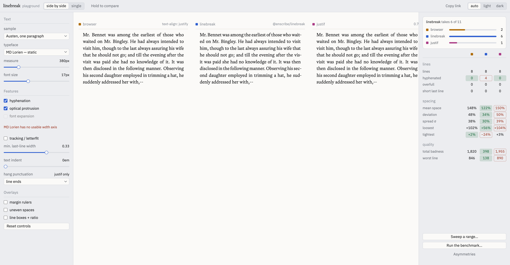

# @enscribe/linebreak

Paragraph-wide line breaking for justified web text, based on the algorithm
Donald Knuth and Michael Plass built for TeX.

With the browser's default wrapping strategy, each line takes the next break
that fits. [`text-wrap: pretty`](https://www.w3.org/TR/css-text-4/#text-wrap-style)
can look farther ahead, but the details vary by browser. This package uses one
explicit cost model for the whole paragraph. It chooses the sequence of breaks
that produces the most even spacing, then renders those lines back into the
page.

```sh
npm install @enscribe/linebreak
```

## Start here

Import the automatic browser entry and its required CSS:

```ts
import { createTypesetter } from "@enscribe/linebreak/auto"
import "@enscribe/linebreak/styles.css"

const typesetter = createTypesetter()
await typesetter.start()
```

Mark the part of the page that contains prose:

```html
<article data-linebreak-root>
  <p>Paragraphs inside this root are discovered automatically.</p>
</article>
```

The automatic entry waits for fonts, works near the viewport first, limits
work per frame, responds to width and font changes, restores authored content
for print, and repairs copied text. If JavaScript fails or a paragraph cannot
be modelled safely, the browser keeps control of that paragraph.

For tests that need to wait for the queue:

```ts
await typesetter.start()
await typesetter.settled
```

## Choose an entry point

The package is split into four layers. Import only the layer you need.

| Import | Use it when | DOM | Runtime dependencies |
| --- | --- | --- | --- |
| `@enscribe/linebreak/auto` | You want discovery, scheduling, and browser lifecycle handling | yes | `@chenglou/pretext` |
| `@enscribe/linebreak` | You already have a scheduler and want direct DOM control | yes | `@chenglou/pretext` |
| `@enscribe/linebreak/text` | You can supply text widths and want compiled layout items | no | none |
| `@enscribe/linebreak/layout` | You already have boxes, spaces, and break opportunities | no | none |

The English hyphenation patterns live in a separate entry:
`@enscribe/linebreak/hyphenation`. They are never loaded unless you import
them.

## How the line breaker works

Knuth and Plass model a paragraph as a stream of three things:

- boxes with fixed widths, such as words and inline objects;
- glue with a natural width and limits for stretching or shrinking;
- penalties that make a break attractive, expensive, forbidden, or forced.

The optimizer considers every feasible route through that stream. For each
candidate line, it measures how far the spaces must move from their natural
width. It adds costs for poor spacing, consecutive hyphens, abrupt changes in
line tightness, and any explicit break penalties. The winning route has the
lowest total demerits for the paragraph.

The browser integration adds four steps around that optimizer:

1. Read the paragraph, its inline structure, and its computed styles.
2. Measure words, spaces, punctuation, wrappers, and inline objects.
3. Solve all line breaks together.
4. Write inline, non-wrapping line spans and verify that they still fit.

The implementation follows TeX82 and the defaults from `plain.tex`, with two
documented differences: `\looseness` is not implemented, and dictionary
hyphenation points remain available during the first pass. Keeping those
points active avoids accepting a merely adequate unhyphenated paragraph before
the better hyphenated route can be considered.

See [the original Knuth–Plass paper](#references) for the algorithm and
[TeX compatibility](#tex-compatibility) for the shipped policy values.

## Automatic browser integration

`createTypesetter()` discovers the deepest prose-bearing blocks under each
root. Its default skip list covers code blocks, tables, form controls,
editable content, scripts, styles, SVG, and MathML. Add another selector with
`skip`, make a final decision with `filter`, or replace discovery with
`blocks`.

### Discovery and scheduling

| Option | Default | Purpose |
| --- | --- | --- |
| `roots` | `[data-linebreak-root]`, then `<body>` | Select or provide the roots to scan |
| `skip` | built-in skip list | Add a selector for content to ignore |
| `filter` | none | Accept or reject each discovered block |
| `blocks` | `proseBlocks` | Replace block discovery |
| `lazy` | `true` | Typeset near the viewport first; pass `{ margin }` to tune the range |
| `budget` | 12 blocks or 6 ms | Limit work in each animation frame |

### Page lifecycle

| Option | Default | Purpose |
| --- | --- | --- |
| `fonts` | `true` | Wait for loaded fonts and remeasure when fonts change |
| `resize` | `true` | Recompose after a paragraph's width changes |
| `print` | `true` | Restore authored content during print |
| `copy` | `true` | Restore authored text when a generated paragraph is copied |
| `beforeWrite`, `afterWrite` | none | Bracket every DOM-writing phase |
| `signal` | none | Dispose when an `AbortSignal` is aborted |

DOM writes can change a paragraph's height. The write hooks can preserve a
reading anchor around that change:

```ts
createTypesetter({
  beforeWrite: captureReadingAnchor,
  afterWrite: restoreReadingAnchor,
})
```

Use `stop()` to restore everything and pause observers. Use `refresh()` after
a layout-mode change, `rescan()` after adding content, and `typeset(elements)`
for immediate work that should ignore viewport laziness. `dispose()` removes
observers, listeners, generated lines, and cached state.

### Fonts and first paint

By default, `start()` waits for `document.fonts.ready`. Until then, the page
uses the browser's own wrapping. This avoids solving against a fallback font
whose advances will change as soon as the intended face loads.

Script placement still controls how long the native paragraph remains visible.
Place the module where it suits the rest of the page's loading strategy. A
render-blocking script can shorten that interval, but it also delays first
paint. The package does not make that trade for you.

## Control the typography

These options work with both browser entries.

| Option | Default | Effect |
| --- | --- | --- |
| `locale` | nearest `lang`, then `<html lang>`, then `en-US` | Sets segmentation and hyphenation locale |
| `minimumWidth` | `240` | Leaves narrower elements under native wrapping |
| `hyphenate` | none | Adds dictionary hyphenation points |
| `protrude` | `true` | Lets eligible punctuation hang slightly past the measure |
| `expand` | `false` | Lets a responsive width axis adjust eligible glyph widths by up to 2% |
| `track` | `false` | Lets letter spacing adjust eligible box widths by up to 3% |
| `lastLineMinWidth` | `0` | Discourages a final line shorter than this fraction of the measure |
| `emergencyStretch` | `"auto"` | Extra stretch available to fallback passes, in pixels |
| `preserveImageAttributes` | `[]` | Copies named live attributes to rebuilt images |
| `policy` | TeX defaults | Overrides tolerances, penalties, and demerits |
| `glue` | `{ stretch: 1/2, shrink: 1/3 }` | Sets how far word spaces may move |
| `safetyMargin` | `0.5` | Leaves a subpixel guard against browser quantization |
| `retries` | `3` | Narrows and resolves lines that wrap after rendering |
| `maximumCharacters` | `3000` | Declines longer collapsed paragraphs |
| `onOutcome` | none | Receives the result for every element |

### Hyphenation

The package ships an English hyphenator behind its own import:

```ts
import { createTypesetter } from "@enscribe/linebreak/auto"
import { englishHyphenator } from "@enscribe/linebreak/hyphenation"

const typesetter = createTypesetter({ hyphenate: englishHyphenator })
await typesetter.start()
```

It only returns points for English locales and words at least five characters
long. Results are memoized in a bounded cache because prose repeats many words.
Authored soft hyphens remain available with or without a dictionary.

A custom hyphenator has this shape:

```ts
type Hyphenator = (
  word: string,
  locale: string,
) => readonly number[] // UTF-16 offsets inside word
```

### Protrusion, expansion, and tracking

Protrusion makes the visible margin look straighter by moving eligible
punctuation slightly outside it. The values come from the LaTeX `microtype`
tables and are priced inside the optimizer, so they can change which breaks
win. Code, inline objects, bordered wrapper edges, and inset monospace runs do
not protrude.

Font expansion shares a small amount of a line's adjustment with a variable
font's width axis. The browser engine first checks how the actual face responds
to `font-stretch`; a nominal percentage is not assumed to equal the same change
in advance width. After rendering, any remaining overset is taken back from
word spacing. A paragraph with an authored `font-stretch` or `wdth` value is
left under native layout.

Tracking shares adjustment with `letter-spacing`. It is only used when the
paragraph has uniform authored letter spacing. Expansion and tracking can be
enabled together, and the optimizer treats them as one limited adjustment
pool.

```ts
createTypesetter({
  protrude: true,
  expand: true,
  track: true,
  lastLineMinWidth: 0.33,
})
```

`lastLineMinWidth` is a soft floor for the last line. It tries stricter break
routes first, then falls back to a continuous penalty if no route can meet the
floor. An authored `<br>` is never penalized for making a short final line.

`emergencyStretch` corresponds to TeX's `\emergencystretch`. When the normal
passes fail, it adds the configured stretch to each line. Higher values can
reduce overflow but loosen word spacing; `"auto"` uses 12 times the paragraph's
mean space width.

The DOM engine also reads ordinary first-line `text-indent`, including
percentages and negative values. The `hanging` and `each-line` forms affect
other lines and are declined because a single first-line inset cannot model
them.

## Use the DOM engine directly

Use the root entry when your application already owns scheduling:

```ts
import { createLinebreaker, proseBlocks } from "@enscribe/linebreak"
import { englishHyphenator } from "@enscribe/linebreak/hyphenation"

const linebreaker = createLinebreaker({ hyphenate: englishHyphenator })
const article = document.querySelector("article")!

linebreaker.warm(document)
const outcomes = linebreaker.typeset(proseBlocks(article))
```

`typeset()` batches `compose()` and `apply()`. Split them when you need to
inspect a composition before writing:

```ts
linebreaker.warm(document)

const blocks = proseBlocks(article)
const compositions = linebreaker.compose(blocks)
const selected = compositions.filter(
  (composition) => composition.status === "ready" && composition.lines >= 4,
)

const selectedOutcomes = linebreaker.apply(selected)
```

Keep all reads in `compose()` and all writes in `apply()` to avoid a layout
flush per paragraph. `warm(document)` performs and caches the one capability
probe needed by punctuation protrusion. Call it inside your own write bracket
before the first composition. `createTypesetter()` does this during `start()`.

Every method accepts an iterable. `restore()` removes generated lines,
`reset()` also drops measurements and remembered outcomes, `refresh()` keeps
font measurements but clears width-dependent state, and `dispose()` restores
everything before making the instance unusable.

### Outcomes and fallback

Content problems do not throw. Every element returns one outcome:

```ts
type Outcome =
  | { element: HTMLElement; status: "typeset"; lines: number; retries: number }
  | { element: HTMLElement; status: "skipped"; reason: SkipReason }
  | { element: HTMLElement; status: "declined"; reason: DeclineReason }
  | { element: HTMLElement; status: "failed"; reason: FailureReason; cause?: unknown }
```

| Status | Meaning | Reasons |
| --- | --- | --- |
| `typeset` | Generated lines are active | line count and retry count are returned |
| `skipped` | Work was unnecessary | `single-line`, `empty`, `too-narrow`, `already-typeset` |
| `declined` | The content could not be represented safely | `unsupported-content`, `unsupported-direction`, `unsupported-writing-mode`, `too-long`, `unmeasurable`, `segmentation-mismatch`, `no-feasible-breaking` |
| `failed` | A write was checked, reverted, and reported | `layout-mismatch`, `unstable-width`, `line-height-unresolved`, `render-failed` |

Anything outside `typeset` remains in, or is restored to, native browser
layout. `isExpected(outcome)` accepts successes and ordinary skips.
`consoleReporter()` reports declines and failures without filling the console
with routine skips.

Programmer errors still throw, including use after disposal, applying a
composition twice, or applying one created by another instance.

## Compile text without a DOM

`@enscribe/linebreak/text` turns strings and caller-supplied widths into the
same item stream used by the browser engine. It is synchronous, has no DOM,
and has no package dependencies.

```ts
import { breakParagraph } from "@enscribe/linebreak/layout"
import { compileText, createMetrics } from "@enscribe/linebreak/text"

const metrics = createMetrics({
  measure: (text) => text.length * 7.5,
  font: "demo-monospace",
})

const compiled = compileText(
  "The optimizer can run wherever text advances can be measured.",
  metrics,
  { protrude: true },
)

if (compiled.ok) {
  const result = breakParagraph(compiled.items, 420, {
    ...(compiled.hangs ? { hangs: compiled.hangs } : {}),
    ...(compiled.flex ? { flex: compiled.flex } : {}),
  })

  if (result.ok) console.log(result.lines)
}
```

This example models a simple 7.5-unit monospace font. In real use, replace it
with Canvas, a font shaper, or another source of text advances. The measurement
function must return an advance for any substring it receives.
`createMetrics()` also accepts `letterSpacing`, a font identifier, and a custom
segmenter. A custom segmenter must tile the source string exactly or compilation
returns `segmentation-mismatch`.

Use `compileRuns()` for mixed fonts, code, wrapper edge widths, and zero-width
anchors. Each text run can carry its own metrics and flags. `nowrap` takes
half-open source ranges over the concatenated text:

```ts
import { compileRuns } from "@enscribe/linebreak/text"

const compiled = compileRuns(
  [
    { text: "Run ", metrics: bodyMetrics },
    { text: "npm test", metrics: codeMetrics, code: true },
    { text: " before publishing.", metrics: bodyMetrics },
  ],
  bodyMetrics,
  { nowrap: [{ start: 4, end: 12 }] },
)
```

The text entry expects whitespace that has already been collapsed for its
target environment. It does not impose the DOM engine's 3,000-character limit.
Replaced content, forced breaks, and `text-indent` still require the DOM tier.
Right-to-left text, CJK line-breaking rules, and bundled non-English
hyphenation are outside the package's current scope.

## Use the optimizer directly

`@enscribe/linebreak/layout` is the lowest layer. Give it measured items and a
line width:

```ts
import {
  box,
  breakParagraph,
  glue,
  paragraphEnd,
} from "@enscribe/linebreak/layout"

const items = [
  box(40),
  glue(4, 2, 1.33),
  box(55),
  ...paragraphEnd(),
]

const result = breakParagraph(items, 380)
if (result.ok) {
  console.log(result.pass, result.demerits, result.lines)
}
```

The item constructors are `box`, `glue`, `penalty`, and `discretionary`.
`lineBreak()` creates TeX's no-break, infinitely stretchable fill, and forced
break sequence.
`paragraphEnd()` adds the final fill and forced break that every paragraph
needs.

`breakParagraph()` tries pretolerance, tolerance, emergency stretch, and a
final containment pass. It reports the pass that succeeded.
`breakParagraphOnce()` runs one explicit tolerance and is useful for tests and
custom policies. `fitLines()` and `trackLines()` turn expansion and tracking
budgets into per-line adjustments.

### TeX compatibility

`texDefaults` contains the `plain.tex` values:

| Policy value | Default | Purpose |
| --- | ---: | --- |
| `pretolerance` | `100` | First-pass badness limit |
| `tolerance` | `200` | Later-pass badness limit |
| `linePenalty` | `10` | Base cost of every line |
| `hyphenPenalty` | `50` | Cost of a printed hyphen |
| `exHyphenPenalty` | `50` | Cost of a break after an existing hyphen |
| `adjDemerits` | `10000` | Cost of a large fitness-class change |
| `doubleHyphenDemerits` | `10000` | Cost of consecutive hyphenated lines |
| `finalHyphenDemerits` | `5000` | Cost of ending the penultimate line with a hyphen |

Tolerances are TeX badness values. A negative `pretolerance` skips that pass;
a negative `tolerance` admits no line. Positive penalties add their square to
line demerits, matching TeX82 rather than the earlier formula in the 1981
paper.

## Generated markup and CSS

A typeset paragraph remains one inline formatting context:

```html
<p data-linebreak-typeset="3">
  <span data-linebreak-line="space">First line</span>
  <span data-linebreak-line="hyphen">Second li</span><wbr>
  <span data-linebreak-line="end">ne and the rest.</span>
</p>
```

Each line span is inline and cannot wrap internally. The boundary between
spans contains the space, `<wbr>`, or authored `<br>` that belongs there.
`data-linebreak-line` records whether the line ended with `space`, `hyphen`,
`forced`, `none`, or `end`.

This shape preserves the paragraph's inline flow, intrinsic sizing,
find-in-page behavior, scroll-to-text matching, and `textContent` across line
boundaries. Inline wrappers that cross a break are cloned into fragments. Only
the first fragment keeps an `id`.

The stylesheet has two cascade layers. `linebreak.core` contains required
layout rules. `linebreak.theme` contains the default justification and the
drawn hyphen, which can be changed with `--linebreak-hyphen`. Unlayered project
CSS overrides both layers without `!important`.

The replacement hyphen should have the same advance as the measured U+002D
hyphen. A visibly different width can move the rendered line away from the
model.

### Markup attributes

Import the shared names from `@enscribe/linebreak/attributes` when build-time
code and runtime code need the same contract.

| Attribute | Purpose |
| --- | --- |
| `data-linebreak-root` | Marks a subtree for automatic discovery |
| `data-linebreak-skip` | Leaves a subtree under native wrapping |
| `data-linebreak-atom` | Measures an inline element as one indivisible object |
| `data-linebreak-decoration` with `aria-hidden="true"` | Counts a decorative child's width without treating its text as prose |
| `data-linebreak-decoration-position="after"` | Places that decoration on the trailing edge |

`text-wrap-mode: nowrap` blocks automatic breaks inside its range. Authored
`<br>` and `<wbr>` elements still apply.

### Copying generated text

Generated line spans change the browser's default serialization of a
selection. The copy handler returns the authored text:

```ts
import { handleCopy } from "@enscribe/linebreak"

document.addEventListener("copy", handleCopy, { signal })
```

The automatic entry registers this handler unless `copy: false` is set.

## Supported content and limits

The DOM engine supports left-to-right text in horizontal writing mode with
normal whitespace collapsing. It handles inline wrappers, inline code, images,
inline replaced content, disabled inputs, `<br>`, `<wbr>`, soft hyphens, and
nowrap ranges. Font feature and variant settings that Canvas cannot model are
measured with a batched, off-screen DOM probe.

It declines content whose browser layout cannot be represented faithfully,
including:

- right-to-left or vertical text;
- nested block layout and enabled form controls;
- preserved whitespace, nonzero `word-spacing`, or transformed text;
- authored font width settings and multi-line indent modes;
- paragraphs beyond the configured character limit.

Inline elements are cloned when a wrapper crosses a generated line. Direct
event listeners, object identity, and arbitrary runtime state on those nodes
do not survive cloning. Prefer delegated events. Use `preserveImageAttributes`
for image attributes that change after load.

An ancestor with `overflow: hidden` or `overflow: clip` can cut off protruding
punctuation. Set `protrude: false` for that subtree. Content-sized boxes are
checked after writing; if their width moves, the paragraph is restored with an
`unstable-width` outcome.

## Compare the rendered result

The checked-in playground places native browser wrapping,
`@enscribe/linebreak`, and [Justif](https://github.com/lyallcooper/justif) in
the same font and measure. Its report uses rendered word rectangles rather
than either library's internal score. It counts lines, hyphens, overfull lines,
short endings, space-width deviation, and TeX badness.



Reproduce the comparison from the repository root:

```sh
git clone --depth 1 --branch v0.7.0 \
  https://github.com/lyallcooper/justif.git \
  ~/.linebreak-bench/justif

bun run --cwd packages/linebreak playground
```

Set `JUSTIF_PATH` to use another checkout. The playground reads its version
from that checkout and stores settings in the URL for sharing.

### Sweep a range

A sweep plots line count, hyphens, spacing, and badness across a range of
column widths or font sizes. Drag a chart to apply that value to the live
comparison.


### Run the benchmark

The benchmark compares the two libraries across combinations of feature flags,
measures, font sizes, and samples. The browser is an unranked baseline, and
ties do not count.


Both projects apply Knuth–Plass ideas to browser text. This package focuses on
measured Latin prose, TeX-compatible policy, explicit outcomes and fallback,
separate browser and headless layers, and a rendered-output comparison harness.
Justif currently covers more languages and writing systems, including CJK and
right-to-left text. The playground makes the trade concrete for the content
you intend to ship.

## Development

From the repository root:

```sh
bun run --cwd packages/linebreak check
bun test tests/linebreak/unit
bun run --cwd packages/linebreak playground:typecheck
```

`@chenglou/pretext` is pre-1.0 and intentionally pinned. The DOM adapter reads
three fields from its prepared paragraphs through a structural type, so an
upstream contract change fails typechecking instead of becoming a silent
measurement error.

## References

- Donald E. Knuth and Michael F. Plass,
  [“Breaking Paragraphs into Lines”](https://typographix.binets.fr/files/knuth-plass-breaking.pdf),
  *Software: Practice and Experience* 11 (1981), 1119–1184.
- Donald E. Knuth,
  [TeX82 annotated source](https://mirrors.ctan.org/systems/knuth/dist/tex/tex.web).
- Donald E. Knuth,
  [`plain.tex`](https://mirrors.ctan.org/macros/plain/base/plain.tex).
- Robert Schlicht,
  [`microtype`](https://ctan.org/pkg/microtype), the source for the Latin
  protrusion values.
- W3C,
  [CSS Text Module Level 4](https://www.w3.org/TR/css-text-4/), including the
  current browser-facing wrapping and justification model.

MIT.
