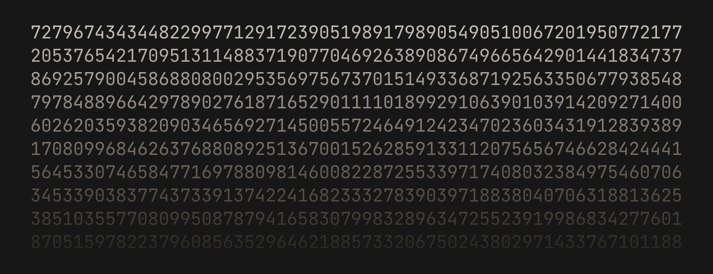
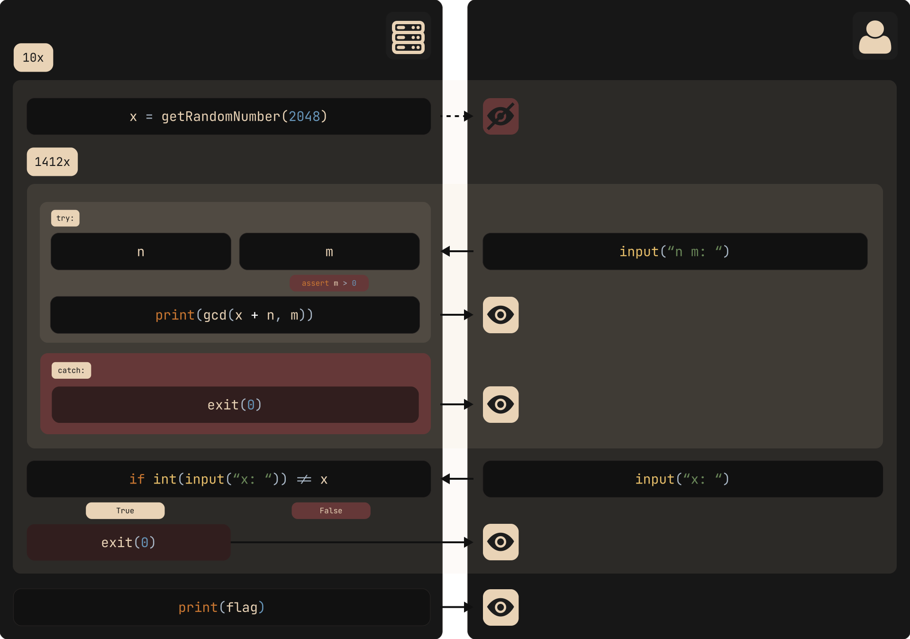
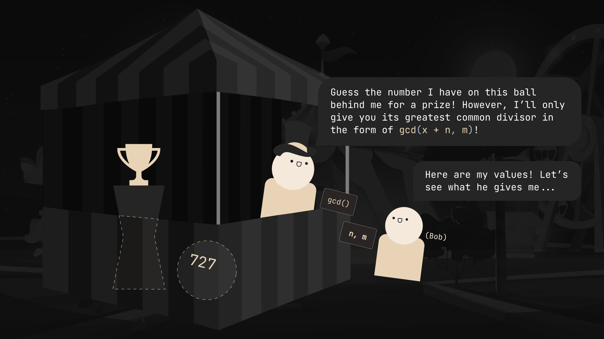
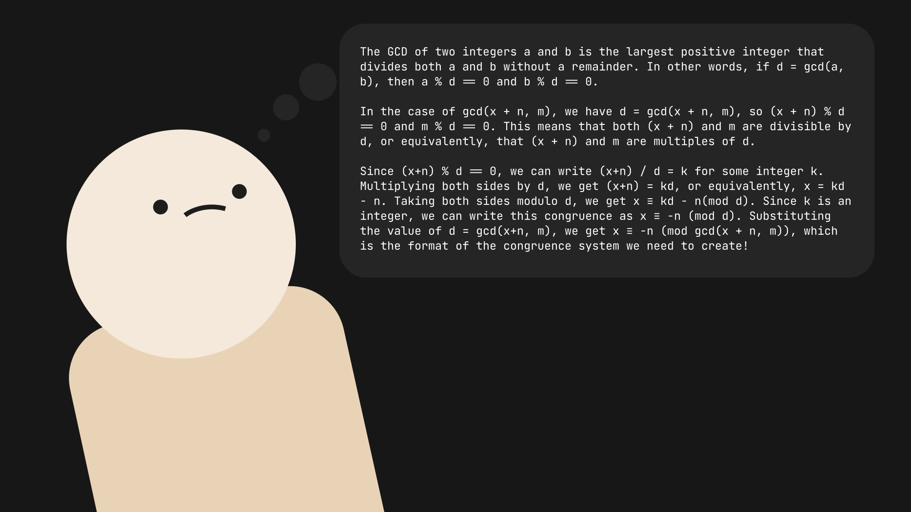

import { Code } from 'astro-expressive-code/components'
import Challenge from '@/components/mdx/Challenge.astro'
import Callout from '@/components/mdx/Callout.astro'

## Introduction

High school CTF team [View Source](https://ctftime.org/team/175828) and I participated in [AmateursCTF 2023](https://ctftime.org/event/1983), placing 2nd both overall and in the student division. Although there were over 64 challenges to tackle throughout the four-day submission period, I personally only put emphasis on the OSINT and algorithm categories. Within these categories lay an interesting challenge: the `gcd-query` series, which I solved with an implementation of a very special algorithm. This was my process (paired alongside a lengthy analogy)!

<div class="invisible h-0! [&+*]:mt-0 [&+*_*]:mt-0">
## gcd-query-v1
</div>

<Challenge
  title="gcd-query-v1"
  authors={['skittles1412']}
  solvers={[
    {
      name: 'enscribe',
      href: 'https://github.com/jktrn',
      avatar: 'https://github.com/jktrn.png',
    },
  ]}
  category="PPC"
  points={475}
  solves={43}
  flag="amateursCTF{probabilistic_binary_search_ftw}"
>
  I wonder if this program leaks enough information for you to get the flag with
  less than 2048 queries... It probably does. I'm sure you can figure out how.
  `nc amt.rs 31692`
</Challenge>

We're initially provided with an attachment `main.py` and a remote server `amt.rs:31692`. The server component contains the following:

import Code1 from './assets/1.txt?raw'

<Code code={Code1} lang="py" title="main.py" />

Let's go over step-by-step what this server is up to:

- For ten iterations, a long `x{:py}` is created by pycrypto's [`getRandomInteger(n){:py}`](https://pythonhosted.org/pycrypto/Crypto.Util.number-module.html#getRandomInteger), which returns a random integer with up to $n$ bits in length. $n = 2048$; this is an absolutely mindbendingly large number——up to 617 digits long! You absolutely do not want to see what 617 digits looks like in decmimal:



- For each iteration of `x{:py}`, the user gets prompted to enter two integers `n{:py}` and `m{:py}`. Once the assertion that `m > 0{:py}` is passed, `n{:py}` and `m{:py}` are passed into a function `gcd(x + n, m){:py}`, which returns the **greatest common divisor** of `x + n{:py}` and `m{:py}`. This occurs for 1412 iterations.
- After the iterations have completed, the user is then prompted to guess the value of `x{:py}`. If the guess is correct, the next iteration of `x{:py}` begins. This process is repeated nine more times until the flag is printed.

Here is a quick visual depicting what's going on:



Paying close attention to the right side of this graphic, we can see that there's only a couple specific points at which we can interact with the server: when we pick the `n{:py}` and `m{:py}` to send, and when we guess the value of `x{:py}`. The question now is: what values should we be picking for `n{:py}` and `m{:py}` which reveal the most information about `x{:py}`, and how do we use this information to obtain its actual value?

### The Chinese Remainder Theorem

<Callout variant="recall" title="Modulus">
Recall that the *modulus* is the remainder of [Euclidian division](https://en.wikipedia.org/wiki/Euclidean_division) (division with remainder) of one number by another. For example, $$2 = 12 \pmod{5}$$.

However, this is different from the **congruence modulo** relation, represented by the congruence symbol $$\equiv$$ and often expressed as $$a \equiv b \pmod{m}$$. When two numbers $$a$$ and $$b$$ are congruent modulo $$m$$, it means that:

1. $$a$$ and $$b$$ have the same remainder when divided by $$m$$
2. $$a - b$$ is divisible by $$m$$ (i.e. $$m \mid (a - b)$$)
3. There is an integer $$k$$ such that $$a = km + b$$

As such, $$12 \equiv 2 \pmod{5}$$ is true, but $$12 = 2 \pmod{5}$$ is obviously false.
</Callout>

We start with a concept called a "system of congruences." A system of congruences is a set of equations of the form $$x \equiv a_i \pmod{m_i}$$, where $$a_i$$, $$b_i$$, and $$m_i$$ are integers. The $$m_i$$ values are called the **moduli** of the system. Here's a quick example of this:

```math
\begin{cases}
x &\equiv 1 \pmod{2} \\
x &\equiv 2 \pmod{3} \\
x &\equiv 3 \pmod{5}
\end{cases}
```

In this system, we have three congruences with moduli $$2$$, $$3$$, and $$5$$. The goal is to find a value for $$x$$ that satisfies all three congruences simultaneously.

Thus, we can apply the Chinese Remainder Theorem:

<Callout variant="theorem" title="Chinese Remainder Theorem">
Given pairwise coprime integers $$n_1, n_2, \ldots, n_k$$ and arbitrary integers $$a_1, a_2, \ldots, a_k$$, the system of simultaneous congruences 

```math
\begin{cases}
x &\equiv a_1 \pmod{n_1} \\ 
x &\equiv a_2 \pmod{n_2} \\ 
\vdots \\ 
x &\equiv a_k \pmod{n_k}
\end{cases}
```

has a solution, and the solution is unique modulo $$N = n_1 n_2 \cdots n_k$$.
</Callout>

<Callout variant="note" title="Non-Coprime Moduli">
Although the Chinese Remainder Theorem is often stated with pairwise coprime moduli (meaning that for a set of moduli $$M = \{n_1, n_2, \ldots, n_k\}$$, $$\gcd(n_i, n_j) = 1$$ for all $$i \neq j$$), it can be extended to non-coprime moduli. However, doing so does not guarantee a solution — this will become increasingly relevant as we get towards our implementation process.
</Callout>

You may be asking: what the hell does this have to do with guessing the giant integer that we've been given? Well, I've concocted a little example here to demonstrate how we can use this theorem to our advantage.

### Tne Modular Arithmetic Nerd's Favorite Carnival Game



Let's say little Bob over at the bottom right goes to a carnival game booth and is asked to guess a number on a ball behind the operator. Obviously, since we're omnipotent observers in this fantastical 2D universe of cute little cartoon circle people, we know that the number is $$x = 727$$. However, Bob doesn't know shit. He's really good at modular arithmetic though, so he'll have a lot of fun with this one.

Bob's told that he can give the operator a piece of paper with two integers of his arbitrary choice: `n{:py}` and `m{:py}`. As long as `m{:py}` is above 0, the operator will always give him back a piece of paper with `n{:py}` and `m{:py}` passed into `gcd(x + n, m){:py}`. However, the operator's shift is about to end soon, and he estimates that he'll probably accept only about three pieces of paper from Bob until he closes shop.

Bob goes back to his table. He's flabbergasted. How in the world is he going to guess that number with only three pieces of information?

He rummages around his little noggin and recollects himself. Let's see what he's thinking:



Uh... thanks, I guess? Well, he has a good point, but since I guarantee that nobody read it (because it's too long for the average CTF player's attention span) I'll give a brief TL;DR here.

Bob's saying that per the definition of a "greatest common divisor," in the scenario $$d = \gcd(a, b)$$, both $$a \pmod{d} = 0$$ and $$b \pmod{d} = 0$$ is true. Since we're given the function `d = gcd(x + n, m){:py}`, we can therefore say that $$(x + n) \pmod{d} = 0$$ and $$m \pmod{d} = 0$$.

We can introduce an integer $$k$$ into the mix and rewrite $$(x + n) \pmod{d} = 0$$ as $$\frac{(x + n)}{d} = k$$. Let's algebraify this up to get to the state that we want it to:

```math
\frac{(x + n)}{d} = k \\
(x + n) = kd \\
x \equiv kd - n \pmod{d} \\
x \equiv -n \pmod{d}
```

Replacing $d$ with the `gcd(){:py}` function:

```math
x \equiv -n \pmod{\gcd(x + n, m)}
```

Doesn't that look very, very familiar to the system of congruences that we were talking about earlier? Now, all we need to do is decide what values of $n$ and $m$ to pick.

Bob's decided that his three attempts is nowhere near enough attempts to do anything reasonable with a fixed offset $$n$$. He's discovered something a bit more clever: **what if you changed the value of $$n$$ every time?** In doing so, it provides information about the offset from 0 modulo that GCD. He's selected the following values for $$n$$:

```math
\begin{cases}
n_1 &= 0 \\
n_2 &= -1 \\
n_3 &= -2
\end{cases}
```

<Callout>
Bob's chosen negative values for $$n_2$$ and $$n_3$$ because of the earlier relation established, $$x \equiv -n \pmod{\gcd(x + n, m)}$$. Making $$n$$ negative creates positive remainders.
</Callout>

For $$m$$, Bob chooses a very large **primorial**:

<Callout variant="definition" title="Primorial">
For the $$n$$th prime number $$p_n$$, the primorial $$p_n\#$$ is defined as the product of the first $$n$$ primes:
  
```math
p_n\# = \prod_{k=1}^n p_k
```

where $$p_k$$ is the prime number.
</Callout>

Primorials have the special property in that since they're the product of the first $$n$$ primes, they're guaranteed to have a lot of prime factors. When thrown into the `gcd()` function, this will give us tons of information about the prime factors of $$x$$ since we're a lot more likely to get a hit (a miss would be if $$\gcd(x + n, m) = 1$$).

Bob's ended up deciding on $$m = p_{11}\#$$. He pulls out his laptop and calculates it with Python:

import Code2 from './assets/2.txt?raw'

<Code code={Code2} lang="py" title="primorial.py" />

import Code3 from './assets/3.txt?raw'

<Code code={Code3} lang="ansi" />

Bob's now ready to go! He walks up to the operator and hands him his pieces of paper. The operator hastily hands him back three pieces of paper with the resulting GCDs:


Now he knows that:

$$
\begin{cases}
x \equiv 0 \pmod{1} \\
x \equiv 1 \pmod{66} \\
x \equiv 2 \pmod{145}
\end{cases}
$$

and he can apply the Chinese Remainder Theorem to solve for $$x$$. Bob opens back up his laptop and runs the following code:

import Code4 from './assets/4.txt?raw'

<Code code={Code4} lang="py" title="crt.py" />

import Code5 from './assets/5.txt?raw'

<Code code={Code5} lang="ansi" />

Bob's got the number! Congratulations, Bob!


### Implementation

Hopefully through this example, you've gained a bit of intuition on where CRT is derived from, why we chose those particular values, and why it works. Now, let's apply this to the actual challenge.

Here is the script that I used to solve this challenge. It's very straightforward and readable in comparison to other scripts I've seen, so I felt it was redundant to go through the step-by-step process. I've added comments to explain what's going on.

import Code6 from './assets/6.txt?raw'

<Code code={Code6} lang="py" title="solve.py" />

Let's run the script on the remote server:

import Code7 from './assets/7.txt?raw'

<Code code={Code7} lang="ansi" />

We've solved `gcd-query-v1`!

---

<div class="invisible h-0! [&+*]:mt-0 [&+*_*]:mt-0">
## gcd-query-v2
</div>

<Challenge
  title="gcd-query-v2"
  authors={['hellopir']}
  solvers={[
    {
      name: 'enscribe',
      href: 'https://github.com/jktrn',
      avatar: 'https://github.com/jktrn.png',
    },
  ]}
  category="PPC"
  points={481}
  solves={34}
  flag="amateursCTF{crt_really_is_too_op...wtf??!??!?!?must_be_cheating!!...i_shouldn't've_removed_query_number_cap.}"
>
  I thought that skittles1412's querying system wasn't optimized enough, so I
  created my own. My system is so much more optimized than his! `nc amt.rs
  31693`
</Challenge>

Of course there's a continuation. Let's see what attachment we're given now:

import Code8 from './assets/8.txt?raw'

<Code code={Code8} lang="py" title="main.py" />

It seems that they haven't changed much. The only things that are different are:

- `getRandomInteger(){:py}`'s `n{:py}` value has been reduced from 2048 to 128 bits (~39 digits)
- We no longer need to complete ten iterations of different random integers; now it's only one iteration of a single random integer
- We only get 16 iterations of `gcd(){:py}` instead of 1412

Well, first step is to try and rerun the same script that we used for "gcd-query-v1" with some minor edits:

import Code9 from './assets/9.txt?raw'

<Code
  code={Code9}
  lang="py"
  title="solve.py"
  ins={[11, 18]}
  del={[10, 13, 17]}
/>

import Code10 from './assets/10.txt?raw'

<Code code={Code10} lang="ansi" />

Well, that didn't work. We're correctly parsing input and a number is being generated, but for some reason the server is telling us to "get better lol".

I added some print statements to see what we were getting in our moduli and remainder arrays:

import Code11 from './assets/11.txt?raw'

<Code code={Code11} lang="ansi" />

Wow, check out that moduli array... that's not even nearly enough prime factors to accurately apply CRT. Let's increase the primorial then for increased chances:

import Code12 from './assets/12.txt?raw'

<Code
  code={Code12}
  lang="py"
  title="solve.py"
  startLineNumber={6}
  ins={{ range: '1-2' }}
  del={{ range: '3-4' }}
/>

Let's try running the script again:

import Code13 from './assets/13.txt?raw'

<Code code={Code13} lang="ansi" />

We've managed to solve the entire challenge with only 16 queries!

---

## Afterword

Thanks to everyone from les amateurs for hosting this CTF! I had a lot of fun solving these challenges and I hope to see more from you guys in the future. I'd also like to credit Quasar, [SuperBeetleGamer](https://www.cryptohack.org/user/SuperBeetleGamer/), and [flocto](https://ctftime.org/user/121085) for helping me wrap my head around CRT in general throughout the process of writing this (because I almost always learn along the way). I hope you learned something like I did!

Sources:

- [Wikipedia: Chinese Remainder Theorem](https://en.wikipedia.org/wiki/Chinese_remainder_theorem)
- [Wikipedia: Primorial](https://en.wikipedia.org/wiki/Primorial)
- [Brilliant: Chinese Remainder Theorem](https://brilliant.org/wiki/chinese-remainder-theorem/)
