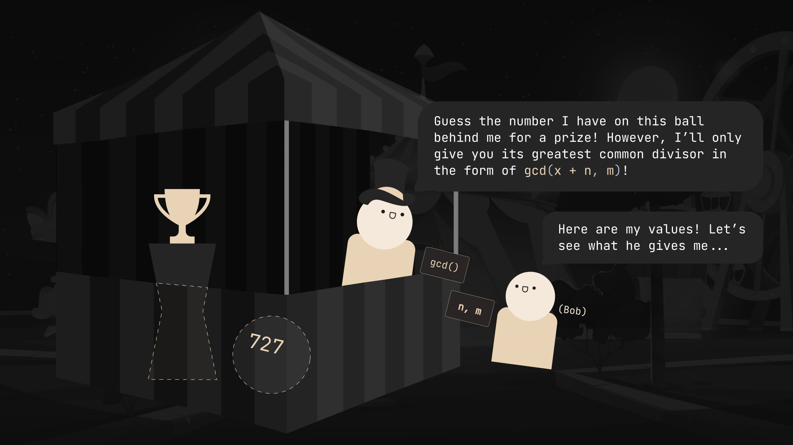

import Challenge from '@/components/mdx/Challenge.astro'
import InfoBox from '@/components/mdx/InfoBox.astro'

## Intro

High school CTF team [View Source](https://ctftime.org/team/175828) and I participated in [AmateursCTF 2023](https://ctftime.org/event/1983), placing 2nd both overall and in the student division. Although there were over 64 challenges to tackle throughout the four-day submission period, I personally only put emphasis on the OSINT and algorithm categories. Within these categories lay an interesting challenge: the `gcd-query` series, which I solved with an implementation of a very special algorithm. This was my process (paired alongside a lengthy analogy)!

---

## gcd-query-v1

<Challenge
  authors={['skittles1412']}
  solvers={[
    {
      name: 'enscribe',
      href: 'https://github.com/jktrn',
      avatar: 'https://github.com/jktrn.png',
    },
  ]}
  category="PPC"
  points={475}
  solves={43}
>
  I wonder if this program leaks enough information for you to get the flag with
  less than 2048 queries... It probably does. I'm sure you can figure out how.
  `nc amt.rs 31692`
</Challenge>

We're initially provided with an attachment `main.py` and a remote server `amt.rs:31692`. The server component contains the following:

```py title="main.py" caption="v1 Attachment" showLineNumbers
#!/usr/local/bin/python
from flag import flag
from math import gcd
from Crypto.Util.number import getRandomInteger

for i in range(10):
    x = getRandomInteger(2048)
    for i in range(1412):
        try:
            n, m = map(int, input("n m: ").split())
            assert m > 0
            print(gcd(x + n, m))
        except:
            print("bad input. you *die*")
            exit(0)
    if int(input("x: ")) != x:
        print("get better lol")
        exit(0)

print(flag)
```

Let's go over step-by-step what this server is up to:

- For ten iterations, a long `x{:py}` is created by pycrypto's [`getRandomInteger(n){:py}`](https://pythonhosted.org/pycrypto/Crypto.Util.number-module.html#getRandomInteger), which returns a random integer with up to $n$ bits in length. $n = 2048$; this is an absolutely mindbendingly large number——up to 617 digits long! You absolutely do not want to see what 617 digits looks like in decmimal:


- For each iteration of `x{:py}`, the user gets prompted to enter two integers `n{:py}` and `m{:py}`. Once the assertion that `m > 0{:py}` is passed, `n{:py}` and `m{:py}` are passed into a function `gcd(x + n, m){:py}`, which returns the **greatest common divisor** of `x + n{:py}` and `m{:py}`. This occurs for 1412 iterations.
- After the iterations have completed, the user is then prompted to guess the value of `x{:py}`. If the guess is correct, the next iteration of `x{:py}` begins. This process is repeated nine more times until the flag is printed.

Here is a quick visual depicting what's going on:


Paying close attention to the right side of this graphic, we can see that there's only a couple specific points at which we can interact with the server: when we pick the `n{:py}` and `m{:py}` to send, and when we guess the value of `x{:py}`. The question now is: what values should we be picking for `n{:py}` and `m{:py}` which reveal the most information about `x{:py}`, and how do we use this information to obtain its actual value?

### The Chinese Remainder Theorem

<InfoBox type="info">
  **Recall**: The *modulus* is the remainder of [Euclidian division](https://en.wikipedia.org/wiki/Euclidean_division) (division with remainder) of one number by another. For example, $$2 = 12 \pmod{5}$$.

  However, this is different from the **congruence modulo** relation, represented by the congruence symbol $$\equiv$$ and often expressed as $$a \equiv b \pmod{m}$$. When two numbers $$a$$ and $$b$$ are congruent modulo $$m$$, it means that:
  
  1. $$a$$ and $$b$$ have the same remainder when divided by $$m$$
  2. $$a - b$$ is divisible by $$m$$ (i.e. $$m \mid (a - b)$$)
  3. There is an integer $$k$$ such that $$a = km + b$$
  
  As such, $$12 \equiv 2 \pmod{5}$$ is true, but $$12 = 2 \pmod{5}$$ is obviously false.
</InfoBox>

We start with a concept called a "system of congruences." A system of congruences is a set of equations of the form $$x \equiv a_i \pmod{m_i}$$, where $$a_i$$, $$b_i$$, and $$m_i$$ are integers. The $$m_i$$ values are called the **moduli** of the system. Here's a quick example of this:

$$
\begin{cases}
x &\equiv 1 \pmod{2} \\
x &\equiv 2 \pmod{3} \\
x &\equiv 3 \pmod{5}
\end{cases}
$$

In this system, we have three congruences with moduli $$2$$, $$3$$, and $$5$$. The goal is to find a value for $$x$$ that satisfies all three congruences simultaneously.

Thus, we can apply the Chinese Remainder Theorem:

<InfoBox>
  **Chinese Remainder Theorem**: Given pairwise coprime integers $$n_1, n_2, \ldots, n_k$$ and arbitrary integers $$a_1, a_2, \ldots, a_k$$, the system of simultaneous congruences
  $$
  \begin{cases}
  x &\equiv a_1 \pmod{n_1} \\
  x &\equiv a_2 \pmod{n_2} \\
  \vdots \\
  x &\equiv a_k \pmod{n_k}
  \end{cases}
  $$
  has a solution, and the solution is unique modulo $$N = n_1 n_2 \cdots n_k$$.
</InfoBox>

<InfoBox type="info">
  **Note**: Although the Chinese Remainder Theorem is often stated with pairwise coprime moduli (meaning that for a set of moduli $$M = \{n_1, n_2, \ldots, n_k\}$$, $$\gcd(n_i, n_j) = 1$$ for all $$i \neq j$$), it can be extended to non-coprime moduli. However, doing so does not guarantee a solution — this will become increasingly relevant as we get towards our implementation process.
</InfoBox>

You may be asking: what the hell does this have to do with guessing the giant integer that we've been given? Well, I've concocted a little example here to demonstrate how we can use this theorem to our advantage.

### Tne Modular Arithmetic Nerd's Favorite Carnival Game



Let's say little Bob over at the bottom right goes to a carnival game booth and is asked to guess a number on a ball behind the operator. Obviously, since we're omnipotent observers in this fantastical 2D universe of cute little cartoon circle people, we know that the number is $$x = 727$$. However, Bob doesn't know shit. He's really good at modular arithmetic though, so he'll have a lot of fun with this one.

Bob's told that he can give the operator a piece of paper with two integers of his arbitrary choice: `n{:py}` and `m{:py}`. As long as `m{:py}` is above 0, the operator will always give him back a piece of paper with `n{:py}` and `m{:py}` passed into `gcd(x + n, m){:py}`. However, the operator's shift is about to end soon, and he estimates that he'll probably accept only about three pieces of paper from Bob until he closes shop.

Bob goes back to his table. He's flabbergasted. How in the world is he going to guess that number with only three pieces of information?

He rummages around his little noggin and recollects himself. Let's see what he's thinking:


Uh... thanks, I guess? Well, he has a good point, but since I guarantee that nobody read it (because it's too long for the average CTF player's attention span) I'll give a brief TL;DR here.

Bob's saying that per the definition of a "greatest common divisor," in the scenario $$d = \gcd(a, b)$$, both $$a \pmod{d} = 0$$ and $$b \pmod{d} = 0$$ is true. Since we're given the function `d = gcd(x + n, m){:py}`, we can therefore say that $$(x + n) \pmod{d} = 0$$ and $$m \pmod{d} = 0$$.

We can introduce an integer $$k$$ into the mix and rewrite $$(x + n) \pmod{d} = 0$$ as $$\frac{(x + n)}{d} = k$$. Let's algebraify this up to get to the state that we want it to:

$$
\frac{(x + n)}{d} = k \\
(x + n) = kd \\
x \equiv kd - n \pmod{d} \\
x \equiv -n \pmod{d}
$$

Replacing $d$ with the `gcd(){:py}` function:

$$
x \equiv -n \pmod{\gcd(x + n, m)}
$$

Doesn't that look very, very familiar to the system of congruences that we were talking about earlier? Now, all we need to do is decide what values of $n$ and $m$ to pick.

Bob's decided that his three attempts is nowhere near enough attempts to do anything reasonable with a fixed offset $$n$$. He's discovered something a bit more clever: **what if you changed the value of $$n$$ every time?** In doing so, it provides information about the offset from 0 modulo that GCD. He's selected the following values for $$n$$:

$$
\begin{cases}
n_1 &= 0 \\
n_2 &= -1 \\
n_3 &= -2
\end{cases}
$$

<InfoBox type="info">
  **Note**: Bob's chosen negative values for $$n_2$$ and $$n_3$$ because of the earlier relation established, $$x \equiv -n \pmod{\gcd(x + n, m)}$$. Making $$n$$ negative creates positive remainders.
</InfoBox>

For $$m$$, Bob chooses a very large **primorial**:

<InfoBox>
  For the $$n$$th prime number $$p_n$$, the primorial $$p_n\#$$ is defined as the product of the first $$n$$ primes:
    
  $$
  p_n\# = \prod_{k=1}^n p_k
  $$

  where $$p_k$$ is the prime number.
</InfoBox>

Primorials have the special property in that since they're the product of the first $$n$$ primes, they're guaranteed to have a lot of prime factors. When thrown into the `gcd()` function, this will give us tons of information about the prime factors of $$x$$ since we're a lot more likely to get a hit (a miss would be if $$\gcd(x + n, m) = 1$$).

Bob's ended up deciding on $$m = p_{11}\#$$. He pulls out his laptop and calculates it with Python:

```py title="primorial.py" caption="v1 Primorial Calculation" showLineNumbers
from operator import mul
from sympy import prime
from functools import reduce

N = 11

product = lambda arr: reduce(mul, arr)
primes = lambda n: [prime(i) for i in range(1, n + 1)]

primorial = product(primes_list := primes(N))
print(primes_list)
print(primorial)
```

```ansi
$ python3 primorial.py
[2, 3, 5, 7, 11, 13, 17, 19, 23, 29, 31]
200560490130
```

Bob's now ready to go! He walks up to the operator and hands him his pieces of paper. The operator hastily hands him back three pieces of paper with the resulting GCDs:


Now he knows that:

$$
\begin{cases}
x \equiv 0 \pmod{1} \\
x \equiv 1 \pmod{66} \\
x \equiv 2 \pmod{145}
\end{cases}
$$

and he can apply the Chinese Remainder Theorem to solve for $$x$$. Bob opens back up his laptop and runs the following code:

```py title="crt.py" caption="CRT Implementation" showLineNumbers
from sympy.ntheory.modular import crt

remainders = [0, 1, 2]
moduli = [1, 66, 145]

print(crt(moduli, remainders)[0] if crt(moduli, remainders) else None)
```

```ansi
$ python3 crt.py
727
```

Bob's got the number! Congratulations, Bob!


### Implementation

Hopefully through this example, you've gained a bit of intuition on where CRT is derived from, why we chose those particular values, and why it works. Now, let's apply this to the actual challenge.

Here is the script that I used to solve this challenge. It's very straightforward and readable in comparison to other scripts I've seen, so I felt it was redundant to go through the step-by-step process. I've added comments to explain what's going on.

```py title="solve.py" caption="v1 Solve" showLineNumbers
from sympy.ntheory.modular import crt
from sympy import primorial
from tqdm import tqdm
from pwn import *

# Generate the 256th primorial
N = 2**8
primorial = primorial(N)

p = remote('amt.rs', 31692)

for _ in range(10):
    remainders = []
    moduli = []

    for j in tqdm(range(1412)):
        n = -j
        m = primorial
        p.sendlineafter(b'n m: ', bytes(f'{n} {m}', 'utf-8'))

        # Append positive j and the GCD result to remainders and moduli
        remainders.append(j)
        moduli.append(int(p.recvlineS()))

    # Apply Chinese Remainder Theorem on the generated congruence system
    result = crt(moduli, remainders)[0]
    log.info(f'Guessing result {result}...')
    p.sendlineafter(b'x: ', bytes(str(result), 'utf-8'))

log.success(p.recvallS())
```

Let's run the script on the remote server:

```ansi
$ python3 solve.py
[+] Opening connection to amt.rs on port 31692: Done
100%|████████████████████████████████████████████████| 1412/1412 [01:40<00:00, 14.04it/s]
[*] Guessing result 13811095902755644846482198689370064280419582878881370588339407663501153599097195284332635926638411305942258944052308307425884540419653139328201177574618591335420779939401302525262761668546835553119134415209843691758490750645864747951903178159493692989313764187586990059771738586045200163035018216446295060384470539168062305034511452235970979419117273140216310229843138043113643676083166573964512431632513584641493571186432113808788793049942365375202657327092823486073026339330473573167785284165209471461667235221858615401687572827124962884033918145410980294471831046866805979291987510822776208660898664193371502076369...
100%|████████████████████████████████████████████████| 1412/1412 [01:39<00:00, 14.18it/s]
[*] Guessing result 24067367100536683843481948076922477560798163483852376131506889605591036635118679499844242052966702222929625069993864001971991784523537397460489925865068254860456001028818287785908306185765071348619009610111507264477178797372871676258725033282034274029344720156895866898205325400301005606977551498118657975147925827017550691718920569276772375658283583669123223351383666410176219776924217313135666297206365499851033368053009731956567238895862545761556922844594607957247284759673600341901489257778669955325852703488640180914304223573157449663595250722203844469185404430056776595901097370576506862193119930831160153039645...
100%|████████████████████████████████████████████████| 1412/1412 [01:42<00:00, 13.73it/s]
[*] Guessing result 7685947172198127107777374667140678037806540421611756768106993632815330391087682127761106281389571374683486036542219393848222956427456311509150767156618253036564165465877103809489418131493044562907409848106468095552829305154616093814537698857191866611405848665535095301533085044115738792583824412519602803896340117760062826548466221367283600448847746972947351204926974932363255643590572461847866131212915876781930382244418815057097926767432358949295853031446962377393616573125245033720888867119691231138082380781540624653902647240454815666606971400673655259741239065245766051836162679683854318266521387362235339818963...
100%|████████████████████████████████████████████████| 1412/1412 [01:48<00:00, 12.96it/s]
[*] Guessing result 28766597769066741230993303926175357282954768621233983144247678673049812708196765345415367655618893220733421356772068739001346432681969591602594000222935708614736440936324186157291043386940251492732071082955951404839783470962507206296695705772074953353546686886779924440978723433609048598598557281139170990533603117402151358229049939138057179004531916123178096145539893434618636827593836703383290710315795175927215739591698425024135973070441559270137929182535000574864967444140896001119156515670962563767514223212280621106522255581529578812057211426495559846747556429983130401676611828235555517439427391088312200114340...
100%|████████████████████████████████████████████████| 1412/1412 [01:48<00:00, 12.96it/s]
[*] Guessing result 18677865908712209418730292654495724290528015510849858170490326355917878128672697854412093924844953163531044998001901092328085313583550146789000037524845877889213383321493193527654231781920756937019622080934588887712014723043748042773932440938345206132177553968803673898406541136240569574800190461899894265810140460486655043391890259966104420844165420881554658957162718918577408662447920231593944600773563355101328960702284671589526558563130043732776075973109889576802320970196034207684109511514803796952372219472313970655379778369020701807058741890165241070828680239075259918663032394171833038787909487851805314448855...
100%|████████████████████████████████████████████████| 1412/1412 [01:48<00:00, 13.04it/s]
[*] Guessing result 11836304072505940760905398461025892318706585845650403696307459093367797596638544732184279765210985819028521462466659807744822525225803985864600241663739335757162123665479918660034002791253847913555642278244324401618077147970750599192781639662548591816262731603920094166899224650569096625236689552770883756297212091569908376860048642542934085934566447138965676494758498143342092937071252542730569085822506016460475594952618479964682242645697696278787543882802499332735666538165978355896706100386750883766313015341113034064919164380613692392893978943240510241390029989518020435933206590980911069595815998565379069909389...
100%|████████████████████████████████████████████████| 1412/1412 [01:41<00:00, 13.96it/s]
[*] Guessing result 24420317305481938235298816362557385961714901243708043773212938107240257747575084932010962245916115390272993933485519074175413937032219229340852213726095989669920838194928305315596794542040319098487745543566184511761273969488130776737327461785375756602677264323848990754751137123554424297870859009175724453359380143043353234606272818695542001911680712268305408158942520319373201023864766813929760605476351460653167923702044806507429823017011764363703007211685200696996786931196521238655621661875819296934888297861611356597802643815992467649175717154699654523758457803470066054358275486505747893429992866200270596751661...
100%|████████████████████████████████████████████████| 1412/1412 [01:41<00:00, 13.88it/s]
[*] Guessing result 8746291504496083705140234574423923063059898747805616503433378954631117111728432658171757653262574759520885819600709214831440637441682872538488457078503354842623369405387792688967753515150540937598749631247461920903968813846190627144355870774195605725620782391303120773103714215960469406131157602962890188334776881890375489689159892019798284385240341860588296227193890430441913365280249935967752362698906808472066477044546437447680420530404664353015954160203510906286156917563841786143548435782146501639423205167799462812075950205027561610970211630045995943417742820399866853970400326052614548186021028377532627871871...
100%|████████████████████████████████████████████████| 1412/1412 [01:40<00:00, 14.04it/s]
[*] Guessing result 3776413613793582995242313256619110085658321586908926663317897349018550337476212258001071782419149912458930815766646550905337728235723272307300941378102274620677732536698577550109310923000424024247688263149196304346054985707956034894436449516525188403790594363585031931796537049874831484362274536023181224802004917294072535858788876951492192929873860801099312063749164291473720602843643395639623020123560780204286718457892996637266933865612558076298859165369386500999104085401312934963056223158856645251058491411254518324928110474142394413979203565229916374507552727133704100494765430582149582181194711798933201266021...
100%|████████████████████████████████████████████████| 1412/1412 [01:40<00:00, 14.04it/s]
[*] Guessing result 1918394921512833068322813834316966022087953894715768422110215181294946514179366813169888547301240804065469118491966955739537769705481715671974513435395758846983078501045506154549423946256752609980460175712801980425200034239297194967213554421865155886790770452738651550235456908807289298689411961528971586844393153811563148549039163519157171048516600236632351978597301720067795049402110382108201111192361352987205533077861286786308995238804327546009181093588939942796532972223963350139247226287706412840852858507637203561823774800941737820339261986921678654613897476089927020657074799151225998589947737942511343979790...
[+] Receiving all data: Done (45B)
[*] Closed connection to amt.rs port 31692
[+] amateursCTF{probabilistic_binary_search_ftw}
```

We've solved `gcd-query-v1`!

<InfoBox type="flag">
  **gcd-query-v1**: `amateursCTF{probabilistic_binary_search_ftw}`
</InfoBox>

---

## gcd-query-v2

<Challenge
  authors={['hellopir']}
  solvers={[
    {
      name: 'enscribe',
      href: 'https://github.com/jktrn',
      avatar: 'https://github.com/jktrn.png',
    },
  ]}
  category="PPC"
  points={481}
  solves={34}
>
  I thought that skittles1412's querying system wasn't optimized enough, so I
  created my own. My system is so much more optimized than his! `nc amt.rs
  31693`
</Challenge>

Of course there's a continuation. Let's see what attachment we're given now:

```py title="main.py" caption="v2 Attachment" showLineNumbers
#!/usr/local/bin/python
from flag import flag
from math import gcd
from Crypto.Util.number import getRandomInteger

x = getRandomInteger(128)
for i in range(16):
    try:
        n, m = map(int, input("n m: ").split())
        assert m > 0
        print(gcd(x + n, m))
    except:
        print("bad input. you *die*")
        exit(0)
if int(input("x: ")) == x:
    print(flag)
else:
    print("get better lol")
```

It seems that they haven't changed much. The only things that are different are:

- `getRandomInteger(){:py}`'s `n{:py}` value has been reduced from 2048 to 128 bits (~39 digits)
- We no longer need to complete ten iterations of different random integers; now it's only one iteration of a single random integer
- We only get 16 iterations of `gcd(){:py}` instead of 1412

Well, first step is to try and rerun the same script that we used for "gcd-query-v1" with some minor edits:

```py title="solve.py" caption="v2 Solve Attempt" showLineNumbers add{11,18} remove{10,13,17}
from sympy.ntheory.modular import crt
from sympy import primorial
from tqdm import tqdm
from pwn import *

# Generate the 256th primorial
N = 2**8
primorial = primorial(N)

p = remote('amt.rs', 31692)
p = remote('amt.rs', 31693)

for _ in range(10):
    remainders = []
    moduli = []

    for j in tqdm(range(1412)):
    for j in tqdm(range(16)):
        n = -j
        m = primorial
        p.sendlineafter(b'n m: ', bytes(f'{n} {m}', 'utf-8'))

        # Append positive j and the GCD result to remainders and moduli
        remainders.append(j)
        moduli.append(int(p.recvlineS()))

    # Apply Chinese Remainder Theorem on the generated congruence system
    result = crt(moduli, remainders)[0]
    log.info(f'Guessing result {result}...')
    p.sendlineafter(b'x: ', bytes(str(result), 'utf-8'))

log.success(p.recvallS())
```

```ansi
$ python3 solve.py
[+] Opening connection to amt.rs on port 31693: Done
100%|█████████████████████████████████████████████████████| 16/16 [00:01<00:00, 11.55it/s]
[*] Guessing result 621207498018765489399784775...
[+] Receiving all data: Done (15B)
[*] Closed connection to amt.rs port 31693
[+] get better lol
```

Well, that didn't work. We're correctly parsing input and a number is being generated, but for some reason the server is telling us to "get better lol".

I added some print statements to see what we were getting in our moduli and remainder arrays:

```ansi
$ python3 solve.py
[+] Opening connection to amt.rs on port 31693: Done
100%|█████████████████████████████████████████████████████| 16/16 [00:01<00:00, 11.45it/s]
[*] Moduli: [2090, 21, 2, 1, 1942352142, 85, 254, 3, 6874, 1, 390, 341, 5392666, 141, 2, 2485]
[*] Remainders: [0, 1, 2, 3, 4, 5, 6, 7, 8, 9, 10, 11, 12, 13, 14, 15]
[*] Guessing result 24101417952332326654560233907130...
[+] Receiving all data: Done (15B)
[*] Closed connection to amt.rs port 31693
[+] get better lol
```

Wow, check out that moduli array... that's not even nearly enough prime factors to accurately apply CRT. Let's increase the primorial then for increased chances:

```py title="solve.py" caption="Changing Primorial" showLineNumbers{6} add{6-7} remove{8-9}
# Generate the 256th primorial
N = 2**8
# Generate the 1024th primorial
N = 2**10
primorial = primorial(N)
```

Let's try running the script again:

```ansi
$ python3 solve.py
[+] Opening connection to amt.rs on port 31693: Done
100%|█████████████████████████████████████████████████████| 16/16 [00:01<00:00, 11.16it/s]
[*] Guessing result 330896654198662695248401611762768684627...
[+] Receiving all data: Done (15B)
[*] Closed connection to amt.rs port 31693
[+] amateursCTF{crt_really_is_too_op...wtf??!??!?!?must_be_cheating!!...i_shouldn't've_removed_query_number_cap.}
```

We've managed to solve the entire challenge with only 16 queries!

<InfoBox type="flag">
  **gcd-query-v2**: `amateursCTF{crt_really_is_too_op...wtf??!??!?!?must_be_cheating!!...i_shouldn't've_removed_query_number_cap.}`
</InfoBox>

---

## Afterword

Thanks to everyone from les amateurs for hosting this CTF! I had a lot of fun solving these challenges and I hope to see more from you guys in the future. I'd also like to credit Quasar, [SuperBeetleGamer](https://www.cryptohack.org/user/SuperBeetleGamer/), and [flocto](https://ctftime.org/user/121085) for helping me wrap my head around CRT in general throughout the process of writing this (because I almost always learn along the way). I hope you learned something like I did!

Sources:

- [Wikipedia: Chinese Remainder Theorem](https://en.wikipedia.org/wiki/Chinese_remainder_theorem)
- [Wikipedia: Primorial](https://en.wikipedia.org/wiki/Primorial)
- [Brilliant: Chinese Remainder Theorem](https://brilliant.org/wiki/chinese-remainder-theorem/)
