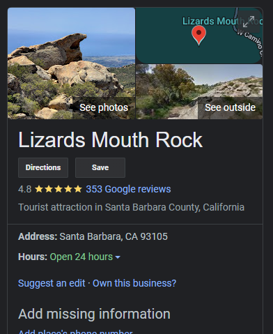

import Challenge from '@/components/mdx/Challenge.astro'

## B0uld3r1ng

<Challenge
  title="B0uld3r1ng"
  solvers={[
    {
      name: 'sahuang',
      href: 'https://github.com/sahuang',
      avatar: 'https://github.com/sahuang.png',
    },
    {
      name: 'enscribe',
      href: 'https://github.com/jktrn',
      avatar: 'https://github.com/jktrn.png',
    },
    {
      name: 'Battlemonger',
      href: 'https://github.com/Battlemonger',
      avatar: 'https://github.com/Battlemonger.png',
    },
  ]}
  category="OSINT"
  points={416}
  files={['b0uld3r1ng.png']}
  flag="byuctf{ju5t_5end_1t_br0_v8bLDrg}"
>
  I met a guy named Sam while climbing here in California. Can't remember what
  it's called though. Kinda looks like reptilian don't you think?
  <figure>
    

    <figcaption class="text-center">b0uld3r1ng.png</figcaption>
  </figure>
</Challenge>

Once again, I used Google Lens to figure out where the location of this image was. Turns out to be a place called the "Lizard's Mouth Rock" in Santa Barbara County, California:

The image given to us is a direct screenshot of an image posted by Maps contributor [Jonathan P.](https://www.google.com/maps/contrib/104742787928495148360), although that has little relevance to the challenge.

Moving on, although we have the location of the image taken the flag is in _explicit format_, meaning that it's somewhere on the internet wrapped with `byuctf{...}`. We noticed that a guy named "Sam" was mentioned, so we guessed that we could find him leaving a review of the place on a platform.

We checked through the following platforms: Yelp, Google Reviews, TripAdvisor, AllTrails — yet, we couldn't find a recent reviewer by the name of Sam. Luckily, one of my team members searched up "Bouldering Lizard's Mouth" (based on the challenge name) and happened to stumble across [this website](https://www.mountainproject.com/area/105885134/the-lizards-mouth):

We scrolled down to the "Reviews" section and found this:

Hey, look! A Sam! Let's check out their [profile](https://www.mountainproject.com/user/201354492/samuel-sender):

The flag is `byuctf{ju5t_5end_1t_br0_v8bLDrg}`.