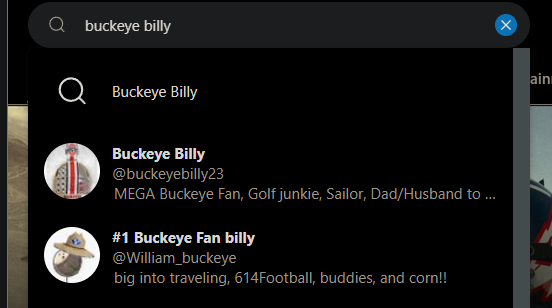
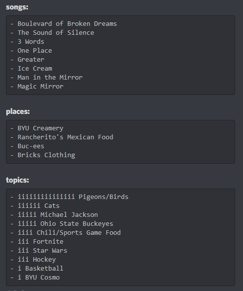

import Challenge from '@/components/mdx/Challenge.astro'
import StaticTweet from '@/components/mdx/StaticTweet.astro'

## Buckeye Billy Blabbin'

<Challenge
  title="Buckeye Billy Blabbin'"
  solvers={[
    {
      name: 'Battlemonger',
      href: 'https://github.com/Battlemonger',
      avatar: 'https://github.com/Battlemonger.png',
    },
    {
      name: 'enscribe',
      href: 'https://github.com/jktrn',
      avatar: 'https://github.com/jktrn.png',
    },
  ]}
  category="OSINT"
  points={500}
  flag="byuctf{t@lk_0sinty_t0_m3}"
>
  Buckeye Billy discovered social media. And probably posts too much. Try to see
  what you can find. for this problem and others! Flag will be completely
  visible once solved! You will see `byuctf{}`.
</Challenge>

Step 0 is to find his social media account, which we did by searching "Buckeye Billy" on [Twitter](https://twitter.com/William_buckeye):

We scoured his Twitter account on the Wayback Machine for it to no avail (and even found some [deleted stuff](https://web.archive.org/web/20220415232856/https://twitter.com/William_buckeye/status/1515109844771999745) from a previous internal CTF).

I slowly began to despise him... that Buckeye Billy. That stupid, perfectly circular nuthead with the even stupider BYU sombrero. We gave up on the challenge and I cried to the admin until he got annoyed and agreed to post a global hint:

> the more billy tweeted about something, the more of a hint it might be. The flag is on his account someplace.

He tweeted a lot about song lyrics:

<StaticTweet
  avatar="https://pbs.twimg.com/profile_images/1515107668242821125/ngThSrt8_400x400.jpg"
  username="#1 Buckeye Fan billy"
  handle="William_buckeye"
  date="April 16, 2022"
  src="https://twitter.com/William_buckeye/status/1515237428025462785"
>
  With not enough to eat  
  Who am I, to be blind pretending not to see their needs?  
  A summer's disregard  
  A broken bottle top  
  And a one man's soul  
  They follow each other on the wind ya know  
  'Cause they got nowhere to go  
  That's why I want you to know  
  I'm starting with the ...
</StaticTweet>

<StaticTweet
  avatar="https://pbs.twimg.com/profile_images/1515107668242821125/ngThSrt8_400x400.jpg"
  username="#1 Buckeye Fan billy"
  handle="William_buckeye"
  date="April 16, 2022"
  src="https://twitter.com/William_buckeye/status/1515238210577657857"
>
  Oh, are you some kind of magic mirror  
  Come to show to me  
  God in time and space  
  I saw the outline of my Maker dancing backlit  
  By the rays of your incandescent light  
  I saw the figure of my Father shadow dancing  
  By the flames of your electric desire
</StaticTweet>

<StaticTweet
  avatar="https://pbs.twimg.com/profile_images/1515107668242821125/ngThSrt8_400x400.jpg"
  username="#1 Buckeye Fan billy"
  handle="William_buckeye"
  date="April 16, 2022"
  src="https://twitter.com/William_buckeye/status/1515237017579229185"
>
  Bring your tired  
  And bring your shame  
  Bring your guilt  
  And bring your pain  
  Don't you know that's not your name  
  You will always be much more to me  
  Every day I wrestle with the voices  
  That keep telling me I'm not right  
  But that's alright
</StaticTweet>

We decided it would be best to create a list of songs, in addition to counting occurrences of topics he discussed (for brainstorming purposes). We ended up with this list:

Hey, check that out in the Songs list. "3 Words", "One Place", "Greater", "Ice Cream"? That sounds a lot like our previous challenge, "Buckeye Billy Birthday." Looks like these were meant to be solved in tandem. By extension, "Man in the Mirror" and "Magic Mirror" were also hinted at, and we found a [tweet](https://twitter.com/William_buckeye/status/1515113600750219265) of Billy posing in front of a mirror with a BYU hat. Uncoincidentally, this is the only mention of BYU in his entire profile (I believe):

<StaticTweet
  avatar="https://pbs.twimg.com/profile_images/1515107668242821125/ngThSrt8_400x400.jpg"
  username="#1 Buckeye Fan billy"
  handle="William_buckeye"
  date="April 15, 2022"
  src="https://twitter.com/William_buckeye/status/1515113600750219265"
  media="https://pbs.twimg.com/media/FQbDwBvVEAcNniH?format=jpg&name=900x900"
>
  thanks [@byu_cosmo](https://twitter.com/byu_cosmo) for the great hat!
</StaticTweet>

My team used steganography tools on this image, and lo and behold:

The flag is `byuctf{t@lk_0sinty_t0_m3}`. Also an extremely guessy challenge. Screw you, Buckeye Billy. And Wyatt too, if you're still reading.
