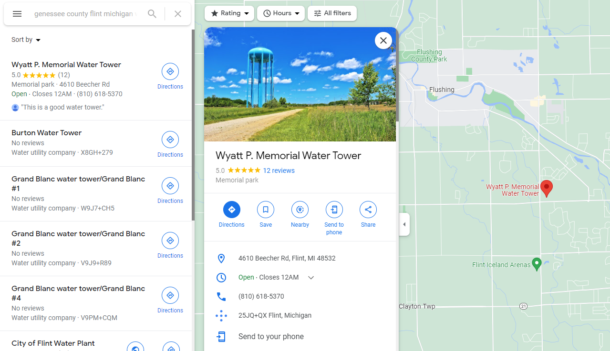

import Challenge from '@/components/mdx/Challenge.astro'
import Callout from '@/components/mdx/Callout.astro'

## Squatter's Rights

<Challenge
  title="Squatter's Rights"
  solvers={[
    {
      name: 'enscribe',
      href: 'https://github.com/jktrn',
      avatar: 'https://github.com/jktrn.png',
    },
    {
      name: 'sahuang',
      href: 'https://github.com/sahuang',
      avatar: 'https://github.com/sahuang.png',
    },
  ]}
  category="OSINT"
  points={489}
  files={['geoguesser.png']}
  flag="byuctf{h0w_d1d_1_st34l_4_w4t3r_t0w3r}"
>
  Somehow, somewhere, something in this picture has a flag, but my friend Blue
  Orca won't tell me where it is!!!! Can you help me??
  <figure>
    

    <figcaption class="text-center">geoguesser.png</figcaption>
  </figure>
</Challenge>

Hey, look! Another Google Lens problem! Although there's a lot of blue water towers out there, I luckily stumbled across one that looked really similar in Flint, Michigan:

  

Going to the [webpage](http://www.eureka4you.com/water-michigan/MI-Flint1.htm), it mentions that this water tower is in "Genesee County. Mid Michigan.", so with a quick Maps search I stumble across the "Wyatt P. Memorial Water Tower":

This is where the rabbit hole begins. I looked around the reviews section of this place and found the absolute weirdest, most hilarious reviews of all time:

> In all my days, I have never seen such a magnificent water tower. Being in its presence has given me powers beyond comprehension. I have mastered flight in the downward direction. I have 100% recall of events that happened to me in the last 5 minutes. I have also discovered I am completely invisible when no one is looking. This water tower has changed my view of who I am, and my ultimate potential.  
> <cite>— Robert Skouson</cite>

This guy even claims it to be holy water:

> This water from Wyatt P. Memorial Water tower has changed the way I see water, and drink it. Every time I see this water tower, it makes me want quality water. Forget Poland Spring or Fiji. This is quality water! You know how in the Book of John Chapter 2, the Savior Jesus Christ turned water into wine? Well he actually turned already good wine to water from Wyatt P. Memorial Water tower.
> <cite>— Nicholas Martinez</cite>

This one might be my favorite:

> Professionally speaking as a water tower enthusiast, this has to be one of the best water towers that I've ever visited and I've visited thousands. The divine structure of the 10 legs leading to the plumply, robust water basin is enough to get any man excited. The satisfying twang as you bang the side wall sends shivers down even the most hardened of souls. Never before has such a feat been attempted and accomplished. Truly this should be the EIGHTIETH WONDER OF THE WORLD.
> <cite>— McKay Lush</cite>

I actually stumbled across the person it's named after, Wyatt Pangerl, and I was super curious as to what the hell was going on:

So I opened a ticket. Turns out, this Wyatt guy, a member of their team, managed to get the water tower named after himself after a series of divine, godlike social engineering strategies (assumedly to the county) and exploitation of the [Squatter's Rights](https://homeguides.sfgate.com/squatters-rights-law-california-45887.html) law in California. He also claimed the location on Google Maps and put his burner phone there as well, which we called (he didn't pick up). When I found his Facebook (will not disclose), I saw a multitude of his friends commenting hilarious crap, calling him "ICONIC." and a "LEGEND." for managing to make it happen.

Yet, there was no flag.

I continued to look around and managed to fall deeper into the rabbit hole, OSINTing everything between the model of [Wyatt's car](https://www.kbb.com/chrysler/crossfire/2006/), a Chrysler Crossfire 2006 (🤣) to where his parents file taxes... I even managed to get an award from a head admin for being a dumbass:

Then, while on the go, I checked the location on my phone... And look what we've got:

Apparently for whatever stupid, scatter-brained, vapid, moronic reason this "From the owner" section isn't on Google Chrome. Screw you Wyatt, and your majestic, plump, baby-blue water tower. The flag is `byuctf{h0w_d1d_1_st34l_4_w4t3r_t0w3r}`. Once again, screw you Wyatt. I hope your taxes are messed up forevermore.

<Callout variant="note">
  This "From the owner" section is [available on Desktop Google
  Chrome](https://www.google.com/search?q=Wyatt+P.+Memorial+Water+Tower), but
  only accessible if the knowledge panel is visible, which wasn't the case for
  me.
</Callout>