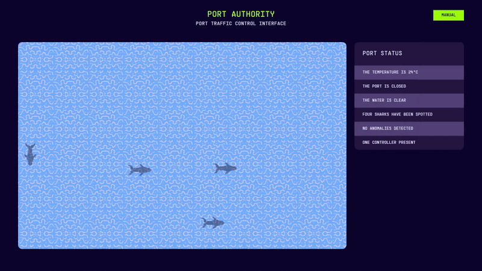
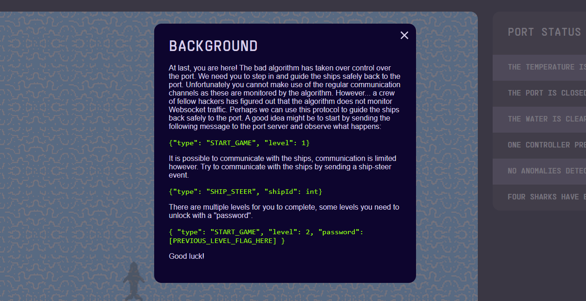
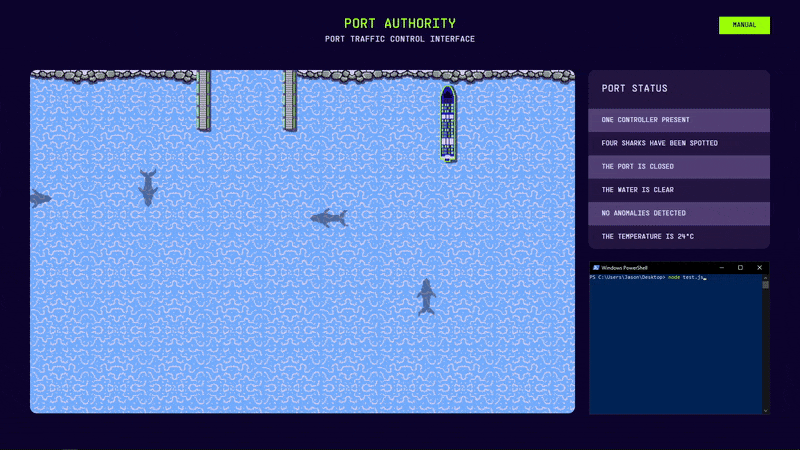

import { Code } from 'astro-expressive-code/components'
import FirstSubpost from '@/components/mdx/FirstSubpost.astro'
import Challenge from '@/components/mdx/Challenge.astro'
import Callout from '@/components/mdx/Callout.astro'

## Introduction

This challenge was part of the Deloitte Hackazon Hacky Holidays "Unlock the City" 2022 CTF (yeah, what a name!). Labeled under the `#ppc` category, which apparently stands for "professional programming challenge", it was the final challenge under the "District 1" segment of the CTF and categorized under the Hard difficulty.

This was the first CTF problem which didn't just challenge my ability to critically think and problem solve - it also challenged my **motor control** and **hand-eye coordination**. Why? _Because I solved it by hand!_ I believe this challenge was meant to be solved using 100% programming, but I wanted to challenge myself. This was the process.

## Port Authority

<Challenge
  title="Port Authority"
  authors={['Luuk Hofman', 'Diederik Bakker']}
  solvers={[
    {
      name: 'blueset',
      href: 'https://github.com/blueset',
      avatar: 'https://github.com/blueset.png',
    },
    {
      name: 'enscribe',
      href: 'https://github.com/jktrn',
      avatar: 'https://github.com/jktrn.png',
    },
    {
      name: 'sahuang',
      href: 'https://github.com/sahuang',
      avatar: 'https://github.com/sahuang.png',
    },
  ]}
  category="PPC"
  points="5/5 = 350"
>
  The harbour is in total chaos, the ships are no longer on course. The AI has
  disabled the brakes of all the ships and corrupted our control systems. The
  ships about to crash into each other, can you build a new AI that will rescue
  the ships and deliver the cargo?
</Challenge>

<Callout variant="note">
  This is an **instance-based** challenge. No website URL will be
  provided!
</Callout>

### Initial Inspection & Interaction

We're initially provided with a link that takes us to a nice-looking webgame called the "Port Traffic Control Interface":

Although we can't directly interact with the game using keyboard controls, there's a manual on the top-right which details the task:

According to this, we can start playing the game and controlling the ships that appear through a [WebSocket](https://developer.mozilla.org/en-US/docs/Web/API/WebSockets_API/) connection, which is an API that enables two-way communication between a user's browser and a server. [This documentation](https://javascript.info/websocket) describes the protocol alongside how to open/close and send/receive using JavaScript.

Heavily referencing the aforementioned documentation, I started off by installing the WebSocket package with `npm i ws`, and then creating a `solve.js` with the following code:

import Code1 from './assets/1.txt?raw'

<Code code={Code1} lang="js" title="solve.js" />

Look what happens when we establish a connection - the game starts running, and we start receiving per-tick input from the server in our console:

import Code2 from './assets/2.txt?raw'

<Code code={Code2} lang="ansi" />

Let's see what happens when we send the `SHIP_STEER` command to the server after five seconds. We can do that with the [`setTimeout()`](https://developer.mozilla.org/en-US/docs/Web/API/setTimeout) method in our `socket.onopen` listener:

import Code3 from './assets/3.txt?raw'

<Code code={Code3} lang="js" title="solve.js" startLineNumber={9} ins={{range: "7-13"}} />

From the provided GIF, we can see that the ship will turn clockwise on its central point when told to steer!

With this, we have a goal: **get the ship into the port by sending JSON instructions to the WebSocket server**. However, it's definitely a good idea to create some quality-of-life features first, such as:

- A way to convert our JSON data into an object we can reference
- A class which can construct objects for each ship
- An HTML/JS "controller", which can be used to steer the ships with UI and to start new levels

Firstly, cleaning up the output involves parsing what we receive from the server, which we can do with the `JSON.parse()` method. We'll assign it into a variable named `obj` (and also delete our steer-testing code):

import Code4 from './assets/4.txt?raw'

<Code code={Code4} lang="js" title="solve.js" startLineNumber={16} ins={{range: "14-15"}} del={{range: "1-8"}} />

Each tick, `obj` will change to an object structured this way:

import Code5 from './assets/5.txt?raw'

<Code code={Code5} lang="json" />

Check out the `obj.type{:js}` key - there'll be multiple types of these (including but not limited to `"LOSS"{:js}`, `"GAME_START"{:js}`). We'll make it so that if `obj.type{:js}` is `"TICK"{:js}`, it will create a new `Class{:js}` instance for each object in the `obj.ships{:js}` array:

import Code6 from './assets/6.txt?raw'

<Code code={Code6} lang="js" title="solve.js" startLineNumber={18} ins={{range: "1-15,21-31"}} />

With this new Class, we can get both our own `ships` array _and_ really clean logging from the server:

import Code7 from './assets/7.txt?raw'

<Code code={Code7} lang="ansi" />

Let's finally get to solving the challenge. I'll use subposts to break down each level.

<FirstSubpost title="Level 1" href="/blog/dhhutc-2022-port-authority/level-1" />

