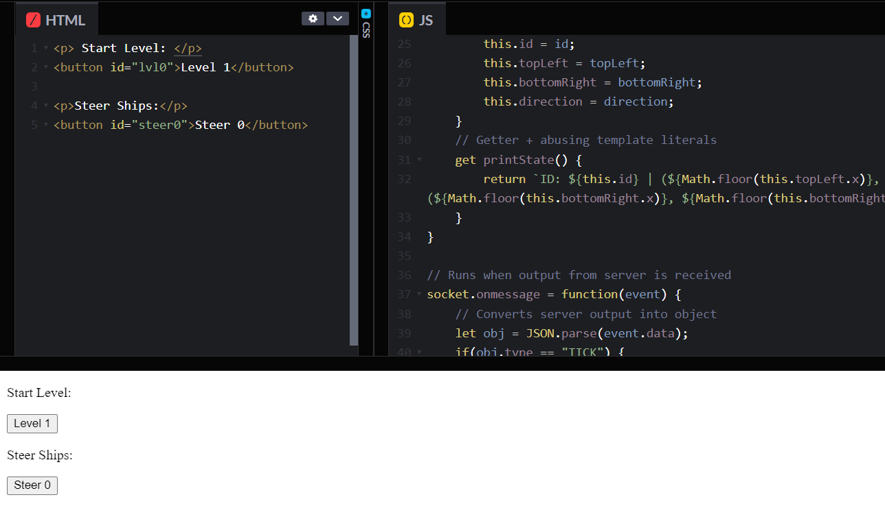
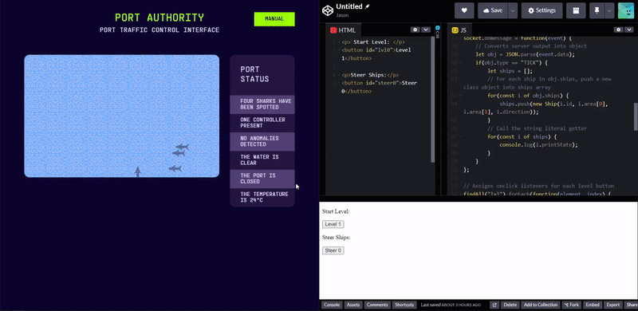
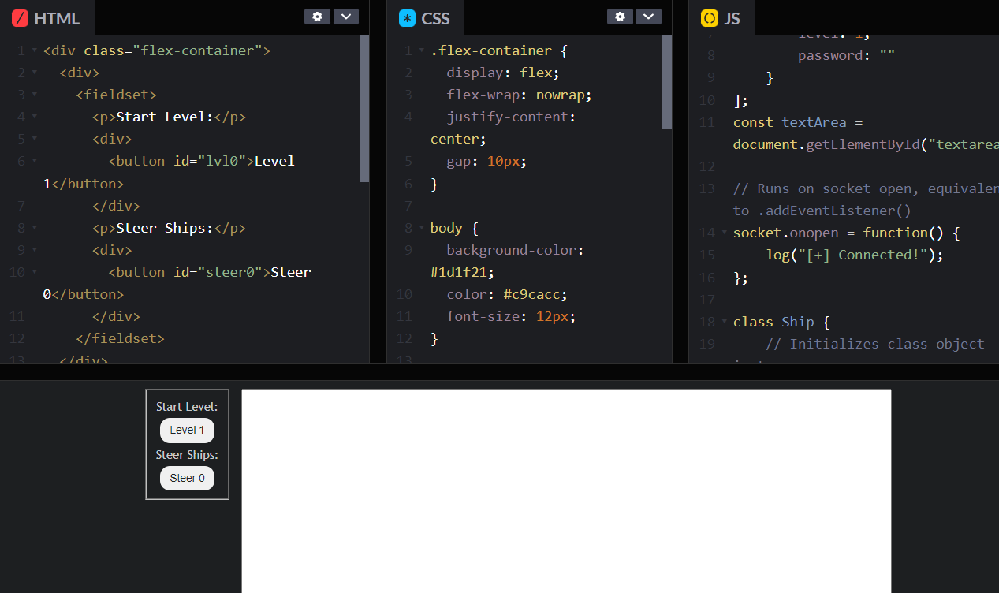

<challenge-info>
<dl>
<div><dt>Solvers</dt><dd><a href="https://github.com/sahuang">sahuang</a>, <a href="https://github.com/blueset">blueset</a></dd></div>
<div><dt>Points</dt><dd>25</dd></div>
<div><dt>Flag</dt><dd>

<challenge-flag>`CTF{CapTA1n-cRUCh}`</challenge-flag>

</dd></div>
</dl>

Do you know how websockets work?

</challenge-info>

### Adding an expandable GUI

The last thing I want to add was a web-based "controller", which can steer the ship on-click and start new levels. I moved all my code from a local `.js` file to [CodePen](https://codepen.io/) for instant page regeneration and accessability by teammates. Here's the HTML:

~~~html title="`index.html{:file}`"
<p>Start Level:</p>
<button id="lvl0">Level 1</button>

<p>Steer Ships:</p>
<button id="steer0">Steer 0</button>
~~~

Here's the JS that adds functionality to these buttons. Note that these are made to be scalable/"future-proof", meaning I can freely add more buttons without needing to copy/paste slight alterations of the same code. I also made some changes upon switching to the CodePen, including deleting the `require(){:js}` method and preventing level 1 from automatically starting on-open:

~~~js title="`solve.js{:file}`" ins={7-12,52-82} del={1-2,17-21} collapse="23-51"
// Make sure you install WebSocket with "npm i ws"!
const WebSocket = require('ws');
// Regex so that I can freely paste the URL when the instance is changed
const url = "https://[REDACTED].challenge.hackazon.org/";
// Opens WebSocket connection
const socket = new WebSocket(`wss://${url.replace(/^https?:\/\//, "")}ws`);
// Object literal for level lookup
const passwords = [{
        level: 1,
        password: ""
    }
];

// Runs on socket open, equivalent to .addEventListener()
socket.onopen = function() {
    console.log("[+] Connected!");
    // Converts object to string
    socket.send(JSON.stringify({
        "type": "START_GAME",
        "level": 1
    }));
};
// Pretend there's stuff here

// Assigns onclick listeners for each level button
findAll("lvl").forEach(function(element, index) {
    element.onclick = function() {
        socket.send(JSON.stringify({
            type: "START_GAME",
            level: passwords[index].level,
            password: passwords[index].password
        }));
    };
});
 
// Assigns onclick listeners for each steer button
findAll("steer").forEach(function(element, index) {
    element.onclick = function() {
        socket.send(JSON.stringify({
            type: "SHIP_STEER",
            shipId: `${index}`
        }));
    };
});
 
// Creates DOM array for each element with name id + int
function findAll(id) {
    let i = 0;
    let list = [];
    while (document.getElementById(id + i)) {
        list[i] = document.getElementById(id + i);
        i++;
    }
    return list;
}
~~~

The preview on CodePen will look something like this:



Let's see if it actually works:



We could totally flag the challenge right now, but currently there's no way to see the filtered output we created. I know there's a "Console" button at the bottom-left of CodePen, but I'd like to see the output on the actual webpage, outside of the IDE. To do this, let's create a `log(){:js}` function to append strings to a `<textarea>{:html}` we'll add in the HTML:

~~~js title="`solve.js{:file}`" ins={34,36-38,72-76} del={33} collapse="2-26,40-71" startLineNumber=11
const text = document.getElementById("textarea");
// Pretend there's stuff here

        // For each ship in obj.ships, push class object into ships array
        for(const i of obj.ships) {
            ships.push(new Ship(i.id, i.area[0], i.area[1], i.direction));
        }
        // Call the string literal getter
        for(const i of ships) {
            console.log(i.printState);
            log(i.printState);        
        }
    } else {
      log(JSON.stringify(JSON.parse(event.data)));
    }
};

function log(str) {
    text.value += "\n" + str;
    text.value = text.value.substring(text.value.length - 10000);
    text.scrollTop = text.scrollHeight;
}
~~~

We'll also spice up the page slightly with flexboxes, a `<fieldset>{:html}` and some CSS:

~~~html title="`index.html{:file}`" ins={1-3,5,7,9,11-17}
<div class="flex-container">
    <div>
        <fieldset>
            <p>Start Level:</p>
            <div>
                <button id="lvl0">Level 1</button>
            </div>
            <p>Steer Ships:</p>
            <div>
                <button id="steer0">Steer 0</button>
            </div>
        </fieldset>
    </div>
    <div>
        <textarea id="textarea" cols="80" rows="20"></textarea>
    </div>
</div>
~~~

~~~css title="`style.css{:file}`"
.flex-container {
  display: flex;
  flex-wrap: nowrap;
  justify-content: center;
  gap: 10px;
}

body {
  background-color: #1d1f21;
  color: #c9cacc;
  font-size: 12px;
}

fieldset {
  text-align: center;
  font-family: 'Trebuchet MS';
}

textarea {
  font-family: 'Courier New';
}

p {
  margin-top: 5px;
  margin-bottom: 5px;
}

button {
  border: none;
  cursor: pointer;
  height: 25px;
  padding: 0px 10px;
  border-radius: 10px;
  color: #222;
  font-size: 11px;
}
~~~

Here's the preview now:



Sorry I was being extra. Let's flag the challenge now (sped up):

```ansi mark="CTF{CapTA1n-cRUCh}"
...
ID: 0 | (688, 115) (748, 383) | DIR: UP
ID: 0 | (688, 115) (748, 383) | DIR: UP
ID: 0 | (688, 111) (748, 379) | DIR: UP
{"type":"WIN","flag":"CTF{CapTA1n-cRUCh}"}
```

We've succesfully completed Level 1!
