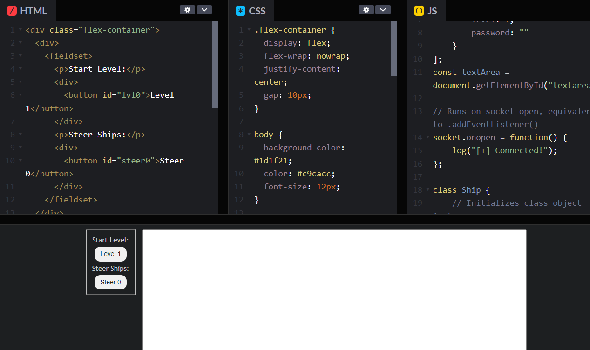

import { Code } from 'astro-expressive-code/components'
import Challenge from '@/components/mdx/Challenge.astro'

## Level 1

<Challenge
  title="Level 1"
  solvers={[
    {
      name: 'sahuang',
      href: 'https://github.com/sahuang',
      avatar: 'https://github.com/sahuang.png',
    },
    {
      name: 'blueset',
      href: 'https://github.com/blueset',
      avatar: 'https://github.com/blueset.png',
    },
  ]}
  flag="CTF{CapTA1n-cRUCh}"
  points={25}
>
  Do you know how websockets work?
</Challenge>

### Adding an Expandable GUI

The last thing I want to add was a web-based "controller", which can steer the ship on-click and start new levels. I moved all my code from a local `.js` file to [CodePen](https://codepen.io/) for instant page regeneration and accessability by teammates. Here's the HTML:

import Code8 from './assets/8.txt?raw'

<Code code={Code8} lang="html" title="index.html" />

Here's the JS that adds functionality to these buttons. Note that these are made to be scalable/"future-proof", meaning I can freely add more buttons without needing to copy/paste slight alterations of the same code. I also made some changes upon switching to the CodePen, including deleting the `require(){:js}` method and preventing level 1 from automatically starting on-open:

import Code9 from './assets/9.txt?raw'

<Code
  code={Code9}
  lang="js"
  title="solve.js"
  ins={{ range: "7-12,52-82" }}
  del={{ range: "1-2,17-21" }}
  collapse="23-51"
/>

The preview on CodePen will look something like this:

Let's see if it actually works:

We could totally flag the challenge right now, but currently there's no way to see the filtered output we created. I know there's a "Console" button at the bottom-left of CodePen, but I'd like to see the output on the actual webpage, outside of the IDE. To do this, let's create a `log(){:js}` function to append strings to a `<textarea>{:html}` we'll add in the HTML:

import Code10 from './assets/10.txt?raw'

<Code
  code={Code10}
  lang="js"
  title="solve.js"
  startLineNumber={11}
  ins={{ range: "34,36-38,72-76" }}
  del={{ range: "33" }}
  collapse="2-26,40-71"
/>

We'll also spice up the page slightly with flexboxes, a `<fieldset>{:html}` and some CSS:

import Code11 from './assets/11.txt?raw'

<Code code={Code11} lang="html" title="index.html" ins={{range: "1-3,5,7,9,11-17"}} />

import Code12 from './assets/12.txt?raw'

<Code code={Code12} lang="css" title="style.css" />

Here's the preview now:

Sorry I was being extra. Let's flag the challenge now (sped up):

import Code13 from './assets/13.txt?raw'

<Code code={Code13} lang="ansi" mark="CTF{CapTA1n-cRUCh}" />

We've succesfully completed Level 1!