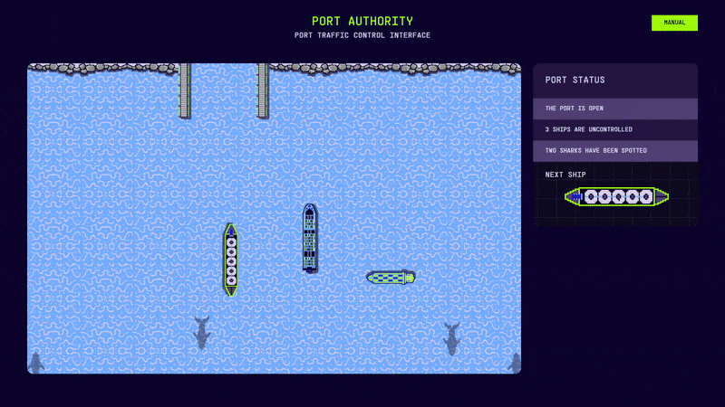
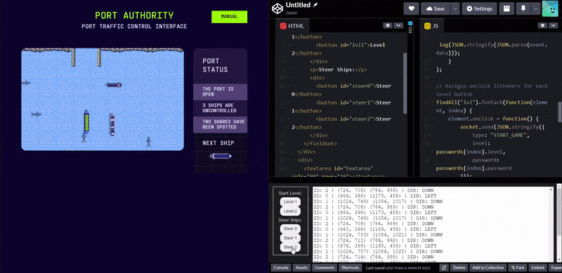

<challenge-info>
<dl>
<div><dt>Solvers</dt><dd><a href="https://github.com/sahuang">sahuang</a>, <a href="https://github.com/blueset">blueset</a></dd></div>
<div><dt>Points</dt><dd>25</dd></div>
<div><dt>Flag</dt><dd>

<challenge-flag>`CTF{capt41n-h00k!}`</challenge-flag>

</dd></div>
</dl>

Lets script it - don't forget the order!

</challenge-info>

"Lets script it"? I've already scripted throughout the entirety of Level 1 to accommodate for future levels! Let's add a Level 2 button to our scalable, future-proof code 😉:

~~~js title="`solve.js{:file}`" ins={5-8} startLineNumber=6
const passwords = [{
        level: 1,
        password: ""
    },
    {
        level: 2,
        password: "CTF{CapTA1n-cRUCh}"
    }
];
~~~

~~~html title="`index.html{:file}`" ins={5} startLineNumber=3
<fieldset>
    <p>Start Level:</p>
        <div>
            <button id="lvl0">Level 1</button>
            <button id="lvl1">Level 2</button>  
        </div>
~~~

This is what appears when clicking the button:



Looks like we'll have to add two more steer buttons:

~~~html title="`index.html{:file}`" ins={4-5} startLineNumber=9
<p>Steer Ships:</p>
        <div>
            <button id="steer0">Steer 0</button>
            <button id="steer1">Steer 1</button>
            <button id="steer2">Steer 2</button>  
        </div>
</fieldset>
~~~

It seems as though that you also need the ships to enter in a specific order. It will be difficult to multitask all three, but it's doable! Let's try to solve it (also very sped up):



```ansi mark="CTF{capt41n-h00k!}"
...
ID: 0 | (789, 105) (849, 294) | DIR: UP
ID: 1 | (796, 105) (856, 373) | DIR: UP
ID: 2 | (691, 108) (751, 389) | DIR: UP
{"type":"WIN","flag":"CTF{capt41n-h00k!}"}
```

Although we've solved level 2 manually, I have a gut feeling the next few ones won't be as trivial...
