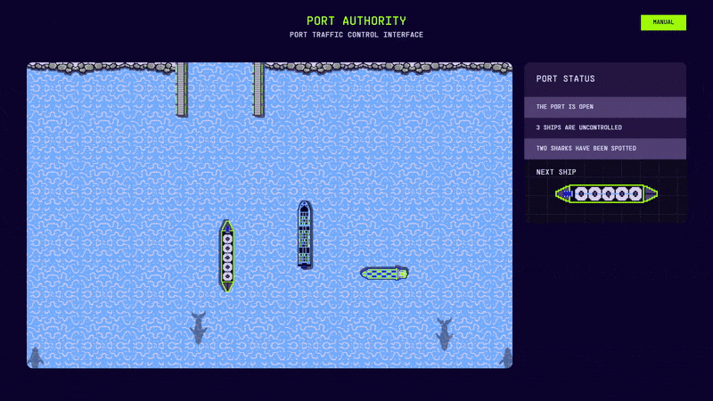
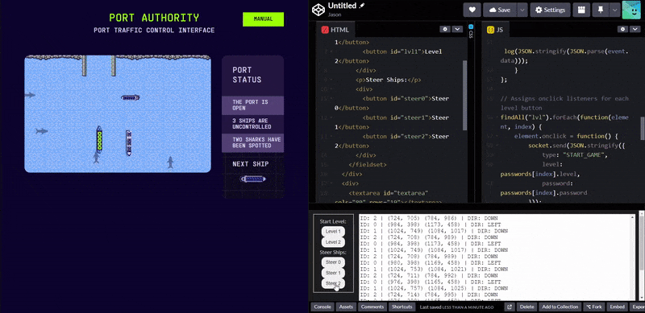

import { Code } from 'astro-expressive-code/components'
import Challenge from '@/components/mdx/Challenge.astro'

## Level 2

<Challenge
  title="Level 2"
  solvers={[
    {
      name: 'sahuang',
      href: 'https://github.com/sahuang',
      avatar: 'https://github.com/sahuang.png',
    },
    {
      name: 'blueset',
      href: 'https://github.com/blueset',
      avatar: 'https://github.com/blueset.png',
    },
  ]}
  points={25}
  flag="CTF{capt41n-h00k!}"
>
  Lets script it - don't forget the order!
</Challenge>

"Lets script it"? I've already scripted throughout the entirety of Level 1 to accommodate for future levels! Let's add a Level 2 button to our scalable, future-proof code 😉:

import Code14 from './assets/14.txt?raw'

<Code code={Code14} lang="js" title="solve.js" startLineNumber={6} ins={{range: "5-8"}} />

import Code15 from './assets/15.txt?raw'

<Code code={Code15} lang="html" title="index.html" startLineNumber={3} ins={{range: "5"}} />

This is what appears when clicking the button:

Looks like we'll have to add two more steer buttons:

import Code16 from './assets/16.txt?raw'

<Code code={Code16} lang="html" title="index.html" startLineNumber={9} ins={{range: "4-5"}} />

It seems as though that you also need the ships to enter in a specific order. It will be difficult to multitask all three, but it's doable! Let's try to solve it (also very sped up):

import Code17 from './assets/17.txt?raw'

<Code code={Code17} lang="ansi" mark="CTF{capt41n-h00k!}" />

Although we've solved level 2 manually, I have a gut feeling the next few ones won't be as trivial...
