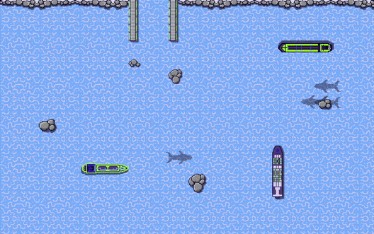
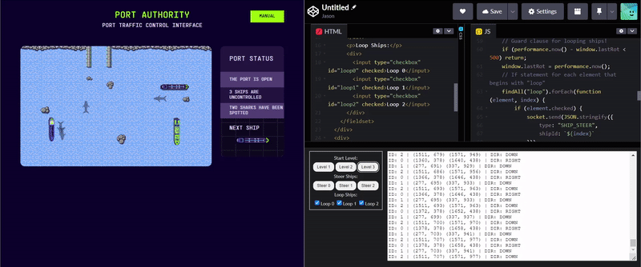

<challenge-info>
<dl>
<div><dt>Solver</dt><dd><a href="https://github.com/sahuang">sahuang</a></dd></div>
<div><dt>Points</dt><dd>50</dd></div>
<div><dt>Flag</dt><dd>

<challenge-flag>`CTF{c4pt41N-m0rG4N}`</challenge-flag>

</dd></div>
</dl>

Can you deal with the rocks that appeared in our once so peaceful harbor?

</challenge-info>

After adding another button to start Level 3, this is the field we start with:



They added some rocks to the board, and the ships are now moving at a faster speed. This is unfeasable to complete via multitasking, so we'll have to come up with a method to keep the ships in place.

### Stabilizing the game state

Here's the plan: let's make it so that these ships will constantly rotate at a certain interval—in doing so, they'll complete a 360° loop within a small area, and we can commandeer them one-at-a-time by disabling the loop for certain ships. Let's start by adding checkboxes to enable the loop:

~~~html title="`index.html{:file}`" ins={7-12} startLineNumber=10
    <p>Steer Ships:</p>
    <div>
        <button id="steer0">Steer 0</button>
        <button id="steer1">Steer 1</button>
        <button id="steer2">Steer 2</button>
    </div>
    <p>Loop Ships:</p>
    <div>
        <input type="checkbox" id="loop0" checked>Loop 0</input>
        <input type="checkbox" id="loop1" checked>Loop 1</input>
        <input type="checkbox" id="loop2" checked>Loop 2</input>
    </div>
</fieldset>
~~~

Regarding the JavaScript, I'll be using `performance.now(){:js}` and checking if the difference between it and `window.lastRot{:js}` is greater than 500ms. This check will happen every tick, and in theory will create a consistently steering ship that doesn't produce `"ILLEGAL_MOVE"{:js}`s for inputting too quickly:

~~~js title="`solve.js{:file}`" ins={1,20-31} startLineNumber=40
window.lastRot = 0;

// Runs when output from server is received
socket.onmessage = function (event) {
    // Converts server output into object
    let obj = JSON.parse(event.data);
    if (obj.type == "TICK") {
        let ships = [];
        // For each ship in obj.ships, push class object into ships array
        for (const i of obj.ships) {
            ships.push(new Ship(i.id, i.area[0], i.area[1], i.direction));
        }
        // Call the string literal getter
        for (const i of ships) {
            log(i.printState);
        }
    } else {
        log(JSON.stringify(JSON.parse(event.data)));
    }
    // Guard clause for looping ships!
    if (performance.now() - window.lastRot < 500) return;
    window.lastRot = performance.now();
    // Sends steer if checkbox is checked
    findAll("loop").forEach(function (element, index) {
        if (element.checked) {
            socket.send(JSON.stringify({
                type: "SHIP_STEER",
                shipId: `${index}`
            }));
        }
    });
};
~~~

Let's see if it works:



We've managed to stabilize the playing field for a manual solve! Let's flag the level:

<video class="frame-center" controls src="/blog/dhhutc-2022-port-authority/flag3.mp4"></video>

```ansi mark="CTF{c4pt41N-m0rG4N}"
...
ID: 0 | (760, 105) (820, 343) | DIR: UP
ID: 1 | (736, 101) (796, 371) | DIR: UP
ID: 2 | (742, 113) (802, 393) | DIR: UP
{"type":"WIN","flag":"CTF{c4pt41N-m0rG4N}"}
```
