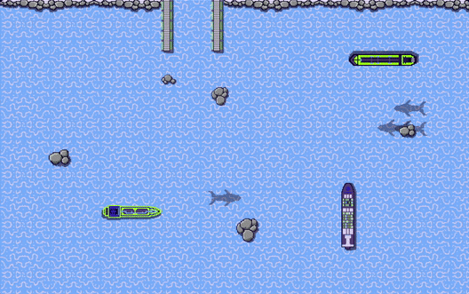
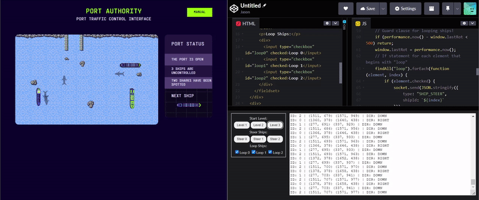

import { Code } from 'astro-expressive-code/components'
import Challenge from '@/components/mdx/Challenge.astro'
import Flag3Video from './assets/flag3.mp4'

## Level 3

<Challenge
  title="Level 3"
  solvers={[{
    name: 'sahuang',
    href: 'https://github.com/sahuang',
    avatar: 'https://github.com/sahuang.png',
  }]}
  points={50}
  flag="CTF{c4pt41N-m0rG4N}"
>
  Can you deal with the rocks that appeared in our once so peaceful harbor?
</Challenge>

After adding another button to start Level 3, this is the field we start with:

They added some rocks to the board, and the ships are now moving at a faster speed. This is unfeasable to complete via multitasking, so we'll have to come up with a method to keep the ships in place.

### Stabilizing the Game State

Here's the plan: let's make it so that these ships will constantly rotate at a certain interval——in doing so, they'll complete a 360° loop within a small area, and we can commandeer them one-at-a-time by disabling the loop for certain ships. Let's start by adding checkboxes to enable the loop:

import Code18 from './assets/18.txt?raw'

<Code code={Code18} lang="html" title="index.html" startLineNumber={10} ins={{range: "7-12"}} />

Regarding the JavaScript, I'll be using `performance.now(){:js}` and checking if the difference between it and `window.lastRot{:js}` is greater than 500ms. This check will happen every tick, and in theory will create a consistently steering ship that doesn't produce `"ILLEGAL_MOVE"{:js}`s for inputting too quickly:

import Code19 from './assets/19.txt?raw'

<Code code={Code19} lang="js" title="solve.js" startLineNumber={40} ins={{range: "1,20-31"}} />

Let's see if it works:

We've managed to stabilize the playing field for a manual solve! Let's flag the level:

<video className="my-4 rounded-md" controls>
  <source src={Flag3Video} type="video/mp4" />
  Your browser does not support the video tag.
</video>

import Code20 from './assets/20.txt?raw'

<Code code={Code20} lang="ansi" mark="CTF{c4pt41N-m0rG4N}" />
