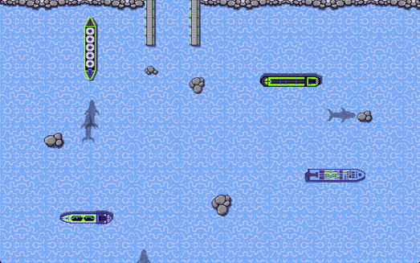

<challenge-info>
<dl>
<div><dt>Solver</dt><dd><a href="https://github.com/sahuang">sahuang</a></dd></div>
<div><dt>Points</dt><dd>50</dd></div>
<div><dt>Flag</dt><dd>

<challenge-flag>`CTF{C4pt41N-4MErIc4}`</challenge-flag>

</dd></div>
</dl>

The algorithm disturbed our radar system - boats that veer too far off track are lost and never seen again. Can you give them directions in time?

</challenge-info>

After I added the level 4 button alongside steer/loop buttons for the extra ship that popped up, I discovered that my solution for level 3 actually worked for level 4 as well:



This means I can flag this level without needing to code at all!:

<video class="frame-center" controls src="/blog/dhhutc-2022-port-authority/flag4.mp4"></video>

```ansi mark="CTF{C4pt41N-4MErIc4}"
...
ID: 0 | (742, 107) (802, 345) | DIR: UP
ID: 1 | (731, 105) (791, 385) | DIR: UP
ID: 2 | (752, 107) (812, 377) | DIR: UP
ID: 3 | (731, 114) (791, 395) | DIR: UP
{"type":"WIN","flag":"CTF{C4pt41N-4MErIc4}"}
```
