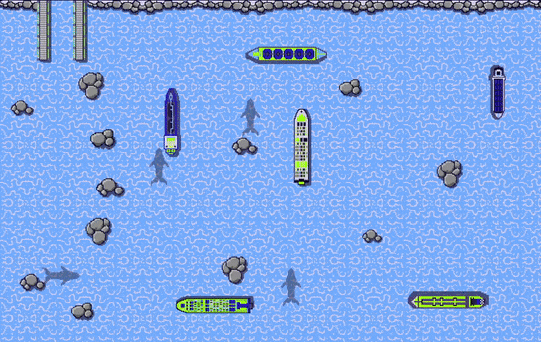
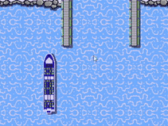
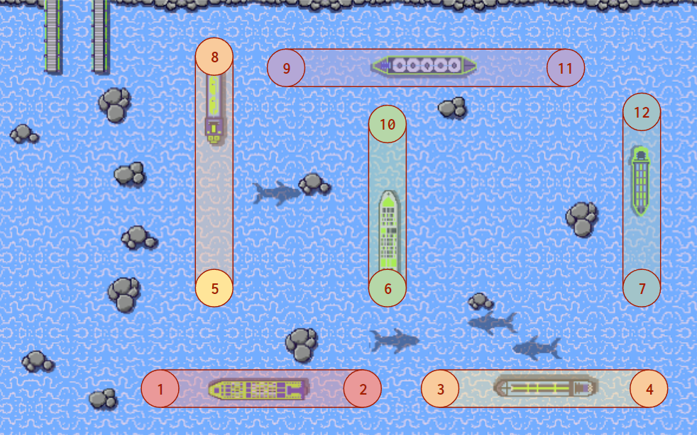
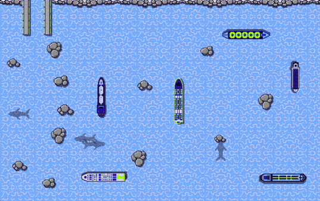
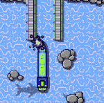
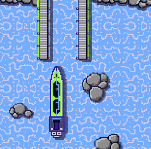
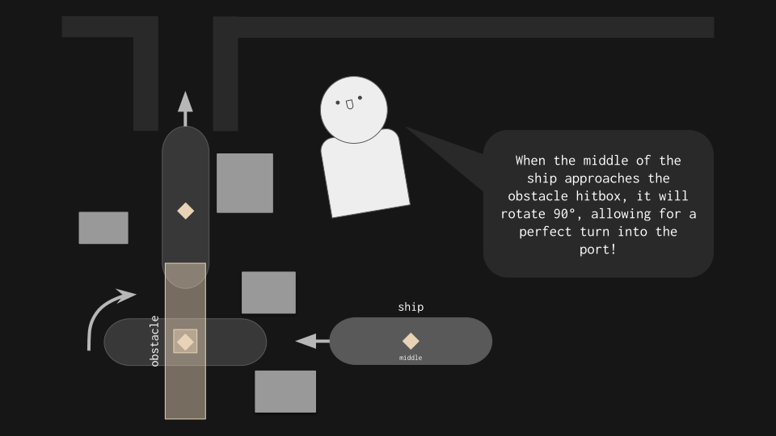
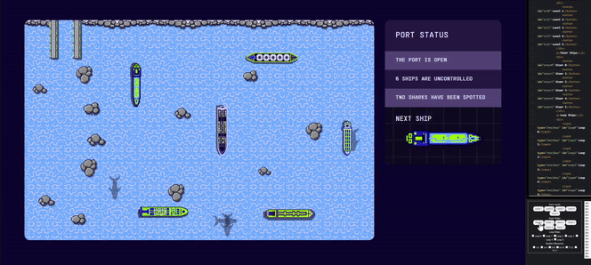
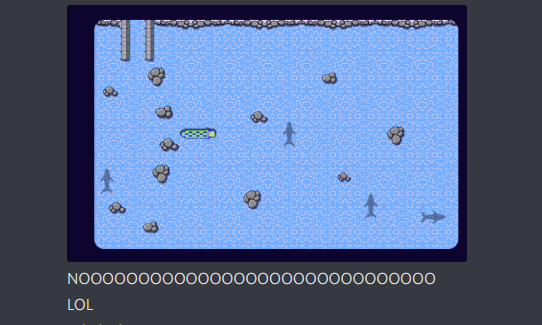
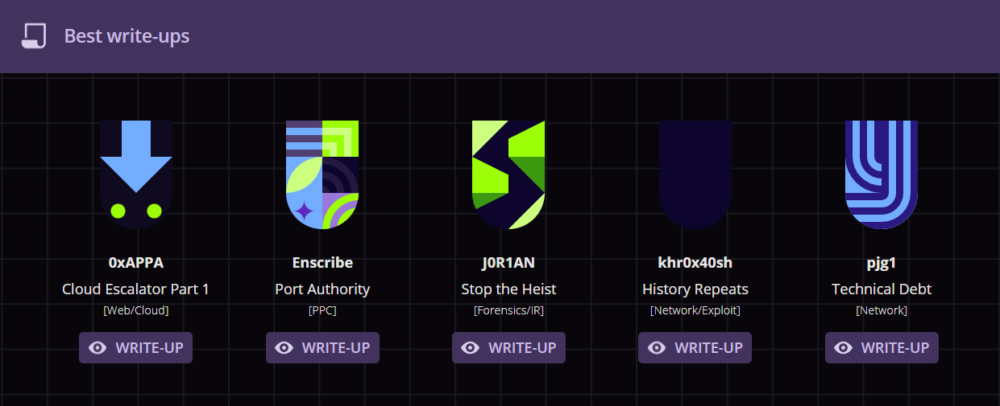

<challenge-info>
<dl>

<dt>Solvers</dt><dd><a href="https://github.com/jktrn">enscribe</a>, <a href="https://github.com/sahuang">sahuang</a></dd>

<dt>Points</dt><dd>200</dd>

<dt>Flag</dt><dd>

<challenge-flag>`CTF{CaPT41n-j4Ck-sp4rR0w}`</challenge-flag>

</dd>

</dl>

A huge influx of ships is coming our way - can you lead them safely to the port?

</challenge-info>

Oh boy...

### Improving the stable game state

Level five gives us a large increase in rocks, a tiny harbor, and six total ships to work with at max speed. Unfortunately, there's not enough room for the ships to loop around in circles, so the solution to levels 3 and 4 won't work. We'll have to figure out something else.

Luckily, during some experimenation on level 1 I found out that you can actually do a full 180° turn by calling two consecutive turns in the code. In doing so, the ship won't hit any of the objects in its surroundings as compared to if it rotated 90° twice. We can observe this phenomenon below:

~~~js title="`solve.js{:file}`" startLineNumber=142
          function turn180(id) {
            socket.send(JSON.stringify({
                type: "SHIP_STEER",
                shipId: id
            }));
            socket.send(JSON.stringify({
                type: "SHIP_STEER",
                shipId: id
            }));
        }
~~~

Also, if you noticed in the first GIF, the ships are spawning at around the same locations every time. With this, we can come up with a plan: create "obstacles" with x-y coordinates that will cause any ship that comes into the region to turn 180°. We'll create separate "lanes" for each ship that spawns, therefore stabilizing the playfield and allowing for a feasible manual solve:

Now, how are these checks going to work? After a lot of experimenting I found that **three** total criteria should be met:

1. The ship is travelling in the same the direction passed as an argument when the `check()` function is called
2. The absolute difference between the x and y values of the object and the ship's top-left is less than a certain threshold (I chose 75px)
3. The global variable to determine whether or not the ship has been rotated 180° yet is false (`hasRotated`)

Here's a visual I drew in case you're lost. The red/green squares on the left indicate the status of each check during different stages of the turn:

We can now begin programming by creating an Obstacle class and manually placing them down throughout the map. This was just a lot of trial and error, so don't worry about these coordinates feeling random:

~~~js title="`solve.js{:file}`" startLineNumber=48
class Obstacle {
    constructor(x, y) {
        this.x = x
        this.y = y
    }
}

let obstacles = [
    new Obstacle(450, 1060),    //1
    new Obstacle(750, 1060),    //2
    new Obstacle(1200, 1060),   //3
    new Obstacle(1600, 1060),   //4
    new Obstacle(604, 700),     //5
    new Obstacle(1070, 600),    //6
    new Obstacle(1730, 650),    //7
    new Obstacle(604, 70),      //8
    new Obstacle(674, 200),     //9
    new Obstacle(1070, 350),    //10
    new Obstacle(1530, 200),    //11
    new Obstacle(1730, 300),    //12
]
~~~

Next, let's create the aforementioned `hasRotated` object alongside the `check()` function, which will implement the three criteria:

~~~js title="`solve.js{:file}`" collapse="9-82" startLineNumber=70
let hasRotated = {
    0: false,
    1: false,
    2: false,
    3: false,
    4: false,
    5: false
}
// Pretend there's stuff here

// Checks if ship should turn 180°
function check(ship, obstacle, direction) {
    if (!hasRotated[ship.id] &&                         // Check 1
        Math.abs(ship.topLeft.y - obstacle.y) < 75 &&   // Check 2
        Math.abs(ship.topLeft.x - obstacle.x) < 75 &&   // Check 2
        ship.direction == direction) {                  // Check 3
        hasRotated[ship.id] = true;
        turn180(ship.id);
        // Sets hasRotated[ship.id] back to false in 1 second asynchronously
        setTimeout(() => {
            hasRotated[ship.id] = false
        }, "1000");
    }
}
~~~

Finally, let's call the `check(){:js}` function for each index in the `ships{:js}` array. Each tick, _every single_ ship will go through these twelve checks. Although this might seem redundant, we have no way of assigning lanes to specific ships, as the IDs are randomized every time based on the order they're meant to dock. This method simply generalizes all of them, and shouldn't cause issues performance-wise:

~~~js title="`solve.js{:file}`" startLineNumber=86
    if (obj.type == "TICK") {
        let ships = [];
        // For each ship in obj.ships, push class object into ships array
        for (const i of obj.ships) {
            ships.push(new Ship(i.id, i.area[0], i.area[1], i.direction));
        }
        // Call the string literal getter
        for (const i of ships) {
            log(i.printState);
            // Infinite checks!
            check(i, obstacles[0], "LEFT");
            check(i, obstacles[1], "RIGHT");
            check(i, obstacles[2], "LEFT");
            check(i, obstacles[3], "RIGHT");
            check(i, obstacles[4], "DOWN");
            check(i, obstacles[5], "DOWN");
            check(i, obstacles[6], "DOWN");
            check(i, obstacles[7], "UP");
            check(i, obstacles[8], "LEFT");
            check(i, obstacles[9], "UP");
            check(i, obstacles[10], "RIGHT");
            check(i, obstacles[11], "UP");
        }
~~~

In theory, these checks should cause the ships to bounce back and forth in their specific lanes. Let's check it out:

Yes! We've managed to stabilize level 5 completely! Now, we need to be able to toggle the lanes off to manually solve the challenge. Let's add more checkboxes to the HTML and adjust the JS accordingly:

~~~html title="`index.html{:file}`" ins={10-27} startLineNumber=21
            
Loop Ships:

            

                <input type="checkbox" id="loop0" checked>Loop 0</input>
                <input type="checkbox" id="loop1" checked>Loop 1</input>
                <input type="checkbox" id="loop2" checked>Loop 2</input>
                <input type="checkbox" id="loop3" checked>Loop 3</input>
                <input type="checkbox" id="loop4" checked>Loop 4</input>
                <input type="checkbox" id="loop5" checked>Loop 5</input>
            

            
 Disable Obstacles: 

            

                <input type="checkbox" id="toggle0">1/2</input>
                <input type="checkbox" id="toggle1">3/4</input>
                <input type="checkbox" id="toggle2">5/8</input>
                <input type="checkbox" id="toggle3">6/10</input>
                <input type="checkbox" id="toggle4">7/12</input>
                <input type="checkbox" id="toggle5">9/11</input>
            

        </fieldset>
~~~

~~~js title="`solve.js{:file}`" ins={1,17,20-21,24-25,28-29,32-33,36-37} startLineNumber=80
let checkList = findAll("toggle");

// Runs when output from server is received
socket.onmessage = function (event) {
    // Converts server output into object
    let obj = JSON.parse(event.data);
    if (obj.type == "TICK") {
        let ships = [];
        // For each ship in obj.ships, push class object into ships array
        for (const i of obj.ships) {
            ships.push(new Ship(i.id, i.area[0], i.area[1], i.direction));
        }
        // Call the string literal getter
        for (const i of ships) {
            log(i.printState);
            // Infinite checks!
            if (!checkList[0].checked) {
                check(s, obstacles[0], "LEFT");
                check(s, obstacles[1], "RIGHT");
            }
            if (!checkList[1].checked) {
                check(s, obstacles[2], "LEFT");
                check(s, obstacles[3], "RIGHT");
            }
            if (!checkList[2].checked) {
                check(s, obstacles[4], "DOWN");
                check(s, obstacles[7], "UP");
            }
            if (!checkList[3].checked) {
                check(s, obstacles[5], "DOWN");
                check(s, obstacles[9], "UP");
            }
            if (!checkList[4].checked) {
                check(s, obstacles[6], "DOWN");
                check(s, obstacles[11], "UP");
            }
            if (!checkList[5].checked) {
                check(s, obstacles[8], "LEFT");
                check(s, obstacles[10], "RIGHT");
            }
        }
~~~

### Solving with pure mechanics

Now, we can strategize on how to solve the challenge manually. Our team deduced that the most ideal order for ships would look something like this:

This order allows for the first ship to enter the port within two turns, and provides plenty of space for the second and third ships to work with. Although it would require a lot of restarting (as the order is always random), it's worth it to ease the difficulty of the challenge.

#### Auto-docking

Moving on, we began work on the manual solve process. It was super tedious and involved a lot of mess-ups, especially around the port area. We discovered that the window to turn into the port was extraordinarily small, leading to many runs dying to something like this:

We decided it'd be best if we added another obstacle to perfectly turn us into the dock every time. This time around, it would have to be a 90° turn utlizing the middle of the ship instead of the top-left, as each ship is a different length and would therefore turn at different points when within the obstacles's hitbox:

Here is its implementation:

~~~js title="`solve.js{:file}`" ins={139-155} collapse="6-52,57-138" startLineNumber=65
    new Obstacle(1070, 350), //10
    new Obstacle(1530, 200), //11
    new Obstacle(1730, 300), //12
    new Obstacle(232, 575) //13
]
// Pretend there's stuff here

            if (!checkList[5].checked) {
                check(s, obstacles[8], "LEFT");
                check(s, obstacles[10], "RIGHT");
            }
// Pretend there's stuff here

function check90(s, o, d) {
    // Calculates middle of ship in coordinates
    let mid = Math.abs(Math.floor(s.topLeft.x + s.bottomRight.x) / 2);
    if (!hasRotated[s.id] &&
        Math.abs(s.topLeft.y - o.y) < 400 && // Large y for legroom
        Math.abs(mid - o.x) < 20 && // Small x for accuracy
        s.direction == d) {
        hasRotated[s.id] = true;
        socket.send(JSON.stringify({
            type: "SHIP_STEER",
            shipId: s.id
        }));
        setTimeout(() => {
            hasRotated[s.id] = false
        }, "1000");
    }
}
~~~

When you turn a ship through those rocks into the obstacle, the ship will now automatically turn to enter the dock perfectly:

**NOW IT'S TIME TO SOLVE THE CHALLENGE MANUALLY!** It took multiple hours across several days, and included some chokes as tragic as this one:

But, finally, I got the solve run clipped here, with a small reaction 🤣:

<video class="frame-center" controls src="/blog/dhhutc-2022-port-authority/solve-cut.mp4"></video>

Here is the final script:

~~~js title="`solve.js{:file}`"
// Regex so that I can freely paste the URL when the instance is changed
const url = "https://[REDACTED].challenge.hackazon.org/";
// Opens WebSocket connection
const socket = new WebSocket(`wss://${url.replace(/^https?:\/\//, "")}ws`);
// Object literal for level lookup
const passwords = [{
        level: 1,
        password: ""
    },
    {
        level: 2,
        password: "CTF{CapTA1n-cRUCh}"
    },
    {
        level: 3,
        password: "CTF{capt41n-h00k!}"
    },
    {
        level: 4,
        password: "CTF{c4pt41N-m0rG4N}"
    },
    {
        level: 5,
        password: "CTF{C4pt41N-4MErIc4}"
    }
];
const text = document.getElementById("textarea");

// Runs on socket open, equivalent to .addEventListener()
socket.onopen = function() {
    log("[+] Connected!");
};

class Ship {
    // Initializes class object instance
    constructor(id, topLeft, bottomRight, direction) {
        this.id = id;
        this.topLeft = topLeft;
        this.bottomRight = bottomRight;
        this.direction = direction;
    }
    // Getter + abusing template literals
    get printState() {
        return `ID: ${this.id} | (${Math.floor(this.topLeft.x)}, ${Math.floor(this.topLeft.y)}) (${Math.floor(this.bottomRight.x)}, ${Math.floor(this.bottomRight.y)}) | DIR: ${this.direction}`;
    }
}

class Obstacle {
    constructor(x, y) {
        this.x = x
        this.y = y
    }
}

let obstacles = [
    new Obstacle(450, 1060), //1
    new Obstacle(750, 1060), //2
    new Obstacle(1200, 1060), //3
    new Obstacle(1600, 1060), //4
    new Obstacle(604, 700), //5
    new Obstacle(1070, 600), //6
    new Obstacle(1730, 650), //7
    new Obstacle(604, 70), //8
    new Obstacle(674, 200), //9
    new Obstacle(1070, 350), //10
    new Obstacle(1530, 200), //11
    new Obstacle(1730, 300), //12
    new Obstacle(232, 575) //13
]

let hasRotated = {
    0: false,
    1: false,
    2: false,
    3: false,
    4: false,
    5: false
}

window.lastRot = 0;
let checkList = findAll("toggle");

// Runs when output from server is received
socket.onmessage = function (event) {
    // Converts server output into object
    let obj = JSON.parse(event.data);
    if (obj.type == "TICK") {
        let ships = [];
        // For each ship in obj.ships, push class object into ships array
        for (const i of obj.ships) {
            ships.push(new Ship(i.id, i.area[0], i.area[1], i.direction));
        }
        // Call the string literal getter
        for (const i of ships) {
            log(i.printState);
            // Infinite checks!
            if (!checkList[0].checked) {
                check(i, obstacles[0], "LEFT");
                check(i, obstacles[1], "RIGHT");
            }
            if (!checkList[1].checked) {
                check(i, obstacles[2], "LEFT");
                check(i, obstacles[3], "RIGHT");
            }
            if (!checkList[2].checked) {
                check(i, obstacles[4], "DOWN");
                check(i, obstacles[7], "UP");
            }
            if (!checkList[3].checked) {
                check(i, obstacles[5], "DOWN");
                check(i, obstacles[9], "UP");
            }
            if (!checkList[4].checked) {
                check(i, obstacles[6], "DOWN");
                check(i, obstacles[11], "UP");
            }
            if (!checkList[5].checked) {
                check(i, obstacles[8], "LEFT");
                check(i, obstacles[10], "RIGHT");
            }
            // Auto-docking obstacle
            check90(i, obstacles[12], "LEFT");
        }
    } else {
        log(JSON.stringify(JSON.parse(event.data)));
    }
    // Guard clause for looping ships!
    if (performance.now() - window.lastRot < 500) return;
    window.lastRot = performance.now();
    // If statement for each element that begins with "loop"
    findAll("loop").forEach(function (element, index) {
        if (element.checked) {
            socket.send(JSON.stringify({
                type: "SHIP_STEER",
                shipId: `${index}`
            }));
        }
    });
};

// Assigns onclick listeners for each level button
findAll("lvl").forEach(function(element, index) {
    element.onclick = function() {
        socket.send(JSON.stringify({
            type: "START_GAME",
            level: passwords[index].level,
            password: passwords[index].password
        }));
    };
});

// Assigns onclick listeners for each steer button
findAll("steer").forEach(function(element, index) {
    element.onclick = function() {
        socket.send(JSON.stringify({
            type: "SHIP_STEER",
            shipId: `${index}`
        }));
    };
});

// Creates DOM array for each element with name id + int
function findAll(id) {
    let i = 0;
    let list = [];
    while (document.getElementById(id + i)) {
        list[i] = document.getElementById(id + i);
        i++;
    }
    return list;
}

function log(str) {
    text.value += "\n" + str;
    text.value = text.value.substring(text.value.length - 10000);
    text.scrollTop = text.scrollHeight;
}

function turn180(id) {
    socket.send(JSON.stringify({
        type: "SHIP_STEER",
        shipId: id
    }));
    socket.send(JSON.stringify({
        type: "SHIP_STEER",
        shipId: id
    }));
}

function check(s, o, d) {
    if (!hasRotated[s.id] &&
        Math.abs(s.topLeft.y - o.y) < 75 &&
        Math.abs(s.topLeft.x - o.x) < 75 &&
        s.direction == d) {
        hasRotated[s.id] = true;
        turn180(s.id);
        setTimeout(() => {
            hasRotated[s.id] = false
        }, "1000");
    }
}

function check90(s, o, d) {
    // Calculates middle of ship in coordinates
    let mid = Math.abs(Math.floor(s.topLeft.x + s.bottomRight.x) / 2);
    if (!hasRotated[s.id] &&
        Math.abs(s.topLeft.y - o.y) < 400 && // Large y for legroom
        Math.abs(mid - o.x) < 20 && // Small x for accuracy
        s.direction == d) {
        hasRotated[s.id] = true;
        socket.send(JSON.stringify({
            type: "SHIP_STEER",
            shipId: s.id
        }));
        setTimeout(() => {
            hasRotated[s.id] = false
        }, "1000");
    }
}
~~~

## Afterword

If you made it to this point of the writeup, I want to sincerely thank you for reading. This writeup genuinely took longer to create than it took to solve the challenge (about 30 hours across two weeks), as I had to recreate, record, crop, and optimize every aspect of the solve. I had to create my own multi-hundred-line plugins to implement custom code blocks specifically for this writeup. Everything from the line numbers in highlighted diffs of code to the diagrams were hand-done, as this is my passion: to create for people to learn in a concise, aesthetically pleasing manner. This is also an entry for the Hacky Holidays writeup competition, so wish me luck! 🤞

\- enscribe

---

Update: There I am! 🎉 Thanks for the support, everybody.

