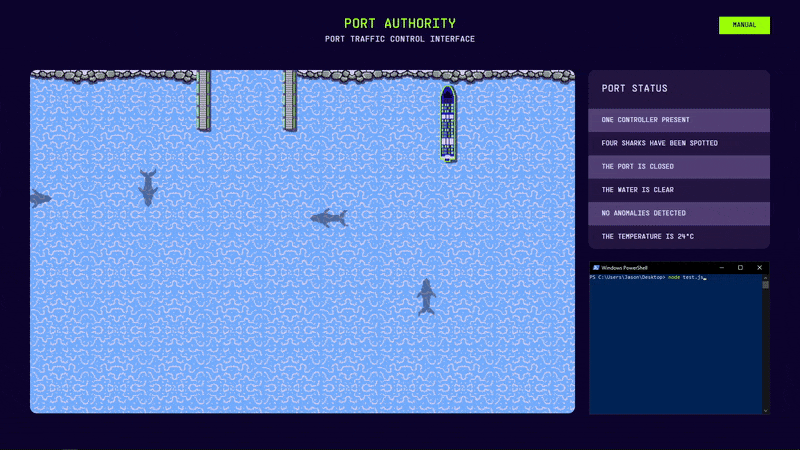
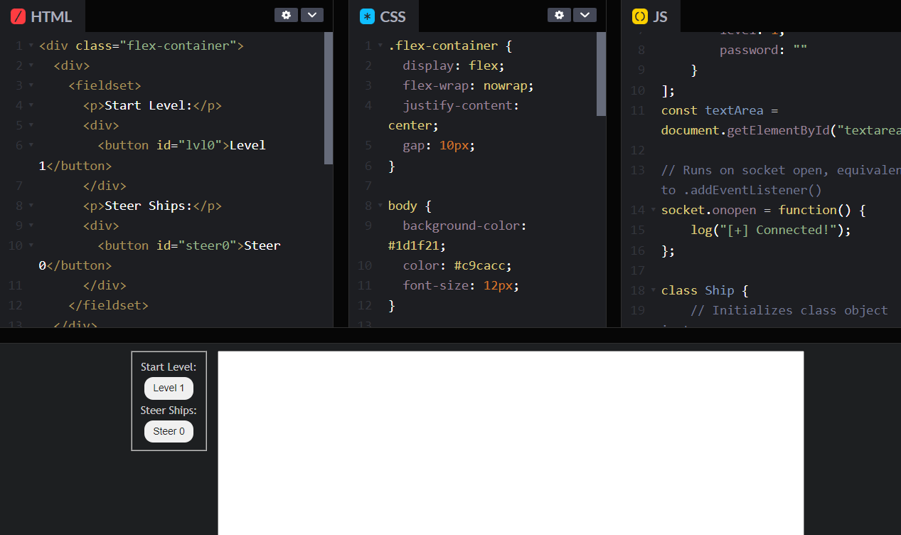
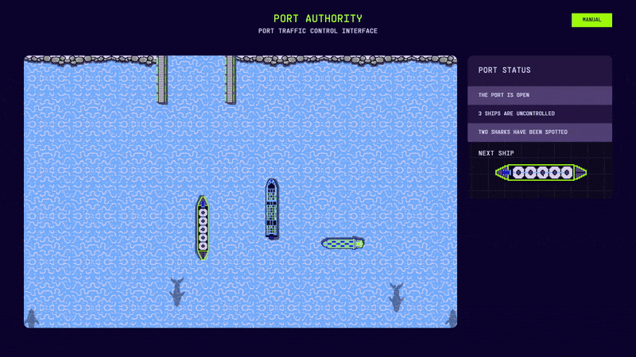
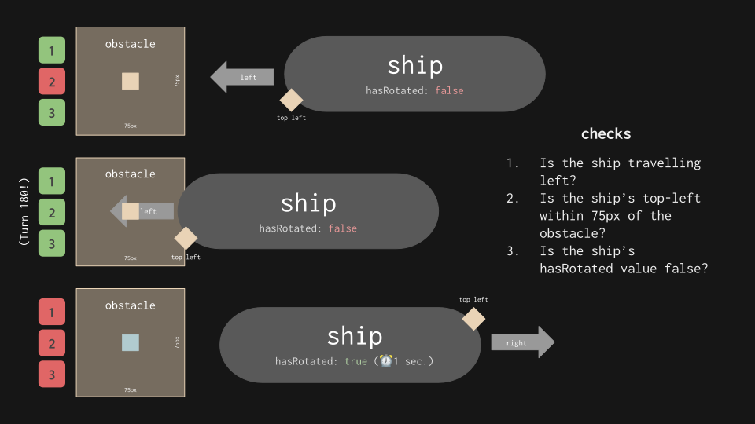
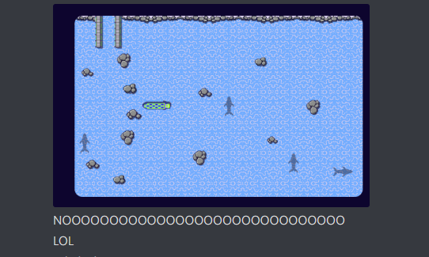

import Challenge from '@/components/mdx/Challenge.astro'
import InfoBox from '@/components/mdx/InfoBox.astro'
import Flag3Video from './assets/flag3.mp4'
import Flag4Video from './assets/flag4.mp4'
import Flag5Video from './assets/solve-cut.mp4'

## Intro

This challenge was part of the Deloitte Hackazon Hacky Holidays "Unlock the City" 2022 CTF (yeah, what a name!). Labeled under the `#ppc` category, which apparently stands for "professional programming challenge", it was the final challenge under the "District 1" segment of the CTF and categorized under the Hard difficulty.

This was the first CTF problem which didn't just challenge my ability to critically think and problem solve - it also challenged my **motor control** and **hand-eye coordination**. Why? _Because I solved it by hand!_ I believe this challenge was meant to be solved using 100% programming, but I wanted to challenge myself. This was the process.

---

## Port Authority

<Challenge
  authors={['Luuk Hofman', 'Diederik Bakker']}
  solvers={[
    {
      name: 'blueset',
      href: 'https://github.com/blueset',
      avatar: 'https://github.com/blueset.png',
    },
    {
      name: 'enscribe',
      href: 'https://github.com/jktrn',
      avatar: 'https://github.com/jktrn.png',
    },
    {
      name: 'sahuang',
      href: 'https://github.com/sahuang',
      avatar: 'https://github.com/sahuang.png',
    },
  ]}
  category="PPC"
  points="5/5 = 350"
>
  The harbour is in total chaos, the ships are no longer on course. The AI has
  disabled the brakes of all the ships and corrupted our control systems. The
  ships about to crash into each other, can you build a new AI that will rescue
  the ships and deliver the cargo?
</Challenge>

<InfoBox type="info">
  **Note**: This is an **instance-based** challenge. No website URL will be
  provided!
</InfoBox>

We're initially provided with a link that takes us to a nice-looking webgame called the "Port Traffic Control Interface":


Although we can't directly interact with the game using keyboard controls, there's a manual on the top-right which details the task:


According to this, we can start playing the game and controlling the ships that appear through a [WebSocket](https://developer.mozilla.org/en-US/docs/Web/API/WebSockets_API/) connection, which is an API that enables two-way communication between a user's browser and a server. [This documentation](https://javascript.info/websocket) describes the protocol alongside how to open/close and send/receive using JavaScript.

Heavily referencing the aforementioned documentation, I started off by installing the WebSocket package with `npm i ws`, and then creating a `solve.js` with the following code:

```js title="solve.js" caption="Initial WebSocket Connection" showLineNumbers
// Make sure you install WebSocket with "npm i ws"!
const WebSocket = require('ws')
// Regex so that I can freely paste the URL when the instance is changed
const url = 'https://[REDACTED].challenge.hackazon.org/'
// Opens WebSocket connection
const socket = new WebSocket(`wss://${url.replace(/^https?:\/\//, '')}ws`)

// Runs on socket open, equivalent to .addEventListener()
socket.onopen = function () {
  console.log('[+] Connected!')
  // Converts object to string
  socket.send(
    JSON.stringify({
      type: 'START_GAME',
      level: 1,
    }),
  )
}

// Runs when output from server is received
socket.onmessage = function (event) {
  // Output is received in event
  console.log(`[-] ${event.data}`)
}
```

Look what happens when we establish a connection - the game starts running, and we start receiving per-tick input from the server in our console:


```ansi
$ node test.js
[+] Connected!
[-] {"type":"GAME_START","level":{"id":1,"board":{"width":1886,"height":1188,"obstructions":[{"type":"HARBOUR_BORDER","area":[{"x":577,"y":0},{"x":627,"y":215.7142857142857}]},{"type":"HARBOUR_BORDER","area":[{"x":875,"y":0},{"x":925,"y":215.7142857142857}]},{"type":"BORDER_ROCK","area":[{"x":0,"y":0},{"x":577,"y":51}]},{"type":"BORDER_ROCK","area":[{"x":925,"y":0},{"x":1886,"y":51}]}],"harbour":[{"x":700,"y":0},{"x":850,"y":107.85714285714285}]},"mechanics":{"borderCollision":false,"sequentialDocking":true},"ships":[null]}}
[-] {"type":"TICK","ships":[{"type":"SHIP_6","area":[{"x":472,"y":795},{"x":532,"y":1063.75}],"direction":"UP","speed":3,"id":0,"isDocked":false}]}
[-] {"type":"TICK","ships":[{"type":"SHIP_6","area":[{"x":472,"y":795},{"x":532,"y":1063.75}],"direction":"UP","speed":3,"id":0,"isDocked":false}]}
[-] {"type":"TICK","ships":[{"type":"SHIP_6","area":[{"x":472,"y":792},{"x":532,"y":1060.75}],"direction":"UP","speed":3,"id":0,"isDocked":false}]}
[-] {"type":"TICK","ships":[{"type":"SHIP_6","area":[{"x":472,"y":789},{"x":532,"y":1057.75}],"direction":"UP","speed":3,"id":0,"isDocked":false}]}
...
```

Let's see what happens when we send the `SHIP_STEER` command to the server after five seconds. We can do that with the [`setTimeout()`](https://developer.mozilla.org/en-US/docs/Web/API/setTimeout) method in our `socket.onopen` listener:

```js title="solve.js" caption="Testing steering mechanic" showLineNumbers{9} add{16-22}
socket.onopen = function() {
    console.log("[+] Connected!");
    // Converts object to string
    socket.send(JSON.stringify({
        "type": "START_GAME",
        "level": 1
    }));
    // Sends steer command after one second
    setTimeout(() => {
        socket.send(JSON.stringify({
            "type": "SHIP_STEER",
            "shipId": 0
        }));
    }, 5000);
};
```



From the provided GIF, we can see that the ship will turn clockwise on its central point when told to steer!

With this, we have a goal: **get the ship into the port by sending JSON instructions to the WebSocket server**. However, it's definitely a good idea to create some quality-of-life features first, such as:

- A way to convert our JSON data into an object we can reference
- A class which can construct objects for each ship
- An HTML/JS "controller", which can be used to steer the ships with UI and to start new levels

Firstly, cleaning up the output involves parsing what we receive from the server, which we can do with the `JSON.parse()` method. We'll assign it into a variable named `obj` (and also delete our steer-testing code):

```js title="solve.js" caption="Parsing JSON" showLineNumbers{16} add{29-30} remove{16-23}
// Sends steer command after one second
    setTimeout(() => {
        socket.send(JSON.stringify({
            "type": "SHIP_STEER",
            "shipId": 0
        }));
    }, 5000);
};

// Runs when output from server is received
socket.onmessage = function(event) {
    // Output is received in event
    console.log(`[-] ${event.data}`);
    // Converts server output into object
    let obj = JSON.parse(event.data);
};
```

Each tick, `obj` will change to an object structured this way:

```json title="Tick output"
{
  "type": "TICK",
  "ships": [
    {
      "type": "SHIP_6",
      "area": [
        {
          "x": 472,
          "y": 795
        },
        {
          "x": 532,
          "y": 1063.75
        }
      ],
      "direction": "UP",
      "speed": 3,
      "id": 0,
      "isDocked": false
    }
  ]
}
```

Check out the `obj.type{:js}` key - there'll be multiple types of these (including but not limited to `"LOSS"{:js}`, `"GAME_START"{:js}`). We'll make it so that if `obj.type{:js}` is `"TICK"{:js}`, it will create a new `Class{:js}` instance for each object in the `obj.ships{:js}` array:

```js title="solve.js" caption="Ship class, instance creation, pretty logging" showLineNumbers{18} add{18-32,38-47}
class Ship {
    // Initializes class object instance
    constructor(id, topLeft, bottomRight, direction) {
        this.id = id;
        this.topLeft = topLeft;
        this.bottomRight = bottomRight;
        this.direction = direction;
    }
    // Getter + abusing template literals
    get printState() {
        return `ID: ${this.id} | (${Math.floor(this.topLeft.x)}, 
${Math.floor(this.topLeft.y)}) (${Math.floor(this.bottomRight.x)}, 
${Math.floor(this.bottomRight.y)}) | DIR: ${this.direction}`;
    }
}

// Runs when output from server is received
socket.onmessage = function(event) {
    // Converts server output into object
    let obj = JSON.parse(event.data);
    if(obj.type == "TICK") {
        let ships = [];
        // For each ship in obj.ships, push class object into ships array
        for(const i of obj.ships) {
            ships.push(new Ship(i.id, i.area[0], i.area[1], i.direction));
        }
        // Call the string literal getter
        for(const i of ships) {
            console.log(i.printState);
        }
    }
};
```

With this new Class, we can get both our own `ships` array _and_ really clean logging from the server:

```ansi
$ node test.js
[+] Connected!
ID: 0 | (211, 256) (271, 524) | DIR: UP
ID: 0 | (211, 256) (271, 524) | DIR: UP
ID: 0 | (211, 252) (271, 520) | DIR: UP
ID: 0 | (211, 248) (271, 516) | DIR: UP
...
```

Let's finally get to solving the challenge.

---

### Level 1

<Challenge
  solvers={[
    {
      name: 'sahuang',
      href: 'https://github.com/sahuang',
      avatar: 'https://github.com/sahuang.png',
    },
    {
      name: 'blueset',
      href: 'https://github.com/blueset',
      avatar: 'https://github.com/blueset.png',
    },
  ]}
  points={25}
>
  Do you know how websockets work?
</Challenge>

The last thing I want to add was a web-based "controller", which can steer the ship on-click and start new levels. I moved all my code from a local `.js` file to [CodePen](https://codepen.io/) for instant page regeneration and accessability by teammates. Here's the HTML:

```html title="index.html" caption="First start & steer buttons"
<p>Start Level:</p>
<button id="lvl0">Level 1</button>

<p>Steer Ships:</p>
<button id="steer0">Steer 0</button>
```

Here's the JS that adds functionality to these buttons. Note that these are made to be scalable/"future-proof", meaning I can freely add more buttons without needing to copy/paste slight alterations of the same code. I also made some changes upon switching to the CodePen, including deleting the `require()` method and preventing level 1 from automatically starting on-open:

```js title="solve.js" caption="Future-proof DOM listeners & events" showLineNumbers add{7-12,24-54} remove{1-2,17-21}
// Make sure you install WebSocket with "npm i ws"!
const WebSocket = require('ws');
// Regex so that I can freely paste the URL when the instance is changed
const url = "https://[REDACTED].challenge.hackazon.org/";
// Opens WebSocket connection
const socket = new WebSocket(`wss://${url.replace(/^https?:\/\//, "")}ws`);
// Object literal for level lookup
const passwords = [{
        level: 1,
        password: ""
    }
];

// Runs on socket open, equivalent to .addEventListener()
socket.onopen = function() {
    console.log("[+] Connected!");
    // Converts object to string
    socket.send(JSON.stringify({
        "type": "START_GAME",
        "level": 1
    }));
};
// [!code skip:16:45]
// Assigns onclick listeners for each level button
findAll("lvl").forEach(function(element, index) {
    element.onclick = function() {
        socket.send(JSON.stringify({
            type: "START_GAME",
            level: passwords[index].level,
            password: passwords[index].password
        }));
    };
});
 
// Assigns onclick listeners for each steer button
findAll("steer").forEach(function(element, index) {
    element.onclick = function() {
        socket.send(JSON.stringify({
            type: "SHIP_STEER",
            shipId: `${index}`
        }));
    };
});
 
// Creates DOM array for each element with name id + int
function findAll(id) {
    let i = 0;
    let list = [];
    while (document.getElementById(id + i)) {
        list[i] = document.getElementById(id + i);
        i++;
    }
    return list;
}
```

The preview on CodePen will look something like this:


Let's see if it actually works:


We could totally flag the challenge right now, but currently there's no way to see the filtered output we created. I know there's a "Console" button at the bottom-left of CodePen, but I'd like to see the output on the actual webpage, outside of the IDE. To do this, let's create a `log()` function to append strings to a `<textarea>` we'll add in the HTML:

```js title="solve.js" caption="Converting to log() function" showLineNumbers{11} add{20,22-24,27-31} remove{19}
const text = document.getElementById("textarea");
// [!code skip:12:36]
        // For each ship in obj.ships, push class object into ships array
        for(const i of obj.ships) {
            ships.push(new Ship(i.id, i.area[0], i.area[1], i.direction));
        }
        // Call the string literal getter
        for(const i of ships) {
            console.log(i.printState);
            log(i.printState);        
        }
    } else {
      log(JSON.stringify(JSON.parse(event.data)));
    }
};
// [!code skip:49:81]
function log(str) {
    text.value += "\n" + str;
    text.value = text.value.substring(text.value.length - 10000);
    text.scrollTop = text.scrollHeight;
}
```

We'll also spice up the page slightly with flexboxes, a `<fieldset>` and some CSS:

```html title="index.html" caption="Adding flexboxes and fieldsets" showLineNumbers add{1-3,5,7,9,11-17}
<div class="flex-container">
    <div>
        <fieldset>
            <p>Start Level:</p>
            <div>
                <button id="lvl0">Level 1</button>
            </div>
            <p>Steer Ships:</p>
            <div>
                <button id="steer0">Steer 0</button>
            </div>
        </fieldset>
    </div>
    <div>
        <textarea id="textarea" cols="80" rows="20"></textarea>
    </div>
</div>
```

```css title="style.css" caption="Some beauty treatment" showLineNumbers
.flex-container {
  display: flex;
  flex-wrap: nowrap;
  justify-content: center;
  gap: 10px;
}

body {
  background-color: #1d1f21;
  color: #c9cacc;
  font-size: 12px;
}

fieldset {
  text-align: center;
  font-family: 'Trebuchet MS';
}

textarea {
  font-family: 'Courier New';
}

p {
  margin-top: 5px;
  margin-bottom: 5px;
}

button {
  border: none;
  cursor: pointer;
  height: 25px;
  padding: 0px 10px;
  border-radius: 10px;
  color: #222;
  font-size: 11px;
}
```

Here's the preview now:



Sorry I was being extra. Let's flag the challenge now (sped up):

```text /CTF{CapTA1n-cRUCh}/
...
ID: 0 | (688, 115) (748, 383) | DIR: UP
ID: 0 | (688, 115) (748, 383) | DIR: UP
ID: 0 | (688, 111) (748, 379) | DIR: UP
{"type":"WIN","flag":"CTF{CapTA1n-cRUCh}"}
```

We've succesfully completed Level 1!

---

### Level 2

<Challenge
  solvers={[
    {
      name: 'sahuang',
      href: 'https://github.com/sahuang',
      avatar: 'https://github.com/sahuang.png',
    },
    {
      name: 'blueset',
      href: 'https://github.com/blueset',
      avatar: 'https://github.com/blueset.png',
    },
  ]}
  points={25}
>
  Lets script it - don't forget the order!
</Challenge>

"Lets script it"? I've already scripted throughout the entirety of Level 1 to accommodate for future levels! Let's add a Level 2 button to our scalable, future-proof code 😉:

```js title="solve.js" caption="Adding Level 2 button" showLineNumbers{6} add{10-13}
const passwords = [{
        level: 1,
        password: ""
    },
    {
        level: 2,
        password: "CTF{CapTA1n-cRUCh}"
    }
];
```

```html title="index.html" caption="Adding Level 2 button" showLineNumbers{3} add{7}
<fieldset>
    <p>Start Level:</p>
        <div>
            <button id="lvl0">Level 1</button>
            <button id="lvl1">Level 2</button>  
        </div>
```

This is what appears when clicking the button:



Looks like we'll have to add two more steer buttons:

```html title="index.html" caption="Adding steer buttons" showLineNumbers{9} add{12-13}
<p>Steer Ships:</p>
        <div>
            <button id="steer0">Steer 0</button>
            <button id="steer1">Steer 1</button>
            <button id="steer2">Steer 2</button>  
        </div>
</fieldset>
```

It seems as though that you also need the ships to enter in a specific order. It will be difficult to multitask all three, but it's doable! Let's try to solve it (also very sped up):


```text /CTF{capt41n-h00k!}/
...
ID: 0 | (789, 105) (849, 294) | DIR: UP
ID: 1 | (796, 105) (856, 373) | DIR: UP
ID: 2 | (691, 108) (751, 389) | DIR: UP
{"type":"WIN","flag":"CTF{capt41n-h00k!}"}
```

Although we've solved level 2 manually, I have a gut feeling the next few ones won't be as trivial...

---

### Level 3

<Challenge
  solvers={[{
    name: 'sahuang',
    href: 'https://github.com/sahuang',
    avatar: 'https://github.com/sahuang.png',
  }]}
  points={50}
>
  Can you deal with the rocks that appeared in our once so peaceful harbor?
</Challenge>

After adding another button to start Level 3, this is the field we start with:


They added some rocks to the board, and the ships are now moving at a faster speed. This is unfeasable to complete via multitasking, so we'll have to come up with a method to keep the ships in place.

Here's the plan: let's make it so that these ships will constantly rotate at a certain interval - in doing so, they'll complete a 360° loop within a small area, and we can commandeer them one-at-a-time by disabling the loop for certain ships. Let's start by adding checkboxes to enable the loop:

```html title="index.html" caption="Adding loop checkboxes" showLineNumbers{10} add{16-21}
    <p>Steer Ships:</p>
    <div>
        <button id="steer0">Steer 0</button>
        <button id="steer1">Steer 1</button>
        <button id="steer2">Steer 2</button>
    </div>
    <p>Loop Ships:</p>
    <div>
        <input type="checkbox" id="loop0" checked>Loop 0</input>
        <input type="checkbox" id="loop1" checked>Loop 1</input>
        <input type="checkbox" id="loop2" checked>Loop 2</input>
    </div>
</fieldset>
```

Regarding the JavaScript, I'll be using `performance.now(){:js}` and checking if the difference between it and `window.lastRot{:js}` is greater than 500ms. This check will happen every tick, and in theory will create a consistently steering ship that doesn't produce `"ILLEGAL_MOVE"{:js}`s for inputting too quickly:

```js title="solve.js" caption="Implementing looped rotations" showLineNumbers{40} add{40,59-70}
window.lastRot = 0;

// Runs when output from server is received
socket.onmessage = function (event) {
    // Converts server output into object
    let obj = JSON.parse(event.data);
    if (obj.type == "TICK") {
        let ships = [];
        // For each ship in obj.ships, push class object into ships array
        for (const i of obj.ships) {
            ships.push(new Ship(i.id, i.area[0], i.area[1], i.direction));
        }
        // Call the string literal getter
        for (const i of ships) {
            log(i.printState);
        }
    } else {
        log(JSON.stringify(JSON.parse(event.data)));
    }
    // Guard clause for looping ships!
    if (performance.now() - window.lastRot < 500) return;
    window.lastRot = performance.now();
    // Sends steer if checkbox is checked
    findAll("loop").forEach(function (element, index) {
        if (element.checked) {
            socket.send(JSON.stringify({
                type: "SHIP_STEER",
                shipId: `${index}`
            }));
        }
    });
};
```

Let's see if it works:


We've managed to stabilize the playing field for a manual solve! Let's flag the level:

<video className="my-4 rounded-md" controls>
  <source src={Flag3Video} type="video/mp4" />
  Your browser does not support the video tag.
</video>

```text /CTF{c4pt41N-m0rG4N}/
...
ID: 0 | (760, 105) (820, 343) | DIR: UP
ID: 1 | (736, 101) (796, 371) | DIR: UP
ID: 2 | (742, 113) (802, 393) | DIR: UP
{"type":"WIN","flag":"CTF{c4pt41N-m0rG4N}"}
```

---

### Level 4

<Challenge
  solvers={[{
    name: 'sahuang',
    href: 'https://github.com/sahuang',
    avatar: 'https://github.com/sahuang.png',
  }]}
  points={50}
>
  The algorithm disturbed our radar system - boats that veer too far off track are lost and never seen again. Can you give them directions in time?
</Challenge>

After I added the level 4 button alongside steer/loop buttons for the extra ship that popped up, I discovered that my solution for level 3 actually worked for level 4 as well:


This means I can flag this level without needing to code at all!:

<video className="my-4 rounded-md" controls>
  <source src={Flag4Video} type="video/mp4" />
  Your browser does not support the video tag.
</video>

```text /CTF{C4pt41N-4MErIc4}/
...
ID: 0 | (742, 107) (802, 345) | DIR: UP
ID: 1 | (731, 105) (791, 385) | DIR: UP
ID: 2 | (752, 107) (812, 377) | DIR: UP
ID: 3 | (731, 114) (791, 395) | DIR: UP
{"type":"WIN","flag":"CTF{C4pt41N-4MErIc4}"}
```

---

### Level 5

<Challenge
  solvers={[{
    name: 'enscribe',
    href: 'https://github.com/jktrn',
    avatar: 'https://github.com/jktrn.png',
  }, {
    name: 'sahuang',
    href: 'https://github.com/sahuang',
    avatar: 'https://github.com/sahuang.png',
  }]}
  points={200}
>
  A huge influx of ships is coming our way - can you lead them safely to the port?
</Challenge>

Oh boy...


Level five gives us a large increase in rocks, a tiny harbor, and six total ships to work with at max speed. Unfortunately, there's not enough room for the ships to loop around in circles, so the solution to levels 3 and 4 won't work. We'll have to figure out something else.

Luckily, during some experimenation on level 1 I found out that you can actually do a full 180° turn by calling two consecutive turns in the code. In doing so, the ship won't hit any of the objects in its surroundings as compared to if it rotated 90° twice. We can observe this phenomenon below:

<div className="align-center flex flex-col justify-center gap-0 sm:flex-row sm:gap-4">
  ```js title="solve.js" caption="180° turn" showLineNumbers{142}
          function turn180(id) {
            socket.send(JSON.stringify({
                type: "SHIP_STEER",
                shipId: id
            }));
            socket.send(JSON.stringify({
                type: "SHIP_STEER",
                shipId: id
            }));
        }
  ```

  
</div>

Also, if you noticed in the first GIF, the ships are spawning at around the same locations every time. With this, we can come up with a plan: create "obstacles" with x-y coordinates that will cause any ship that comes into the region to turn 180°. We'll create separate "lanes" for each ship that spawns, therefore stabilizing the playfield and allowing for a feasible manual solve:


Now, how are these checks going to work? After a lot of experimenting I found that **three** total criteria should be met:

1. The ship is travelling in the same the direction passed as an argument when the `check()` function is called
2. The absolute difference between the x and y values of the object and the ship's top-left is less than a certain threshold (I chose 75px)
3. The global variable to determine whether or not the ship has been rotated 180° yet is false (`hasRotated`)

Here's a visual I drew in case you're lost. The red/green squares on the left indicate the status of each check during different stages of the turn:



We can now begin programming by creating an Obstacle class and manually placing them down throughout the map. This was just a lot of trial and error, so don't worry about these coordinates feeling random:

```js title="solve.js" caption="Creating obstacles" showLineNumbers{48}
class Obstacle {
    constructor(x, y) {
        this.x = x
        this.y = y
    }
}

let obstacles = [
    new Obstacle(450, 1060),    //1
    new Obstacle(750, 1060),    //2
    new Obstacle(1200, 1060),   //3
    new Obstacle(1600, 1060),   //4
    new Obstacle(604, 700),     //5
    new Obstacle(1070, 600),    //6
    new Obstacle(1730, 650),    //7
    new Obstacle(604, 70),      //8
    new Obstacle(674, 200),     //9
    new Obstacle(1070, 350),    //10
    new Obstacle(1530, 200),    //11
    new Obstacle(1730, 300),    //12
]
```

Next, let's create the aforementioned `hasRotated` object alongside the `check()` function, which will implement the three criteria:

```js title="solve.js" caption="Creating check() function" showLineNumbers{70}
let hasRotated = {
    0: false,
    1: false,
    2: false,
    3: false,
    4: false,
    5: false
}
// [!code skip:78:151]
// Checks if ship should turn 180°
function check(ship, obstacle, direction) {
    if (!hasRotated[ship.id] &&                         // Check 1
        Math.abs(ship.topLeft.y - obstacle.y) < 75 &&   // Check 2
        Math.abs(ship.topLeft.x - obstacle.x) < 75 &&   // Check 2
        ship.direction == direction) {                  // Check 3
        hasRotated[ship.id] = true;
        turn180(ship.id);
        // Sets hasRotated[ship.id] back to false in 1 second asynchronously
        setTimeout(() => {
            hasRotated[ship.id] = false
        }, "1000");
    }
}
```

Finally, let's call the `check()` function for each index in the `ships` array. Each tick, _every single_ ship will go through these twelve checks. Although this might seem redundant, we have no way of assigning lanes to specific ships, as the IDs are randomized every time based on the order they're meant to dock. This method simply generalizes all of them, and shouldn't cause issues performance-wise:

```js title="solve.js" caption="Implementing lane checks" showLineNumbers{86}
    if (obj.type == "TICK") {
        let ships = [];
        // For each ship in obj.ships, push class object into ships array
        for (const i of obj.ships) {
            ships.push(new Ship(i.id, i.area[0], i.area[1], i.direction));
        }
        // Call the string literal getter
        for (const i of ships) {
            log(i.printState);
            // Infinite checks!
            check(i, obstacles[0], "LEFT");
            check(i, obstacles[1], "RIGHT");
            check(i, obstacles[2], "LEFT");
            check(i, obstacles[3], "RIGHT");
            check(i, obstacles[4], "DOWN");
            check(i, obstacles[5], "DOWN");
            check(i, obstacles[6], "DOWN");
            check(i, obstacles[7], "UP");
            check(i, obstacles[8], "LEFT");
            check(i, obstacles[9], "UP");
            check(i, obstacles[10], "RIGHT");
            check(i, obstacles[11], "UP");
        }
```

In theory, these checks should cause the ships to bounce back and forth in their specific lanes. Let's check it out:


Yes! We've managed to stabilize level 5 completely! Now, we need to be able to toggle the lanes off to manually solve the challenge. Let's add more checkboxes to the HTML and adjust the JS accordingly:

```html title="index.html" caption="Adding lane checkboxes" showLineNumbers{21} add{30-37}
            <p>Loop Ships:</p>
            <div>
                <input type="checkbox" id="loop0" checked>Loop 0</input>
                <input type="checkbox" id="loop1" checked>Loop 1</input>
                <input type="checkbox" id="loop2" checked>Loop 2</input>
                <input type="checkbox" id="loop3" checked>Loop 3</input>
                <input type="checkbox" id="loop4" checked>Loop 4</input>
                <input type="checkbox" id="loop5" checked>Loop 5</input>
            </div>
            <p> Disable Obstacles: </p>
            <div>
                <input type="checkbox" id="toggle0">1/2</input>
                <input type="checkbox" id="toggle1">3/4</input>
                <input type="checkbox" id="toggle2">5/8</input>
                <input type="checkbox" id="toggle3">6/10</input>
                <input type="checkbox" id="toggle4">7/12</input>
                <input type="checkbox" id="toggle5">9/11</input>
            </div>
        </fieldset>
```

```js title="solve.js" caption="Toggleable lanes" showLineNumbers{80} add{80,96,99-100,103-104,107-108,111-112,115-116}
let checkList = findAll("toggle");

// Runs when output from server is received
socket.onmessage = function (event) {
    // Converts server output into object
    let obj = JSON.parse(event.data);
    if (obj.type == "TICK") {
        let ships = [];
        // For each ship in obj.ships, push class object into ships array
        for (const i of obj.ships) {
            ships.push(new Ship(i.id, i.area[0], i.area[1], i.direction));
        }
        // Call the string literal getter
        for (const i of ships) {
            log(i.printState);
            // Infinite checks!
            if (!checkList[0].checked) {
                check(s, obstacles[0], "LEFT");
                check(s, obstacles[1], "RIGHT");
            }
            if (!checkList[1].checked) {
                check(s, obstacles[2], "LEFT");
                check(s, obstacles[3], "RIGHT");
            }
            if (!checkList[2].checked) {
                check(s, obstacles[4], "DOWN");
                check(s, obstacles[7], "UP");
            }
            if (!checkList[3].checked) {
                check(s, obstacles[5], "DOWN");
                check(s, obstacles[9], "UP");
            }
            if (!checkList[4].checked) {
                check(s, obstacles[6], "DOWN");
                check(s, obstacles[11], "UP");
            }
            if (!checkList[5].checked) {
                check(s, obstacles[8], "LEFT");
                check(s, obstacles[10], "RIGHT");
            }
        }
```

Now, we can strategize on how to solve the challenge manually. Our team deduced that the most ideal order for ships would look something like this:


This order allows for the first ship to enter the port within two turns, and provides plenty of space for the second and third ships to work with. Although it would require a lot of restarting (as the order is always random), it's worth it to ease the difficulty of the challenge.

Moving on, we began work on the manual solve process. It was super tedious and involved a lot of mess-ups, especially around the port area. We discovered that the window to turn into the port was extraordinarily small, leading to many runs dying to something like this:

<div className="[&>p]:align-center [&>p]:flex [&>p]:flex-col [&>p]:justify-center [&>p]:gap-0 [&>p]:sm:flex-row [&>p]:sm:gap-4 sm:[&>p>img]:!mx-0">
  
  
</div>

We decided it'd be best if we added another obstacle to perfectly turn us into the dock every time. This time around, it would have to be a 90° turn utlizing the middle of the ship instead of the top-left, as each ship is a different length and would therefore turn at different points when within the obstacles's hitbox:


Here is its implementation:

```js title="solve.js" caption="Implementing auto-dock" showLineNumbers{65} add{76-92}
    new Obstacle(1070, 350), //10
    new Obstacle(1530, 200), //11
    new Obstacle(1730, 300), //12
    new Obstacle(232, 575) //13
]
// [!code skip:70:116]
            if (!checkList[5].checked) {
                check(s, obstacles[8], "LEFT");
                check(s, obstacles[10], "RIGHT");
            }
// [!code skip:121:202]
function check90(s, o, d) {
    // Calculates middle of ship in coordinates
    let mid = Math.abs(Math.floor(s.topLeft.x + s.bottomRight.x) / 2);
    if (!hasRotated[s.id] &&
        Math.abs(s.topLeft.y - o.y) < 400 && // Large y for legroom
        Math.abs(mid - o.x) < 20 && // Small x for accuracy
        s.direction == d) {
        hasRotated[s.id] = true;
        socket.send(JSON.stringify({
            type: "SHIP_STEER",
            shipId: s.id
        }));
        setTimeout(() => {
            hasRotated[s.id] = false
        }, "1000");
    }
}
```

When you turn a ship through those rocks into the obstacle, the ship will now automatically turn to enter the dock perfectly:


**NOW IT'S TIME TO SOLVE THE CHALLENGE MANUALLY!** It took multiple hours across several days, and included some chokes as tragic as this one:



But, finally, I got the solve run clipped here, with a small reaction 🤣:

<video controls>
  <source src={Flag5Video} type="video/mp4" />
  <track kind="captions" />
  Your browser does not support the video tag.
</video>

<InfoBox type="flag">
  **Port Authority**, Level 5: `CTF{CaPT41n-j4Ck-sp4rR0w}`
</InfoBox>

Here is the final script:

```js title="solve.js" caption="Final script" showLineNumbers
// Regex so that I can freely paste the URL when the instance is changed
const url = "https://[REDACTED].challenge.hackazon.org/";
// Opens WebSocket connection
const socket = new WebSocket(`wss://${url.replace(/^https?:\/\//, "")}ws`);
// Object literal for level lookup
const passwords = [{
        level: 1,
        password: ""
    },
    {
        level: 2,
        password: "CTF{CapTA1n-cRUCh}"
    },
    {
        level: 3,
        password: "CTF{capt41n-h00k!}"
    },
    {
        level: 4,
        password: "CTF{c4pt41N-m0rG4N}"
    },
    {
        level: 5,
        password: "CTF{C4pt41N-4MErIc4}"
    }
];
const text = document.getElementById("textarea");

// Runs on socket open, equivalent to .addEventListener()
socket.onopen = function() {
    log("[+] Connected!");
};

class Ship {
    // Initializes class object instance
    constructor(id, topLeft, bottomRight, direction) {
        this.id = id;
        this.topLeft = topLeft;
        this.bottomRight = bottomRight;
        this.direction = direction;
    }
    // Getter + abusing template literals
    get printState() {
        return `ID: ${this.id} | (${Math.floor(this.topLeft.x)}, ${Math.floor(this.topLeft.y)}) (${Math.floor(this.bottomRight.x)}, ${Math.floor(this.bottomRight.y)}) | DIR: ${this.direction}`;
    }
}

class Obstacle {
    constructor(x, y) {
        this.x = x
        this.y = y
    }
}

let obstacles = [
    new Obstacle(450, 1060), //1
    new Obstacle(750, 1060), //2
    new Obstacle(1200, 1060), //3
    new Obstacle(1600, 1060), //4
    new Obstacle(604, 700), //5
    new Obstacle(1070, 600), //6
    new Obstacle(1730, 650), //7
    new Obstacle(604, 70), //8
    new Obstacle(674, 200), //9
    new Obstacle(1070, 350), //10
    new Obstacle(1530, 200), //11
    new Obstacle(1730, 300), //12
    new Obstacle(232, 575) //13
]

let hasRotated = {
    0: false,
    1: false,
    2: false,
    3: false,
    4: false,
    5: false
}

window.lastRot = 0;
let checkList = findAll("toggle");

// Runs when output from server is received
socket.onmessage = function (event) {
    // Converts server output into object
    let obj = JSON.parse(event.data);
    if (obj.type == "TICK") {
        let ships = [];
        // For each ship in obj.ships, push class object into ships array
        for (const i of obj.ships) {
            ships.push(new Ship(i.id, i.area[0], i.area[1], i.direction));
        }
        // Call the string literal getter
        for (const i of ships) {
            log(i.printState);
            // Infinite checks!
            if (!checkList[0].checked) {
                check(i, obstacles[0], "LEFT");
                check(i, obstacles[1], "RIGHT");
            }
            if (!checkList[1].checked) {
                check(i, obstacles[2], "LEFT");
                check(i, obstacles[3], "RIGHT");
            }
            if (!checkList[2].checked) {
                check(i, obstacles[4], "DOWN");
                check(i, obstacles[7], "UP");
            }
            if (!checkList[3].checked) {
                check(i, obstacles[5], "DOWN");
                check(i, obstacles[9], "UP");
            }
            if (!checkList[4].checked) {
                check(i, obstacles[6], "DOWN");
                check(i, obstacles[11], "UP");
            }
            if (!checkList[5].checked) {
                check(i, obstacles[8], "LEFT");
                check(i, obstacles[10], "RIGHT");
            }
            // Auto-docking obstacle
            check90(i, obstacles[12], "LEFT");
        }
    } else {
        log(JSON.stringify(JSON.parse(event.data)));
    }
    // Guard clause for looping ships!
    if (performance.now() - window.lastRot < 500) return;
    window.lastRot = performance.now();
    // If statement for each element that begins with "loop"
    findAll("loop").forEach(function (element, index) {
        if (element.checked) {
            socket.send(JSON.stringify({
                type: "SHIP_STEER",
                shipId: `${index}`
            }));
        }
    });
};

// Assigns onclick listeners for each level button
findAll("lvl").forEach(function(element, index) {
    element.onclick = function() {
        socket.send(JSON.stringify({
            type: "START_GAME",
            level: passwords[index].level,
            password: passwords[index].password
        }));
    };
});

// Assigns onclick listeners for each steer button
findAll("steer").forEach(function(element, index) {
    element.onclick = function() {
        socket.send(JSON.stringify({
            type: "SHIP_STEER",
            shipId: `${index}`
        }));
    };
});

// Creates DOM array for each element with name id + int
function findAll(id) {
    let i = 0;
    let list = [];
    while (document.getElementById(id + i)) {
        list[i] = document.getElementById(id + i);
        i++;
    }
    return list;
}

function log(str) {
    text.value += "\n" + str;
    text.value = text.value.substring(text.value.length - 10000);
    text.scrollTop = text.scrollHeight;
}

function turn180(id) {
    socket.send(JSON.stringify({
        type: "SHIP_STEER",
        shipId: id
    }));
    socket.send(JSON.stringify({
        type: "SHIP_STEER",
        shipId: id
    }));
}

function check(s, o, d) {
    if (!hasRotated[s.id] &&
        Math.abs(s.topLeft.y - o.y) < 75 &&
        Math.abs(s.topLeft.x - o.x) < 75 &&
        s.direction == d) {
        hasRotated[s.id] = true;
        turn180(s.id);
        setTimeout(() => {
            hasRotated[s.id] = false
        }, "1000");
    }
}

function check90(s, o, d) {
    // Calculates middle of ship in coordinates
    let mid = Math.abs(Math.floor(s.topLeft.x + s.bottomRight.x) / 2);
    if (!hasRotated[s.id] &&
        Math.abs(s.topLeft.y - o.y) < 400 && // Large y for legroom
        Math.abs(mid - o.x) < 20 && // Small x for accuracy
        s.direction == d) {
        hasRotated[s.id] = true;
        socket.send(JSON.stringify({
            type: "SHIP_STEER",
            shipId: s.id
        }));
        setTimeout(() => {
            hasRotated[s.id] = false
        }, "1000");
    }
}
```

---

## Afterword

If you made it to this point of the writeup, I want to sincerely thank you for reading. This writeup genuinely took longer to create than it took to solve the challenge (about 30 hours across two weeks), as I had to recreate, record, crop, and optimize every aspect of the solve. I had to create my own multi-hundred-line plugins to implement custom code blocks specifically for this writeup. Everything from the line numbers in highlighted diffs of code to the diagrams were hand-done, as this is my passion: to create for people to learn in a concise, aesthetically pleasing manner. This is also an entry for the Hacky Holidays writeup competition, so wish me luck! 🤞

\- enscribe

---

Update: There I am! 🎉 Thanks for the support, everybody.


