import CountryFlag from '@/components/mdx/CountryFlag.astro'
import Challenge from '@/components/mdx/Challenge.astro'
import Callout from '@/components/mdx/Callout.astro'
import StaticTweet from '@/components/mdx/StaticTweet.astro'
import WalterWhiteFalling from './assets/walter-white-falling.gif'


## Introduction

Recently my team ([Project Sekai](https://sekai.team/)) and I played [idekCTF 2022\*](https://ctftime.org/event/1839) (with an asterisk... because it's 2023), which was an extraordinarily "race against the clock"-esque CTF with a ridiculously large pool of challenges - 58 of them, over a 48-hour runtime. We managed to snag a 1st place finish after countless hours of _not_ touching grass (despite analyzing it throughout this challenge), and I would like to share my personal favorite OSINT challenge of the competition - "NMPZ", an acronym in the [GeoGuessr](https://geoguessr.com/) community for "no **moving**, **panning**, or **zooming**." Although my team hadn't 100% correctly solved the challenge (we inferred part of the flag), here was our thought process tackling it. Enjoy!

<div class="invisible h-0! [&+*]:mt-0 [&+*_*]:mt-0">
## NMPZ
</div>

<Challenge
  title="NMPZ"
  solvers={[
    {
      name: 'enscribe',
      href: 'https://github.com/jktrn',
      avatar: 'https://github.com/jktrn.png',
    },
  ]}
  authors={['jazzzooo']}
  category="OSINT"
  points={474}
  files={['NMPZ.zip']}
  flag="idek{BReAK_me_sPaCEbaR}"
>
  Are you as good as Rainbolt at GeoGuessr? Prove your skills by geo-guessing
  these 17 countries.
</Challenge>

The provided `README` file contains the following:

```text title="README"
Figure out in which country each image was taken.
The first letter of every country's name will create the flag.
Countries with over 10 million inhabitants will have a capital letter.
Countries with less than one million inhabitants become an underscore.
```

Here is a table of the provided example flag (`idek{TEST_flAg}`), and how the flag construction works:

| Image | Country                                                                                   | [Population](https://en.wikipedia.org/wiki/List_of_countries_and_dependencies_by_population) | Flag |
| ----- | ----------------------------------------------------------------------------------------- | -------------------------------------------------------------------------------------------- | ---- |
| 1.png | <CountryFlag country="tr" /> [Turkey](https://en.wikipedia.org/wiki/Turkey)               | 84,680,273 ([2021](https://en.wikipedia.org/wiki/Demographics_of_Turkey))                    | `T`  |
| 2.png | <CountryFlag country="ec" /> [Ecuador](https://en.wikipedia.org/wiki/Ecuador)             | 18,145,568 ([2023](https://en.wikipedia.org/wiki/Demographics_of_Ecuador))                   | `E`  |
| 3.png | <CountryFlag country="es" /> [Spain](https://en.wikipedia.org/wiki/Spain)                 | 47,615,034 ([2022](https://en.wikipedia.org/wiki/Demographics_of_Spain))                     | `S`  |
| 4.png | <CountryFlag country="th" /> [Thailand](https://en.wikipedia.org/wiki/Thailand)           | 66,883,467 ([2023](https://en.wikipedia.org/wiki/Demographics_of_Thailand))                  | `T`  |
| 5.png | <CountryFlag country="va" /> [Vatican City](https://en.wikipedia.org/wiki/Vatican_City)   | 825 ([2019](https://en.wikipedia.org/wiki/Vatican_City#Demographics))                        | `_`  |
| 6.png | <CountryFlag country="fi" /> [Finland](https://en.wikipedia.org/wiki/Finland)             | 5,528,796 ([2022](https://en.wikipedia.org/wiki/Demographics_of_Finland))                    | `f`  |
| 7.png | <CountryFlag country="lt" /> [Lithuania](https://en.wikipedia.org/wiki/Lithuania)         | 2,839,020 ([2022](https://en.wikipedia.org/wiki/Demographics_of_Lithuania))                  | `l`  |
| 8.png | <CountryFlag country="ar" /> [Argentina](https://en.wikipedia.org/wiki/Argentina)         | 47,327,407 ([2022](https://en.wikipedia.org/wiki/Demographics_of_Argentina))                 | `A`  |
| 9.png | <CountryFlag country="ge" /> [Georgia](<https://en.wikipedia.org/wiki/Georgia_(country)>) | 3,688,600 ([2022](<https://en.wikipedia.org/wiki/Demographics_of_Georgia_(country)>))        | `g`  |

We're given... 17 different screenshots of locations on [Google Street View](https://www.google.com/streetview/). Currently, our goal is to find the Country for each and every single one of these screenshots, and to combine each letter together to form the flag (as per the README). Let's get to work.

---

### 1.png

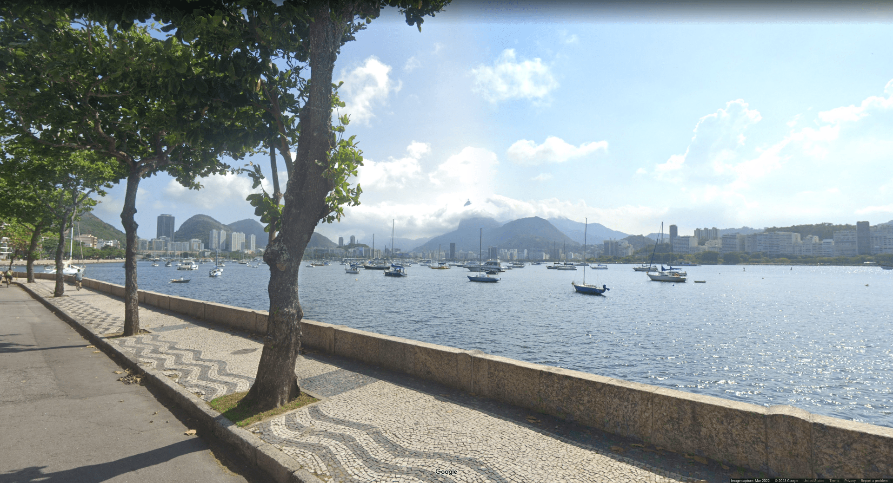

Looks like we're on a waterfront walkway with a beautiful view of a harbor. A quick [Google Lens](https://lens.google/) results in a "[Muerta da Urca](https://www.google.com/search?q=mureta+da+urca)" in Rio de Janeiro, <CountryFlag country="br" /> [Brazil](https://en.wikipedia.org/wiki/Brazil):


Oh, yeah, there's totally a World Wonder in the background by the way... [Christ the Redeemer](<https://en.wikipedia.org/wiki/Christ_the_Redeemer_(statue)>):

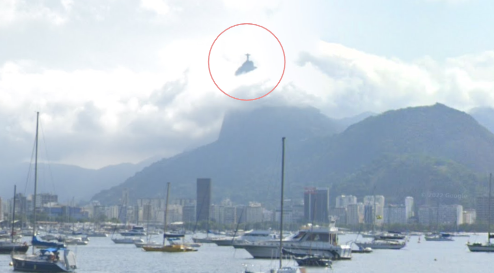

Since Brazil had a population of ~215 million in [2022](https://en.wikipedia.org/wiki/Demographics_of_Brazil), it'll be capitalized in the flag.

| Image          | Country                                                                     | [Population](https://en.wikipedia.org/wiki/List_of_countries_and_dependencies_by_population) | Flag |
| -------------- | --------------------------------------------------------------------------- | -------------------------------------------------------------------------------------------- | ---- |
| [1.png](#1png) | <CountryFlag country="br" /> [Brazil](https://en.wikipedia.org/wiki/Brazil) | 215,652,035 ([2023](https://en.wikipedia.org/wiki/Demographics_of_Brazil))                   | `B`  |

---

### 2.png

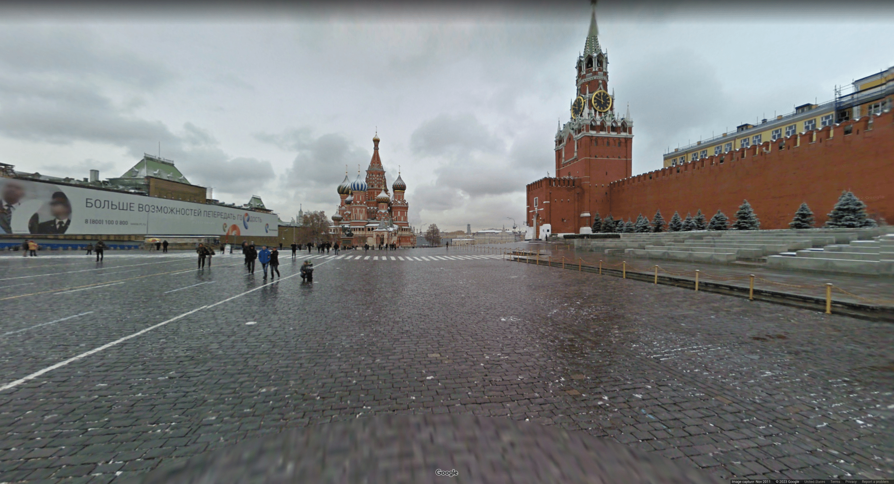

Wow... this is the most <CountryFlag country="ru" /> [Russia](https://en.wikipedia.org/wiki/Russia) photo I've ever seen! If you don't believe me, here's a Google Lens of the very evident [St. Basil's Cathedral](https://en.wikipedia.org/wiki/Saint_Basil%27s_Cathedral) looming in the background:


| Image          | Country                                                                     | [Population](https://en.wikipedia.org/wiki/List_of_countries_and_dependencies_by_population) | Flag |
| -------------- | --------------------------------------------------------------------------- | -------------------------------------------------------------------------------------------- | ---- |
| [1.png](#1png) | <CountryFlag country="br" /> [Brazil](https://en.wikipedia.org/wiki/Brazil) | 215,652,035 ([2023](https://en.wikipedia.org/wiki/Demographics_of_Brazil))                   | `B`  |
| [2.png](#2png) | <CountryFlag country="ru" /> [Russia](https://en.wikipedia.org/wiki/Russia) | 146,980,061 ([2022](https://en.wikipedia.org/wiki/Demographics_of_Russia))                   | `R`  |

---

### 3.png

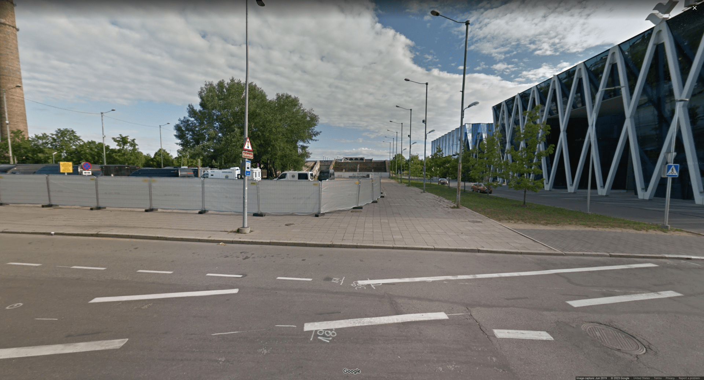

Finally, no more trivial landmarks in the background! Looks like we're now on the roadside of some European business-y area. I quickly noticed a name on the brown sign attached to the streetlight:

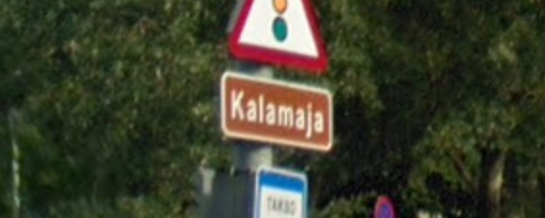

It reads "Kalamaja", which upon a quick Google results in a small city district in [Tallinn](https://en.wikipedia.org/wiki/Tallinn), <CountryFlag country="ee" /> [Estonia](https://en.wikipedia.org/wiki/Estonia):

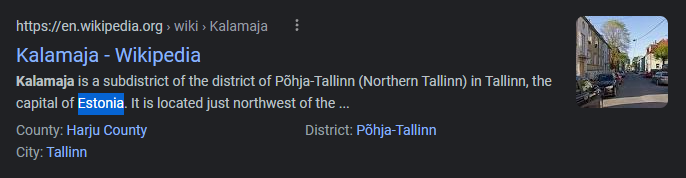

| Image          | Country                                                                       | [Population](https://en.wikipedia.org/wiki/List_of_countries_and_dependencies_by_population) | Flag |
| -------------- | ----------------------------------------------------------------------------- | -------------------------------------------------------------------------------------------- | ---- |
| [1.png](#1png) | <CountryFlag country="br" /> [Brazil](https://en.wikipedia.org/wiki/Brazil)   | 215,652,035 ([2023](https://en.wikipedia.org/wiki/Demographics_of_Brazil))                   | `B`  |
| [2.png](#2png) | <CountryFlag country="ru" /> [Russia](https://en.wikipedia.org/wiki/Russia)   | 146,980,061 ([2022](https://en.wikipedia.org/wiki/Demographics_of_Russia))                   | `R`  |
| [3.png](#3png) | <CountryFlag country="ee" /> [Estonia](https://en.wikipedia.org/wiki/Estonia) | 1,331,796 ([2022](https://en.wikipedia.org/wiki/Demographics_of_Estonia))                    | `e`  |

---

### 4.png

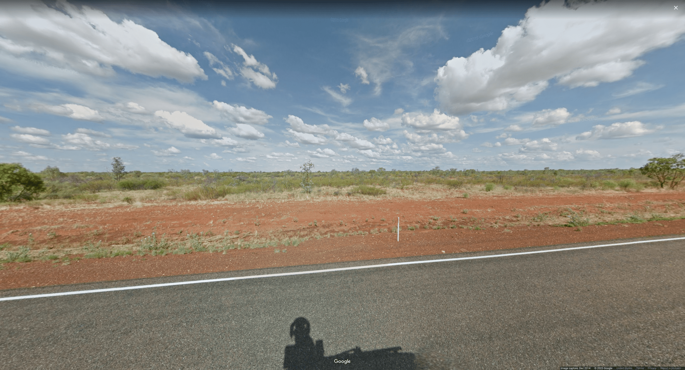

The middle of nowhere... a classic. Let's see what the Google Lens yields:


The first result identifies a [Stuart Highway](https://en.wikipedia.org/wiki/Stuart_Highway), which runs straight through central <CountryFlag country="au" /> [Australia](https://en.wikipedia.org/wiki/Australia) (a.k.a. the middle of nowhere). Also, if you look closely, there's a reflector sign in the center of the photo which looks exactly like the Australian bollard on [geohints.com](https://geohints.com/Bollards), a resource for GeoGuessr players:

<div className="mx-auto flex w-fit flex-col gap-2 sm:flex-row">
  <figure class="[&_*]:my-0">
    
    <figcaption className="[&>p]:text-muted-foreground text-center [&>p]:mt-2">
      Bollard in [4.png](#4png)
    </figcaption>
  </figure>
  <figure class="[&_*]:my-0">
    
    <figcaption className="[&>p]:text-muted-foreground text-center [&>p]:mt-2">
      Australian bollard in [geohints.com](https://geohints.com/Bollards)
    </figcaption>
  </figure>
</div>

Additionally, a key "Australian" identifier would be the orangey dirt on the roadsides, which is common around the country.

| Image          | Country                                                                           | [Population](https://en.wikipedia.org/wiki/List_of_countries_and_dependencies_by_population) | Flag |
| -------------- | --------------------------------------------------------------------------------- | -------------------------------------------------------------------------------------------- | ---- |
| [1.png](#1png) | <CountryFlag country="br" /> [Brazil](https://en.wikipedia.org/wiki/Brazil)       | 215,652,035 ([2023](https://en.wikipedia.org/wiki/Demographics_of_Brazil))                   | `B`  |
| [2.png](#2png) | <CountryFlag country="ru" /> [Russia](https://en.wikipedia.org/wiki/Russia)       | 146,980,061 ([2022](https://en.wikipedia.org/wiki/Demographics_of_Russia))                   | `R`  |
| [3.png](#3png) | <CountryFlag country="ee" /> [Estonia](https://en.wikipedia.org/wiki/Estonia)     | 1,331,796 ([2022](https://en.wikipedia.org/wiki/Demographics_of_Estonia))                    | `e`  |
| [4.png](#4png) | <CountryFlag country="au" /> [Australia](https://en.wikipedia.org/wiki/Australia) | 26,033,493 ([2023](https://en.wikipedia.org/wiki/Demographics_of_Australia))                 | `A`  |

---

### 5.png

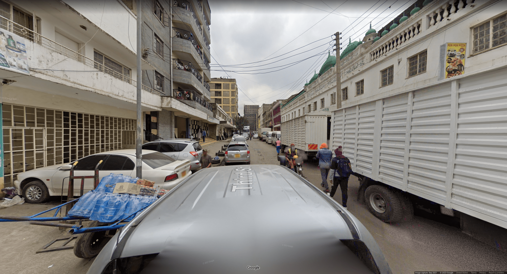

This one was extraordinarily rough. According to the author themselves:

> its hilarious that every single person got one country wrong, but the letter was the same so it didnt matter... you included ;)
>
> <cite>— jazzzooo</cite>

...and apparently this was the one that everyone was messing up!

Let's move on to my approach. I noticed a few things:


<ol type="A">
  <li>
    The extraordinarily ambiguous "Third St" on top of the grey SUV in front of
    us
  </li>
  <li>
    The words "Al-Siraad Plaza" plastered to the side of the grey building on
    the left
  </li>
  <li>
    The words "Ab-Furqan" on the poster above the white/green checkered wall on
    the left
  </li>
  <li>Arabic script on the walls of the white/green building on the right</li>
  <li>An advertisement for "Peri Peri Pizza" on the far right</li>
  <li>Consistently yellow license plates</li>
</ol>

All signs point to an Arabic-speaking country. In addition, since we solved each image out of order (and knew the next character would be an underscore) the flag contained the word segment `BReA-`, which only had three possibilities to form a proper word: `BReAD`, `BReAK`, and `BReAM` (which we ruled out due to unlikeliness). As a result, we simply guessed the country to be <CountryFlag country="kz" /> [Kazakhstan](https://en.wikipedia.org/wiki/Kazakhstan) (even though it doesn't have official Google Street View coverage and Arabic isn't a nationally recognized language).

#### GeoGuessr Meta: The Infamous Snorkel

Now... here is the absolutely crazy part. After solving the challenge, the author revealed to me what the actual country was:

> do you see the little snorkel on the right front corner of your car in 5.png?
> i implore you to google "geoguessr snorkel" haha
>
> <cite>— jazzzooo</cite>

I had no idea what they were talking about, so I zoomed in on the car and lo and behold, snorkel:


I did a quick Google search, and found a tweet from the official GeoGuessr [Twitter](https://twitter.com/geoguessr/) account:

<StaticTweet
  avatar="https://pbs.twimg.com/profile_images/1598668200375369728/0aaAqc68_400x400.jpg"
  username="GeoGuessr"
  handle="geoguessr"
  date="August 30, 2022"
  src="https://twitter.com/geoguessr/status/1564621460034969606"
  media="https://pbs.twimg.com/media/FbamixjXoBIGYzm?format=jpg&name=medium"
>
  The Kenya Snorkels 🤿 Beautiful, bombastic & ehm... broombroom?
</StaticTweet>

Apparently, this was one of the strategies that GeoGuessr pros use to quickly identify countries: using the car the Photo Sphere was taken from to their advantage, considered to be part of the "meta" game. The "<CountryFlag country="ke" /> [Kenya](https://en.wikipedia.org/wiki/Kenya) Snorkel" was one of the more infamous ones, and I had no idea it existed. I was absolutely blown away. Since I guessed Kazakhstan wrong, it will be italicized in the below table.

| Image          | Country                                                                               | [Population](https://en.wikipedia.org/wiki/List_of_countries_and_dependencies_by_population) | Flag |
| -------------- | ------------------------------------------------------------------------------------- | -------------------------------------------------------------------------------------------- | ---- |
| [1.png](#1png) | <CountryFlag country="br" /> [Brazil](https://en.wikipedia.org/wiki/Brazil)           | 215,652,035 ([2023](https://en.wikipedia.org/wiki/Demographics_of_Brazil))                   | `B`  |
| [2.png](#2png) | <CountryFlag country="ru" /> [Russia](https://en.wikipedia.org/wiki/Russia)           | 146,980,061 ([2022](https://en.wikipedia.org/wiki/Demographics_of_Russia))                   | `R`  |
| [3.png](#3png) | <CountryFlag country="ee" /> [Estonia](https://en.wikipedia.org/wiki/Estonia)         | 1,331,796 ([2022](https://en.wikipedia.org/wiki/Demographics_of_Estonia))                    | `e`  |
| [4.png](#4png) | <CountryFlag country="au" /> [Australia](https://en.wikipedia.org/wiki/Australia)     | 26,033,493 ([2023](https://en.wikipedia.org/wiki/Demographics_of_Australia))                 | `A`  |
| [5.png](#5png) | <CountryFlag country="kz" /> [_Kazakhstan_](https://en.wikipedia.org/wiki/Kazakhstan) | 19,392,112 ([2023](https://en.wikipedia.org/wiki/Demographics_of_Kazakhstan))                | `K`  |

---

### 6.png

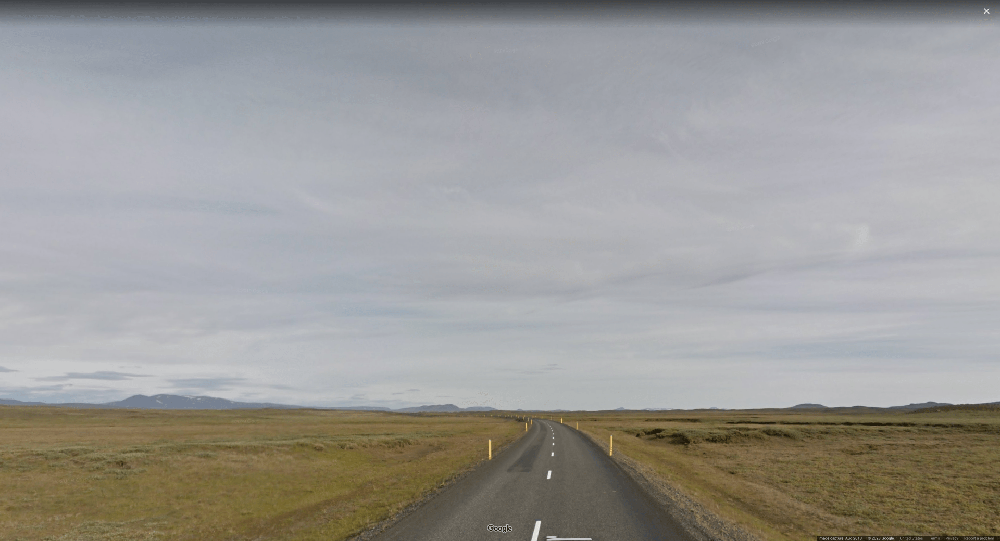

Ah, yes, another "middle of nowhere." This time, however, it's a bit easier! Here's the Google Lens yield:


Yep, that's definitely <CountryFlag country="is" /> [Iceland](https://en.wikipedia.org/wiki/Iceland). Here are some things you use to identify Iceland:

- 99% of the time there will be overcast skies
- Off-green, almost yellow-ish grass. Here is an example from [GeoHints](https://geohints.com/Scenery):

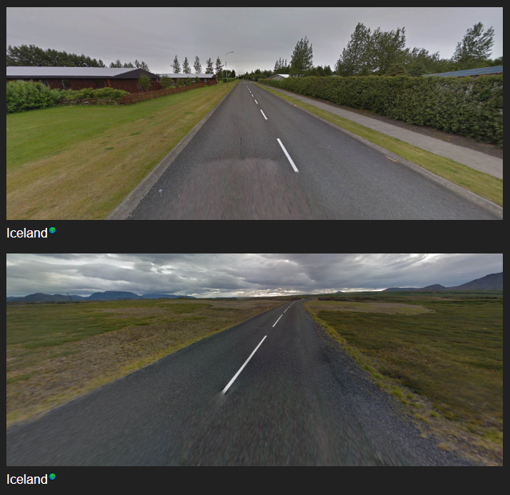

- Bollards! These ones are bright yellow with a diagonally pointed top, and a white reflector:

<div className="mx-auto flex w-fit flex-col gap-2 sm:flex-row">
  <figure class="[&_*]:my-0">
    
    <figcaption className="[&>p]:text-muted-foreground text-center [&>p]:mt-2">
      Bollard in [6.png](#6png)
    </figcaption>
  </figure>
  <figure class="[&_*]:my-0">
    
    <figcaption className="[&>p]:text-muted-foreground text-center [&>p]:mt-2">
      Icelandic bollard in [geohints.com](https://geohints.com/Bollards)
    </figcaption>
  </figure>
</div>

This character will be an underscore (`_`), since the population of Iceland is 376,000 ([2022](https://en.wikipedia.org/wiki/Demographics_of_Iceland)).

| Image          | Country                                                                               | [Population](https://en.wikipedia.org/wiki/List_of_countries_and_dependencies_by_population) | Flag |
| -------------- | ------------------------------------------------------------------------------------- | -------------------------------------------------------------------------------------------- | ---- |
| [1.png](#1png) | <CountryFlag country="br" /> [Brazil](https://en.wikipedia.org/wiki/Brazil)           | 215,652,035 ([2023](https://en.wikipedia.org/wiki/Demographics_of_Brazil))                   | `B`  |
| [2.png](#2png) | <CountryFlag country="ru" /> [Russia](https://en.wikipedia.org/wiki/Russia)           | 146,980,061 ([2022](https://en.wikipedia.org/wiki/Demographics_of_Russia))                   | `R`  |
| [3.png](#3png) | <CountryFlag country="ee" /> [Estonia](https://en.wikipedia.org/wiki/Estonia)         | 1,331,796 ([2022](https://en.wikipedia.org/wiki/Demographics_of_Estonia))                    | `e`  |
| [4.png](#4png) | <CountryFlag country="au" /> [Australia](https://en.wikipedia.org/wiki/Australia)     | 26,033,493 ([2023](https://en.wikipedia.org/wiki/Demographics_of_Australia))                 | `A`  |
| [5.png](#5png) | <CountryFlag country="kz" /> [_Kazakhstan_](https://en.wikipedia.org/wiki/Kazakhstan) | 19,392,112 ([2023](https://en.wikipedia.org/wiki/Demographics_of_Kazakhstan))                | `K`  |
| [6.png](#6png) | <CountryFlag country="is" /> [Iceland](https://en.wikipedia.org/wiki/Iceland)         | 385,230 ([2022](https://en.wikipedia.org/wiki/Demographics_of_Iceland))                      | `_`  |

---

### 7.png

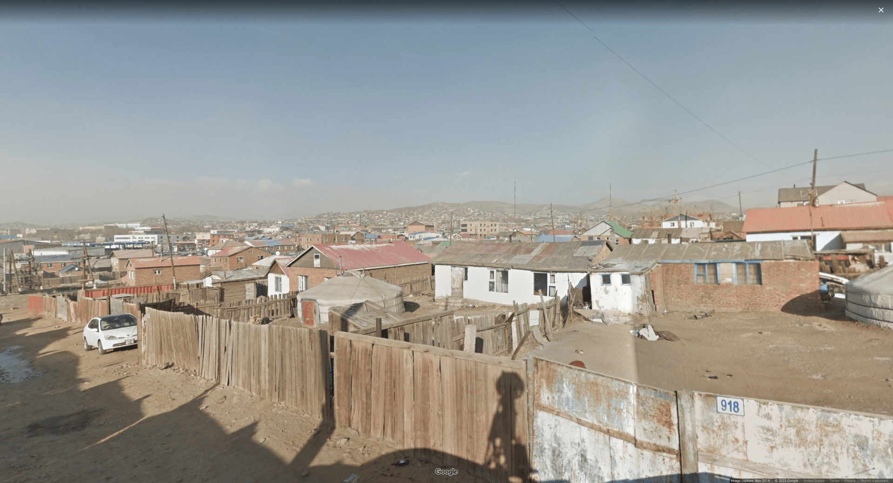

Wow... I've never seen a neighborhood this massive with not a single piece of foliage in sight. Here's the Google Lens output:


Definitely [Ulaanbaatar](https://en.wikipedia.org/wiki/Ulaanbaatar), <CountryFlag country="mn" /> [Mongolia](https://https://en.wikipedia.org/wiki/Mongolia)! We confirmed it with the license plate of the car on the left:

<div className="mx-auto flex w-fit flex-col gap-2 sm:flex-row">
  <figure class="[&_*]:my-0">
    
    <figcaption className="[&>p]:text-muted-foreground text-center [&>p]:mt-2">
      License plate in [7.png](#7png)
    </figcaption>
  </figure>
  <figure class="[&_*]:my-0">
    
    <figcaption className="[&>p]:text-muted-foreground text-center [&>p]:mt-2">
      Mongolian license plate
      ([Wikipedia](https://en.wikipedia.org/wiki/Vehicle_registration_plates_of_Mongolia))
    </figcaption>
  </figure>
</div>

| Image          | Country                                                                               | [Population](https://en.wikipedia.org/wiki/List_of_countries_and_dependencies_by_population) | Flag |
| -------------- | ------------------------------------------------------------------------------------- | -------------------------------------------------------------------------------------------- | ---- |
| [1.png](#1png) | <CountryFlag country="br" /> [Brazil](https://en.wikipedia.org/wiki/Brazil)           | 215,652,035 ([2023](https://en.wikipedia.org/wiki/Demographics_of_Brazil))                   | `B`  |
| [2.png](#2png) | <CountryFlag country="ru" /> [Russia](https://en.wikipedia.org/wiki/Russia)           | 146,980,061 ([2022](https://en.wikipedia.org/wiki/Demographics_of_Russia))                   | `R`  |
| [3.png](#3png) | <CountryFlag country="ee" /> [Estonia](https://en.wikipedia.org/wiki/Estonia)         | 1,331,796 ([2022](https://en.wikipedia.org/wiki/Demographics_of_Estonia))                    | `e`  |
| [4.png](#4png) | <CountryFlag country="au" /> [Australia](https://en.wikipedia.org/wiki/Australia)     | 26,033,493 ([2023](https://en.wikipedia.org/wiki/Demographics_of_Australia))                 | `A`  |
| [5.png](#5png) | <CountryFlag country="kz" /> [_Kazakhstan_](https://en.wikipedia.org/wiki/Kazakhstan) | 19,392,112 ([2023](https://en.wikipedia.org/wiki/Demographics_of_Kazakhstan))                | `K`  |
| [6.png](#6png) | <CountryFlag country="is" /> [Iceland](https://en.wikipedia.org/wiki/Iceland)         | 385,230 ([2022](https://en.wikipedia.org/wiki/Demographics_of_Iceland))                      | `_`  |
| [7.png](#7png) | <CountryFlag country="mn" /> [Mongolia](https://en.wikipedia.org/wiki/Mongolia)       | 3,477,605 ([2023](https://en.wikipedia.org/wiki/Demographics_of_Mongolia))                   | `m ` |

---

### 8.png

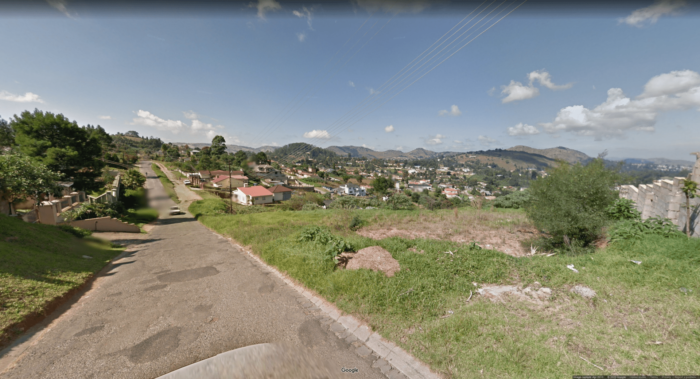

This was arguably one of the hardest to solve (and one that we got incorrect). Here's the Google Lens output:


No idea! Our original guess was the <CountryFlag country="ph" /> [Philippines](https://en.wikipedia.org/wiki/Philippines) or <CountryFlag country="id" /> [Indonesia](https://en.wikipedia.org/wiki/Indonesia), but `BReAK_m(P/I)_` didn't make any sense. We moved on to the next image and discovered it was an underscore (`_`), and eventually came to the conclusion that the country had to either start with `E` or `Y` to make any sense (to make either `BReAK_m`(`Y`/`y`) or `BReAK_m`(`E`/`e`)). The only recognized country which starts with Y is <CountryFlag country="ye" /> [Yemen](https://en.wikipedia.org/wiki/Yemen), which was an unlikely guess because of the consistent greenery, foliage, and hills (in the Arabian Peninsula, practically all desert).

In accordance with `E`/`e` as the only likely character, we eventually settled on either <CountryFlag country="sv" /> [El Salvador](https://en.wikipedia.org/wiki/El_Salvador) or <CountryFlag country="ec" /> [Ecuador](https://en.wikipedia.org/wiki/Ecuador), so this character would be either uppercase or lowercase.

| Image          | Country                                                                                                                                                                   | [Population](https://en.wikipedia.org/wiki/List_of_countries_and_dependencies_by_population)                                                               | Flag    |
| -------------- | ------------------------------------------------------------------------------------------------------------------------------------------------------------------------- | ---------------------------------------------------------------------------------------------------------------------------------------------------------- | ------- |
| [1.png](#1png) | <CountryFlag country="br" /> [Brazil](https://en.wikipedia.org/wiki/Brazil)                                                                                               | 215,652,035 ([2023](https://en.wikipedia.org/wiki/Demographics_of_Brazil))                                                                                 | `B`     |
| [2.png](#2png) | <CountryFlag country="ru" /> [Russia](https://en.wikipedia.org/wiki/Russia)                                                                                               | 146,980,061 ([2022](https://en.wikipedia.org/wiki/Demographics_of_Russia))                                                                                 | `R`     |
| [3.png](#3png) | <CountryFlag country="ee" /> [Estonia](https://en.wikipedia.org/wiki/Estonia)                                                                                             | 1,331,796 ([2022](https://en.wikipedia.org/wiki/Demographics_of_Estonia))                                                                                  | `e`     |
| [4.png](#4png) | <CountryFlag country="au" /> [Australia](https://en.wikipedia.org/wiki/Australia)                                                                                         | 26,033,493 ([2023](https://en.wikipedia.org/wiki/Demographics_of_Australia))                                                                               | `A`     |
| [5.png](#5png) | <CountryFlag country="kz" /> [_Kazakhstan_](https://en.wikipedia.org/wiki/Kazakhstan)                                                                                     | 19,392,112 ([2023](https://en.wikipedia.org/wiki/Demographics_of_Kazakhstan))                                                                              | `K`     |
| [6.png](#6png) | <CountryFlag country="is" /> [Iceland](https://en.wikipedia.org/wiki/Iceland)                                                                                             | 385,230 ([2022](https://en.wikipedia.org/wiki/Demographics_of_Iceland))                                                                                    | `_`     |
| [7.png](#7png) | <CountryFlag country="mn" /> [Mongolia](https://en.wikipedia.org/wiki/Mongolia)                                                                                           | 3,477,605 ([2023](https://en.wikipedia.org/wiki/Demographics_of_Mongolia))                                                                                 | `m `    |
| [8.png](#8png) | <CountryFlag country="sv" /> [_El Salvador_](https://en.wikipedia.org/wiki/El_Salvador) / <CountryFlag country="ec" /> [_Ecuador_](https://en.wikipedia.org/wiki/Ecuador) | 6,825,935 ([2021](https://en.wikipedia.org/wiki/Demographics_of_El_Salvador)) / 18,145,568 ([2023](https://en.wikipedia.org/wiki/Demographics_of_Ecuador)) | `e`/`E` |

---

### 9.png

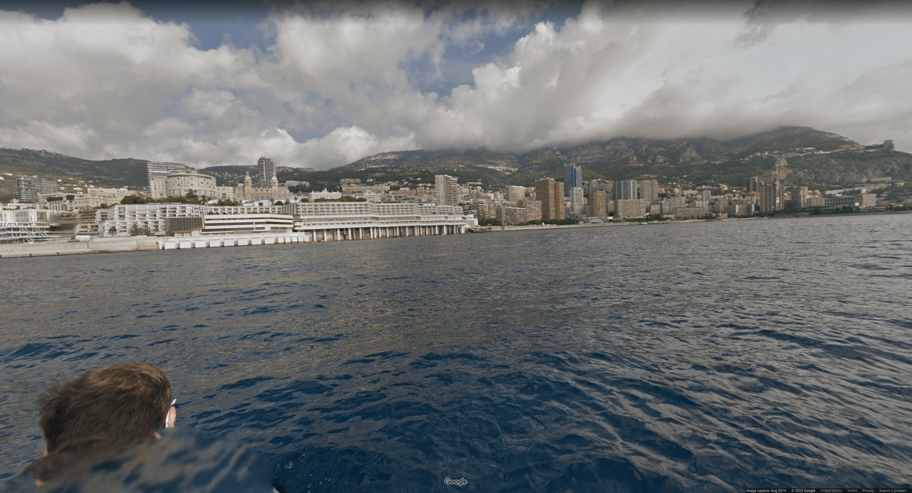

A Photo Sphere in the middle of the sea! Looks like we're in a pretty large city, and it's giving off tourist resort-y vibes. Here's the Google Lens output:


It looks like it's identified the cityscape as belonging to <CountryFlag country="mc" /> [Monaco](https://en.wikipedia.org/wiki/Monaco). It's even identified the facade of one of the buildings in the city as the [Opéra de Monte-Carlo](https://en.wikipedia.org/wiki/Op%C3%A9ra_de_Monte-Carlo):

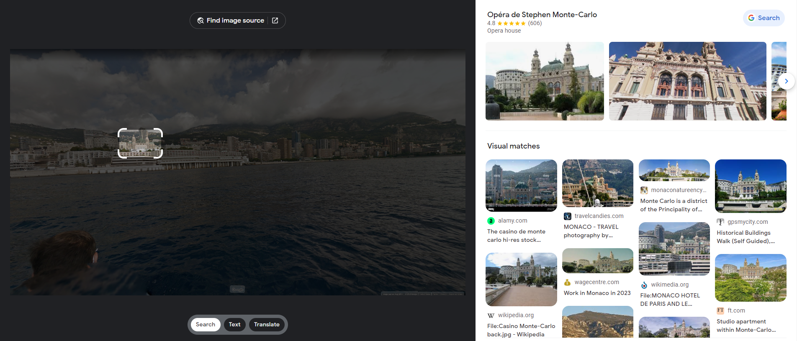

Let's add an underscore to the flag, since Monaco's population is 37,308 ([2016](https://en.wikipedia.org/wiki/Demographics_of_Monaco)).

| Image          | Country                                                                                                                                                                   | [Population](https://en.wikipedia.org/wiki/List_of_countries_and_dependencies_by_population)                                                               | Flag    |
| -------------- | ------------------------------------------------------------------------------------------------------------------------------------------------------------------------- | ---------------------------------------------------------------------------------------------------------------------------------------------------------- | ------- |
| [1.png](#1png) | <CountryFlag country="br" /> [Brazil](https://en.wikipedia.org/wiki/Brazil)                                                                                               | 215,652,035 ([2023](https://en.wikipedia.org/wiki/Demographics_of_Brazil))                                                                                 | `B`     |
| [2.png](#2png) | <CountryFlag country="ru" /> [Russia](https://en.wikipedia.org/wiki/Russia)                                                                                               | 146,980,061 ([2022](https://en.wikipedia.org/wiki/Demographics_of_Russia))                                                                                 | `R`     |
| [3.png](#3png) | <CountryFlag country="ee" /> [Estonia](https://en.wikipedia.org/wiki/Estonia)                                                                                             | 1,331,796 ([2022](https://en.wikipedia.org/wiki/Demographics_of_Estonia))                                                                                  | `e`     |
| [4.png](#4png) | <CountryFlag country="au" /> [Australia](https://en.wikipedia.org/wiki/Australia)                                                                                         | 26,033,493 ([2023](https://en.wikipedia.org/wiki/Demographics_of_Australia))                                                                               | `A`     |
| [5.png](#5png) | <CountryFlag country="kz" /> [_Kazakhstan_](https://en.wikipedia.org/wiki/Kazakhstan)                                                                                     | 19,392,112 ([2023](https://en.wikipedia.org/wiki/Demographics_of_Kazakhstan))                                                                              | `K`     |
| [6.png](#6png) | <CountryFlag country="is" /> [Iceland](https://en.wikipedia.org/wiki/Iceland)                                                                                             | 385,230 ([2022](https://en.wikipedia.org/wiki/Demographics_of_Iceland))                                                                                    | `_`     |
| [7.png](#7png) | <CountryFlag country="mn" /> [Mongolia](https://en.wikipedia.org/wiki/Mongolia)                                                                                           | 3,477,605 ([2023](https://en.wikipedia.org/wiki/Demographics_of_Mongolia))                                                                                 | `m `    |
| [8.png](#8png) | <CountryFlag country="sv" /> [_El Salvador_](https://en.wikipedia.org/wiki/El_Salvador) / <CountryFlag country="ec" /> [_Ecuador_](https://en.wikipedia.org/wiki/Ecuador) | 6,825,935 ([2021](https://en.wikipedia.org/wiki/Demographics_of_El_Salvador)) / 18,145,568 ([2023](https://en.wikipedia.org/wiki/Demographics_of_Ecuador)) | `e`/`E` |
| [9.png](#9png) | <CountryFlag country="mc" /> [Monaco](https://en.wikipedia.org/wiki/Monaco)                                                                                               | 39,150 ([2021](https://en.wikipedia.org/wiki/Demographics_of_Monaco))                                                                                      | `_`     |

---

### 10.png

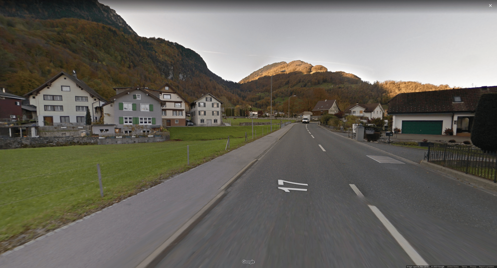

We're now given a small town in the hills of an assumingly European country (overall house aesthetic). Here's the Google Lens output:


Lens results are giving me either <CountryFlag country="ch" /> [Switzerland](https://en.wikipedia.org/wiki/Switzerland) or <CountryFlag country="no" /> [Norway](https://en.wikipedia.org/wiki/Norway). My suspicions for Switzerland were confirmed when I saw its recognizable square flag hanging off one of the houses:

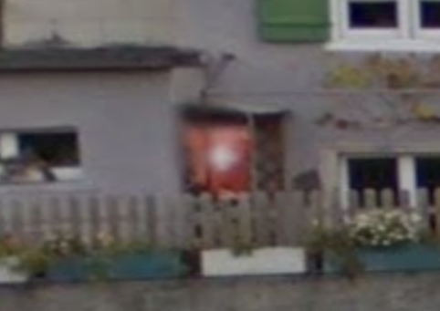

| Image            | Country                                                                                                                                                                   | [Population](https://en.wikipedia.org/wiki/List_of_countries_and_dependencies_by_population)                                                               | Flag    |
| ---------------- | ------------------------------------------------------------------------------------------------------------------------------------------------------------------------- | ---------------------------------------------------------------------------------------------------------------------------------------------------------- | ------- |
| [1.png](#1png)   | <CountryFlag country="br" /> [Brazil](https://en.wikipedia.org/wiki/Brazil)                                                                                               | 215,652,035 ([2023](https://en.wikipedia.org/wiki/Demographics_of_Brazil))                                                                                 | `B`     |
| [2.png](#2png)   | <CountryFlag country="ru" /> [Russia](https://en.wikipedia.org/wiki/Russia)                                                                                               | 146,980,061 ([2022](https://en.wikipedia.org/wiki/Demographics_of_Russia))                                                                                 | `R`     |
| [3.png](#3png)   | <CountryFlag country="ee" /> [Estonia](https://en.wikipedia.org/wiki/Estonia)                                                                                             | 1,331,796 ([2022](https://en.wikipedia.org/wiki/Demographics_of_Estonia))                                                                                  | `e`     |
| [4.png](#4png)   | <CountryFlag country="au" /> [Australia](https://en.wikipedia.org/wiki/Australia)                                                                                         | 26,033,493 ([2023](https://en.wikipedia.org/wiki/Demographics_of_Australia))                                                                               | `A`     |
| [5.png](#5png)   | <CountryFlag country="kz" /> [_Kazakhstan_](https://en.wikipedia.org/wiki/Kazakhstan)                                                                                     | 19,392,112 ([2023](https://en.wikipedia.org/wiki/Demographics_of_Kazakhstan))                                                                              | `K`     |
| [6.png](#6png)   | <CountryFlag country="is" /> [Iceland](https://en.wikipedia.org/wiki/Iceland)                                                                                             | 385,230 ([2022](https://en.wikipedia.org/wiki/Demographics_of_Iceland))                                                                                    | `_`     |
| [7.png](#7png)   | <CountryFlag country="mn" /> [Mongolia](https://en.wikipedia.org/wiki/Mongolia)                                                                                           | 3,477,605 ([2023](https://en.wikipedia.org/wiki/Demographics_of_Mongolia))                                                                                 | `m `    |
| [8.png](#8png)   | <CountryFlag country="sv" /> [_El Salvador_](https://en.wikipedia.org/wiki/El_Salvador) / <CountryFlag country="ec" /> [_Ecuador_](https://en.wikipedia.org/wiki/Ecuador) | 6,825,935 ([2021](https://en.wikipedia.org/wiki/Demographics_of_El_Salvador)) / 18,145,568 ([2023](https://en.wikipedia.org/wiki/Demographics_of_Ecuador)) | `e`/`E` |
| [9.png](#9png)   | <CountryFlag country="mc" /> [Monaco](https://en.wikipedia.org/wiki/Monaco)                                                                                               | 39,150 ([2021](https://en.wikipedia.org/wiki/Demographics_of_Monaco))                                                                                      | `_`     |
| [10.png](#10png) | <CountryFlag country="ch" /> [Switzerland](https://en.wikipedia.org/wiki/Switzerland)                                                                                     | 8,789,726 ([2022](https://en.wikipedia.org/wiki/Demographics_of_Switzerland))                                                                              | `s`     |

---

### 11.png

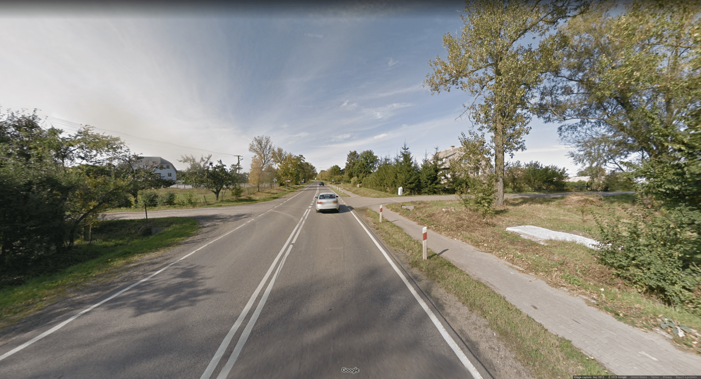

Splat in the middle of an inconspicuous-looking suburb! Here's the Google Lens output when you focus in on the bollards on the street (since there's nothing of interest anywhere else):


Scrolling through the outputs results in distinctly <CountryFlag country="pl" /> [Polish](https://en.wikipedia.org/wiki/Poland) bollards:

<div className="mx-auto flex w-fit flex-col gap-2 sm:flex-row">
  <figure class="[&_*]:my-0">
    
    <figcaption className="[&>p]:text-muted-foreground text-center [&>p]:mt-2">
      Bollard in [11.png](#11png)
    </figcaption>
  </figure>
  <figure class="[&_*]:my-0">
    
    <figcaption className="[&>p]:text-muted-foreground text-center [&>p]:mt-2">
      Polish bollard in [geohints.com](https://geohints.com/Bollards)
    </figcaption>
  </figure>
</div>

| Image            | Country                                                                                                                                                                   | [Population](https://en.wikipedia.org/wiki/List_of_countries_and_dependencies_by_population)                                                               | Flag    |
| ---------------- | ------------------------------------------------------------------------------------------------------------------------------------------------------------------------- | ---------------------------------------------------------------------------------------------------------------------------------------------------------- | ------- |
| [1.png](#1png)   | <CountryFlag country="br" /> [Brazil](https://en.wikipedia.org/wiki/Brazil)                                                                                               | 215,652,035 ([2023](https://en.wikipedia.org/wiki/Demographics_of_Brazil))                                                                                 | `B`     |
| [2.png](#2png)   | <CountryFlag country="ru" /> [Russia](https://en.wikipedia.org/wiki/Russia)                                                                                               | 146,980,061 ([2022](https://en.wikipedia.org/wiki/Demographics_of_Russia))                                                                                 | `R`     |
| [3.png](#3png)   | <CountryFlag country="ee" /> [Estonia](https://en.wikipedia.org/wiki/Estonia)                                                                                             | 1,331,796 ([2022](https://en.wikipedia.org/wiki/Demographics_of_Estonia))                                                                                  | `e`     |
| [4.png](#4png)   | <CountryFlag country="au" /> [Australia](https://en.wikipedia.org/wiki/Australia)                                                                                         | 26,033,493 ([2023](https://en.wikipedia.org/wiki/Demographics_of_Australia))                                                                               | `A`     |
| [5.png](#5png)   | <CountryFlag country="kz" /> [_Kazakhstan_](https://en.wikipedia.org/wiki/Kazakhstan)                                                                                     | 19,392,112 ([2023](https://en.wikipedia.org/wiki/Demographics_of_Kazakhstan))                                                                              | `K`     |
| [6.png](#6png)   | <CountryFlag country="is" /> [Iceland](https://en.wikipedia.org/wiki/Iceland)                                                                                             | 385,230 ([2022](https://en.wikipedia.org/wiki/Demographics_of_Iceland))                                                                                    | `_`     |
| [7.png](#7png)   | <CountryFlag country="mn" /> [Mongolia](https://en.wikipedia.org/wiki/Mongolia)                                                                                           | 3,477,605 ([2023](https://en.wikipedia.org/wiki/Demographics_of_Mongolia))                                                                                 | `m `    |
| [8.png](#8png)   | <CountryFlag country="sv" /> [_El Salvador_](https://en.wikipedia.org/wiki/El_Salvador) / <CountryFlag country="ec" /> [_Ecuador_](https://en.wikipedia.org/wiki/Ecuador) | 6,825,935 ([2021](https://en.wikipedia.org/wiki/Demographics_of_El_Salvador)) / 18,145,568 ([2023](https://en.wikipedia.org/wiki/Demographics_of_Ecuador)) | `e`/`E` |
| [9.png](#9png)   | <CountryFlag country="mc" /> [Monaco](https://en.wikipedia.org/wiki/Monaco)                                                                                               | 39,150 ([2021](https://en.wikipedia.org/wiki/Demographics_of_Monaco))                                                                                      | `_`     |
| [10.png](#10png) | <CountryFlag country="ch" /> [Switzerland](https://en.wikipedia.org/wiki/Switzerland)                                                                                     | 8,789,726 ([2022](https://en.wikipedia.org/wiki/Demographics_of_Switzerland))                                                                              | `s`     |
| [11.png](#11png) | <CountryFlag country="pl" /> [Poland](https://en.wikipedia.org/wiki/Poland)                                                                                               | 37,796,000 ([2022](https://en.wikipedia.org/wiki/Demographics_of_Poland))                                                                                  | `P`     |

---

### 12.png

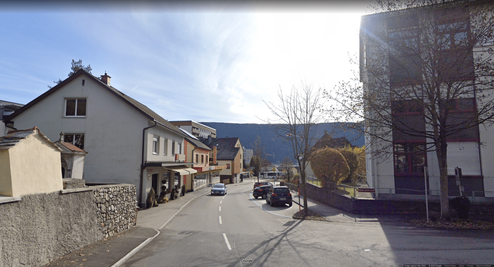

More Europe! Here's the Google Lens output:


The vertical sign reads "ELEKTRO", whilst the lower horizontal sign reads "Weißensteiner", two distinctly German words (with the latter being a surname, romanized into "[Weissensteiner](https://forebears.io/surnames/weissensteiner)"). Although we could automatically assume <CountryFlag country="de" /> [Germany](https://en.wikipedia.org/wiki/Germany), there are multiple other German-speaking European countries, so we'll have to narrow it down further.

Here's the solution: simply Google "Elektro Weißensteiner" and you'll find that it's an electronics store based in <CountryFlag country="at" /> [Austria](https://en.wikipedia.org/wiki/Austria):

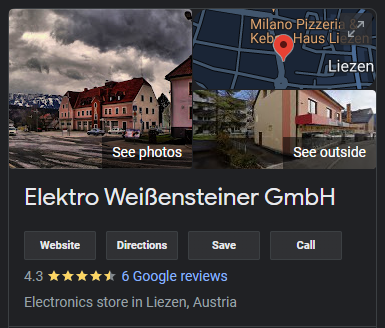

> [Elektro Weißensteiner GmbH](https://www.google.com/maps?q=elektro+weissensteiner)  
> 4.3 ⭐⭐⭐⭐⭐ 6 Google reviews  
> Electronics store in Liezen, Austria

| Image            | Country                                                                                                                                                                   | [Population](https://en.wikipedia.org/wiki/List_of_countries_and_dependencies_by_population)                                                               | Flag    |
| ---------------- | ------------------------------------------------------------------------------------------------------------------------------------------------------------------------- | ---------------------------------------------------------------------------------------------------------------------------------------------------------- | ------- |
| [1.png](#1png)   | <CountryFlag country="br" /> [Brazil](https://en.wikipedia.org/wiki/Brazil)                                                                                               | 215,652,035 ([2023](https://en.wikipedia.org/wiki/Demographics_of_Brazil))                                                                                 | `B`     |
| [2.png](#2png)   | <CountryFlag country="ru" /> [Russia](https://en.wikipedia.org/wiki/Russia)                                                                                               | 146,980,061 ([2022](https://en.wikipedia.org/wiki/Demographics_of_Russia))                                                                                 | `R`     |
| [3.png](#3png)   | <CountryFlag country="ee" /> [Estonia](https://en.wikipedia.org/wiki/Estonia)                                                                                             | 1,331,796 ([2022](https://en.wikipedia.org/wiki/Demographics_of_Estonia))                                                                                  | `e`     |
| [4.png](#4png)   | <CountryFlag country="au" /> [Australia](https://en.wikipedia.org/wiki/Australia)                                                                                         | 26,033,493 ([2023](https://en.wikipedia.org/wiki/Demographics_of_Australia))                                                                               | `A`     |
| [5.png](#5png)   | <CountryFlag country="kz" /> [_Kazakhstan_](https://en.wikipedia.org/wiki/Kazakhstan)                                                                                     | 19,392,112 ([2023](https://en.wikipedia.org/wiki/Demographics_of_Kazakhstan))                                                                              | `K`     |
| [6.png](#6png)   | <CountryFlag country="is" /> [Iceland](https://en.wikipedia.org/wiki/Iceland)                                                                                             | 385,230 ([2022](https://en.wikipedia.org/wiki/Demographics_of_Iceland))                                                                                    | `_`     |
| [7.png](#7png)   | <CountryFlag country="mn" /> [Mongolia](https://en.wikipedia.org/wiki/Mongolia)                                                                                           | 3,477,605 ([2023](https://en.wikipedia.org/wiki/Demographics_of_Mongolia))                                                                                 | `m `    |
| [8.png](#8png)   | <CountryFlag country="sv" /> [_El Salvador_](https://en.wikipedia.org/wiki/El_Salvador) / <CountryFlag country="ec" /> [_Ecuador_](https://en.wikipedia.org/wiki/Ecuador) | 6,825,935 ([2021](https://en.wikipedia.org/wiki/Demographics_of_El_Salvador)) / 18,145,568 ([2023](https://en.wikipedia.org/wiki/Demographics_of_Ecuador)) | `e`/`E` |
| [9.png](#9png)   | <CountryFlag country="mc" /> [Monaco](https://en.wikipedia.org/wiki/Monaco)                                                                                               | 39,150 ([2021](https://en.wikipedia.org/wiki/Demographics_of_Monaco))                                                                                      | `_`     |
| [10.png](#10png) | <CountryFlag country="ch" /> [Switzerland](https://en.wikipedia.org/wiki/Switzerland)                                                                                     | 8,789,726 ([2022](https://en.wikipedia.org/wiki/Demographics_of_Switzerland))                                                                              | `s`     |
| [11.png](#11png) | <CountryFlag country="pl" /> [Poland](https://en.wikipedia.org/wiki/Poland)                                                                                               | 37,796,000 ([2022](https://en.wikipedia.org/wiki/Demographics_of_Poland))                                                                                  | `P`     |
| [12.png](#12png) | <CountryFlag country="at" /> [Austria](https://en.wikipedia.org/wiki/Austria)                                                                                             | 9,090,868 ([2022](https://en.wikipedia.org/wiki/Demographics_of_Austria))                                                                                  | `a`     |

---

### 13.png

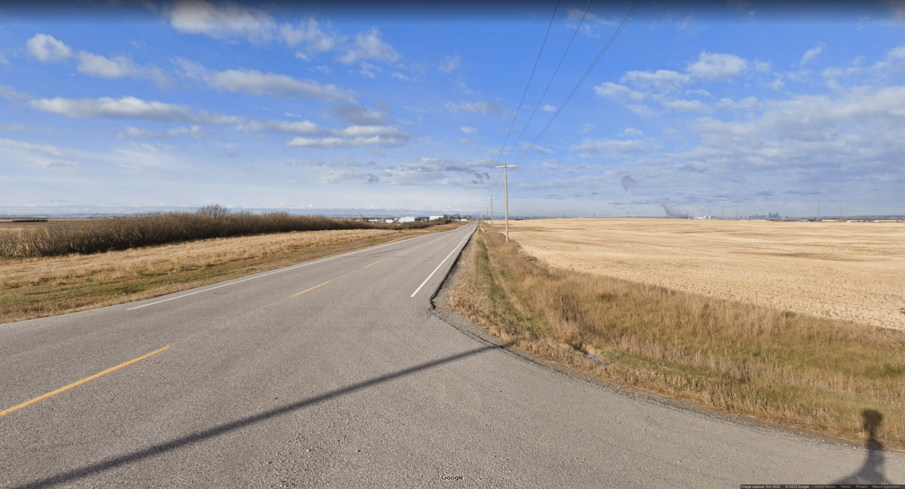

This is probably the quintessential "North America" picture ever—impossibly flat land, a random city skyline in the background, and huge fields. A Google Lens search yields nothing we don't already know:


Currently, our only issue here is telling between either <CountryFlag country="ca" /> [Canada](https://en.wikipedia.org/wiki/Canada) or the <CountryFlag country="us" /> [United States](https://en.wikipedia.org/wiki/United_States). Let's narrow it down a bit more.

The only telling sign here is **road markings**. Since I live in the US, I know that two-way roads (with one lane per direction) are typically marked with either **broken double** yellow lines or **solid double** yellow lines. Although **single dashed** yellow lines exist in the US, they are much more common in Canada (albeit still existing in the US). Here's a diagram I threw up, which you can combine with the overall "feel" of an image to make a calculated guess:

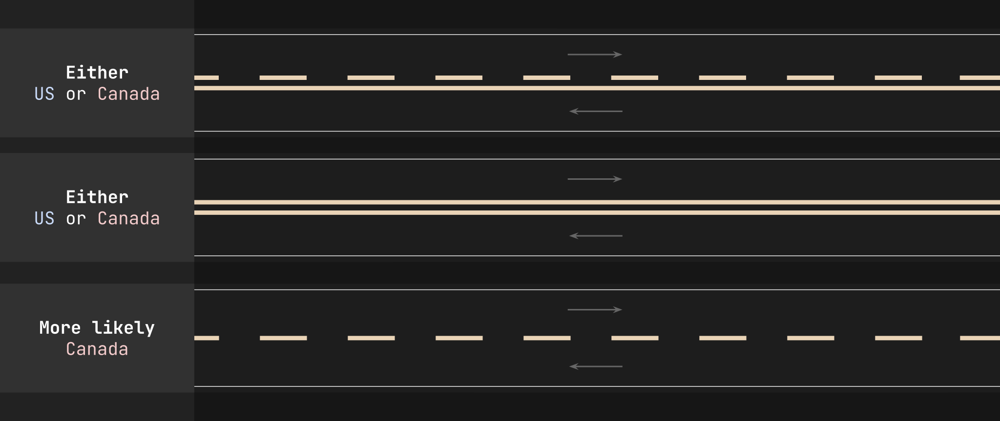

Alongside this, not a single common word in English starts with the prefix `spau-`, so ruling out the US is a no-brainer. However, the above knowledge about road markings is useful when you have no flag to infer characters from!

| Image            | Country                                                                                                                                                                   | [Population](https://en.wikipedia.org/wiki/List_of_countries_and_dependencies_by_population)                                                               | Flag    |
| ---------------- | ------------------------------------------------------------------------------------------------------------------------------------------------------------------------- | ---------------------------------------------------------------------------------------------------------------------------------------------------------- | ------- |
| [1.png](#1png)   | <CountryFlag country="br" /> [Brazil](https://en.wikipedia.org/wiki/Brazil)                                                                                               | 215,652,035 ([2023](https://en.wikipedia.org/wiki/Demographics_of_Brazil))                                                                                 | `B`     |
| [2.png](#2png)   | <CountryFlag country="ru" /> [Russia](https://en.wikipedia.org/wiki/Russia)                                                                                               | 146,980,061 ([2022](https://en.wikipedia.org/wiki/Demographics_of_Russia))                                                                                 | `R`     |
| [3.png](#3png)   | <CountryFlag country="ee" /> [Estonia](https://en.wikipedia.org/wiki/Estonia)                                                                                             | 1,331,796 ([2022](https://en.wikipedia.org/wiki/Demographics_of_Estonia))                                                                                  | `e`     |
| [4.png](#4png)   | <CountryFlag country="au" /> [Australia](https://en.wikipedia.org/wiki/Australia)                                                                                         | 26,033,493 ([2023](https://en.wikipedia.org/wiki/Demographics_of_Australia))                                                                               | `A`     |
| [5.png](#5png)   | <CountryFlag country="kz" /> [_Kazakhstan_](https://en.wikipedia.org/wiki/Kazakhstan)                                                                                     | 19,392,112 ([2023](https://en.wikipedia.org/wiki/Demographics_of_Kazakhstan))                                                                              | `K`     |
| [6.png](#6png)   | <CountryFlag country="is" /> [Iceland](https://en.wikipedia.org/wiki/Iceland)                                                                                             | 385,230 ([2022](https://en.wikipedia.org/wiki/Demographics_of_Iceland))                                                                                    | `_`     |
| [7.png](#7png)   | <CountryFlag country="mn" /> [Mongolia](https://en.wikipedia.org/wiki/Mongolia)                                                                                           | 3,477,605 ([2023](https://en.wikipedia.org/wiki/Demographics_of_Mongolia))                                                                                 | `m `    |
| [8.png](#8png)   | <CountryFlag country="sv" /> [_El Salvador_](https://en.wikipedia.org/wiki/El_Salvador) / <CountryFlag country="ec" /> [_Ecuador_](https://en.wikipedia.org/wiki/Ecuador) | 6,825,935 ([2021](https://en.wikipedia.org/wiki/Demographics_of_El_Salvador)) / 18,145,568 ([2023](https://en.wikipedia.org/wiki/Demographics_of_Ecuador)) | `e`/`E` |
| [9.png](#9png)   | <CountryFlag country="mc" /> [Monaco](https://en.wikipedia.org/wiki/Monaco)                                                                                               | 39,150 ([2021](https://en.wikipedia.org/wiki/Demographics_of_Monaco))                                                                                      | `_`     |
| [10.png](#10png) | <CountryFlag country="ch" /> [Switzerland](https://en.wikipedia.org/wiki/Switzerland)                                                                                     | 8,789,726 ([2022](https://en.wikipedia.org/wiki/Demographics_of_Switzerland))                                                                              | `s`     |
| [11.png](#11png) | <CountryFlag country="pl" /> [Poland](https://en.wikipedia.org/wiki/Poland)                                                                                               | 37,796,000 ([2022](https://en.wikipedia.org/wiki/Demographics_of_Poland))                                                                                  | `P`     |
| [12.png](#12png) | <CountryFlag country="at" /> [Austria](https://en.wikipedia.org/wiki/Austria)                                                                                             | 9,090,868 ([2022](https://en.wikipedia.org/wiki/Demographics_of_Austria))                                                                                  | `a`     |
| [13.png](#13png) | <CountryFlag country="ca" /> [Canada](https://en.wikipedia.org/wiki/Canada)                                                                                               | 39,082,640 ([2023](https://en.wikipedia.org/wiki/Demographics_of_Canada))                                                                                  | `C`     |

---

### 14.png

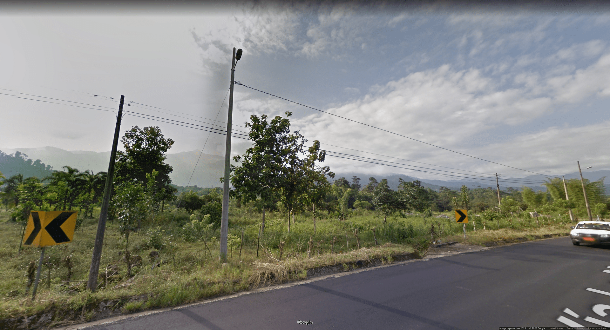

This one was actually really, really clever. Although a Google Lens yields nothing of use (since its viewpoint is a random tropical area), take a look at the bottom right-hand corner of the image:

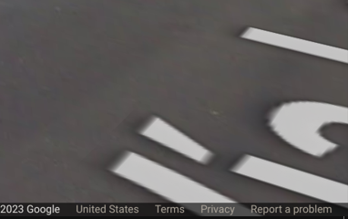

Is that an acute accent mark on top of the letter I ("í")? Inferring from the shape of the other letters, it looks like this segment of the word spells out "-íal", which many Spanish words end with. We can safely narrow this down to a Latin-American/Spanish-speaking country.

Let's keep inferring from the flag. It currently says `BReAK_m(E/e)_sPaC`, so we can safely guess that the next country should start with "e" or "E" to continue the next likely word, "space." <CountryFlag country="ec" /> [Ecuador](https://en.wikipedia.org/wiki/Ecuador) and <CountryFlag country="sv" /> [El Salvador](https://en.wikipedia.org/wiki/El_Salvador) are the only Spanish-speaking countries that start with "e" or "E", and I was able to narrow it down to Ecuador solely from the license plate of the car on the right, which looks like a taxi:

<div className="grid grid-cols-1 gap-4 sm:grid-cols-2">
  <figure class="[&>p>img]:!m-0 [&>p>img]:!mx-auto">
    
    <figcaption className="text-muted-foreground text-center">
      License plate in <a href="#14png">14.png</a>
    </figcaption>
  </figure>
  <figure class="[&>p>img]:!m-0 [&>p>img]:!mx-auto">
    
    <figcaption className="text-muted-foreground text-center">
      Ecuadorian license plate (commercial vehicles,
      [Wikipedia](https://en.wikipedia.org/wiki/Vehicle_registration_plates_of_Ecuador))
    </figcaption>
  </figure>
</div>

| Image            | Country                                                                                                                                                                   | [Population](https://en.wikipedia.org/wiki/List_of_countries_and_dependencies_by_population)                                                               | Flag    |
| ---------------- | ------------------------------------------------------------------------------------------------------------------------------------------------------------------------- | ---------------------------------------------------------------------------------------------------------------------------------------------------------- | ------- |
| [1.png](#1png)   | <CountryFlag country="br" /> [Brazil](https://en.wikipedia.org/wiki/Brazil)                                                                                               | 215,652,035 ([2023](https://en.wikipedia.org/wiki/Demographics_of_Brazil))                                                                                 | `B`     |
| [2.png](#2png)   | <CountryFlag country="ru" /> [Russia](https://en.wikipedia.org/wiki/Russia)                                                                                               | 146,980,061 ([2022](https://en.wikipedia.org/wiki/Demographics_of_Russia))                                                                                 | `R`     |
| [3.png](#3png)   | <CountryFlag country="ee" /> [Estonia](https://en.wikipedia.org/wiki/Estonia)                                                                                             | 1,331,796 ([2022](https://en.wikipedia.org/wiki/Demographics_of_Estonia))                                                                                  | `e`     |
| [4.png](#4png)   | <CountryFlag country="au" /> [Australia](https://en.wikipedia.org/wiki/Australia)                                                                                         | 26,033,493 ([2023](https://en.wikipedia.org/wiki/Demographics_of_Australia))                                                                               | `A`     |
| [5.png](#5png)   | <CountryFlag country="kz" /> [_Kazakhstan_](https://en.wikipedia.org/wiki/Kazakhstan)                                                                                     | 19,392,112 ([2023](https://en.wikipedia.org/wiki/Demographics_of_Kazakhstan))                                                                              | `K`     |
| [6.png](#6png)   | <CountryFlag country="is" /> [Iceland](https://en.wikipedia.org/wiki/Iceland)                                                                                             | 385,230 ([2022](https://en.wikipedia.org/wiki/Demographics_of_Iceland))                                                                                    | `_`     |
| [7.png](#7png)   | <CountryFlag country="mn" /> [Mongolia](https://en.wikipedia.org/wiki/Mongolia)                                                                                           | 3,477,605 ([2023](https://en.wikipedia.org/wiki/Demographics_of_Mongolia))                                                                                 | `m `    |
| [8.png](#8png)   | <CountryFlag country="sv" /> [_El Salvador_](https://en.wikipedia.org/wiki/El_Salvador) / <CountryFlag country="ec" /> [_Ecuador_](https://en.wikipedia.org/wiki/Ecuador) | 6,825,935 ([2021](https://en.wikipedia.org/wiki/Demographics_of_El_Salvador)) / 18,145,568 ([2023](https://en.wikipedia.org/wiki/Demographics_of_Ecuador)) | `e`/`E` |
| [9.png](#9png)   | <CountryFlag country="mc" /> [Monaco](https://en.wikipedia.org/wiki/Monaco)                                                                                               | 39,150 ([2021](https://en.wikipedia.org/wiki/Demographics_of_Monaco))                                                                                      | `_`     |
| [10.png](#10png) | <CountryFlag country="ch" /> [Switzerland](https://en.wikipedia.org/wiki/Switzerland)                                                                                     | 8,789,726 ([2022](https://en.wikipedia.org/wiki/Demographics_of_Switzerland))                                                                              | `s`     |
| [11.png](#11png) | <CountryFlag country="pl" /> [Poland](https://en.wikipedia.org/wiki/Poland)                                                                                               | 37,796,000 ([2022](https://en.wikipedia.org/wiki/Demographics_of_Poland))                                                                                  | `P`     |
| [12.png](#12png) | <CountryFlag country="at" /> [Austria](https://en.wikipedia.org/wiki/Austria)                                                                                             | 9,090,868 ([2022](https://en.wikipedia.org/wiki/Demographics_of_Austria))                                                                                  | `a`     |
| [13.png](#13png) | <CountryFlag country="ca" /> [Canada](https://en.wikipedia.org/wiki/Canada)                                                                                               | 39,082,640 ([2023](https://en.wikipedia.org/wiki/Demographics_of_Canada))                                                                                  | `C`     |
| [14.png](#14png) | <CountryFlag country="ec" /> [Ecuador](https://en.wikipedia.org/wiki/Ecuador)                                                                                             | 18,146,244 ([2023](https://en.wikipedia.org/wiki/Demographics_of_Ecuador))                                                                                 | `E`     |

---

### 15.png

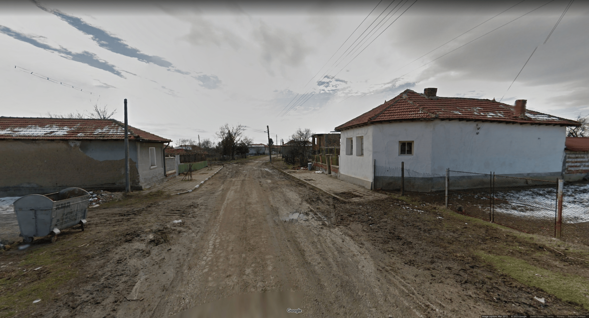

We are now presented with... some dilapidated, snowy houses! This will be difficult to narrow down.

Google Lens yielded nothing of use, but I did identify some Cyrillic writing on the dumpster to the left:


#### The Guesswork Begins

This was around the time my team started to suspect the flag for the challenge read "break me spacebar", which is a meme in the GeoGuessr community for how content creator [Rainbolt](https://www.youtube.com/@georainbolt) hits his spacebar really loudly when guessing a location on the map:


> YouTube: "[1 hour of silence randomly interrupted by Rainbolt annihilating his spacebar](https://www.youtube.com/watch?v=UDFFWi0pKlM)" by wid  
> YouTube: "[geoguessr but i have to slam my spacebar](https://www.youtube.com/watch?v=xDoy9CFIiBw)" by Toofee  
> YouTube: "[Rainbolt hitting space bar for 1 minute](https://www.youtube.com/watch?v=vdgPDUpyT9Y)" by PSM

In accordance with the word "spacebar", I narrowed the country down to the only Russian-speaking country (in terms of officially recognized languages) with starts with "B": <CountryFlag country="by" /> [Belarus](https://en.wikipedia.org/wiki/Belarus).

#### GeoGuessr Meta: Snow Coverage

So... Belarus was incorrect. However, it had a population under 10 million (similarly to the correct answer), meaning that the letter `b` was correct, regardless. The real country this image was taken in was <CountryFlag country="bg" /> [Bulgaria](https://en.wikipedia.org/wiki/Bulgaria), which a pro player would guess due to the typical snow coverage of Google Street View. According to this [GeoGuessr Tips](https://somerandomstuff1.wordpress.com/2019/02/08/geoguessr-the-top-tips-tricks-and-techniques/#bulgaria) article:

> Hungary is one of three European countries that can have similar, bleak, winter scenery with trees without leaves and snowfall beside the road. The other two countries are Bulgaria and small parts of Czechia.

> Much of Bulgarian Street View was taken in winter and thus the trees are often without leaves and the Street View scenes in Bulgaria are often fairly bleak. Within Europe, Hungary and parts of Czechia have similar bleak wintery scenery. Bulgaria is one of the poorest countries in Europe and the Bulgarian roads reflect this fact. These roads are commonly crumbling and filled with cracks and holes.

So when you see a combination of dilapidation/bleakness and snowiness, Bulgaria, <CountryFlag country="hu" /> [Hungary](https://en.wikipedia.org/wiki/Hungary), or <CountryFlag country="cz" /> [Czechia](https://en.wikipedia.org/wiki/Czech_Republic) would be your best guesses.

| Image            | Country                                                                                                                                                                   | [Population](https://en.wikipedia.org/wiki/List_of_countries_and_dependencies_by_population)                                                               | Flag    |
| ---------------- | ------------------------------------------------------------------------------------------------------------------------------------------------------------------------- | ---------------------------------------------------------------------------------------------------------------------------------------------------------- | ------- |
| [1.png](#1png)   | <CountryFlag country="br" /> [Brazil](https://en.wikipedia.org/wiki/Brazil)                                                                                               | 215,652,035 ([2023](https://en.wikipedia.org/wiki/Demographics_of_Brazil))                                                                                 | `B`     |
| [2.png](#2png)   | <CountryFlag country="ru" /> [Russia](https://en.wikipedia.org/wiki/Russia)                                                                                               | 146,980,061 ([2022](https://en.wikipedia.org/wiki/Demographics_of_Russia))                                                                                 | `R`     |
| [3.png](#3png)   | <CountryFlag country="ee" /> [Estonia](https://en.wikipedia.org/wiki/Estonia)                                                                                             | 1,331,796 ([2022](https://en.wikipedia.org/wiki/Demographics_of_Estonia))                                                                                  | `e`     |
| [4.png](#4png)   | <CountryFlag country="au" /> [Australia](https://en.wikipedia.org/wiki/Australia)                                                                                         | 26,033,493 ([2023](https://en.wikipedia.org/wiki/Demographics_of_Australia))                                                                               | `A`     |
| [5.png](#5png)   | <CountryFlag country="kz" /> [_Kazakhstan_](https://en.wikipedia.org/wiki/Kazakhstan)                                                                                     | 19,392,112 ([2023](https://en.wikipedia.org/wiki/Demographics_of_Kazakhstan))                                                                              | `K`     |
| [6.png](#6png)   | <CountryFlag country="is" /> [Iceland](https://en.wikipedia.org/wiki/Iceland)                                                                                             | 385,230 ([2022](https://en.wikipedia.org/wiki/Demographics_of_Iceland))                                                                                    | `_`     |
| [7.png](#7png)   | <CountryFlag country="mn" /> [Mongolia](https://en.wikipedia.org/wiki/Mongolia)                                                                                           | 3,477,605 ([2023](https://en.wikipedia.org/wiki/Demographics_of_Mongolia))                                                                                 | `m `    |
| [8.png](#8png)   | <CountryFlag country="sv" /> [_El Salvador_](https://en.wikipedia.org/wiki/El_Salvador) / <CountryFlag country="ec" /> [_Ecuador_](https://en.wikipedia.org/wiki/Ecuador) | 6,825,935 ([2021](https://en.wikipedia.org/wiki/Demographics_of_El_Salvador)) / 18,145,568 ([2023](https://en.wikipedia.org/wiki/Demographics_of_Ecuador)) | `e`/`E` |
| [9.png](#9png)   | <CountryFlag country="mc" /> [Monaco](https://en.wikipedia.org/wiki/Monaco)                                                                                               | 39,150 ([2021](https://en.wikipedia.org/wiki/Demographics_of_Monaco))                                                                                      | `_`     |
| [10.png](#10png) | <CountryFlag country="ch" /> [Switzerland](https://en.wikipedia.org/wiki/Switzerland)                                                                                     | 8,789,726 ([2022](https://en.wikipedia.org/wiki/Demographics_of_Switzerland))                                                                              | `s`     |
| [11.png](#11png) | <CountryFlag country="pl" /> [Poland](https://en.wikipedia.org/wiki/Poland)                                                                                               | 37,796,000 ([2022](https://en.wikipedia.org/wiki/Demographics_of_Poland))                                                                                  | `P`     |
| [12.png](#12png) | <CountryFlag country="at" /> [Austria](https://en.wikipedia.org/wiki/Austria)                                                                                             | 9,090,868 ([2022](https://en.wikipedia.org/wiki/Demographics_of_Austria))                                                                                  | `a`     |
| [13.png](#13png) | <CountryFlag country="ca" /> [Canada](https://en.wikipedia.org/wiki/Canada)                                                                                               | 39,082,640 ([2023](https://en.wikipedia.org/wiki/Demographics_of_Canada))                                                                                  | `C`     |
| [14.png](#14png) | <CountryFlag country="ec" /> [Ecuador](https://en.wikipedia.org/wiki/Ecuador)                                                                                             | 18,146,244 ([2023](https://en.wikipedia.org/wiki/Demographics_of_Ecuador))                                                                                 | `E`     |
| [15.png](#15png) | <CountryFlag country="by" /> [Belarus](https://en.wikipedia.org/wiki/Belarus)                                                                                             | 9,349,645 ([2021](https://en.wikipedia.org/wiki/Demographics_of_Belarus))                                                                                  | `b`     |

---

### 16.png

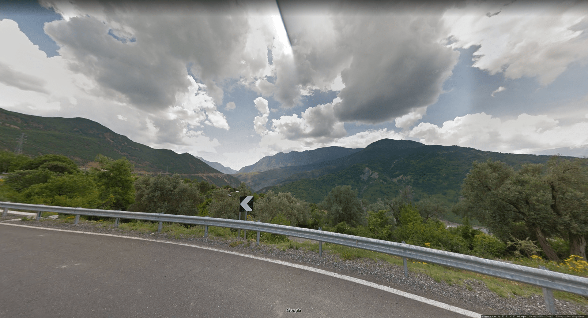

Beautiful hills and mountains... However, I genuinely have no idea where this could be!

Let's start off with what little we have, and analyze the black and white chevron marker in the center of the image:

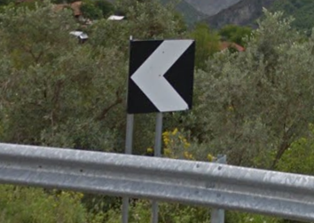

I initially scoured the internet for countries which use this specific chevron and came across this map, courtesy of user [u/isaacSW](https://www.reddit.com/r/geoguessr/comments/lwa9wr/map_of_european_road_curve_chevron_signs/) on the [r/geoguessr](https://www.reddit.com/r/geoguessr/) subreddit:

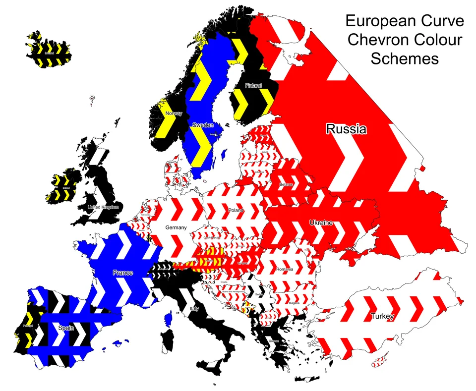

According to this map, the only countries which use white-on-black turn chevrons are the <CountryFlag country="gb" /> [United Kingdom](https://en.wikipedia.org/wiki/United_Kingdom), <CountryFlag country="ch" /> [Switzerland](https://en.wikipedia.org/wiki/Switzerland), <CountryFlag country="it" /> [Italy](https://en.wikipedia.org/wiki/Italy), <CountryFlag country="gr" /> [Greece](https://en.wikipedia.org/wiki/Greece), <CountryFlag country="al" /> [Albania](https://en.wikipedia.org/wiki/Albania), and occasionally <CountryFlag country="es" /> [Spain](https://en.wikipedia.org/wiki/Spain).

Since this part of the flag says "spacebar", the only choice which starts with "A" is Albania, so we will be using "a" for this character.

#### GeoGuessr Meta: Rifts in the Sky

After the challenge was completed, the author revealed something really interesting about this image... "**rifts in the sky**":

<StaticTweet
  avatar="https://pbs.twimg.com/profile_images/1749414032279216128/sxf-SdKE_400x400.jpg"
  username="PokemonChallenges"
  handle="pChalTV"
  date="Aug 25, 2022"
  src="https://twitter.com/pChalTV/status/1562906335125336067"
  media={WalterWhiteFalling}
>
  Geoguessr players when they fly to Albania and theres no rift in the sky
</StaticTweet>

Apparently, for countries like Albania, <CountryFlag country="me" /> [Montenegro](https://en.wikipedia.org/wiki/Montenegro), and <CountryFlag country="sn" /> [Senegal](https://en.wikipedia.org/wiki/Senegal), there are camera imperfections in the Photo Sphere which result in creases in the sky:

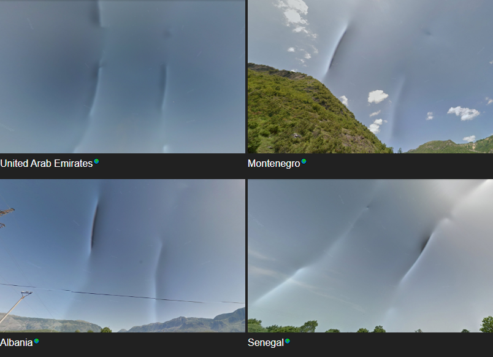

We can see the rift itself in `16.png` in the top center of the image:


Little meta tricks and trivia like these are what make GeoGuessr such an interesting game.

| Image            | Country                                                                                                                                                                   | [Population](https://en.wikipedia.org/wiki/List_of_countries_and_dependencies_by_population)                                                               | Flag    |
| ---------------- | ------------------------------------------------------------------------------------------------------------------------------------------------------------------------- | ---------------------------------------------------------------------------------------------------------------------------------------------------------- | ------- |
| [1.png](#1png)   | <CountryFlag country="br" /> [Brazil](https://en.wikipedia.org/wiki/Brazil)                                                                                               | 215,652,035 ([2023](https://en.wikipedia.org/wiki/Demographics_of_Brazil))                                                                                 | `B`     |
| [2.png](#2png)   | <CountryFlag country="ru" /> [Russia](https://en.wikipedia.org/wiki/Russia)                                                                                               | 146,980,061 ([2022](https://en.wikipedia.org/wiki/Demographics_of_Russia))                                                                                 | `R`     |
| [3.png](#3png)   | <CountryFlag country="ee" /> [Estonia](https://en.wikipedia.org/wiki/Estonia)                                                                                             | 1,331,796 ([2022](https://en.wikipedia.org/wiki/Demographics_of_Estonia))                                                                                  | `e`     |
| [4.png](#4png)   | <CountryFlag country="au" /> [Australia](https://en.wikipedia.org/wiki/Australia)                                                                                         | 26,033,493 ([2023](https://en.wikipedia.org/wiki/Demographics_of_Australia))                                                                               | `A`     |
| [5.png](#5png)   | <CountryFlag country="kz" /> [_Kazakhstan_](https://en.wikipedia.org/wiki/Kazakhstan)                                                                                     | 19,392,112 ([2023](https://en.wikipedia.org/wiki/Demographics_of_Kazakhstan))                                                                              | `K`     |
| [6.png](#6png)   | <CountryFlag country="is" /> [Iceland](https://en.wikipedia.org/wiki/Iceland)                                                                                             | 385,230 ([2022](https://en.wikipedia.org/wiki/Demographics_of_Iceland))                                                                                    | `_`     |
| [7.png](#7png)   | <CountryFlag country="mn" /> [Mongolia](https://en.wikipedia.org/wiki/Mongolia)                                                                                           | 3,477,605 ([2023](https://en.wikipedia.org/wiki/Demographics_of_Mongolia))                                                                                 | `m `    |
| [8.png](#8png)   | <CountryFlag country="sv" /> [_El Salvador_](https://en.wikipedia.org/wiki/El_Salvador) / <CountryFlag country="ec" /> [_Ecuador_](https://en.wikipedia.org/wiki/Ecuador) | 6,825,935 ([2021](https://en.wikipedia.org/wiki/Demographics_of_El_Salvador)) / 18,145,568 ([2023](https://en.wikipedia.org/wiki/Demographics_of_Ecuador)) | `e`/`E` |
| [9.png](#9png)   | <CountryFlag country="mc" /> [Monaco](https://en.wikipedia.org/wiki/Monaco)                                                                                               | 39,150 ([2021](https://en.wikipedia.org/wiki/Demographics_of_Monaco))                                                                                      | `_`     |
| [10.png](#10png) | <CountryFlag country="ch" /> [Switzerland](https://en.wikipedia.org/wiki/Switzerland)                                                                                     | 8,789,726 ([2022](https://en.wikipedia.org/wiki/Demographics_of_Switzerland))                                                                              | `s`     |
| [11.png](#11png) | <CountryFlag country="pl" /> [Poland](https://en.wikipedia.org/wiki/Poland)                                                                                               | 37,796,000 ([2022](https://en.wikipedia.org/wiki/Demographics_of_Poland))                                                                                  | `P`     |
| [12.png](#12png) | <CountryFlag country="at" /> [Austria](https://en.wikipedia.org/wiki/Austria)                                                                                             | 9,090,868 ([2022](https://en.wikipedia.org/wiki/Demographics_of_Austria))                                                                                  | `a`     |
| [13.png](#13png) | <CountryFlag country="ca" /> [Canada](https://en.wikipedia.org/wiki/Canada)                                                                                               | 39,082,640 ([2023](https://en.wikipedia.org/wiki/Demographics_of_Canada))                                                                                  | `C`     |
| [14.png](#14png) | <CountryFlag country="ec" /> [Ecuador](https://en.wikipedia.org/wiki/Ecuador)                                                                                             | 18,146,244 ([2023](https://en.wikipedia.org/wiki/Demographics_of_Ecuador))                                                                                 | `E`     |
| [15.png](#15png) | <CountryFlag country="by" /> [Belarus](https://en.wikipedia.org/wiki/Belarus)                                                                                             | 9,349,645 ([2021](https://en.wikipedia.org/wiki/Demographics_of_Belarus))                                                                                  | `b`     |
| [16.png](#16png) | <CountryFlag country="al" /> [Albania](https://en.wikipedia.org/wiki/Albania)                                                                                             | 2,829,741 ([2021](https://en.wikipedia.org/wiki/Demographics_of_Albania))                                                                                  | `a`     |

---

### 17.png

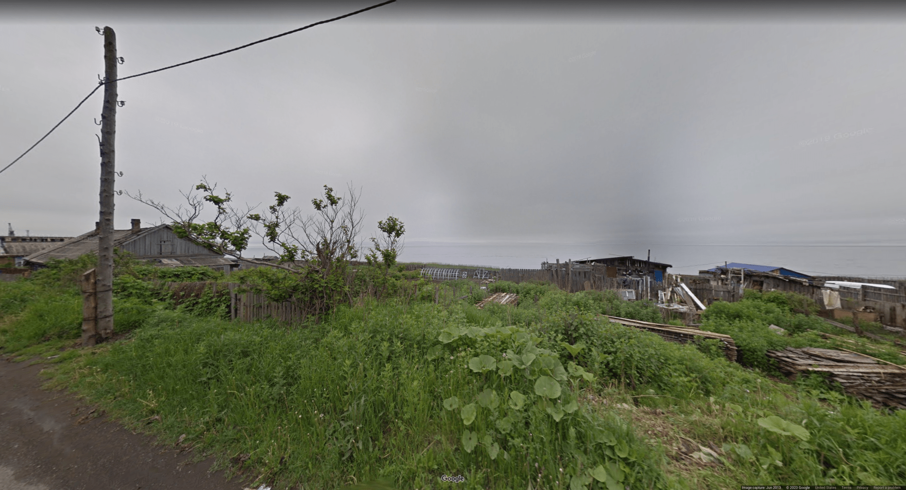

To be honest, we didn't solve this one at all—we just completed the sentence "break me spacebar" and guessed the last character was either "R" or "r". Our original <CountryFlag country="kh" /> [Cambodia](https://en.wikipedia.org/wiki/Cambodia) guess didn't make any sense, anyways :P

#### GeoGuessr Meta: The Sakhalin Plant

The author of the challenge revealed that the last location was <CountryFlag country="ru" /> [Russia](https://en.wikipedia.org/wiki/Russia), on the large island of [Sakhalin](https://en.wikipedia.org/wiki/Sakhalin) north of <CountryFlag country="jp" /> [Japan](https://en.wikipedia.org/wiki/Japan):

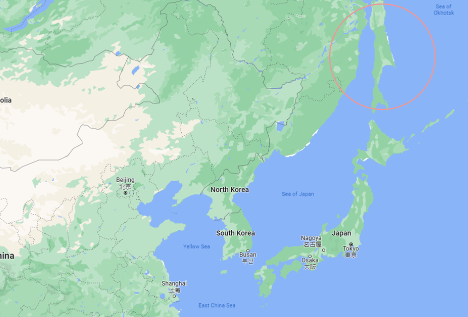

The intended method of identifying the location was to analyze this patch of particular foliage in the image:


This plant is called [butterbur](https://en.wikipedia.org/wiki/Petasites_japonicus) (_Petasites japonicus_, or colloquially "The Sakhalin Plant"), and it's native to Sakhalin, Japan, <CountryFlag country="cn" /> [China](https://en.wikipedia.org/wiki/China), and <CountryFlag country="kp" />/<CountryFlag country="kr" /> [Korea](https://en.wikipedia.org/wiki/Korea). Apparently, GeoGuessr pros can instantly identify this particular area of Russia from this plant alone!

| Image            | Country                                                                                                                                                                   | [Population](https://en.wikipedia.org/wiki/List_of_countries_and_dependencies_by_population)                                                               | Flag    |
| ---------------- | ------------------------------------------------------------------------------------------------------------------------------------------------------------------------- | ---------------------------------------------------------------------------------------------------------------------------------------------------------- | ------- |
| [1.png](#1png)   | <CountryFlag country="br" /> [Brazil](https://en.wikipedia.org/wiki/Brazil)                                                                                               | 215,652,035 ([2023](https://en.wikipedia.org/wiki/Demographics_of_Brazil))                                                                                 | `B`     |
| [2.png](#2png)   | <CountryFlag country="ru" /> [Russia](https://en.wikipedia.org/wiki/Russia)                                                                                               | 146,980,061 ([2022](https://en.wikipedia.org/wiki/Demographics_of_Russia))                                                                                 | `R`     |
| [3.png](#3png)   | <CountryFlag country="ee" /> [Estonia](https://en.wikipedia.org/wiki/Estonia)                                                                                             | 1,331,796 ([2022](https://en.wikipedia.org/wiki/Demographics_of_Estonia))                                                                                  | `e`     |
| [4.png](#4png)   | <CountryFlag country="au" /> [Australia](https://en.wikipedia.org/wiki/Australia)                                                                                         | 26,033,493 ([2023](https://en.wikipedia.org/wiki/Demographics_of_Australia))                                                                               | `A`     |
| [5.png](#5png)   | <CountryFlag country="kz" /> [_Kazakhstan_](https://en.wikipedia.org/wiki/Kazakhstan)                                                                                     | 19,392,112 ([2023](https://en.wikipedia.org/wiki/Demographics_of_Kazakhstan))                                                                              | `K`     |
| [6.png](#6png)   | <CountryFlag country="is" /> [Iceland](https://en.wikipedia.org/wiki/Iceland)                                                                                             | 385,230 ([2022](https://en.wikipedia.org/wiki/Demographics_of_Iceland))                                                                                    | `_`     |
| [7.png](#7png)   | <CountryFlag country="mn" /> [Mongolia](https://en.wikipedia.org/wiki/Mongolia)                                                                                           | 3,477,605 ([2023](https://en.wikipedia.org/wiki/Demographics_of_Mongolia))                                                                                 | `m `    |
| [8.png](#8png)   | <CountryFlag country="sv" /> [_El Salvador_](https://en.wikipedia.org/wiki/El_Salvador) / <CountryFlag country="ec" /> [_Ecuador_](https://en.wikipedia.org/wiki/Ecuador) | 6,825,935 ([2021](https://en.wikipedia.org/wiki/Demographics_of_El_Salvador)) / 18,145,568 ([2023](https://en.wikipedia.org/wiki/Demographics_of_Ecuador)) | `e`/`E` |
| [9.png](#9png)   | <CountryFlag country="mc" /> [Monaco](https://en.wikipedia.org/wiki/Monaco)                                                                                               | 39,150 ([2021](https://en.wikipedia.org/wiki/Demographics_of_Monaco))                                                                                      | `_`     |
| [10.png](#10png) | <CountryFlag country="ch" /> [Switzerland](https://en.wikipedia.org/wiki/Switzerland)                                                                                     | 8,789,726 ([2022](https://en.wikipedia.org/wiki/Demographics_of_Switzerland))                                                                              | `s`     |
| [11.png](#11png) | <CountryFlag country="pl" /> [Poland](https://en.wikipedia.org/wiki/Poland)                                                                                               | 37,796,000 ([2022](https://en.wikipedia.org/wiki/Demographics_of_Poland))                                                                                  | `P`     |
| [12.png](#12png) | <CountryFlag country="at" /> [Austria](https://en.wikipedia.org/wiki/Austria)                                                                                             | 9,090,868 ([2022](https://en.wikipedia.org/wiki/Demographics_of_Austria))                                                                                  | `a`     |
| [13.png](#13png) | <CountryFlag country="ca" /> [Canada](https://en.wikipedia.org/wiki/Canada)                                                                                               | 39,082,640 ([2023](https://en.wikipedia.org/wiki/Demographics_of_Canada))                                                                                  | `C`     |
| [14.png](#14png) | <CountryFlag country="ec" /> [Ecuador](https://en.wikipedia.org/wiki/Ecuador)                                                                                             | 18,146,244 ([2023](https://en.wikipedia.org/wiki/Demographics_of_Ecuador))                                                                                 | `E`     |
| [15.png](#15png) | <CountryFlag country="by" /> [Belarus](https://en.wikipedia.org/wiki/Belarus)                                                                                             | 9,349,645 ([2021](https://en.wikipedia.org/wiki/Demographics_of_Belarus))                                                                                  | `b`     |
| [16.png](#16png) | <CountryFlag country="al" /> [Albania](https://en.wikipedia.org/wiki/Albania)                                                                                             | 2,829,741 ([2021](https://en.wikipedia.org/wiki/Demographics_of_Albania))                                                                                  | `a`     |
| [17.png](#17png) | <CountryFlag country="ru" /> [Russia](https://en.wikipedia.org/wiki/Russia)                                                                                               | 146,980,061 ([2022](https://en.wikipedia.org/wiki/Demographics_of_Russia))                                                                                 | `R`     |

---

## Afterword

With this, the entire flag is revealed, and was successfully submitted with a lowercase "e" for the eighth character (the country was actually <CountryFlag country="sz" /> [Eswatini](https://en.wikipedia.org/wiki/Eswatini)); the flag is `idek{BReAK_me_sPaCEbaR}`.

This challenge would have not been possible if the flag wasn't made up of recognizable English words. When we were approaching the end, we simply inferred that the last bit spelled "spacebar"—although we could have brute forced all 8 different capitalizations of "bar" ($2^3$) by the time we finished "sPaCE", we felt like doing so would have detracted from the fun of the challenge.

Overall, I didn't just learn more about [GEOINT](https://en.wikipedia.org/wiki/Geospatial_intelligence)-style challenges—I came to a greater understanding of how absolutely massive Earth is. I guess that's part of the fun in playing GeoGuessr!

Here is a final table of all the countries (and what I guessed incorrectly):

| Image            | Correct Country                                                                       | [Population](https://en.wikipedia.org/wiki/List_of_countries_and_dependencies_by_population) | Flag | Incorrect Guess                                                                       |
| ---------------- | ------------------------------------------------------------------------------------- | -------------------------------------------------------------------------------------------- | ---- | ------------------------------------------------------------------------------------- |
| [1.png](#1png)   | <CountryFlag country="br" /> [Brazil](https://en.wikipedia.org/wiki/Brazil)           | 215,652,035 ([2023](https://en.wikipedia.org/wiki/Demographics_of_Brazil))                   | `B`  |                                                                                       |
| [2.png](#2png)   | <CountryFlag country="ru" /> [Russia](https://en.wikipedia.org/wiki/Russia)           | 146,980,061 ([2022](https://en.wikipedia.org/wiki/Demographics_of_Russia))                   | `R`  |                                                                                       |
| [3.png](#3png)   | <CountryFlag country="ee" /> [Estonia](https://en.wikipedia.org/wiki/Estonia)         | 1,331,796 ([2022](https://en.wikipedia.org/wiki/Demographics_of_Estonia))                    | `e`  |                                                                                       |
| [4.png](#4png)   | <CountryFlag country="au" /> [Australia](https://en.wikipedia.org/wiki/Australia)     | 26,033,493 ([2023](https://en.wikipedia.org/wiki/Demographics_of_Australia))                 | `A`  |                                                                                       |
| [5.png](#5png)   | <CountryFlag country="ke" /> [Kenya](https://en.wikipedia.org/wiki/Kenya)             | 47,564,296 ([2019](https://en.wikipedia.org/wiki/Demographics_of_Kenya))                     | `K`  | <CountryFlag country="kz" /> [Kazakhstan](https://en.wikipedia.org/wiki/Kazakhstan)   |
| [6.png](#6png)   | <CountryFlag country="is" /> [Iceland](https://en.wikipedia.org/wiki/Iceland)         | 385,230 ([2022](https://en.wikipedia.org/wiki/Demographics_of_Iceland))                      | `_`  |                                                                                       |
| [7.png](#7png)   | <CountryFlag country="mn" /> [Mongolia](https://en.wikipedia.org/wiki/Mongolia)       | 3,477,605 ([2023](https://en.wikipedia.org/wiki/Demographics_of_Mongolia))                   | `m ` |                                                                                       |
| [8.png](#8png)   | <CountryFlag country="sz" /> [Eswatini](https://en.wikipedia.org/wiki/Eswatini)       | 1,202,000 ([2021](https://en.wikipedia.org/wiki/Demographics_of_Eswatini))                   | `e`  | <CountryFlag country="sv" /> [El Salvador](https://en.wikipedia.org/wiki/El_Salvador) |
| [9.png](#9png)   | <CountryFlag country="mc" /> [Monaco](https://en.wikipedia.org/wiki/Monaco)           | 39,150 ([2021](https://en.wikipedia.org/wiki/Demographics_of_Monaco))                        | `_`  |                                                                                       |
| [10.png](#10png) | <CountryFlag country="ch" /> [Switzerland](https://en.wikipedia.org/wiki/Switzerland) | 8,789,726 ([2022](https://en.wikipedia.org/wiki/Demographics_of_Switzerland))                | `s`  |                                                                                       |
| [11.png](#11png) | <CountryFlag country="pl" /> [Poland](https://en.wikipedia.org/wiki/Poland)           | 37,796,000 ([2022](https://en.wikipedia.org/wiki/Demographics_of_Poland))                    | `P`  |                                                                                       |
| [12.png](#12png) | <CountryFlag country="at" /> [Austria](https://en.wikipedia.org/wiki/Austria)         | 9,090,868 ([2022](https://en.wikipedia.org/wiki/Demographics_of_Austria))                    | `a`  |                                                                                       |
| [13.png](#13png) | <CountryFlag country="ca" /> [Canada](https://en.wikipedia.org/wiki/Canada)           | 39,082,640 ([2023](https://en.wikipedia.org/wiki/Demographics_of_Canada))                    | `C`  |                                                                                       |
| [14.png](#14png) | <CountryFlag country="ec" /> [Ecuador](https://en.wikipedia.org/wiki/Ecuador)         | 18,146,244 ([2023](https://en.wikipedia.org/wiki/Demographics_of_Ecuador))                   | `E`  |                                                                                       |
| [15.png](#15png) | <CountryFlag country="bg" /> [Bulgaria](https://en.wikipedia.org/wiki/Bulgaria)       | 6,520,314 ([2021](https://en.wikipedia.org/wiki/Demographics_of_Bulgaria))                   | `b`  | <CountryFlag country="by" /> [Belarus](https://en.wikipedia.org/wiki/Belarus)         |
| [16.png](#16png) | <CountryFlag country="al" /> [Albania](https://en.wikipedia.org/wiki/Albania)         | 2,829,741 ([2021](https://en.wikipedia.org/wiki/Demographics_of_Albania))                    | `a`  |                                                                                       |
| [17.png](#17png) | <CountryFlag country="ru" /> [Russia](https://en.wikipedia.org/wiki/Russia)           | 146,980,061 ([2022](https://en.wikipedia.org/wiki/Demographics_of_Russia))                   | `R`  |                                                                                       |

### Resources

Here are some of the websites I used throughout the challenge-solving process:

- [GeoHints](https://geohints.com/) - Provides images and key characteristics of every covered country in Google Street View
- [GeoTips](https://geotips.net/) - Lots of meta stuff (e.g. camera quality, cars vs. trekkers, etc.)
- [r/geoguessr](https://www.reddit.com/r/geoguessr/) - Useful community diagrams and wiki
- [The Digital Labyrinth - GeoGuessr](https://somerandomstuff1.wordpress.com/2019/02/08/geoguessr-the-top-tips-tricks-and-techniques/) - An absolutely massive blog post with everything you need to know about the game and its tricks
- [World License Plates](http://www.worldlicenseplates.com/) - Scanned license plates of the majority of countries, including old and new designs
- [Google Lens](https://lens.google/) - A powerful image recognition tool which can identify objects, text, landmarks, foliage, you name it and provide similar images
