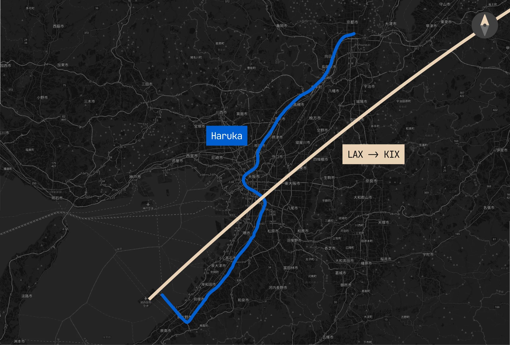

## Day 0: Kansai Airport

Upon arriving in Japan, my first blunder of the trip was not actually researching how to get _out_ of the airport. After clearing customs and navigating the airport, we eventually stumbled upon a JR ticket office. I was reluctant to enter at first; I assumed that they only sold JR passes. However, my parents, more optimistic, just wanted to enter to ask for directions and assistance inside. Turns out, they had everything we needed to get out of the airport: the aforementioned IC cards, and a one-way train ticket out of the airport:

<figure>
  
  <figcaption class="text-center [&>p]:text-muted-foreground">
    Image courtesy of [Inside
    Kyoto](https://www.insidekyoto.com/arriving-at-kansai-international-airport-kix)
  </figcaption>
</figure>

In the ticket office we purchased the ["ICOCA & Haruka"](https://web.archive.org/web/20230713044404/https://www.westjr.co.jp/global/en/ticket/icoca-haruka/) discount ticket package (sadly discontinued since September 2023), which comes with the ICOCA IC Card (served in JR West jurisdiction) preloaded with ¥500 alongside a discounted one-way ticket for the [Haruka Limited Express](https://www.westjr.co.jp/global/en/travel/shopping/access/train.html). We learned that the Haruka is the only rail service between KIX and Kyoto Station, and it comes at 30-minute intervals.

### The Kansai Faregate Incident

In our rush to catch the next Haruka train, which we learned was departing in just three minutes, we hurried to the platform, only to face an unfamiliar barrier... the fare gate:

Getting through this fare gate is supposed to be _extremely_ easy; you just slip the ticket into the slot and it pops out the other side for retrieval. What you're **NOT** supposed to do (and we were explicitly warned **NOT TO DO THIS** by the ticket office) is tap your IC card on the reader to open the gate, as then your IC card would effectively be charged the full price of the Haruka ticket (we bought a physical, reduced-fare ticket as an alternative to the full-priced trip). Guess what we ended up doing in a panic?

Of course, we realized our mistake on the train ride after we settled in our seats. This is where our next, arguably worse blunder comes in: we didn't know about the "tap-in, tap-out" system which Japanese public transportation uses.

Whenever you tap your IC card to enter a station, it doesn't actually get charged——you're just setting your "start point" for a newly created "trip" in the IC system, and your charge only gets calculated/processed after you go through a tap-out gate at your destination station, effectively ending your trip. We didn't know this at all, so we just assumed that we already got charged, and that we could attempt to refund the unused one-way tickets later.

At Kyoto Station, Google Maps was telling us to transfer to the Karasuma Line. The correct way to do this (that we obviously didn't do) would be to:

- Finish the Haruka trip by tapping out
  - Technically this wouldn't even work regardless of what we did. We can't slip our ticket into the exit fare gate because we didn't start the trip with it, and we couldn't tap out with an IC card because it'd attempt to charge us the full ¥2,850 Haruka ticket on our ¥500 balance.
- Tap in with the IC card to the Karasuma Line
- Tap out at the destination station

Here is the "What Should Have Happened" diagram to help illustrate this:

I thought it genuinely could not get any worse, but then we somehow mystically managed to _completely dodge_ the tap-out gate at Kyoto Station and ended up at the tap-in gate to the Karasuma line platforms. Of course, since the system never detected us ending our initial trip from KIX, it denied us with an embarrassingly loud blare accompanied with appropriately flashing red lights. When we attempted to exit Kyoto Station entirely, we also got denied at the exit gate because the system was trying to charge ¥2,850 on our ¥500 balance (the full fare of the Haruka ticket).

In a desperate attempt to resolve the situation, we approached a station attendant. The language barrier only worsened our confusion (and frustration), as the attendant struggled to understand exactly what happened even after looking at our IC card balances. We showed our unused Haruka tickets, hoping perhaps for a refund or an explanation. Instead, the attendant inexplicably took our Haruka tickets (which we intended to refund) and waived us out of the station. At this point, we were completely dumbfounded; we thought that we double charged ourselves for the Haruka fare, and that we were now out of ¥2,850 each person.

This simply wasn't the case, however. After a while of piecing together all of the events that transpired, I finally figured out what actually happened:

Essentially, we never actually completed the Haruka trip by tapping out, but we never got charged for it either. Thankfully we weren't committing fare evasion of any kind, because our tickets _did_ end up getting taken by the station attendant and we didn't get reimbursed.

After my dad managed to find a taxi pickup spot, we finally managed to arrive at our accommodation at 11pm. When we discussed the confusion with our receptionist, she checked the balance of our IC cards using an app (which we didn't even know was possible at the time) and discovered that we all still had our ¥500 balances. This was also the time where the "tap-in tap-out" system was explained to us——we were relieved, but we unfortunately were still unaware that our IC cards were still in a "trip" state since we failed to tap out, which would cause issues in the future.

We were all so relieved to finally be in our apartment, and ended up walking to a nearby 7-Eleven to grab some 12am dinner. And yes, the kombini is magical.
