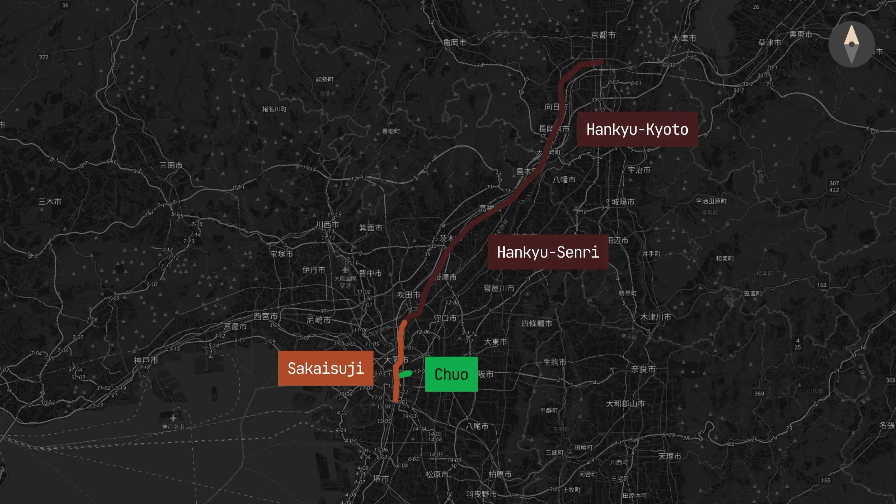
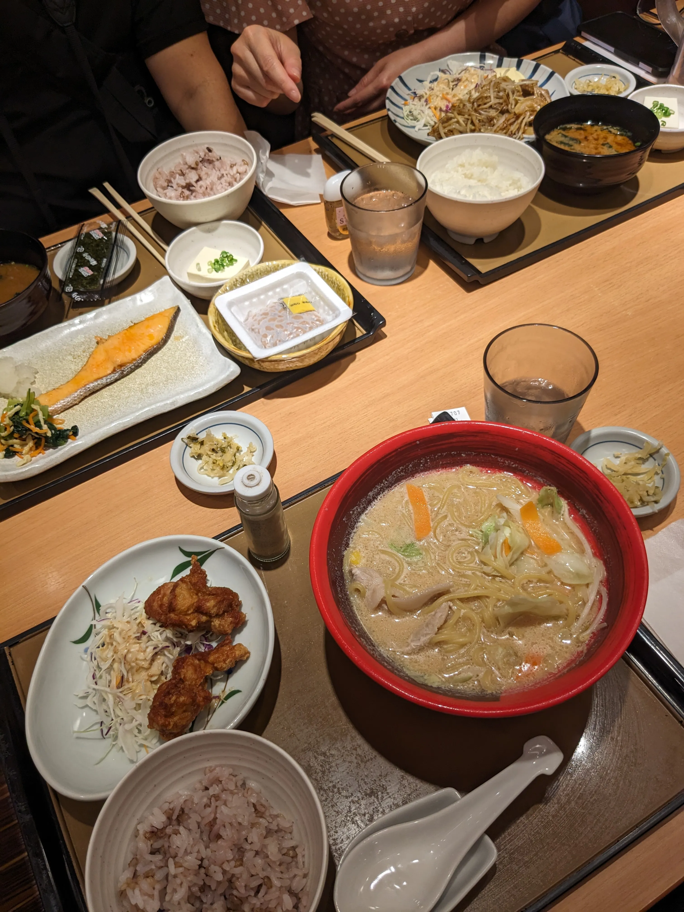

## Day 1: Osaka Day Trip

Although we were so exhausted from yesterday, we actually managed to wake up at around 5am due to jetlag (2am our time). We decided to take advantage of this and eat at a breakfast place two blocks down, recommended by our receptionist from yesterday. The summer sun was already out by 6am and we were welcomed with a nice walk:

### Breakfast (Teishoku)

We ended up at a place called [Yayoi-ken Shijo-Karasuma](https://tabelog.com/en/kyoto/A2601/A260201/26011748/) (where Yayoi-ken is the chain name and Shijo-Karasuma is the branch name), a 24-hour chain restaurant that serves traditional Japanese [teishoku](https://en.wikipedia.org/wiki/Teishoku) (set meals). It was pretty empty and even had a self-serve kiosk for ordering. Food was served quickly and was delicious; we had a lot of never-tried-before dishes like [natto](https://en.wikipedia.org/wiki/Natt%C5%8D), and we enjoyed having so much variety of dishes for breakfast as we picked off of each other's plates to try everything:

### Osaka Castle

Our first stop in our itinerary for today was [Osaka Castle](https://en.wikipedia.org/wiki/Osaka_Castle), a very popular tourist attraction. Although I heard that Osaka Castle was underwhelming, I still wanted to go because we might as well see it if we're already there.

When we walked over to Karasuma Station with the intention of taking the Hankyu-Kyoto line down to Osaka, we were greeted by a prompt denial at the "tap-in" fare gate (remember how we were still in a "trip" state?). However, thank goodness for the station master who was able to clear up our messed up IC cards and let us re-tap in (for some reason he wasn't even bothered by the fact that we somehow tapped out of KIX and ended up in Kyoto without ever tapping out). We managed to get through the fare gate successfully!

After transferring to the Hankyu-Senri line at Awaji Station and doing one final transfer at Sakaisuji-Hommachi Station to the Chuo Line, we finally arrived at [Osaka Castle Park](https://en.wikipedia.org/wiki/Osaka_Castle_Park) at 9am opening time. The park was very peaceful, and the castle itself was quite grand:

Although many people opt out of going inside the castle (it's just a museum and there is an entry fee), we decided to go in to get to the top floor and see views from the observation deck. The museum itself was very informative, and the view from the top was quite nice:

### Shinsekai & Lunch (Kushikatsu)

Our next stop after this was [Shinsekai](https://www.japan-guide.com/e/e4012.html), a business district in downtown Osaka which is known for its [Tsūtenkaku Tower](https://en.wikipedia.org/wiki/Ts%C5%ABtenkaku), pretty signage and [kushikatsu](https://en.wikipedia.org/wiki/Kushikatsu) (deep-fried skewers, Osaka's specialty):

We had a lot of fun exploring the area and trying out some of the various street foods and stores, and we decided to have lunch at a kushikatsu place called [Kushikatsu to Odashi Kushiemon](https://tabelog.com/en/osaka/A2701/A270206/27135045/) that we saw had a pretty exterior. Although the food was somewhat mediocre——it was simple fried skewers and other miscellaneous dishes——the service was wonderful because the person who staffed us was Vietnamese (a trend that would continue throughout the trip; there are a lot of Vietnamese people in Japan with work visas, and so we encountered more Vietnamese-speaking people than English-speaking people):

### Nipponbashi's Den Den Town

After shopping around a little bit (and even discovering a dead market alleyway), we decided to head to our next destination at around 1:30pm: [Nipponbashi's Den Den Town](https://en.wikipedia.org/wiki/Nipponbashi), Osaka's [Akihabara](https://en.wikipedia.org/wiki/Akihabara) equivalent (electronics, otaku culture, collectibles). Den Den Town had a really interesting aesthetic: one insanely long street with huge signs flaring out from the buildings, with traffic lights down the entire road that turned red and green in unison. Although we didn't buy anything, we did peruse and enjoy the atmosphere:

### Doguyasuji, Kuromon Ichiba, Hozenji Yokocho

Adjacently west of the Den Den Town street was the [Sennichimae Doguyasuji Shopping Street](https://osaka-info.jp/en/spot/sennichimae-doguyasuji-shopping-street/), a street known for its cute kitchenware and cookware stores. Here was where we took our first pit stop at a [Doutor](https://www.doutor.co.jp/en/) to grab some coffee and rest our feet.

Next stop was the [Kuromon Ichiba Market](https://www.osakastation.com/kuromon-ichiba-market/), a market known for its insanely fresh seafood and street food. We ended up getting a ¥1,000 stick of Wagyu beef, which was the first time we tried Japanese wagyu (pretty good!):

Although this was a brief "go through to get it over with" place, we did pass through [Hozenji Yokocho](https://insideosaka.com/hozenji-yokocho/) and [Hozenji Temple](https://www.japan.travel/en/spot/1109/), a small alleyway filled with pubs and izakayas with a temple at the end. This was a pretty touristy area due to it being recommended by some travel guides, but it was interesting seeing such a juxtaposition between the intensely modern Osaka area compared to the traditional alleyway and preserved temple:

### Dotonbori

Our last stop of the day was [Dotonbori](https://www.osakastation.com/dotonbori-area-the-bright-heart-of-osaka/), a beautiful canal area filled with neon lights and billboards at the heart of Osaka. The canal was beautiful (and packed!) even in the daytime:

Besides the main canal area, there is so much to see and do around the Dotonbori area. Nearby was the [Ebisubashi-suji Shopping Street](https://osaka-info.jp/en/spot/ebisubashisuji-shopping-street/), where we ended up buying new shoes for my little brother (who had demolished his current pair by intense walking and heat):

### Dinner (Ichiran)

Dinner was, of course, at the famous [Ichiran](https://en.wikipedia.org/wiki/Ichiran) ramen chain. Many people love to hate on tourists dining at Ichiran because it's an "overrated chain", but we genuinely enjoyed the experience they catered to us. We got in line at around 4:30pm and paid for our meals via vending machine tickets, and were also provided a pencil and small sheet of paper to customize how we wanted our ramen (noodle firmness, broth richness, spice level, etc). We were seated in individual booths in a little over an hour and were served with zero interaction with the staff:

The ramen itself was really palatable (especially for my parents and little brother, who weren't as fond of heavy/oily flavors as much as I was), and the experience was quite unique. Even for an insanely popular chain, their quality of service and food was still top-notch.

After dinner, we walked off our meal by exploring and shopping around Dotonbori. Although I wanted to wait to take pictures of the canal during the night, we were all pretty burnt out and decided to head back to Kyoto at around 7:30pm.
