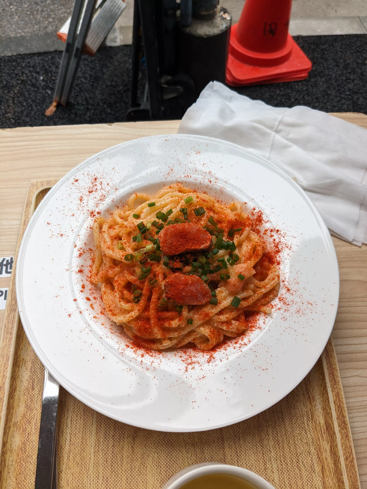
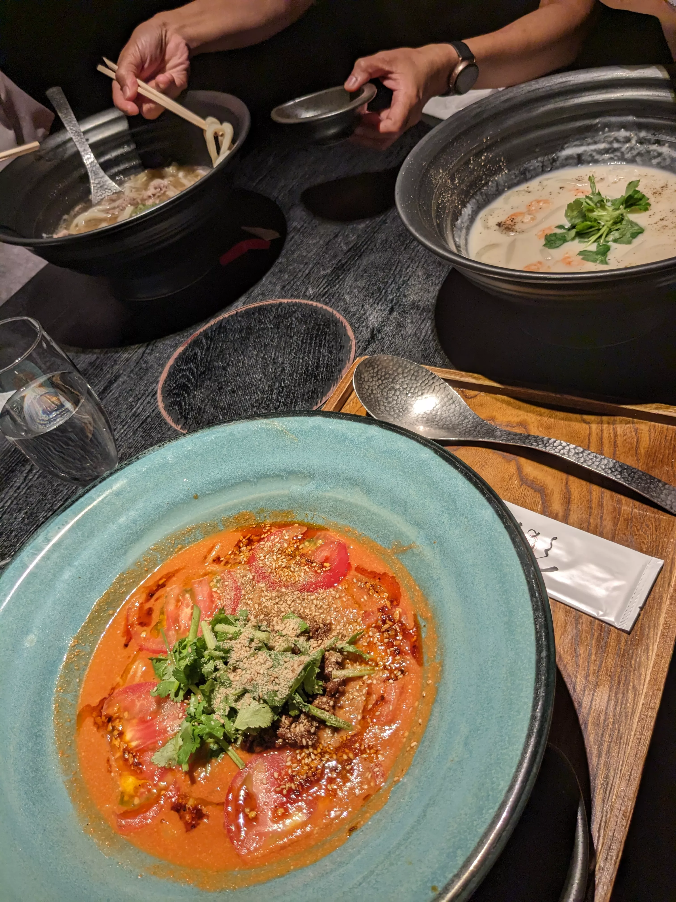
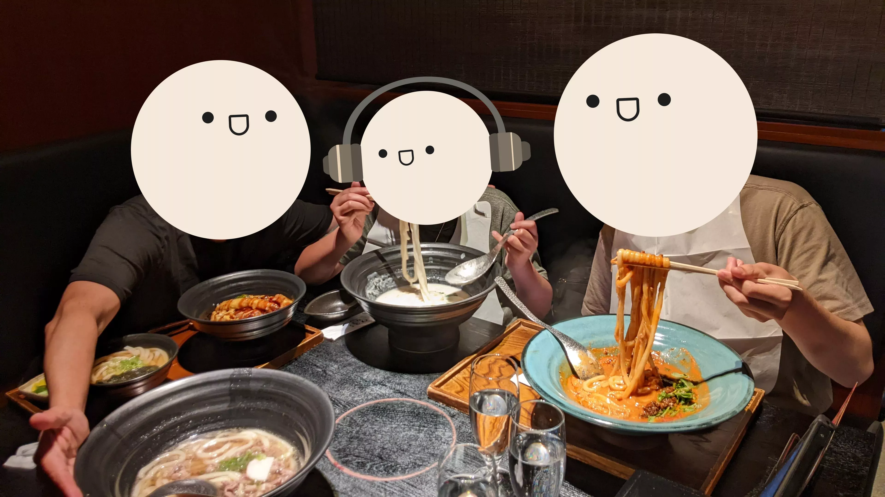

## Day 10: Rest Day

Today was our planned rest day, which was probably much needed after 9 days of non-stop exploration and sightseeing and averaging around 20k steps per day (a lot for my middle-aged parents).

### Tsukiji Fish Market, Lunch (Food Court)

After sleeping in and taking our time in the morning, we made our way to the Tsukiji Fish Market for lunch. Unfortunately, we arrived during peak hours and in the middle of heavy rainfall, which made for quite an overwhelming experience with the dense crowds and general market commotion:

The market was particularly interesting to explore with my dad, who brought his knowledge as a former restaurateur and deep understanding of seafood and fresh produce. Unfortunately, we found that Tsukiji in this hour has largely transformed into a tourist destination rather than a working market——most of the serious business happens in the early morning hours when fresh catches arrive. By the time we visited, the focus had clearly shifted from wholesale seafood to street food vendors catering to tourists like ourselves:

Although there was a pretty obvious tourist markup, we gave in and tried a couple small bites of the various seafood dishes, including the above depicted grilled squid alongside the below ikura/uni bowl (which was like USD$30) and cod roe pasta, both of which were very delicious:

Overall, the experience was a bit disappointing and I'd personally consider it a tourist trap, but at least the food was good.

### Dinner (Udon)

At this point we had rotated through pretty much every subgenre of Japanese food imaginable (we were trying to eat different things every day), but we somehow managed to come up with udon for dinner, which we hadn't had yet on the trip. After some research at the hotel, I found a very highly acclaimed udon restaurant just a 10 minute walk from our hotel called [Tsurutontan](https://tabelog.com/tokyo/A1304/A130401/13024799/) which had 1500+ reviews on Tabelog, a quantity I'd never seen before.

The restaurant itself was very dimly lit with private booths (and was also underground with zero windows), which made it seem like its primary function was a bar. We were seated in a booth, ordered via tablet, and were presented with these ridiculously large-rimmed bowls of udon:

With the addition of the disposable bibs, this was one of the most fun meals we had during the trip! While my parents opted for the traditional soup-based beef udon, me and my brother were a bit more adventurous and got sauce-based udon that were almost pasta-like in flavor:

We didn't do much for the rest of the day, but we did walk around and window shop a bit around the hotel before retreating back to our rooms as the sun went down:

