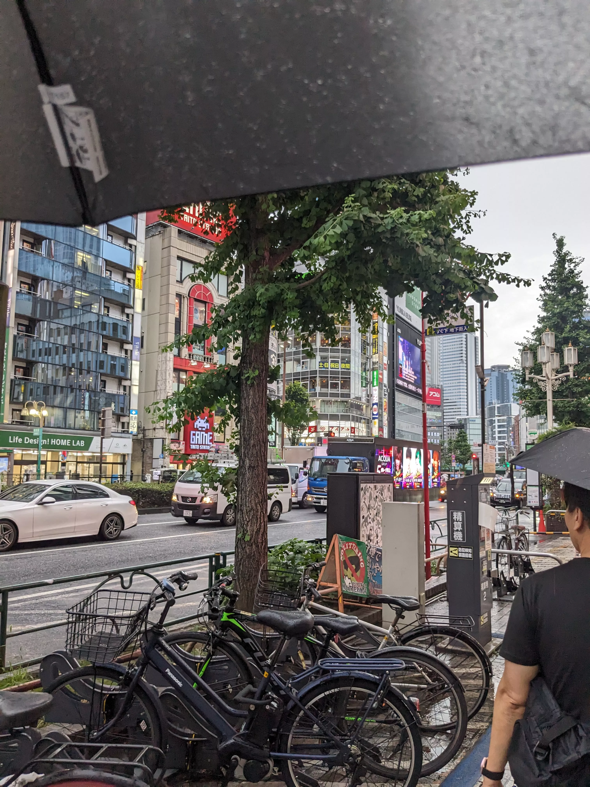

## Day 10: Rest Day

### Tsujiki Fish Market, Lunch

*>*]:my-0">

### Dinner: Udon

[つるとんたん 新宿店 (Tsurutontan Shinjuku)](https://tabelog.com/tokyo/A1304/A130401/13024799/)

*>*]:my-0">

### Evening Walk

*>*]:my-0">

