

## Day 11: Akihabara

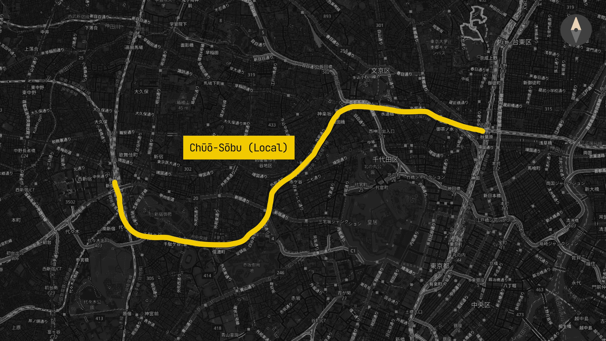

Today, my plan was to split up from my family to go hang out with a couple of my high school friends who were also concurrently visiting Tokyo. This was an extraordinarily good idea, since we could then go to Akihabara and do some ridiculous things and enter ridiculous stores.

### Brunch (Phở)

At this point we were absolutely exhausted from Japanese food. A perspective I found amusing is that Japanese people don't even make this differentiation from other cuisines, this is simply just "food" to them.

For brunch before we split up we decided to get phở, as it was a flavor that we missed pretty dearly. I found a spot called [PHO THIN](https://tabelog.com/en/tokyo/A1304/A130401/13257231/) which served Northern-style phở, which is very uncommon in the US——Vietnamese expatriates who opened brick-and-mortar restaurants in the US are almost exclusively Southern refugees from the war, and as such served Southern-style phở. The waiter who took care of us was also very Vietnamese, but we were less surprised about this since, of course, we were in a Vietnamese restaurant:

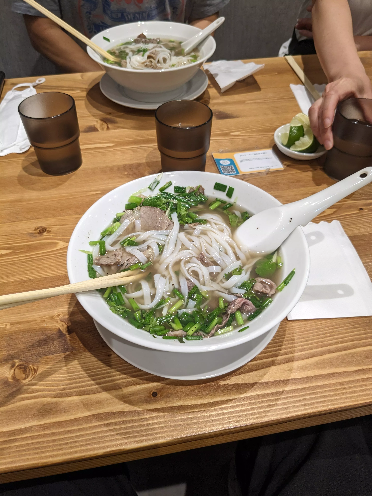

This variety of phở was quite different from what I was used to. Northern-style phở uses wider, flatter rice noodles compared to the thinner noodles found in Southern-style phở. The toppings were also more minimalist——mainly green onions and herbs, without the bean sprouts, basil, and other garnishes that are common in Southern and Americanized versions. The broth itself had a cleaner, more focused beef flavor since it uses fewer spices than Southern-style phở. While the phở that my family makes at home and what's typically served in US restaurants has evolved into its own delicious style over time, it was fascinating to try this more traditional Northern preparation that highlighted the dish's origins.

At this point I split up from my family and took the train to Akihabara to meet up with my friends.

### Akihabara

Akihabara was, quite frankly, ridiculous. There is nowhere else in the world where this many anime girls are plastered onto every billboard like this:

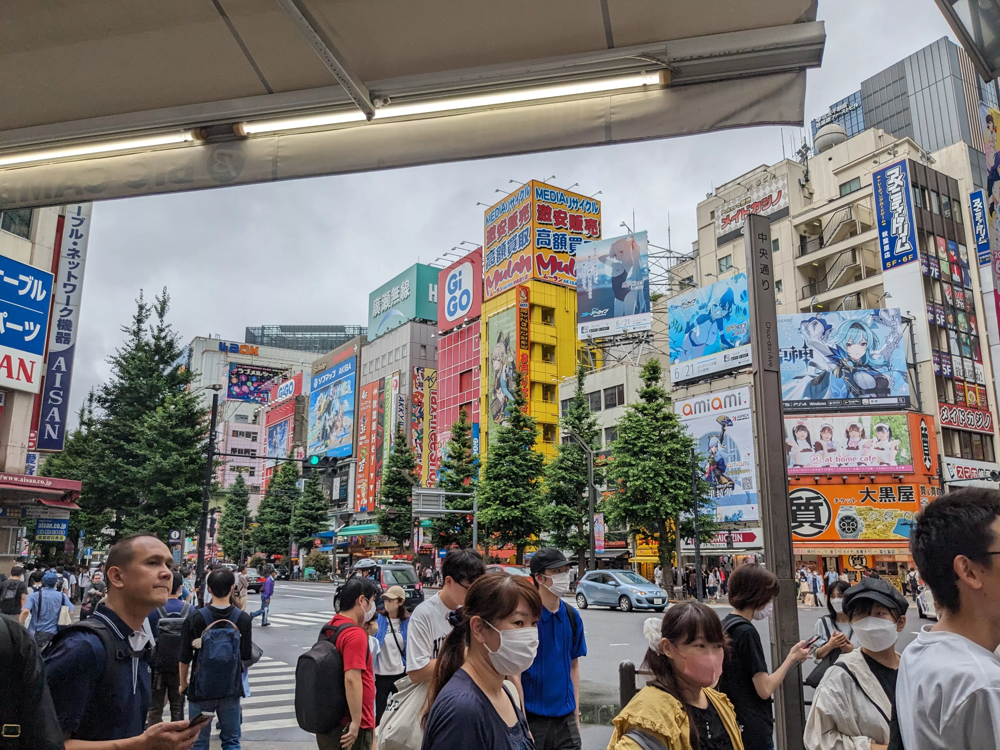

Probably the most ridiculous thing I saw was a small parade of women driving tricycles, advertising an anime where the premise is that the main character gets reincarnated into a fantasy world as a vending machine:

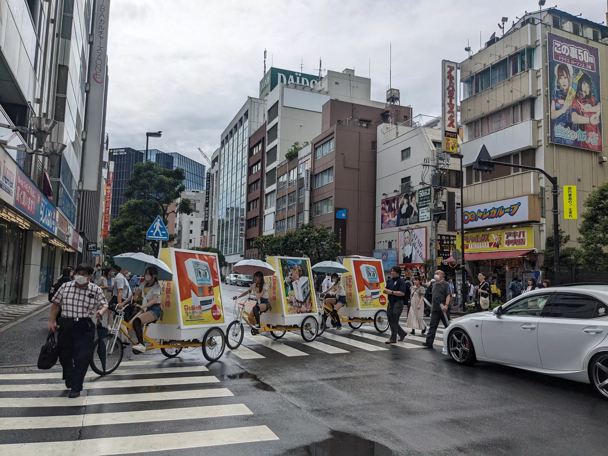

After meeting up with my friends, we walked around for a very long time, visiting various electronics and anime merchandise stores. The upper floors of these establishments often sold increasingly mischievous/less family-friendly goods and, as such, I have very few photos of:

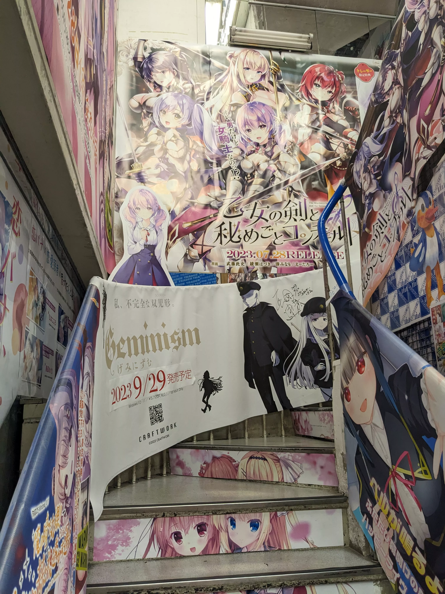

### Lunch (Maid Cafe)

We decided to go to a maid cafe for lunch. Two of the three friends I was with are Japanese——they were visiting family——and it was doubly embarrassing for them since these establishments are exclusively a tourist thing (i.e. it's odd seeing actual Japanese people in them). We decided to go to [maidreamin Akihabara](https://tabelog.com/en/tokyo/A1311/A131101/13050366/), which had a line going out the door and down the fire escape; we waited for about 45 minutes before being seated.

Of course, the food itself is never the reason why you would go to a maid cafe (even though the food was cute, e.g. omurice with ketchup art or cute bear-shaped parfaits). All food would actually be part of a combo where you could receive items like wearable bunny ears or a polaroid photo with a maid of your choice. Every time the maids interacted with us, they'd instruct us to say something along the lines of "oishikunare, moe moe kyun~!" (translation unnecessary) and make us do various hand signs. The two Japanese friends had a pretty long and genuine conversation with one of the maids that I picked up on a bit (talking about how they were [Nisei](https://en.wikipedia.org/wiki/Nisei), i.e. second-generation Japanese-Americans) but I was too embarrassed to do or say anything:

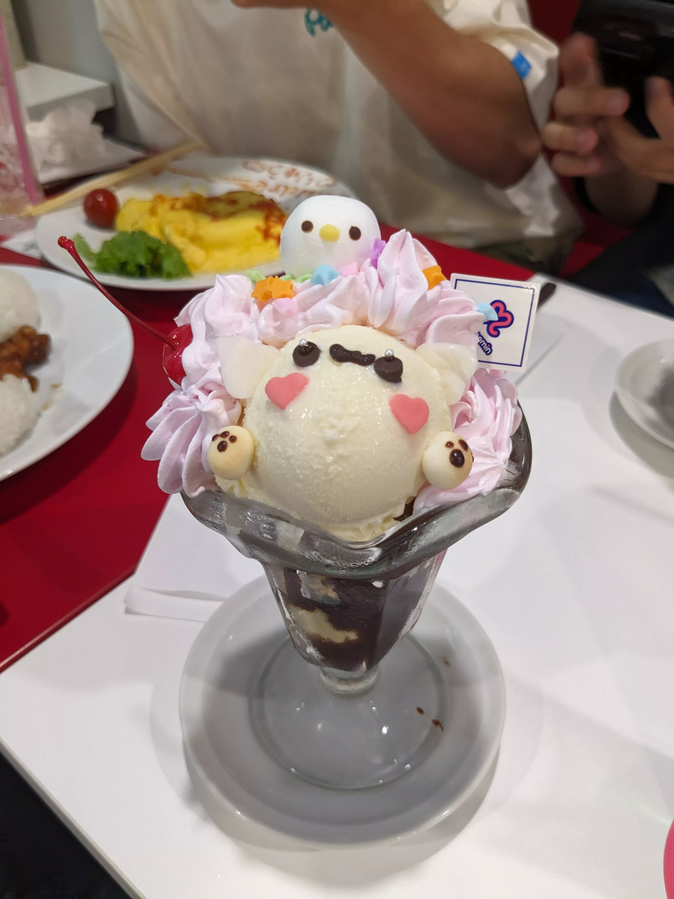

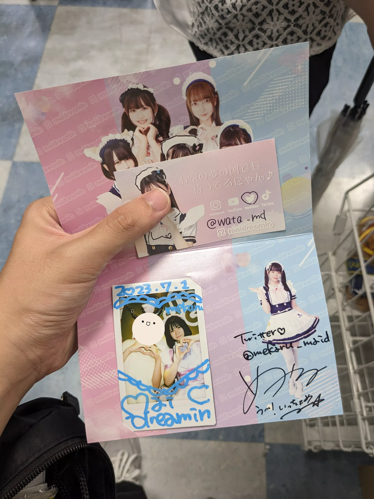

For the rest of the evening we stuck to the same routine of walking into a shop we found interesting, not buying anything, and moving on to the next one. The only item I actually ended up buying was an [Artisan Mousepad](https://www.artisan-jp.com/nj_index_eng.html/), a gaming-oriented mousepad that was only readily available in Japan at the time. We also popped into an arcade and messed around with the fighting games:

  

    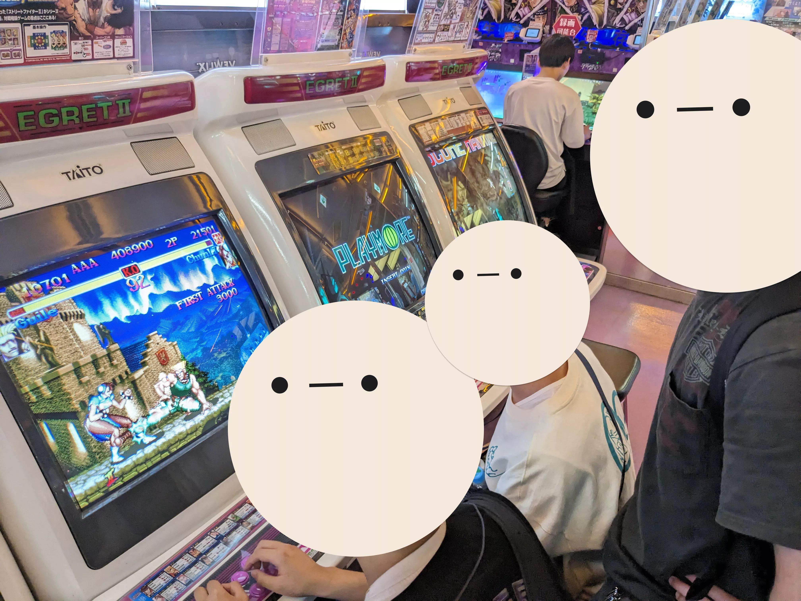
  

  

    
  

  

    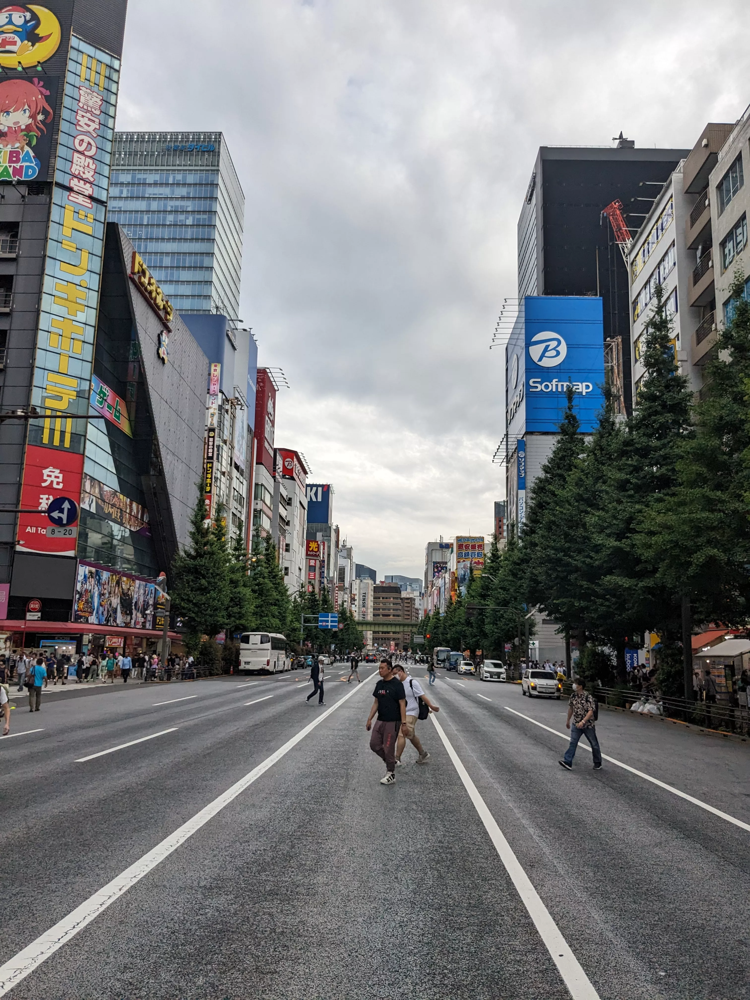
  

### Dinner (Hakata-style Ramen)

It was way past dinnertime at this point (8:30pm) and the tiny portions from the maid cafe didn't help at all with how astonishingly hungry we were. We ended up opting for Hakata-style ramen at [Hakata Furyu](https://tabelog.com/en/tokyo/A1311/A131101/13096267/) which we passed by during our exploration and kept at the back of our minds.

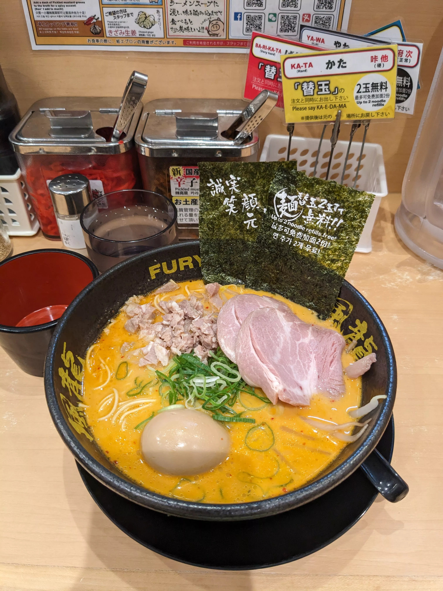

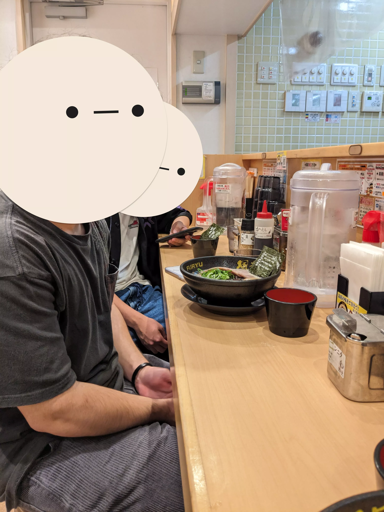

One unique feature of this restaurant was their noodle refill system. The seaweed garnish had a rice-based imprint advertising "Up to 2 free noodle refills!", and each seat came with cards that you could place on the counter to request more noodles. The cards even let you specify how firm you wanted the noodles cooked for each refill. In my opinion, this was the best bowl of ramen I had while in Japan (however, not the best bowl of ramen I've ever had——that award goes to another Hakata-style shop near my house in LA). I said goodbye to my friends and went back to Akihabara station, where this was the last anime-related thing I saw:

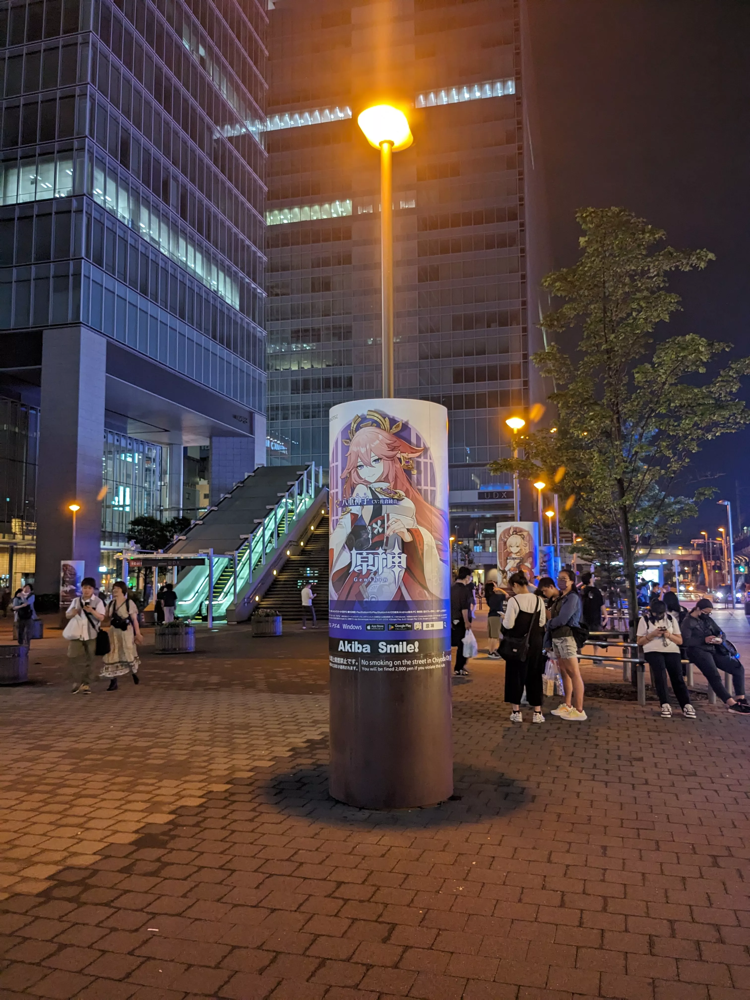

Overall, I'm really glad I went to Akihabara with friends and not family. That day my parents and little brother went mall shopping at Shinjuku Station; I'm sure they had a good time as well.