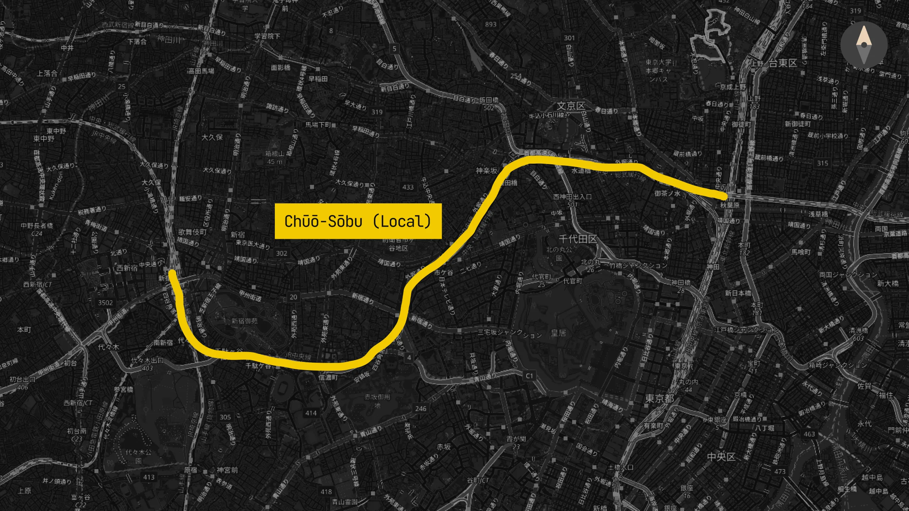
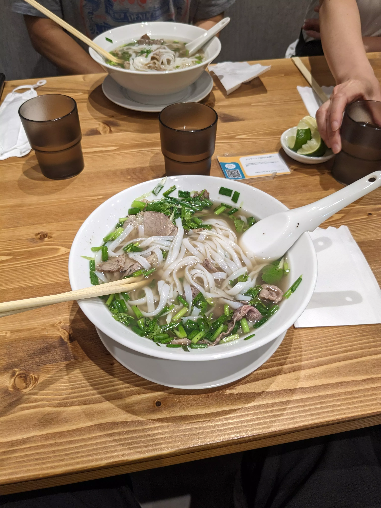
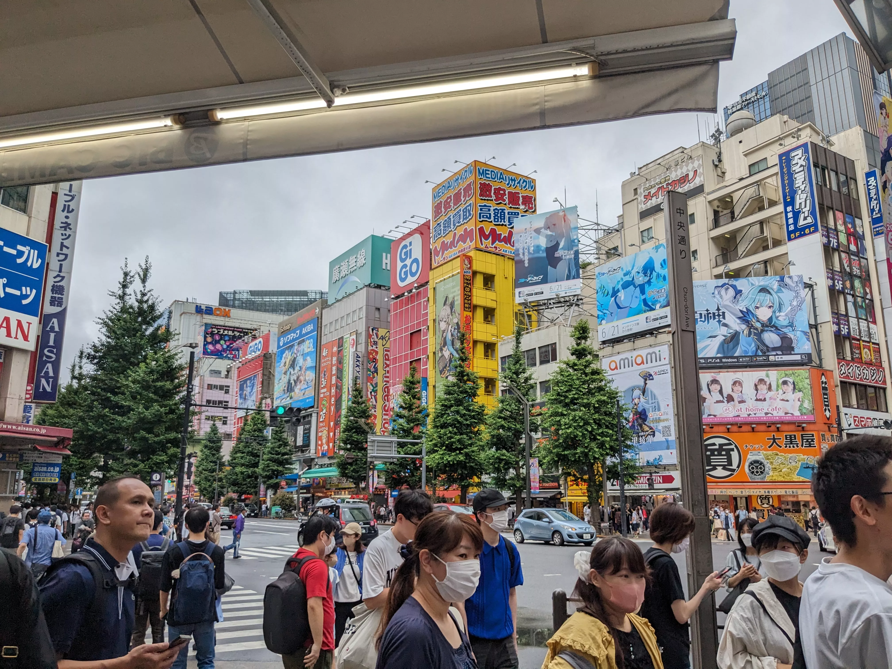
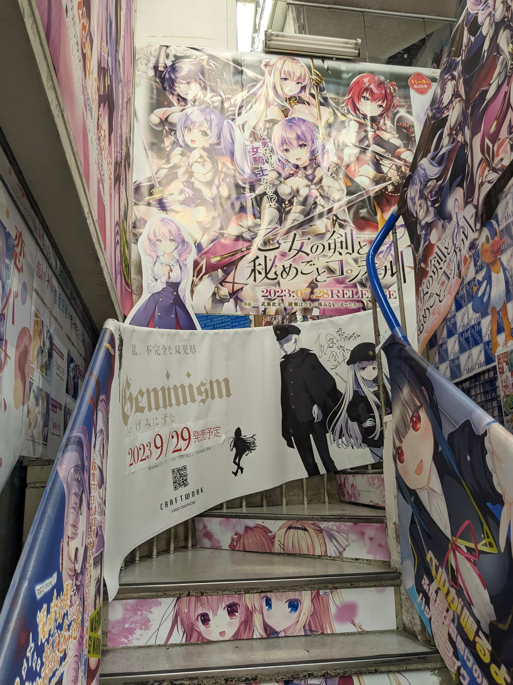
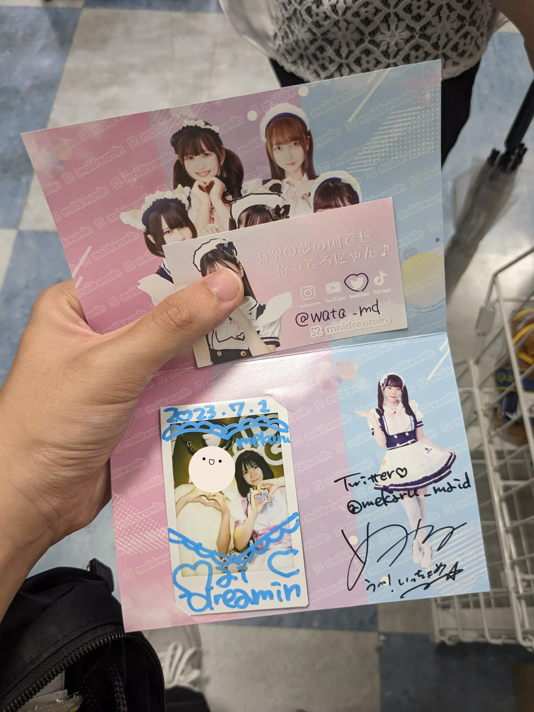
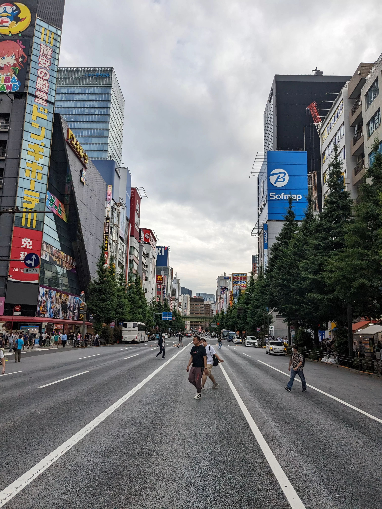
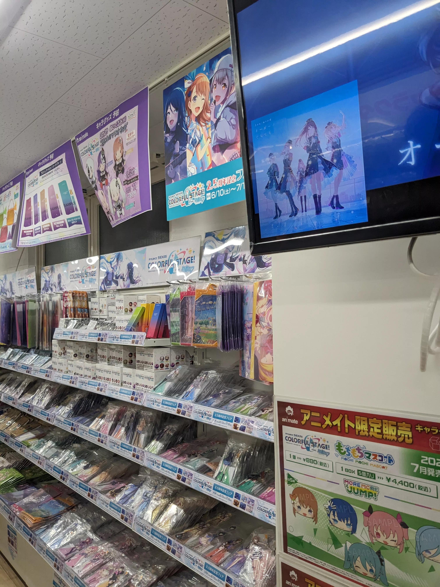
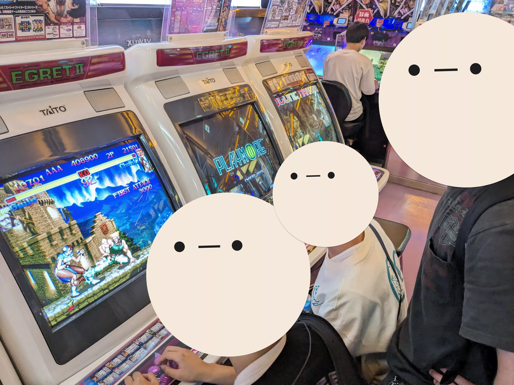
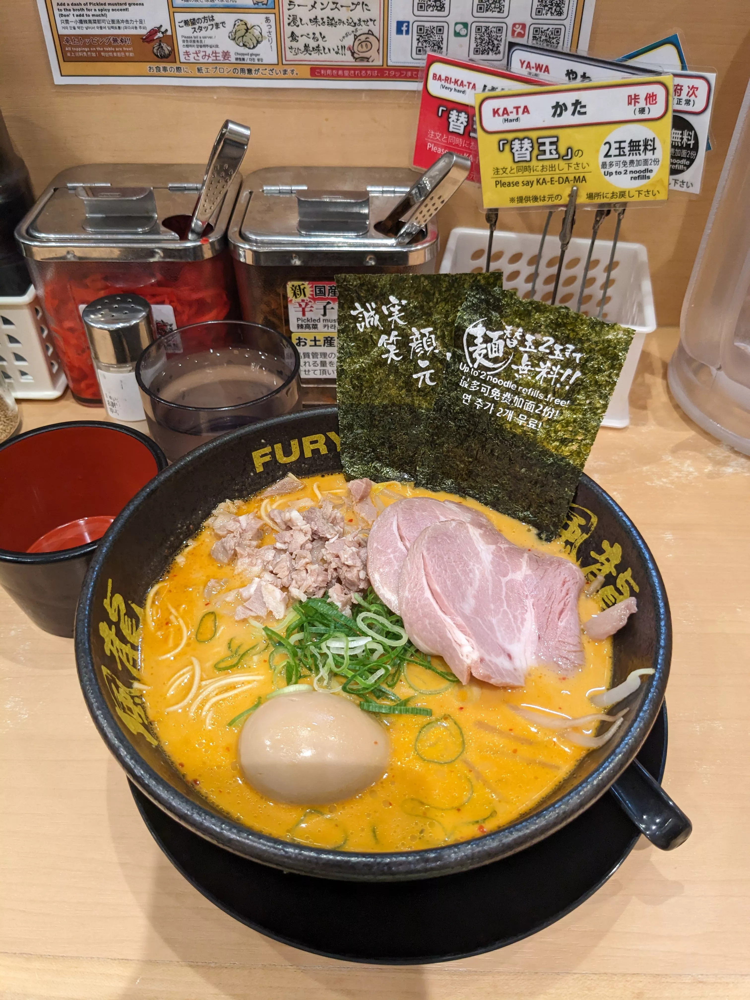
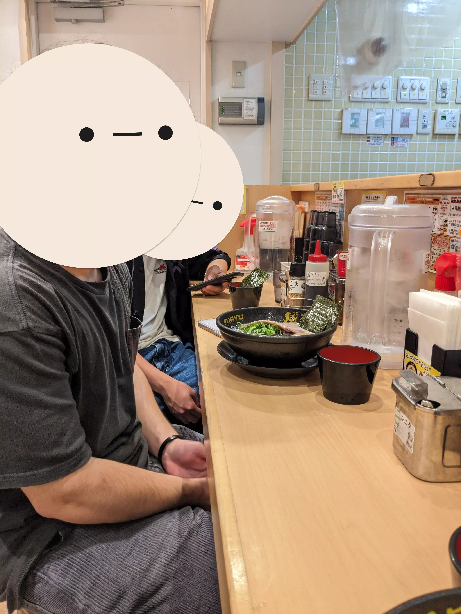

## Day 11: Akihabara

### Brunch: Phở

[フォーティントーキョー 新宿店 (PHO THIN TOKYO Shinjuku)](https://tabelog.com/en/tokyo/A1304/A130401/13257231/)

### Akihabara

### Lunch: Maid Cafe

[めいどりーみん 秋葉原 本店 (maidreamin Akihabara)](https://tabelog.com/en/tokyo/A1311/A131101/13050366/)

*>*]:my-0">

*>*]:my-0">

### Dinner: Hakata-style Ramen

[博多風龍 秋葉原総本店 (Hakata Fuu Ryuu Akihabara Sohonten)](https://tabelog.com/en/tokyo/A1311/A131101/13096267/)

*>*]:my-0">

