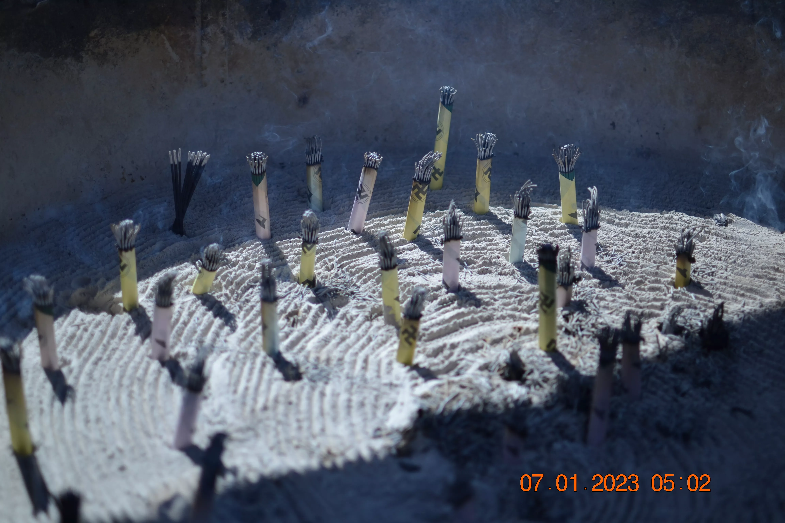
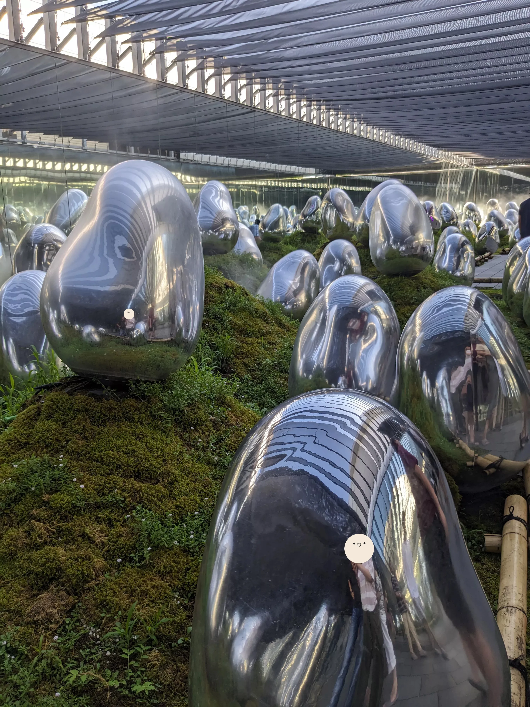

## Day 12: Asakusa, Odaiba

Today, the plan was to quickly get Sensō-ji Temple in Asakusa out of the way (if you recall Osaka Castle from Day 1, this destination gets similar treatment) and then head to Odaiba for an immersive experience at an experimental museum called [TeamLab Planets](https://www.teamlab.art/e/planets/).

### Sensō-ji Temple

Since Asakusa was pretty far away from our hotel (combined with the fact that we were used to the timezone by now and thus were waking up at 8:00am rather than 5:00am), when we got to the temple it was already extremely crowded, which quickly soured the immersion——this could also just be me getting spoiled from the astonishing experiences we had at temples in Kyoto during early mornings. It was also extremely sunny and humid; sun umbrellas were almost mandatory:

  

    
  

  

    
  

  

    
  

Despite this, we explored the temple a bit and got some surprisingly beautiful photos, with credit going to my dad's really old budget DSLR (you can tell when it's his photos if there's a timestamp on the bottom-right corner):

  

    
  

  

    
  

  

    
  

  

    
  

### Asakusa Area

For the surrounding Asakusa area I found it to be very quaint and calm, with the architecture being historic and reminiscent of 20th-century metropolitan Tokyo:

*>*]:mb-3">
  

    
  

  

    
  

    

    
  

  

    
  

  

    
  

### Tokyo Sightseeing Cruise, Rainbow Bridge

During the planning process, I discovered that right next to Sensō-ji Temple was a dock for a scenic ship that would take us to Odaiba via the Sumida River. I thought this would be a novel way to get to the other side of Tokyo, so we had booked tickets for the cruise yesterday night. This was the view of the river just a 5-minute walk from the temple:

This particular vessel was designed to look almost like a futuristic spacecraft, called the "Hotaluna":

  

    
  

  

    
  

  

    
  

Throughout the duration of the cruise, a guided tour was provided in English which described the purpose of the river and the surrounding environment. We were able to step out onto the deck and take insane photos of Tokyo from the river:

  

    
  

  

    
  

  

    
  

  

    
  

### Odaiba Marine Park Pier, Aqua City

Docking at its final destination in Odaiba, we were greeted by the view of the Tokyo Bay and the Rainbow Bridge:

Here, we're presented with an enormous mall called [Aqua City](https://www.tokyo-odaiba.net/en/genre/%E3%82%A2%E3%82%AF%E3%82%A2%E3%82%B7%E3%83%86%E3%82%A3%E3%81%8A%E5%8F%B0%E5%A0%B4/). The building frankly looks like a spaceship:

Here are some additional views from around the walking area outside the mall, which for some reason had a small replica of the Statue of Liberty:

  

    
  

  

    
  

  

    
  

  

    
  

### Lunch (Cold Soba)

We decided to have lunch not inside of this mall, but to the next door [DiverCity Tokyo Plaza](https://www.tokyo-odaiba.net/en/genre/%E3%83%80%E3%82%A4%E3%83%90%E3%83%BC%E3%82%B7%E3%83%86%E3%82%A3%E6%9D%B1%E4%BA%AC-%E3%83%97%E3%83%A9%E3%82%B6/) which was atrium-styled with around six floors. Although malls typically have food courts, this one had restaurants take up entire suites and their own seating arrangements on the upper floors. Our meal today was cold soba at [Shinshu Sojibo](https://tabelog.com/en/tokyo/A1313/A131306/13188484/), which served a huge spread of dishes which came in combo sets:

For some reason, the [Gundam](https://en.wikipedia.org/wiki/Gundam) franchise has a massive presence in this particular mall, with a massive "Gundam Base" selling Gunpla kits inside the store alongside a massive statue of the Unicorn Gundam outside:

At this point we left the mall via a [Yurikamome](https://en.wikipedia.org/wiki/Yurikamome) car, which is a completely automated guideway train system that runs on Odaiba and connects the artificial island to the mainland at [Shimbashi Station](https://en.wikipedia.org/wiki/Shimbashi_Station). We were dropped off just a few minutes away from Teamlab Planets, which we had booked reservations for at this particular time slot:

### TeamLab Planets

Unlike traditional museums where art is viewed from a distance, TeamLab Planets is designed to make you part of the artwork itself. Each exhibit takes up an entire room within the building and uses a combination of lights, projections, sounds, and water to create otherworldly environments that respond to your movement and interaction. Before entering, we had to remove our shoes and store all personal belongings in lockers, as many of the exhibits feature ankle-deep water on the floor.

#### "Waterfall of Light Particles at the Top of an Incline"

We started the experience with a completely pitch-black room with the exception of an inclined, dimly lit walkway with flowing water. This was a great start since we immediately got our feet wet and warmed us up to the experience we were about to embark on. I didn't take a photo of this particular exhibit because it would be impossible with a mobile phone camera, so here's an official photo instead:

<figure>
    
    <figcaption class="text-center [&>p]:text-muted-foreground">
        Courtesy of [TeamLab](https://www.teamlab.art/e/planets/)
    </figcaption>
</figure>

#### "Soft Black Hole"

After drying our feet off from the previous exhibit, we entered a soft room with a cloth floor that sucked you in when you stepped on it. I also didn't take a photo of this exhibit since I was having so much fun jumping around like it was a bouncy castle. Here's an official photo instead:

<figure>
    
    <figcaption class="text-center [&>p]:text-muted-foreground">
        Courtesy of [TeamLab](https://www.teamlab.art/e/planets/)
    </figcaption>
</figure>

#### "The Infinite Crystal Universe"

This exhibit was a mirror room filled with crystal-like LED strips that would change depending on the presence of individuals within the room. Since the room's floor, walls, and ceiling were all mirrors, this created an infinitely repeating effect that was mesmerizing to watch:

#### "Drawing on the Water Surface Created by the Dance of Koi and People"

This exhibit consisted of a giant projector that displayed rendered koi on the surface of the ankle-deep water we waded through. The water itself had some sort of powder in it to make it opaque so that things could be projected onto the water itself. Moving around the room would move the koi around, and colliding with the koi would cause it to explode in a sea of flowers.

#### "Expanding Three-dimensional Existence in Transforming Space"

This room was basically another mirror room, except it was filled with these soft RGB spheres that changed color when people moved or pushed them around. Some of the spheres were suspended/fixed in the air, while others we could pick up and throw around:

#### "Floating in the Falling Universe of Flowers"

This one was probably my favorite exhibit of the day. It was a spherical room with a dome-like ceiling (simliar to a planetarium) that projected a rendered computer artwork of infinitely falling, everchanging flowers. You could lay down in the center of the room and watch as the flowers would move around and shift. Similar to most other programming-based exhibits within the museum, the art is dynamic and unreplicable, so the photos below can never be exactly replicated again. I sat there for about 10 minutes just watching the flowers fall and shift:

This concluded the "Water" portion of the museum, and then we moved onto the "Garden" portion.

#### "Moss Garden of Resonating Microcosms"

This exhibit was a mossy room filled with these shiny blobs (called "ovoids" by the exhibit description) fenced off from us, and these blobs supposedly interact with the sun, wind, and rain (the exhibit's ceiling was exposed to the outside). Although the blobs didn't do anything while we were in the room, apparently they glow in the dark at night which we missed out on:

#### "Floating Flower Garden"

This was the final exhibit, and consisted of yet another mirror room——this time, it was filled with a layer of orchids hanging from the ceiling. The ceiling would move towards the floor and force you to duck down/crawl around, but would occasionally move back and allow for space to move around. This cycle would repeat as you make your way through the room from start to finish:

Overall, this was by far the most fun I've ever had at a museum, and was a perfect place to go with a family. If you can be entertained at a traditional museum where stuff sits in a glass case that you stare at while reading a context placard, then imagine how insane it was to touch and move the art itself and watch it respond to you with your feet covered in water.

### Dinner (Wafu Pasta)

While I was exploring Akihabara yesterday, my family discovered an wafu (Japanese-style) pasta restaurant on the seventh floor of the [Shinjuku MYLORD](https://www.shinjukustation.com/shinjuku-mylord/) shopping mall above Shinjuku Station. They enjoyed it so much during their first visit that they insisted on returning for dinner. Although I tried to convince them that it would be best to try out new restaurants, apparently it was *that* good.

The place they were raving about turned out to be [Yomenya Goemon](https://en.yomenya-goemon.com/), a very large chain of wafu pasta restaurants. While researching later, I found that the chain typically gets around 3.5 stars on Google Maps, which is considered fairly mediocre for Western reviewers (unlike Tabelog where 3.5 is excellent). I don't understand how this place could receive such mediocre feedback from the rest of the world when me and my family had an absolutely insane experience. Check out this carbonara with a whole egg yolk just sitting on top of the pasta:

I don't care what anyone says and don't care that this chain has dozens of locations. This meal was life-changing.