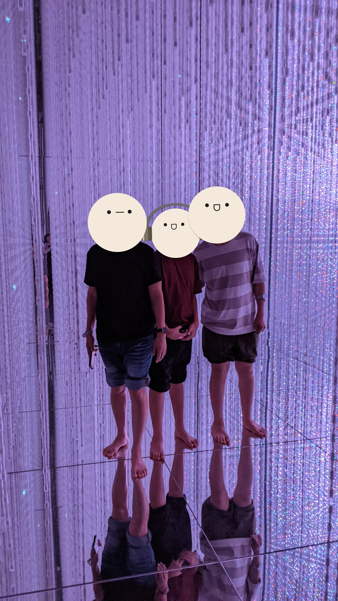

## Day 12: Asakusa, Odaiba

### Sensō-ji Temple

*>*]:my-0">

*>*]:my-0">

### Asakusa Area

*>*]:my-0">

*>*]:my-0">

### Tokyo Sightseeing Cruise, Rainbow Bridge

*>*]:my-0">

*>*]:my-0">

### Odaiba Marine Park Pier, Aqua City

*>*]:my-0">

*>*]:my-0">

### Lunch: Cold Soba

*>*]:my-0">

*>*]:my-0">

### TeamLab Planets

*>*]:my-0">

*>*]:my-0">

*>*]:my-0">

*>*]:my-0">

### Dinner: Wafu Pasta

