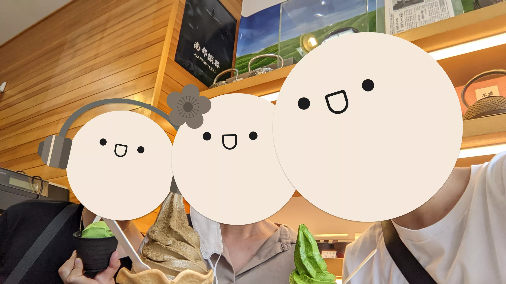

## Day 13: Kamakura Day Trip

My dad wasn't feeling too well this morning, so he decided to stay behind in the hotel to rest. We didn't really have any plans today (on the Wanderlog itinerary we were meant to go to Ginza today), so I decided to take the opportunity to visit this giant Buddha statue within the [Kōtoku-in Temple](https://en.wikipedia.org/wiki/K%C5%8Dtoku-in) alongside the rest of the Kamakura area. Recall that my family was intensely shrine-sick, but this one was just a small outing since we didn't have much planned today; I guess they didn't mind.

### Kōtoku-in Temple, Kamakura Daibutsu

Although there are buses that can take you to Kōtoku-in from Kamakura Station, we decided to walk there to see what this small coastal town was like——it was about a 30-minute walk from the station.

Along the way, we encountered these six Jizō statues. As someone who practices Vietnamese [Mahayana](https://en.wikipedia.org/wiki/Mahayana) Buddhism, I was familiar with this figure——I know him as "Địa Tạng Vương" in Vietnamese, or [Kṣitigarbha](https://en.wikipedia.org/wiki/K%E1%B9%A3itigarbha) in Sanskrit. Jizō is a [bodhisattva](https://en.wikipedia.org/wiki/Bodhisattva) (an enlightened being who has vowed to help all others attain [Buddhahood](https://en.wikipedia.org/wiki/Buddhahood)) particularly known for protecting the souls of the deceased, especially children, in the hell realms. In Japanese Buddhist tradition, you'll often see six Jizō statues arranged together, representing the six realms of existence in Buddhist cosmology that he vows to protect (these realms are part of [Saṃsāra](https://en.wikipedia.org/wiki/Sa%E1%B9%83s%C4%81ra_(Buddhism)#Realms_of_rebirth), the cycle of rebirth).

Here is a miscellaneous photo of us at the outskirts of the temple grounds:

The main attraction, the Great Buddha statue, actually depicts [Amitābha](https://en.wikipedia.org/wiki/Amit%C4%81bha) Buddha rather than the historical [Shakyamuni Buddha](https://en.wikipedia.org/wiki/The_Buddha) that you might be familiar with:

Amitābha Buddha holds special significance in [Pure Land Buddhism](https://en.wikipedia.org/wiki/Pure_Land_Buddhism), a major branch of Mahayana Buddhism. The tradition focuses on achieving rebirth in a [Pure Land](https://en.wikipedia.org/wiki/Pure_land)——a realm created and maintained by a Buddha that offers optimal conditions for attaining enlightenment. Amitābha's Pure Land, known as [Sukhavati](https://en.wikipedia.org/wiki/Sukhavati) (or as I learned it in Vietnamese, "Tây Phương Cực Lạc Thế Giới"——the "Western Pure Land of Ultimate Bliss"), is considered the most prominent of these realms and is central to Pure Land Buddhist practice.

### Yuigahama Beach

I honestly think I'm intensely spoiled by living in Southern California, because there is no way you could consider this an adequate beach. The sand was overly packed and coarse, yet still damp in an oddly uncomfortable way. I found it disappointing, but don't trust my judgement on this matter:

At the train station we also stopped by for some matcha ice cream since it was blistering hot:

At this point we were already tired, so we just decided to head back to Tokyo and rest in the hotel for the rest of the day. I actually don't even recall what we had for lunch this day since no photos were taken (or maybe we just didn't eat lunch at all).

### Emergency Dinner (Food Court Ramen)

For dinner today, we headed to the eighth floor of [LUMINE EST](https://www.lumine.ne.jp/est/), a shopping mall in Shinjuku Station. The photo doesn't do it justice, but this bowl of ramen was actually quite good. The restaurant, [Ippudo](https://tabelog.com/en/tokyo/A1304/A130401/13274333/), actually specializes in vegan ramen, but yeah no way I'm trying that:

Walking back to the hotel at night I was reminded of how beautiful this city was at night:

This would be our final night in Tokyo. My dad did what he did best and made friends with the Vietnamese guy who was actually the manager of the local 7-Eleven. This person was gracious enough to give us a bunch of extra cardboard boxes from the back of the store so that we could pack up the gifts, souvenirs, and clothes that we bought throughout the trip.
