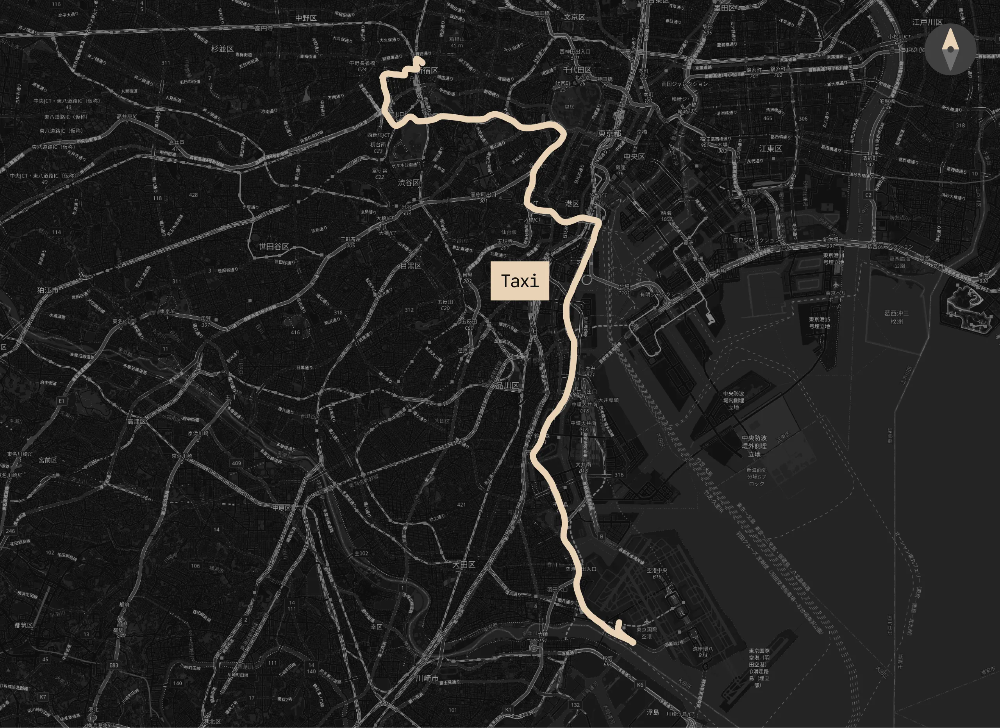
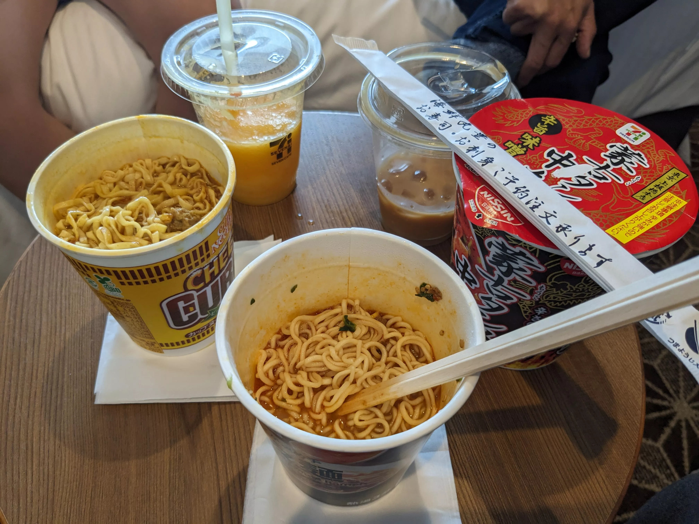
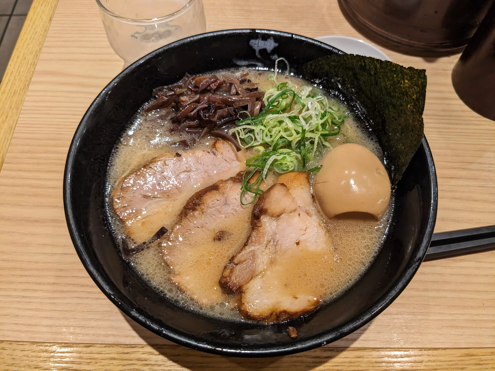
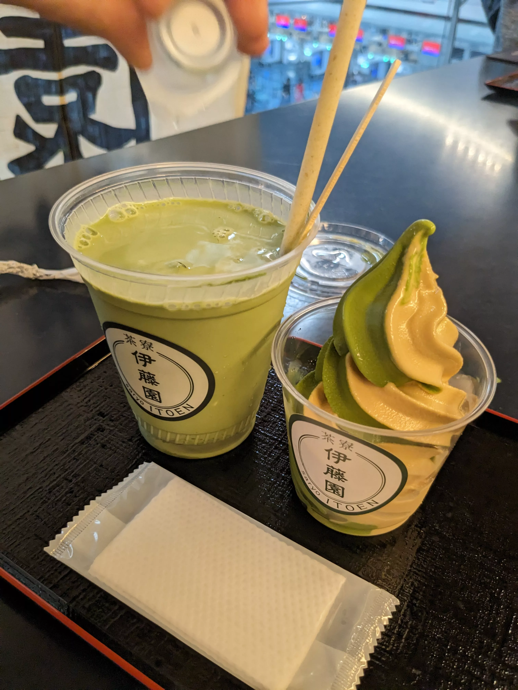

## Day 14: Haneda Airport

Unfortunately, I have very little photos from this day (I guess I was too caught up in the moment at the airport to take any relevant photos). I also was taking these photos just for keepsake and had no intention of writing a blog post like this at the time.

### Hotel Check-out

Before checking out of the hotel we decided to visit that Vietnamese manager at the 7-Eleven again. All four of us had breakfast on the nightstand in the room, which consisted of three varieties of instant noodles, orange juice, and freshly brewed coffee (which was all done at 7-Eleven):

The noodles were insane. I'm not sure why they don't export this stuff to the US.

### HND Terminal 3

We got to the airport several hours early since we wanted to explore the airport. Haneda Airport Terminal 3, the one exclusively for international flights, had an entire Edo-style shopping area inside of it for some reason:

<figure>
    
    <figcaption class="text-center text-muted-foreground">
        Courtesy of [Wikimedia Commons](https://commons.wikimedia.org/wiki/File:Shopping_area_terminal_3_haneda_airport_tokyo.jpg)
    </figcaption>
</figure>

### Lunch: Ramen (again!)

If you haven't picked up on the trend yet, we were eating ramen a lot. This was about the fifth bowl of proper ramen we had throughout the trip (obviously the instant ramen we had the morning of didn't count). This one was from a place called [Ramen Setagaya](https://tabelog.com/en/tokyo/A1315/A131504/13117591/) that we found in the terminal. The bowl was very proper and very affordable at about ¥950 from the vending machine (USD$6):

As a bonus, we found a cute cafe in the terminal that was actually owned by [Ito En](https://en.wikipedia.org/wiki/Ito_En) (the tea company) called [Saryo Itoen](https://tabelog.com/en/tokyo/A1315/A131504/13174290/). We had both a drink and a soft-serve ice cream:

This was the final photo I took of the trip. If you've made it this far, thank you for reading! I'm glad I got to share this with you all.