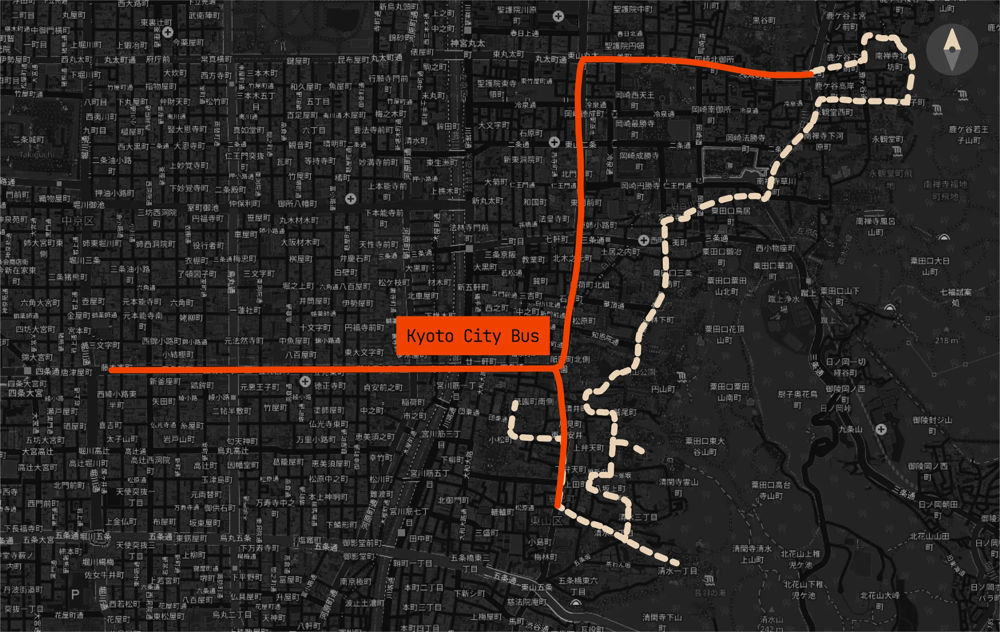
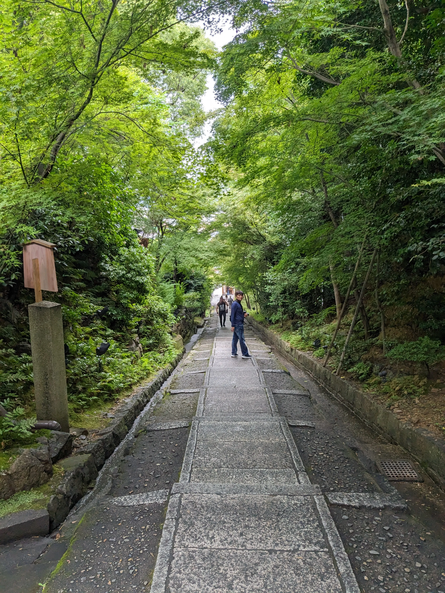

## Day 3: East Kyoto

Nice and early morning today! Our itinerary today involved [Kiyomizu-dera](https://www.kiyomizudera.or.jp/en/) and its surrounding areas.

### Kiyomizu-dera Grounds

We were out of the house at 7:00am and took a 30-minute bus to the temple, and by the time we arrived at 7:30am it was completely empty. To get to the temple you had to walk through [Sannenzaka](https://en.wikipedia.org/wiki/Sannenzaka), a stone-paved street lined with traditional buildings and shops. Walking up to the temple, we were greeted by this three-tiered pagoda and a board of wooden plaques with wishes written on them:

Kiyomizu-dera at this time was very calm. We paid the small entry fee to get onto the temple grounds, and we were able to freely walk through the main stage (with a beautiful vantage point of the city) and its surrounding areas. We were also able to walk along the hill that the temple was situated on to take the quintessential "Kyoto" photo:

The forest beyond the temple was also beautiful:

Another thing I noticed around the temple was that there were occasionally these "mini-shrines" with Jizo statues on them, which I found very wholesome due to their symbolism (meant to protect travelers and children):

#### Otowa Waterfall

From here, we walked down the staircase on the east rear side of the temple and stumbled upon [Otowa Waterfall](https://en.japantravel.com/kyoto/otowa-waterfall/14020), one of the attractions of the temple. The waterfall is split into three streams which visitors are allowed to drink from (via long-handled cups sanitized under UV light). From the perspective of the below image, each stream is said to grant a different wish: school achievement, love, and longetivity (of course, drinking from all of them is considered greedy, and I won't say which one I drank from!). At this time, although there were queue guides and signs all set up (preparing for the onslaught of 10am tourists), there was absolutely noone around!:

The very empty staircase also provided nice photos:

By now, it was 9:00am and the temple was starting to get a little crowded from all of the school field trips and early bird tourists:

### Lunch (Kombini)

We decided to dip and grab something to eat. Here is where I made the terrible mistake of trusting Google Maps with restaurant recommendations. It pointed towards a very high-rated establishment in the [Gion District](https://www.japan-guide.com/e/e3902.html), a full 20-minute walk away. I convinced my family that it was worth it... and we did the entire walk just for the restaurant to be reservation-only! By 9:30 we gave up and headed back to the temple area to eat at a Fresco (combini) that we spotted earlier:

    

### Sannenzaka

By 10am, the Sannenzaka area was bustling, and all of the shops and restaurants were open! We hung around the area for a really long time, exploring the insanely cute shops and buying souvenirs:

#### Maccha House

One very special shop near the end of the street called to our very souls via a posterboard at the front lined with matcha ice cream and sweets and a beautiful exterior: [MACCHA HOUSE](https://tabelog.com/en/kyoto/A2601/A260301/26030960/). Since it opened at 11am we decided to _create_ the line and watched as it grew enormous behind us. We attempted to get the best out of our experience via ordering a good variety of the menu: a hojicha latte, and a matcha latte, parfait and tiramisu:

### Kōdai-ji Temple

Our next stop after this was [Kōdai-ji Temple](https://www.kodaiji.com/e_index.html), a nearby temple complex which offered a beautiful garden and a bamboo grove which mimicked the one in Arashiyama (arguably the largest tourist attraction in Kyoto, and obviously on our later itinerary). At this point my entire family was shrinesick (and complained about the entrance fees), so although we didn't stay for long I still managed to get some nice photos:

### Philosopher's Path

Our last stop for the day was the [Philosopher's Path](https://www.japan-guide.com/e/e3906.html), a stone path that runs along a canal lined with hundreds of cherry trees. I told my family to push through, even though all of our feet were aching intensely. The scenery was nice (although it's apparently significantly better during cherry blossom season), although we exited the path after the halfway point due to heat and exhaustion:

From here, we returned to our apartment and took a fat nap before heading out for dinner.

### Dinner (Yakiniku)

While we were walking home from the bus stop after East Kyoto, we stumbled upon a [yakiniku](https://en.wikipedia.org/wiki/Yakiniku) restaurant called [Honkaku Yakiniku Chifaja](https://tabelog.com/en/kyoto/A2601/A260201/26021071/) which was just a couple blocks away from our apartment (the posters up front and all-you-can-eat prices were very enticing). We decided to give it a try!

We were told at the front to remove our shoes, storing them in tiny lockers which didn't even have locks on them (high-trust society, I guess). We were then led to a private room with a sunken table and a grill in the middle! For this establishment, the waiter told us that we'd need to order through the LINE app (the Messenger/WhatsApp of Japan; thankfully I had it installed already) and that we could order in waves/rounds. I really enjoyed the variety of sides that they offered (they surprisingly had a lot of Korean banchan, possibly to appeal to tourists);

Afterwards we did a pit stop at the local [Life Supermarket](http://www.lifecorp.jp/) to stock up our fridge for the next days:

