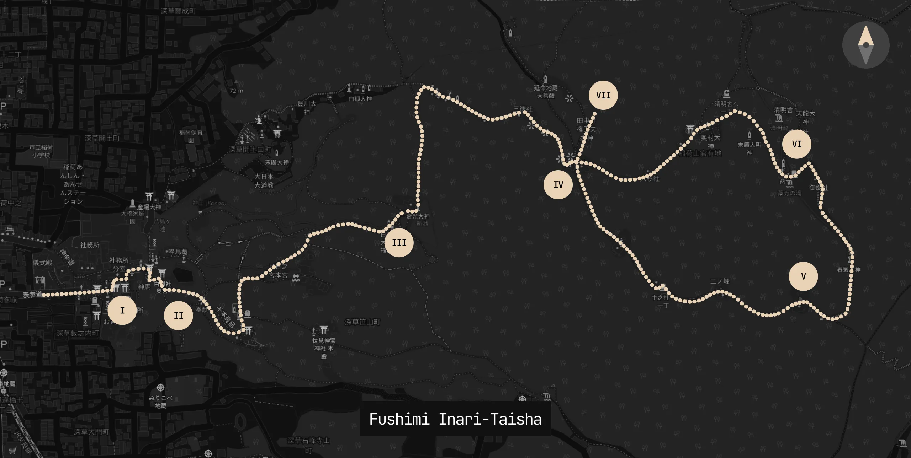
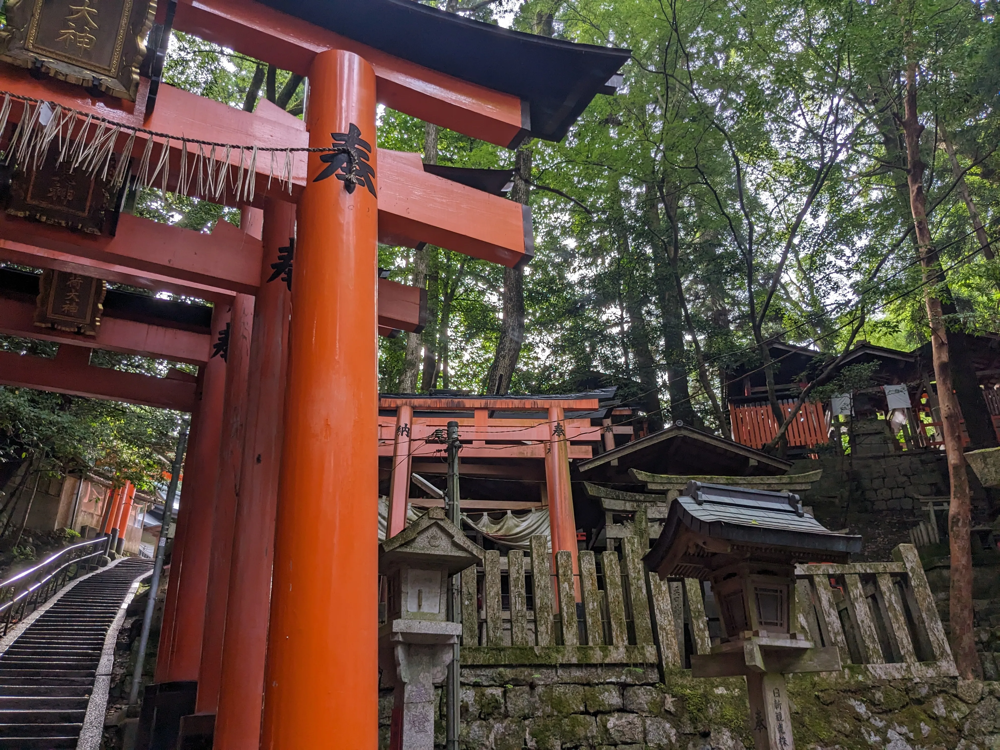

## Day 5: Fushimi-Inari Taisha

Today was our trip to Fushimi-Inari Taisha! This is, by far, the most touristy destination in the entirety of Kyoto, which is why we decided to scram early in the morning to avoid the crowds.

Although during the trip we had no prior map or visualization of the actual path we were taking, I've since been able to retrace our steps via geotagged images and provide a more detailed map of the path we took, labeled with points of interest:

- (I): [Romon Building](#romon-building)
- (II): [Senbon Torii (Start)](#senbon-torii-start)
- (III): [Kumataka Shrine & Shin-Ike Pond](#kumataka-shrine--shin-ike-pond)
- (IV): [Yotsutsuji Intersection](#yotsutsuji-intersection)
- (V): [Ichinomine Shrine (Summit)](#ichinomine-shrine-summit)
- (VI): [Descent and Breakfast (Tea and Eggs)](#descent-and-breakfast-tea-and-eggs)
- (VII): [Kojigamine Observation Deck](#kojigamine-observation-deck)

### Romon Building

We woke up at around 5:30am today, and Google Maps made us go down to Kyoto Station, which was a doozy when trying to find the Nara Line down to Fushimi-Inari Station, but we eventually made our way there. We got to the first torii gate and [Romon Building](https://inari.jp/en/map/spot_02/) by 6:30am:

Fushimi-Inari is one of the more complex shrines in Japan; it has a network of trails up to the summit of the mountain with thousands of vermillion torii gates lining the paths. Although the lower parts of the shrine were nice, we only briefly walked through them to get to the main [Senbon Torii](https://inari.jp/en/map/spot_07/) path:

### Senbon Torii (Start)

We began walking through the torii gates at around 6:45am. The sheer emptiness of the path at the time was a stark contrast to what I'd seen on social media pre-trip, and I was very grateful for the opportunity to experience the shrine in this way (also cool photos). The torii themselves created this sort of tunnel effect, despite sunlight being cast through the gaps in the gates:

Thus begins the hike to the nearest checkpoint, the Yotsutsuji Intersection. I have no other comments for this stretch of the walk except sincere appreciation for the ambience and respect for the history behind this shrine: 

Nearing the checkpoint we entered a very wooded area, which made for wonderful photos:

This is the approach to [Kumataka Shrine](https://inari.jp/en/map/spot_09/), a small shrine on the main path:

### Kumataka Shrine & Shin-Ike Pond

The entire shrine consisted of these little corridors lined with small fox statues, stone carvings, and torii gates dispersed in seemingly random but meaningful arrangements:

Adjacent to the shrine is a small pond called the Shin-Ike (or [Kodamagaike](https://inari.jp/en/map/spot_09/)) pond which reflected its neighboring greenery:

### Yotsutsuji Intersection

This area of the shrine is the place where most people stop and turn back. It provides an absolutely stunning view of Kyoto from the mountainside and has amenities like vending machines and restrooms:

From here, we decided to continue on to the summit of the mountain, an approximately 1-hour upward trek from the intersection. On this path there are three shrines that worship three different deities: [Sannonmine](https://inari.jp/en/map/spot_13/), [Ainomine](https://inari.jp/en/map/spot_12/), and [Ichinomine Shrine](https://inari.jp/en/map/spot_10/), the last of which indicates the summit of the mountain:

### Ichinomine Shrine (Summit)

One little funny thing we noticed about the hike in general was that the further you went up the mountain, the more expensive the vending machines got. We were parched and ended up splurging on 450-yen electrolyte drinks near the summit. At the summit itself was the aforementioned Ichinomine Shrine, which we paid respects to very briefly before the descent. Note that we were the only ones at the summit of the mountain at the time, which was a particularly surreal experience given the sheer number of people that would be at the base of the shrine at this time (about 8:00am).

### Descent and Breakfast (Tea and Eggs)

Since this part of the hike is a complete loop back to the checkpoint, instead of coming back down the way we came, we decided to complete the loop and see the other side of the mountain:

Although the descent was physically easier, we stumbled across a cute lady selling boiled eggs and tea at a small shack (the place is actually on Tabelog; it's called [Yakurikitei](https://tabelog.com/en/kyoto/A2601/A260601/26024780/)) and decided to rest and eat our breakfast there:

Unrelated cute photo:

### Kojigamine Observation Deck

There is a small path which connects to the Yotsusuji Intersection that leads to a beautiful observation deck, which is a more dedicated area for viewing Kyoto from the mountainside. When we made it back to the intersection, we decided to take a quick detour to see the view before heading back down forever:

This is what the bottom of the shrine looked like when we got back down at around 9am. Yep, we lucked out:

We took the Keihan Main Line back to Gion-Shijō Station and took a bus back to our hotel. We ended up eating lunch at home——my dad had some ingredients from the local supermarket and ended up making udon!

## Bonus: Shijō Street

Although I intended to call it a day (a 3-hour hike at 6am is no joke), we somehow managed to re-energize and decided to go out at around 2pm to Shijō Street's shopping district, which we saw on the bus from Gion-Shijō. We also had a quick matcha/hojicha soft serve from [nana's green tea](https://tabelog.com/en/kyoto/A2601/A260201/26032210/) on the corner of Shijō and Karasuma Street before heading out for dinner (forgot to take pictures, but I'm recommending this place!).

### Dinner (Ramen)

Tonight was a ramen night, and I decided to play it safe by going to a place with a high quantity of views on Google Maps (indicating that it's popular with tourists, and is more likely to accomodate English speakers). We ended up at [Ramen Sen-no-Kaze Kyoto](https://tabelog.com/en/kyoto/A2601/A260202/26016307/), and the queue was so giant that I had to stay in line to wait for our names to be called while my family went around enjoying themselves. The following pictures are their Pirikara Miso and Shio ramen, respectively; the former was both intensely spicy and umami, while the latter was more fragrant and traditional (a nuance that isn't often present in U.S. ramen establishments). Both were delicious!:

### Nishiki Market

After dinner, we decided to walk around the Nishiki Market, a retail market selling a plethora of street food and fresh seafood. Its atmosphere was really lively and bustling, and we ended up snacking on wagyu skewers, cute pastries, and yuzu soft serve ice cream:

This was a really lovely end to both the day and our time in Kyoto. Tomorrow, we head to Hakone!