

## Day 6: Hakone-Yumoto

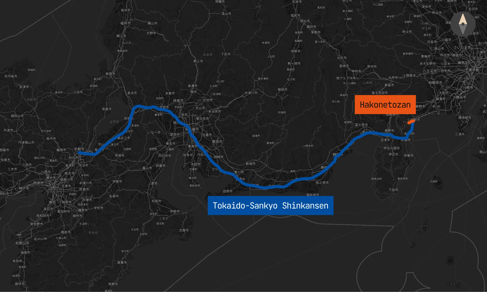

Today was check-out day for the Kyoto apartment! After a quick breakfast at the same spot from Day 2 (Shijō Nishinotōin Shokudō) at around 6:30am, we packed up and left for Kyoto Station. The goal today was to check into our [ryokan](https://en.wikipedia.org/wiki/Ryokan) at Hakone, which was a really long journey from Kyoto. We'd need to purchase Shinkansen tickets to [Odawara Station](https://www.hakonenavi.jp/international/en/station/odawara), and then take a local train to [Hakone-Yumoto Station](https://www.hakonenavi.jp/international/en/station/yumoto).

### Shinkansen to Odawara

To purchase Shinkansen tickets, we found the JR ticket office at Kyoto Station so that we could ask questions and communicate in English (note that although you can technically purchase Shinkansen tickets from the ticket machines, we found the process overwhelming and decided it would be easier to ask questions in person). We purchased reserved seats on the Hikari (running on the Tokaido-Sanyo Shinkansen line) to Odawara Station——the journey was about 2 hours long. After resting at a Starbucks for a bit, we made our way through the station to the Shinkansen platforms:

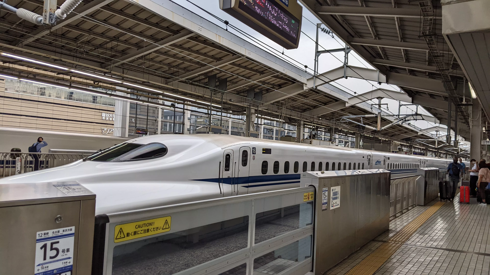

The Shinkansen was given the pseudo-plane ride experience, with food carts and overhead cabinet space for luggage. I was interested in the engineering behind the train and the technology that allowed for the world to pass by my window at such high speeds:

    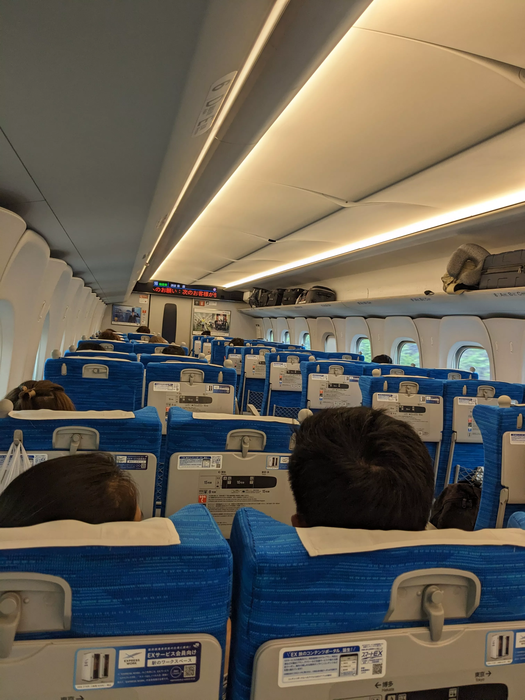

Since we were travelling across what was essentially the countryside, the view was mostly of small towns and fields:

    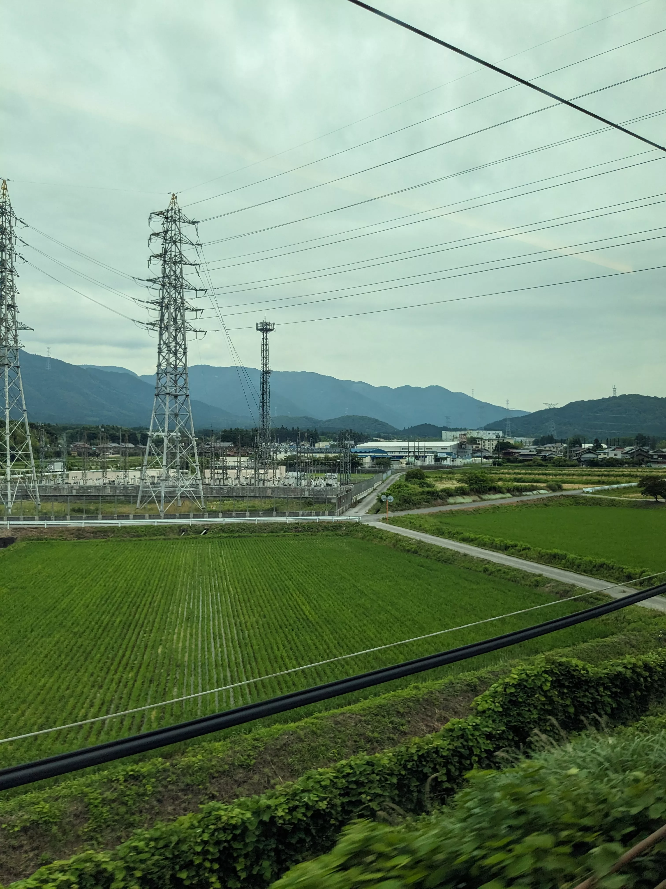

    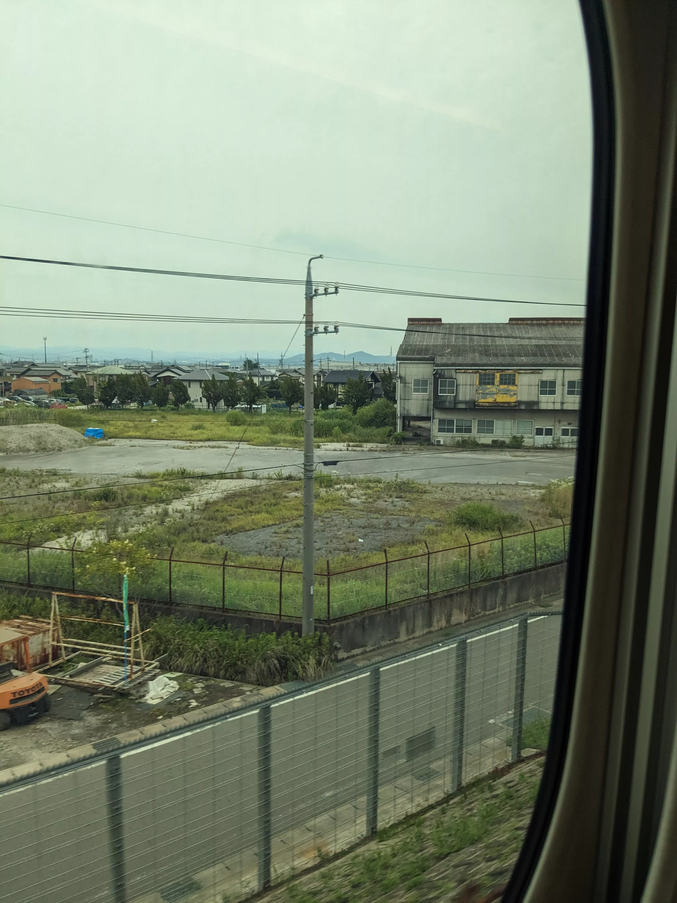

### The Hakone Freepass and Romancecar

After the Shinkansen, we arrived at Odawara Station and promptly transferred to the local train to Hakone-Yumoto Station.

At Hakone-Yumoto Station, we attempted to purchase reservations for the [Romancecar](https://www.odakyu.jp/english/romancecar/) train (a limited express, reserved seating-only train) to Shinjuku Station for our return trip to Tokyo in two days. This option was a compromise between the Shinkansen and the local train in terms of speed and price (the Romancecar is faster/more expensive than the local train, but slower/cheaper than the Shinkansen). Unfortunately, we were unable to communicate with the ticket office's front-house staff in English——however, when my family conversed in Vietnamese amongst ourselves to strategize, another staff member overheard and was able to assist us in Vietnamese!

The attendant explained to us a particular system which would make travel within Hakone exponentially easier and more economical: the [Hakone Freepass](https://www.odakyu.jp/english/passes/hakone/). This pass allowed for unlimited travel on all modes of transportation within Hakone's "free area" (including the base fare for the Romancecar, but *not* the reserved seating fee) for 2 or 3 days. The free area included all of the popular [Hakone Round Course](https://www.japan-guide.com/e/e5210.html), a route which allows tourists to visit most of Hakone's attractions while taking all possible modes of transportation (train, bus, cablecar, ropeway, and even a pirate ship):

<figure>
    
    <figcaption class="text-center [&>p]:text-muted-foreground">
        A map of Hakone's "Round Course," courtesy of [Japan Guide](https://www.japan-guide.com/e/e5210.html)
    </figcaption>
</figure>

Overall, the Freepass was a no-brainer for us, as it would allow us to travel to all of Hakone's attractions without worrying about individual ticket prices (and save money in the process). We purchased the 2-day pass, alongside reservations for the Romancecar, and then walked to our ryokan. Since we strategically booked our ryokan near the station, the walk from train platform to check-in desk was only about 5 minutes.

### Hotel Check-in

We came way too early for check-in (~1:00pm vs 2:30pm check-in) and were able to leave our luggage at the ryokan to explore the area:

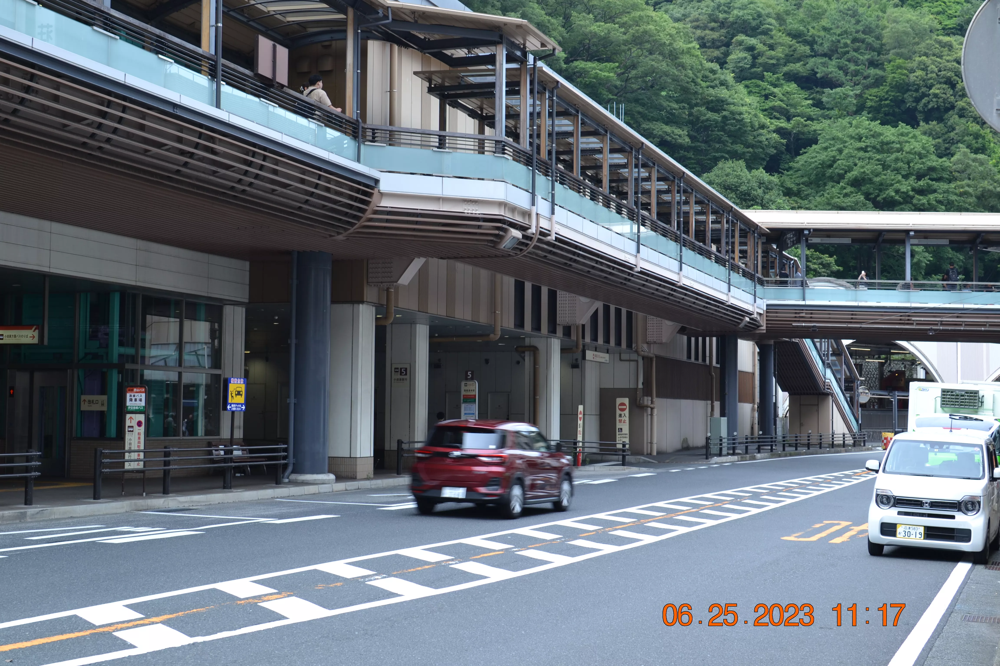

We booked the "traditional-style room" which, although didn't have a private onsen (there was a shared onsen on the same floor), allowed us to sleep in futon beds on tatami mats:

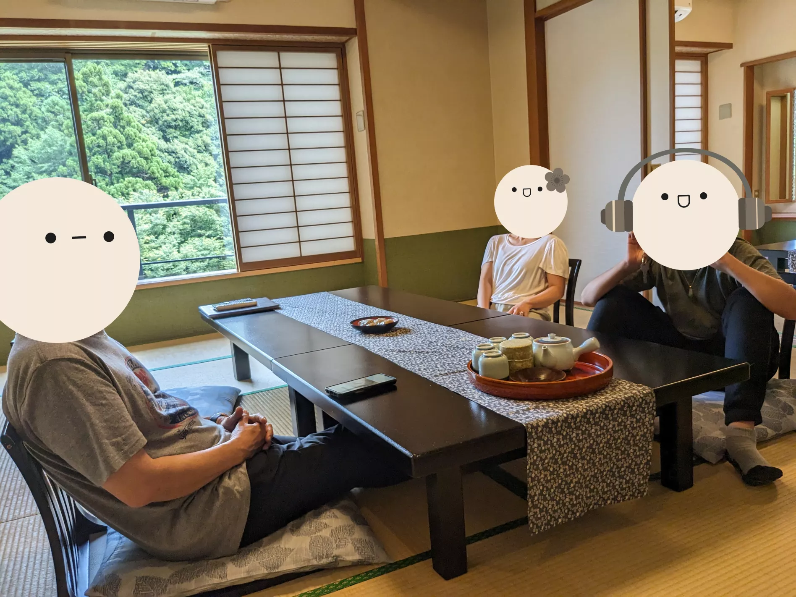

The room was well-antiquated and had a nice view of the nearby river and outdoor shopping district:

    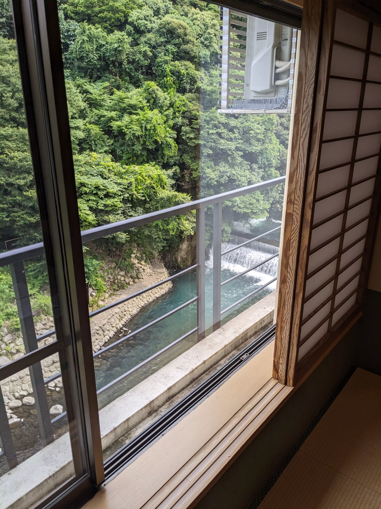

    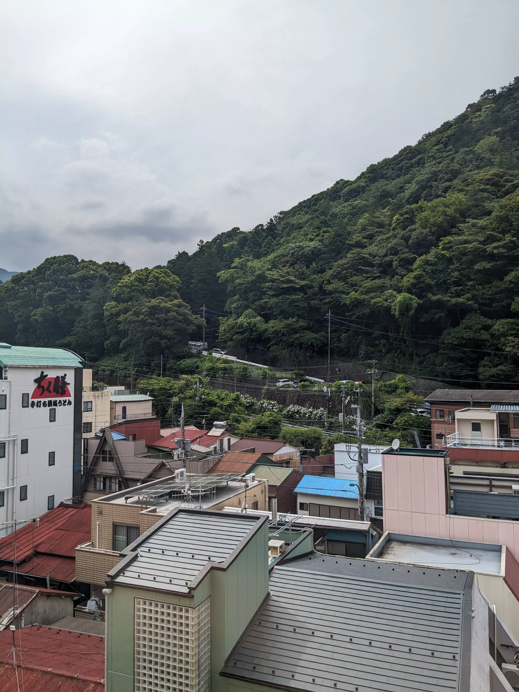

### Hakone-Yumoto Area

From here, we decided to head out again to kill time before the 5pm dinner service within our room! We walked around the little business district near the station and found a really cute ice cream shop and miscellaneous souvenir stores:

    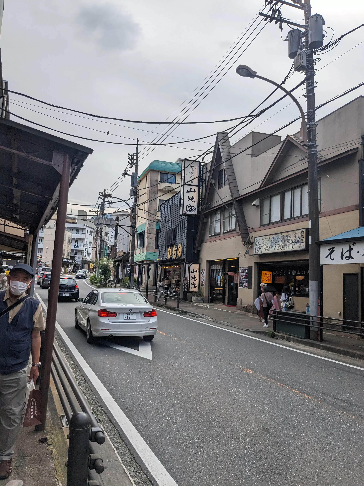

    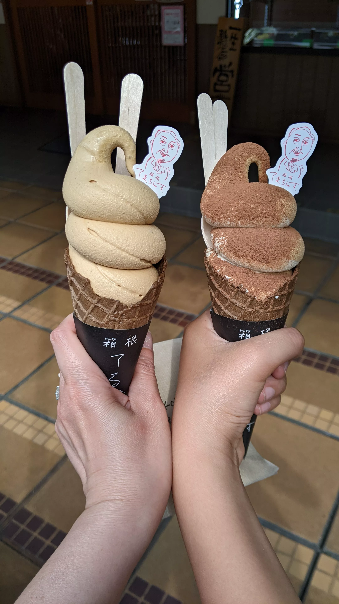

When we got back, we were presented with [yukata](https://en.wikipedia.org/wiki/Yukata) by a kind [nakai](https://en.wikipedia.org/wiki/Nakai_(vocation))/inn attendant who performed hospitality duties (they would be serving us dinner/breakfast and taking care of our futons):

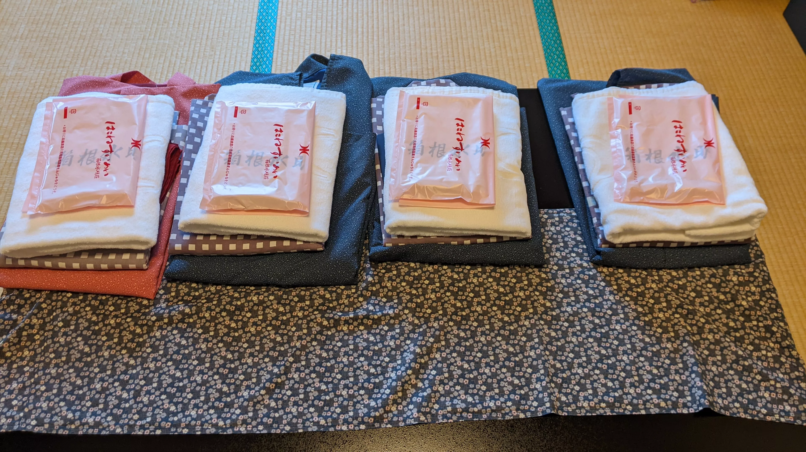

Although the attendant could not communicate with us in English, and spoke to us in Japanese without regard of our comprehension, I could luckily understand a smidgen of what she was saying (e.g. explaining dinner/breakfast times, requesting yukata sizes, etc.) and was able to——albeit at the level of a toddler——respond with appropriate information and desperate gesturing.

### Dinner (Kaiseki)

This might have been the most memorable experience of the entire trip.

We were sat down in a sunken table, fitted in the attire provided above, and were served a multi-course (~12-ish) [kaiseki](https://en.wikipedia.org/wiki/Kaiseki) dinner. We found the presentation of each to be wonderfully endearing and deliberate, and inferred that it meant to balance color, texture, taste across the dish itself alongside the entire meal. Upon researching the dishes and tradition after the fact (I was ignorant about the particulars of this form of cuisine before the trip) I found that this order is actually hyper-specific and traditional (see [Wikipedia](https://en.wikipedia.org/wiki/Kaiseki#Order)):

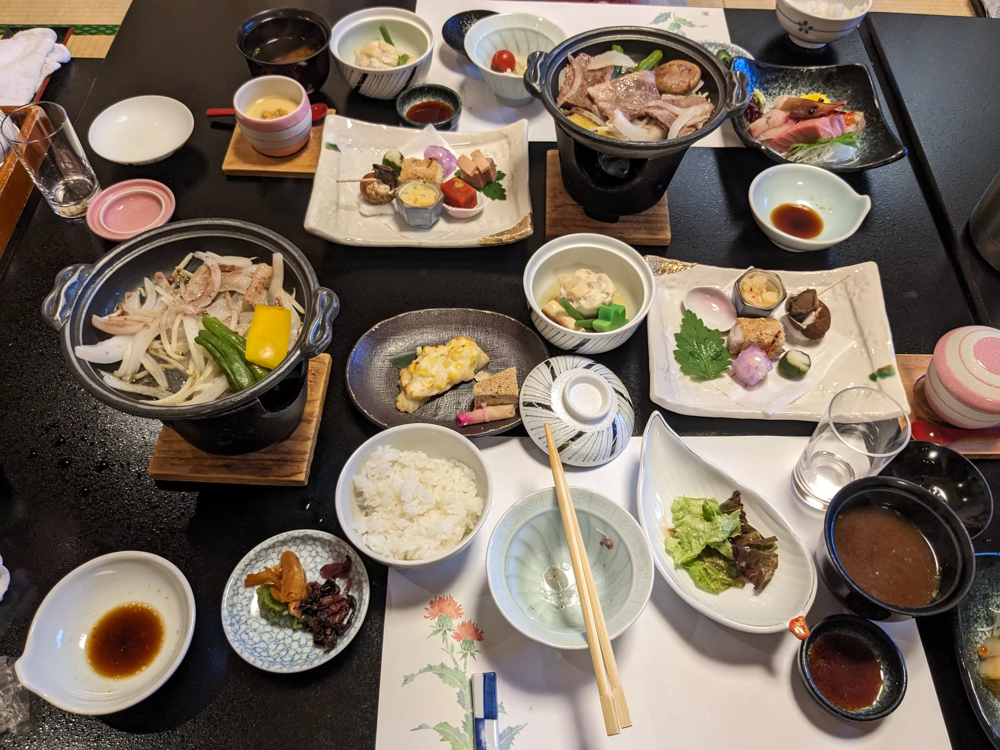

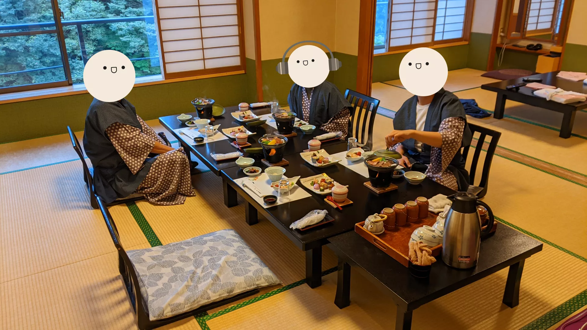

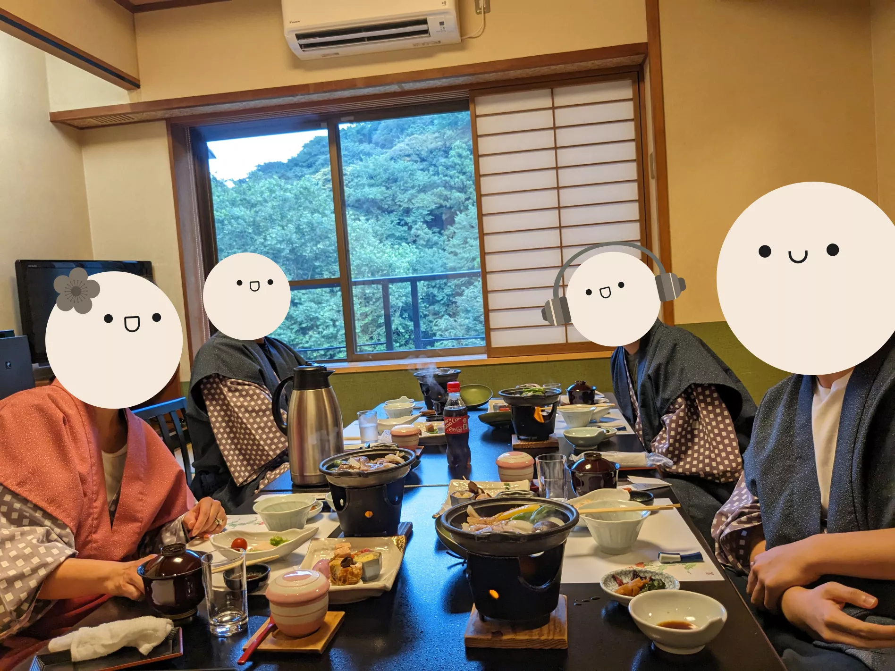

After the dinner, we were served some sliced fruit for dessert, and then the attendant came to clean up our table and set up our futons for the night (which was actually a pretty involved process with multiple layers). Although my brother and dad wanted to sleep, my mom and I wanted to walk off the dinner and decided to go out and explore for a bit. It was about 7:45pm at this point——all the shops were closed, and the streets were empty:

    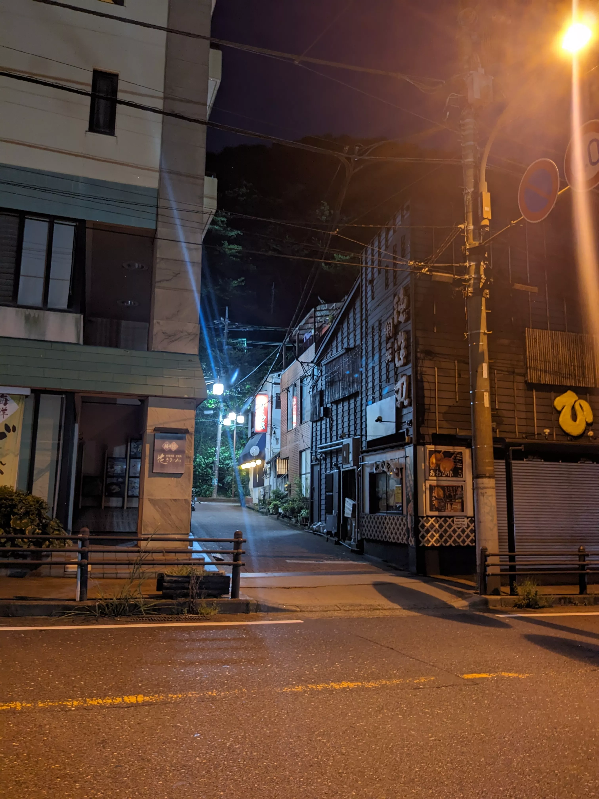

    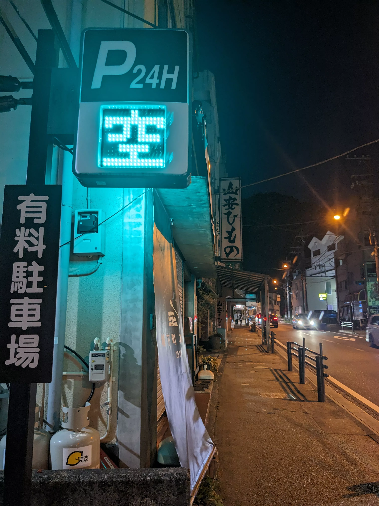

Next to our ryokan was a small footbridge which passed over the Haya river and into a small park:

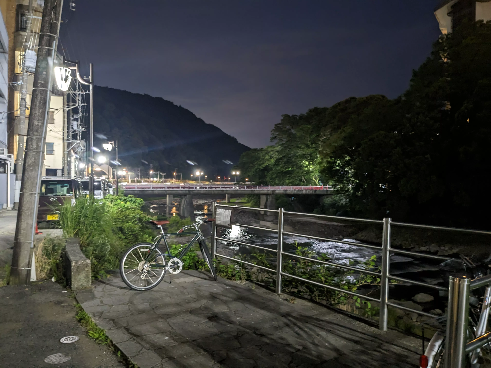

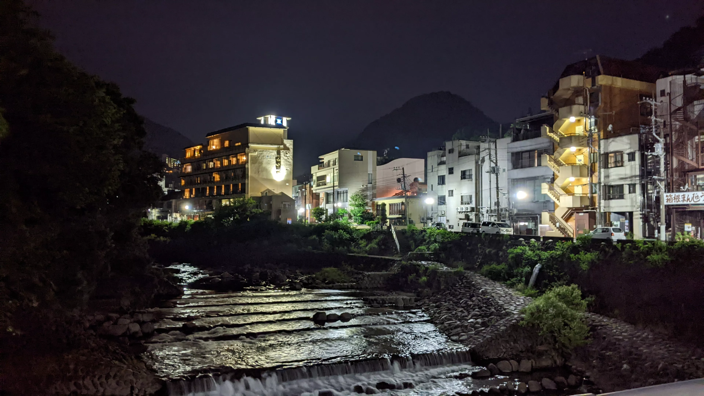

At around 8:30pm we headed back to the ryokan to sleep. It was my first time sleeping on a futon, and I found it to be quite comfortable (and space-saving, which I'm assuming was the original intent) but not at all a long-term replacement for a mattress.