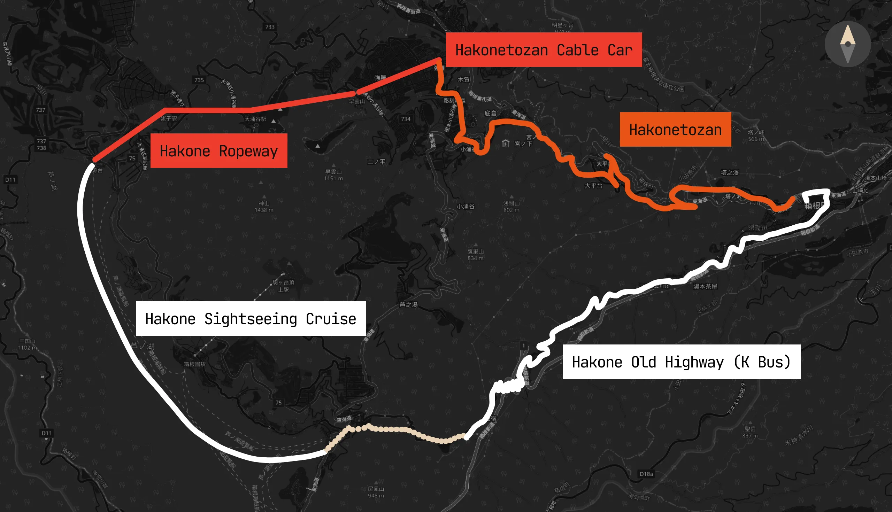
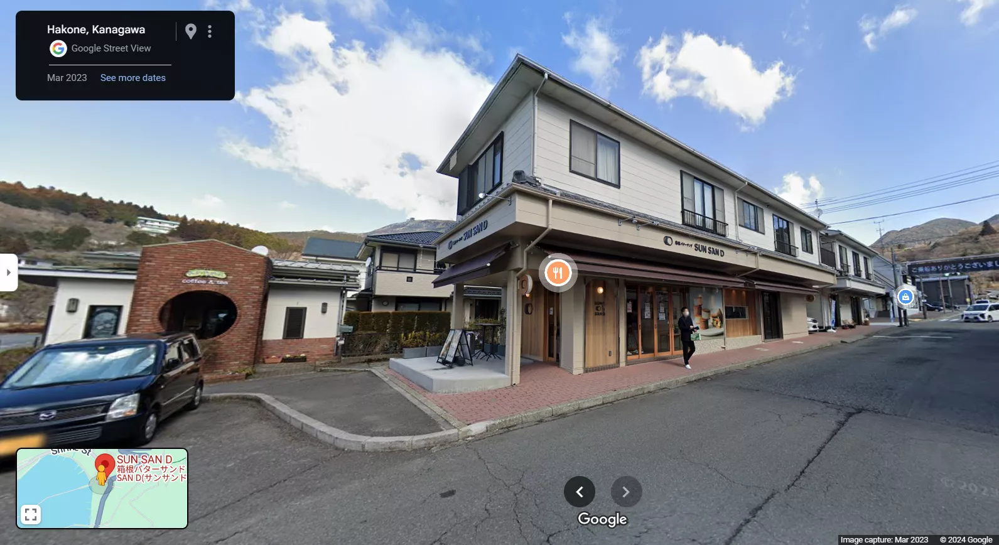
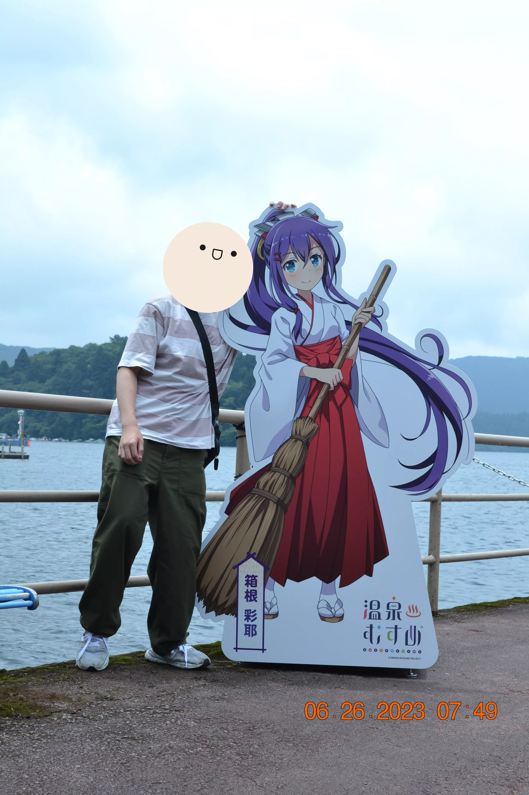
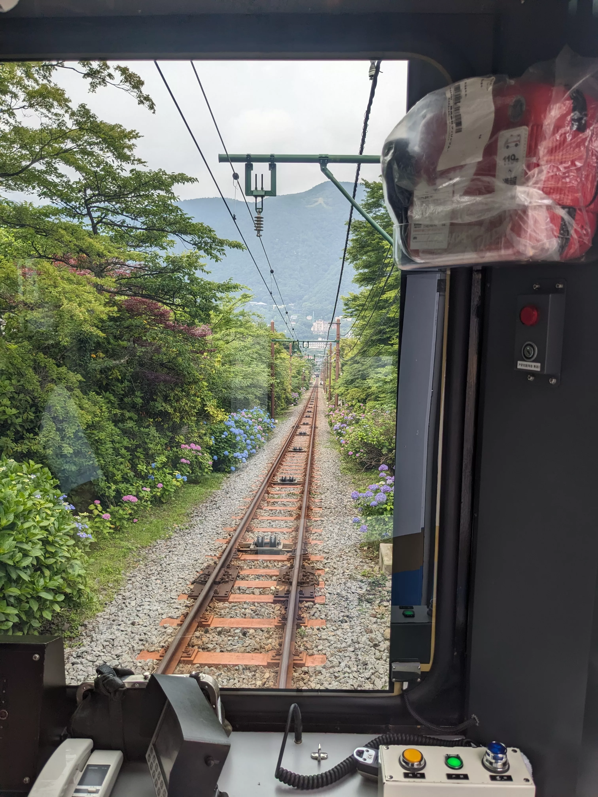

## Day 7: Hakone Round Course

Recall from yesterday that when we decided to purchase the [Hakone Freepass](https://www.odakyu.jp/english/passes/hakone/), that we were also entitled to free access to the entirety of the [Hakone Round Course](https://www.japan-guide.com/e/e5210.html), which allowed us to visit many of the attractions in Hakone (via multiple modes of transit) under one inclusive price:

<figure>
    
    <figcaption class="text-center [&>p]:text-muted-foreground">
        A map of Hakone's "Round Course," courtesy of [Japan Guide](https://www.japan-guide.com/e/e5210.html)
    </figcaption>
</figure>

Today, we decided to embark on this route! Although you can choose to traverse either counterclockwise or clockwise along this circular path (with the former being more popular), we decided to go clockwise since [Amazake Chaya](https://tabelog.com/kanagawa/A1410/A141001/14001260/) (a very traditional teahouse) was the first stop along the way.

Our morning started off at around 6:00am, and me and Dad decided to hop in the onsen for a quick dip, since apparently that's what you're supposed to do before meals. The onsen was very empty at the time (there is one onsen per floor of the ryokan) and we had the entire place to ourselves! We found it very similar to the korean saunas that we have around our local area back home, except the water was completely still and had this inexplicable texture that made it feel "softer" than normal water. Lots of amenities were provided as well, such as towels, slippers, Q-tips, toothbrushes, hair dryers, etc.

### Breakfast (In-House)

We got back to the room at around 7:30am since we knew there would be an in-house breakfast courtesy of the ryokan——the meal included grilled horse mackerel with rice, a platter of various pickled goods alongside a small bowl of miso soup:

    

After breakfast, we packed our bags for the day and headed out at around 8:45am to a small tourst information booth near the station to enquire about how we were supposed to get to the teahouse, and the attendant said that the first bus would show up in about an hour (9:45am). As such, to kill time we walked back and explored the area around our ryokan:

The bus arrived on time, and the ~30 min. ride took us deep into a forest in what seemed like the middle of nowhere.

### Amazake Chaya

The teahouse itself had a thatched roof and served as a rest zone along the ancient Tokaido Road, considered one of the oldest highways in the entire country. This place had a long, 400-year history (apparently managed by the 13th generation of the same family that established it!) and specialized in two things: amazake (a fermented rice drink) and mochi:

The interior of the teahouse was antique and the air was smoky; it seemed like they were burning a type of incense on top of a controlled fire pit:

Everyone in the family ordered their own drink (shiso juice, matcha, and amazake) and we shared a small mochi platter together, which was surprisingly served with pickled vegetables as if they were a savory dish:

The amazake was both subtly sweet and lukewarm while offering an inexplicably comforting texture, while the mochi was glutinous and coated in a dry sesame powder, which the pickled vegetables surprisingly complemented. We also passed around the shiso juice (which was pink for some reason) and the matcha, which both served as palate cleansers.

### Old Tokaido Highway

After the meal, we decided to go out on a hike along the old Tokaido highway. This was a terrible mistake. I did get a warning before taking a family of four into the deep woods——a pamphlet from the tourist information booth rated the hike as an "Insane" difficulty with five blazing red stars next to it——but I thought that it wouldn't be too bad. Although the hike itself wasn't too arduous or steep, the issue was that the path itself was poorly paved and made of loose stones. Even worse, light rainfall from the night before made the path slippery and dangerous, and we had to step on the side of the path to avoid falling:

### Motohakone Port, Hakone Shrine

We made it out of the forest and back to civilization after about an hour of everyone else complaining about the hike. Thankfully, said civilization was very beautiful and just a short walk from the ocean:

Although we unfortunately didn't take any photos (and as such you get Google Street View coverage instead), to treat ourselves after the long hike we impulsively walked into an ice cream shop we encountered named [Hakone Butter SUN SAN D](https://tabelog.com/kanagawa/A1410/A141001/14088985/):

This establishment served quite possibly the best ice cream I've ever had in my life. There are actually no words to describe how whatever concoction of ice cream they served could have such crazy buttery flavor (obviously this would be the case since the establishment literally has "butter" in its name, but we just couldn't read it). Even Dad, who is both lactose intolerant and overcritical of every food he ever eats, couldn't help but compliment the soft serve. I'm just going to yoink photos from their official [website](https://sunsan-d.com/) (which is surprisingly well-designed) to help you visualize what just transpired:

Anyways, after this experience we walked over to the pier to chill for a bit and took some funny photos of the interesting decorations they propped up along the way:

At this point we decided to visit Hakone Shrine——the most famous and touristy attraction in the entire Hakone region——since it was just a 15 minute walk from the pier. The reason why this shrine is so popular is because of a particular torii gate situated right next to Lake Ashi, which creates a very Instagrammable photo opportunity for everyone who visits. When we got there, the line was snaking out to the entrance, yet we decided to wait anyways since we were already there and hadn't gotten a good family photo yet. After about an hour of standing in line, we finally got a chance to take a photo with the gate:

### Lake Ashi, Sightseeing Cruise

From here, we walked back to Motohakone Port to get to the pier and wait for a very... interesting experience——a ferry named the "Queen Ashinoko," shaped like a pirate ship, would be picking us up to cross Lake Ashi to get to Togendai Station:

From the ferry, we could even see Hakone Shrine sticking out of the water from an alternative perspective:

After we deboarded the ferry at Togendai Station, we hopped on another mode of transit: the Hakone Ropeway, a cable car that would take us on a short but steep ride to [Owakudani](https://www.japan-guide.com/e/e5203.html):

### Owakudani

[Owakudani](https://www.japan-guide.com/e/e5203.html), the "Great Boiling Valley," is a volcanic valley with active sulphur vents and hot springs. This geothermal area was created about 3,000 years ago when Mount Hakone's last eruption occurred. As we stepped off the ropeway, we were immediately greeted by the distinct smell of sulphur and billowing steam rising from the ground. The landscape was almost alien and otherwordly:

Owakudani is famous for its black eggs, which are just generic chicken eggs cooked in the hot spring water. The shells turn black due to a chemical reaction with the sulphur, but the inside remains normal. According to local lore, eating one of these eggs is said to add seven years to your life. Despite being a bit of a tourist trap, we tried them anyways since we actually didn't eat lunch (it was about 2:30pm at this point) and they were actually pretty good (placebo effect, probably):

We walked around the souvenir shops and browsed around for a bit before dipping, since dinner would be served at 5:30pm at the ryokan. We took the ropeway down the hill and to Sounzan Station:

From here, we transferred to a cable car (yet another mode of transit!) to get to Gora Station:

From here, we transferred to the Hakoneyumoto train line (our final mode of transit!) to get back to the station next to our ryokan. We got back just in time for dinner.

### Dinner (Kaiseki)

Dinner today was as extravagant, if not more so, than yesterday. We annihilated this meal in particular since we were starving after surviving off of two hardboiled eggs per person for lunch——the meal today seemed to involve various seafood (abalone, eel/scallop/squid sashimi, grilled fish):

This would be the last night we would spend in Hakone!