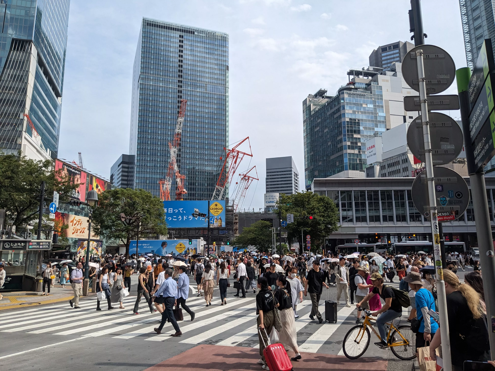

## Day 9: Yokohama, Shibuya

Today our primary plan was to visit the [Cup Noodles Museum](https://www.cupnoodles-museum.jp/en/) in Yokohama as a fun family event! To get to Yokohama, we actually opted out of going to Shinjuku station and instead went to [Shinjuku-Sanchōme](https://en.wikipedia.org/wiki/Shinjuku-sanch%C5%8Dme_Station) station, which is a bit further but comes with the benefit that it's served by the [Fukutoshin Line](https://en.wikipedia.org/wiki/Tokyo_Metro_Fukutoshin_Line), which does throughway service to Yokohama (and hence when going back to Tokyo, it's called the [Minatomirai Line](https://en.wikipedia.org/wiki/Minatomirai_Line) instead due to point of origin).

### Yokohama City

This part of Yokohama (called [Minatomirai](https://en.wikipedia.org/wiki/Minato_Mirai_21)) was very different from Shinjuku in terms of architecture and vibe due to it being primarily a business-oriented area. The architecture was significantly less "in-your-face" and overwhelming than interior Shinjuku, and both the streets and sidewalks were wider and emptier. The buildings were sleek and almost futuristic, with wide open spaces between them that let you actually see the sky. The sidewalks themselves had no tourists and were instead sparsely populated with businesspeople and commuters:

Despite this professionalism, there is for some reason a gigantic ferris wheel (which is part of [Yokohama Cosmo World](https://en.wikipedia.org/wiki/Yokohama_Cosmo_World) theme park) in the middle of this neighborhood, which I found to be quite amusing:

  

    
  

  

    
  

  

    
  

### Cup Noodles Museum, Lunch (Food Court)

The Cup Noodles Museum was a delightful family-friendly experience! The main attraction was definitely the "My Cup Noodle Factory" experience where you get to create your own personalized Cup Noodle from start to finish. You start by decorating the outside of the Cup Noodle container with markers, and then you move to a buffet-style line where you get to pick your soup base and toppings. The staff then seals the Cup Noodle right in front of you:

We were quite proud of our artistry on the exterior of the cup, and they even provide these neat inflatable protective bags to ensure our creation survives the journey home inside luggage. The second picture below was actually taken in the food court of the museum, which was themed to look like a food truck area with each truck representing a different culture's interpretation of noodles. We ended up having lunch there:

The museum itself was quite interesting and focused on documenting the very storied history of instant noodles, alongside their very important role in post-WWII reconstruction efforts. My favorite exhibit was a room where all four walls were just completely covered in varieties of instant noodles, ordered by the year they were initially manufactured:

  

    
  

  

    
  

  

    
  

Here is a better shot of that ferris wheel that we took on our way back to the train station:

### Shibuya Scramble Crossing

For the latter half of the day we decided to check out Shibuya, which is one of Tokyo's most iconic districts (to the point of it almost being overhyped). Known for its massive pedestrian crossing (the "Shibuya Scramble"), towering video screens and endless shopping/entertainment options, Shibuya is probably one of the most energetic areas in the entire country:

This particular area was giving off Times Square vibes, and we were able to get a good shot of the various surrounding buildings and billboards:

We spent a lot of time in this area and underneath in Shibuya Station (which also served as a giant underground shopping mall). Since we didn't really have plans as fine-grained as visiting individual buildings, we just wandered around and visited anything that looked interesting to us.

#### Tower Records Shibuya

One of those buildings we visited was [Tower Records Shibuya](https://towershibuya.jp/), a giant record store with a large selection of CDs, cassettes and vinyl records:

Although I wanted to buy at least one item for memorabilia's sake I found the prices to be quite high and I ended up opting out.

### Dinner (Shabu-shabu)

For some reason for dinner we really wanted shabu-shabu, and we found this all-you-can-eat spot situated a couple floors up in a mixed-use building called [Shabu Yo](https://tabelog.com/en/tokyo/A1303/A130301/13207838/). My family in particular really likes AYCE-style restaurants since we can order without the stress of keeping tabs on the bill. This particular restaurant had multiple "tiers" of AYCE that unlocked higher quality meats on the tablet, and we refused to compromise on this front and maxed out! Our total was about ¥5000 (USD$32 as of December 2024) per person, which is actually quite reasonable for the quantity and quality of the meats we got (also for the location since it sits directly on top of the crossing). This restaurant also has these cute robot cats that deliver your food and collect empty plates (the one in the below image is sleeping for some reason):

### Shibuya to Shinjuku Walk

After this meal we were frankly annihilated, but the sun was still out and we wanted to walk off the meal, so we simply decided to walk from Shibuya to Shinjuku (about an hour-long walk, 4.4km/2.7mi). Here are some of the sights we saw along the way:

  

    
  

  

    
  

  

    
  

This walk actually goes alongside the [Meiji Jingū](https://en.wikipedia.org/wiki/Meiji_Shrine) Shrine, which I wanted to visit——but the moment my parents heard the word "shrine" they immediately recoiled and so I ended up opting out (shrine sickness is very real).

#### Aside: Regional Inflation

One fun thing that we decided to do throughout the trip was to keep track of the price of one particular item and see how it changes depending on location. We decided to do this particular bottle of Kirin Lemon Tea, since my brother is a big fan of it and gets it every time he sees one in a convenience store or vending machine:

At this particular Ministop in Tokyo, the tea cost ¥168 (USD\$1.07 as of December 2024), while at Life Supermarket in Kyoto it was nearly half the price at ¥78 (USD\$0.50). Although this is probably not a good example since I'm comparing convenience store prices to supermarket prices, in general there is a noticeable cost of living difference between cities in Japan, and I hadn't realized this in the planning process even though we have that intuition for US cities (e.g. NYC and LA are obviously more expensive than Atlanta or Dallas). We had initially planned to do most of our shopping in Tokyo with the naive line of reasoning that it had the widest selection of stores (plus the convenience of being able to box everything up at the airport), but we didn't account for the fact that things were more affordable in Kyoto and Osaka.

Here are some other photos as we reached the outskirts of Shibuya and into the Shinjuku area. These are the final pictures of the day as we headed back to our hotel:

