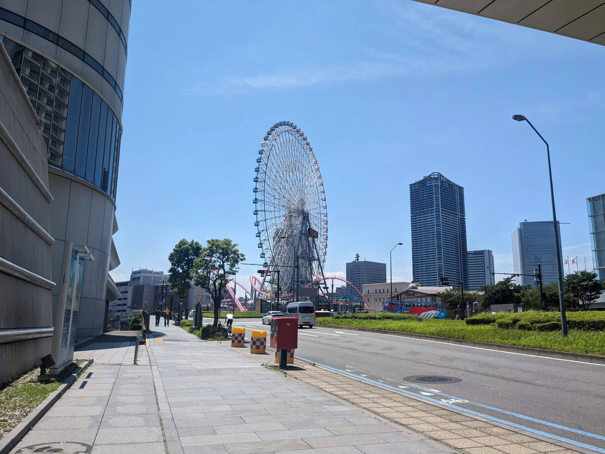
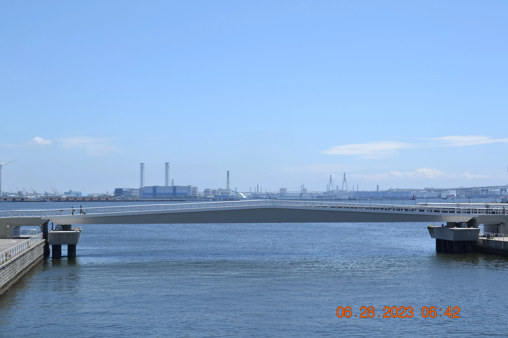
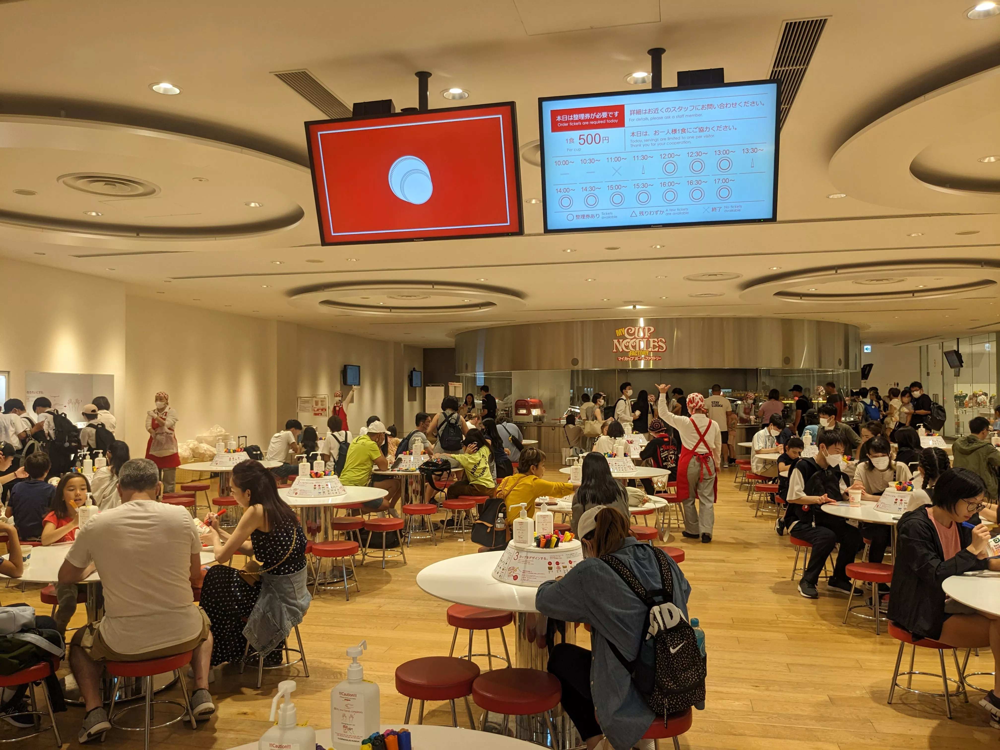
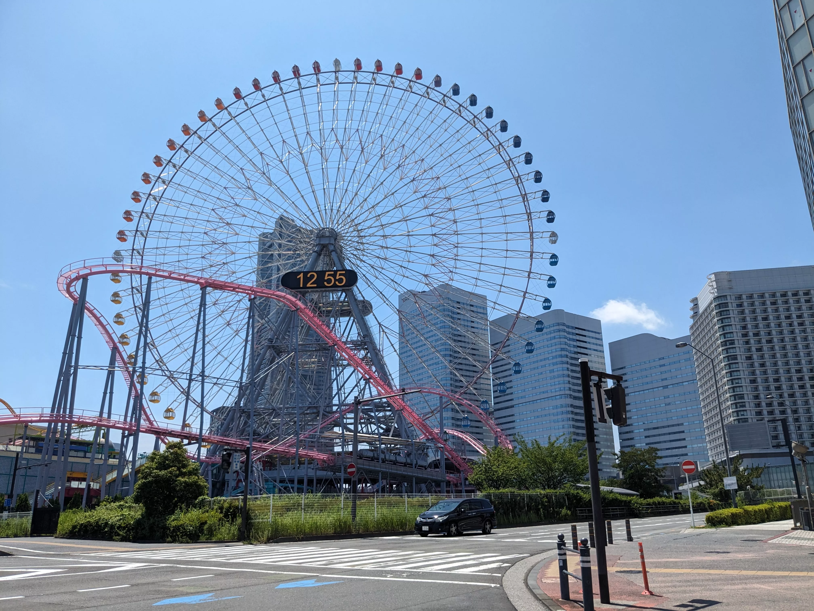
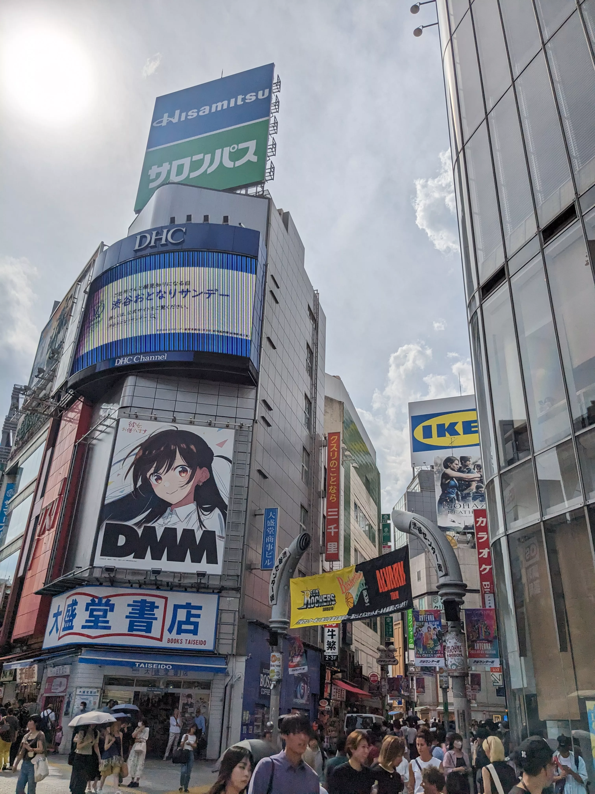
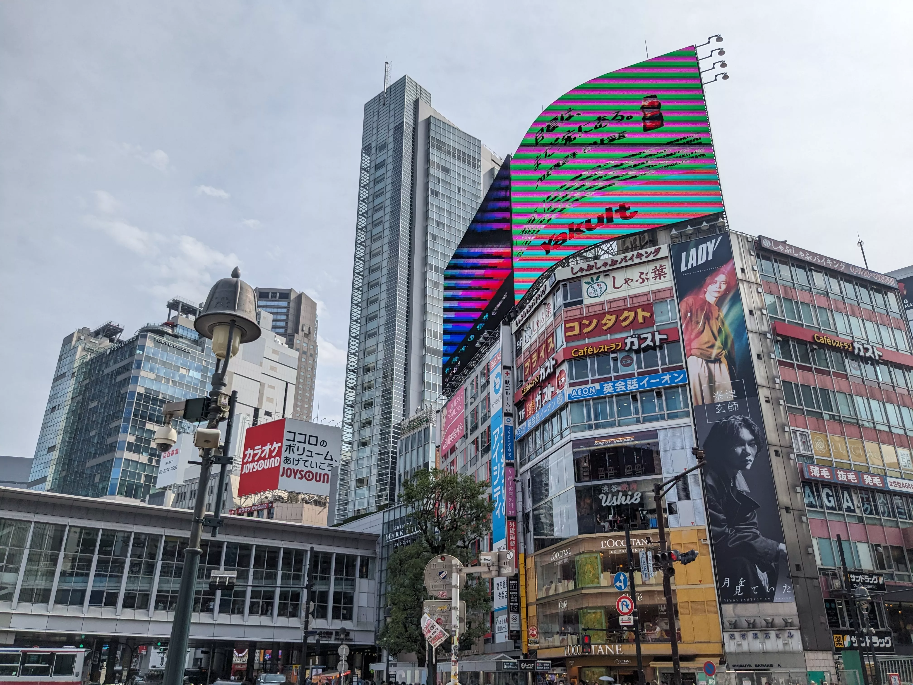
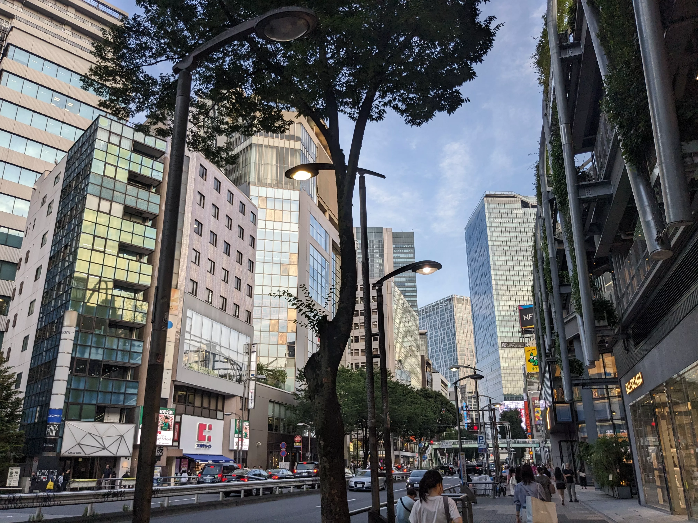
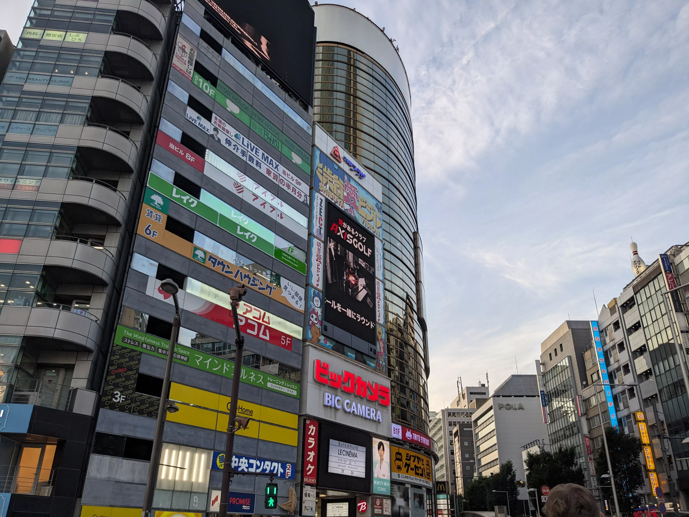
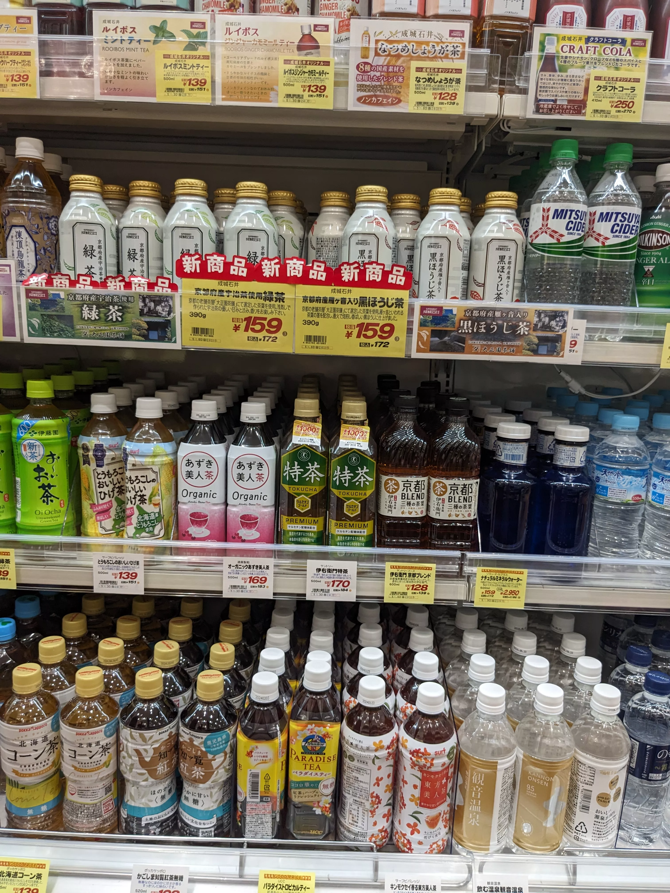
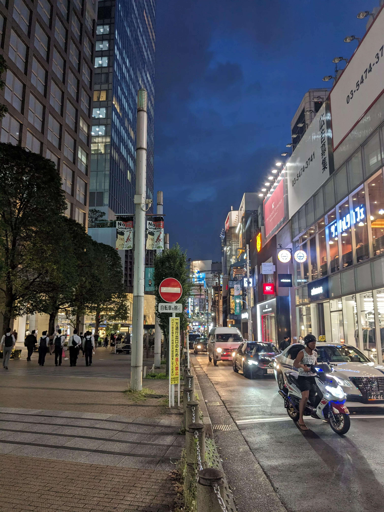

## Day 9: Yokohama, Shibuya

### Yokohama City

*>*]:my-0">

*>*]:my-0">

### Cup Noodles Museum, Lunch

*>*]:my-0">

*>*]:my-0">

*>*]:my-0">

### Shibuya Scramble Crossing

*>*]:my-0">

### Tower Records Shibuya

*>*]:my-0">

### Dinner: Shabu-shabu

[しゃぶ葉 (Shabu Yo Shibuyaekimaeten)](https://tabelog.com/en/tokyo/A1303/A130301/13207838/)

*>*]:my-0">

### Shibuya → Shinjuku Walk

*>*]:my-0">

#### Aside: Inflation

*>*]:my-0">

*>*]:my-0">

