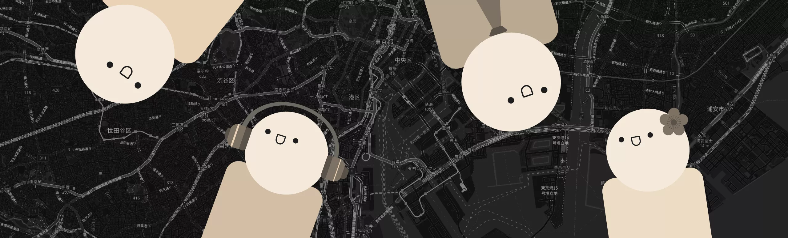
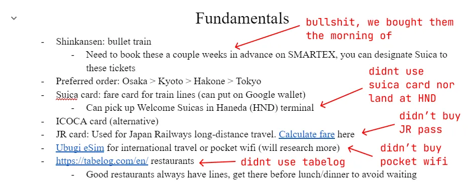
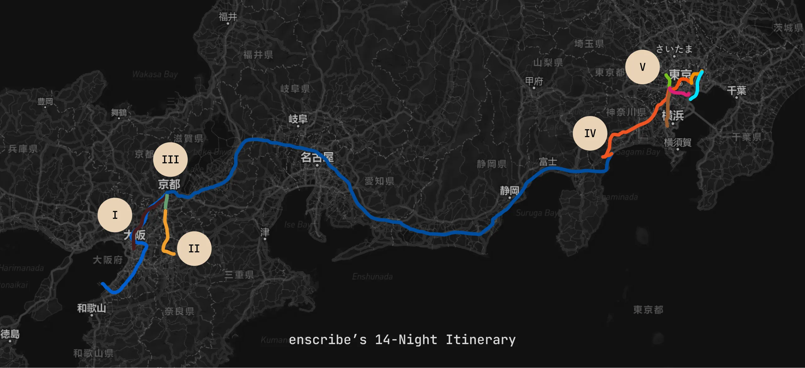
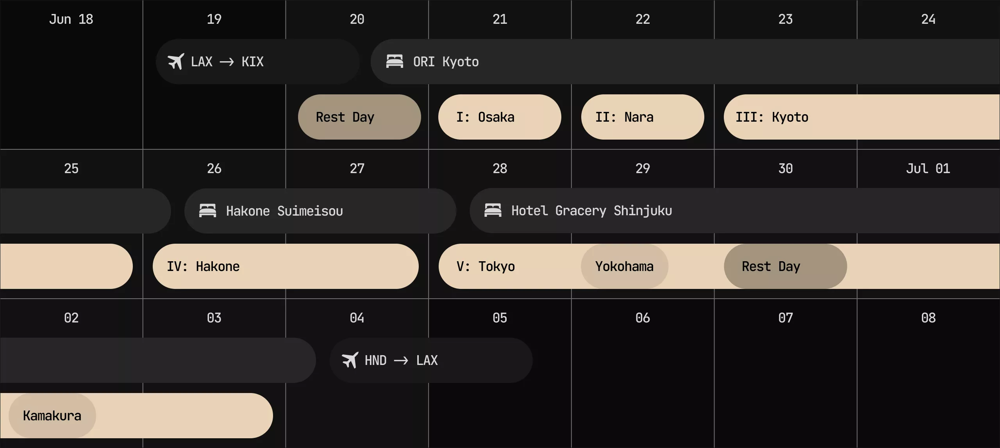
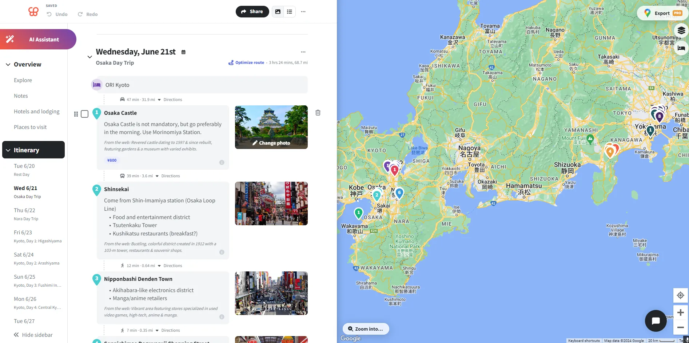
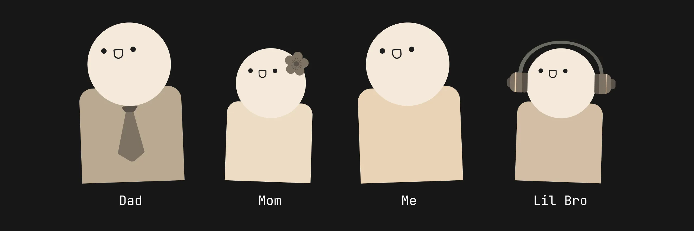

import FirstSubpost from '@/components/mdx/FirstSubpost.astro'

## Introduction

This is going to be a little different from the posts I typically make on this site!

During my senior year of high school, I was given the behemoth task of planning a trip to Japan for my immediate family of four. The idea was my Mom's——I was given absolutely nothing to work with, except for the general time interval which was feasible (the summer of 2023) alongside the guttural desire to go. Although I happily obliged, since I was the most "knowledgeable" about internet research and the culture, I quickly realized that being the one to plan came with both responsibilities and accountability. I would be the one to:

- Plan the entire itinerary, from start to finish (which stipulated deciding on the cities we'd visit, the attractions we'd see, and the general pathing between them)
- Book all flights, accommodations (hotels, ryokans/inns, etc.), and transportation (shinkansen/bullet trains, buses, subways, etc.)
- Be the primary navigator, a.k.a. figuring out how the public transportation system works as a suburban Angeleno who had never taken a bus (let alone the subway) in his life

Although I was blatantly overwhelmed, the overall excitement which came with the idea of the trip itself was enough to keep me going. For the next few months, I spent many days and nights dealing with the planning process, and I can say with confidence that it was one of the most rewarding experiences of my life. I'd like to share some of the process, alongside a daily log of the entire trip. This is the longest blog post I've ever written, so I hope you enjoy it (despite it being different from my usual posts).

## Prerequisites

Before getting into the nitty-gritty of the itinerary and planning process, I'll cover some of the fundamental aspects of traveling to Japan, as a prerequisite knowledge floor for terminology, cities, and transportation absolutely exists. Of course, I'll assume that you know of the country's existence alongside its general culture:

1. Japan has a bullet train system called the [Shinkansen](https://en.wikipedia.org/wiki/Shinkansen), which connects many of its major cities together at insanely high speeds. The Shinkansen, alongside many other trains, are owned by a central authority called the [Japan Railways Group](https://en.wikipedia.org/wiki/Japan_Railways_Group) (JR). Although you could purchase one-way tickets for JR-owned rail, it's recommended you purchase a [JR Pass](https://japanrailpass.net/en/) _if and only if_ you take the Shinkansen a lot. The JR Pass allows unlimited, economic travel on JR rail (e.g. Shinkansen) for the duration of the pass (offered in 7, 14, and 21-day varieties). The JR Pass is only available to tourists and must be purchased before you arrive in Japan. For reference, here's a map of the Shinkansen network:

<figure>
  
  <figcaption class="text-center [&>p]:text-muted-foreground">
    Map courtesy of [Japan Station](https://www.japanstation.com)
  </figcaption>
</figure>

2. Within metropolitan areas, you can and should use rechargeable public transportation cards called [IC Cards](https://www.japan-guide.com/e/e2359_003.html) (e.g. Suica/Pasmo in Tokyo, Icoca in the Kansai region) to utilize subways, trains, buses, and even purchase items at convenience stores. You can top up the balance of these cards at every station, and you can even check its balance with NFC-based phone apps! Here is a map of IC card coverage across Japan; note that all are compatible with each other, except in very rare cases:

<figure>
  
  <figcaption class="text-center [&>p]:text-muted-foreground">
    Map courtesy of [Japan Guide](https://www.japan-guide.com)
  </figcaption>
</figure>

3. There are many forms of accommodation in Japan. Although there is the typical Western-style hotel from big-name chains, you can experience traditional Japanese hospitality and culture by staying at a [ryokan](https://en.wikipedia.org/wiki/Ryokan) (a traditional Japanese inn) or a [minshuku](https://en.wikipedia.org/wiki/Minshuku) (a Japanese bed and breakfast).
4. Although [Tokyo](https://en.wikipedia.org/wiki/Tokyo), [Kyoto](https://en.wikipedia.org/wiki/Kyoto) and [Osaka](https://en.wikipedia.org/wiki/Osaka) are the most popular cities to visit (and obviously for good reason), we also choose to book accommodation in [Hakone](https://en.wikipedia.org/wiki/Hakone). It's less known than the three aforementioned cities, but still insanely popular and built for tourists. I'll explain why later!

## Itinerary

Itinerary-making for a destination like Japan would be described as, at best, a clusterfuck. The moment you Googled ["2-week japan itinerary"](https://www.google.com/search?q=2-week+japan+itinerary) you get back a bunch of self-proclaimed travel warlords who sell you surface-level bullet points and mediocre locations. You can see for yourself how plans can change drastically over time; I kept a Google Doc throughout the entire process:

Amidst all of this noise, I found a couple of credible and consistent sources which, although were still overwhelming, provided some semblance of "I know what I'm doing, I'm not going to be a stupid tourist." Those were:

- [japan-guide.com](https://www.japan-guide.com/): Seriously phenomenal itineraries. A lot of my day trips and main destinations were suggested by this site!
- [r/JapanTravel](https://www.reddit.com/r/JapanTravel/): I read through dozens of "Itinerary Check" (a user sends in their itinerary, and it gets reviewed by others to see what's feasible, things to change, recommendations, etc.) and "Trip Report" (a user sends in their specific experiences and recommendations) posts. Although you still have to use some internet fluency to discern what's good advice and what's not, I found some lovely ideas here, and decided to add them to our own itinerary based on vibes and family preferences.
- Friends! Please ask people who've been (or who live there) for recommendations. I ended up skipping some of the places shilled by the internet because of personal anecdotes from friends.

Since the itinerary-making process was super iterative and went through multiple revisions, I'll only be showing the final product here. This was the final pathing that we decided on:

The colors of the lines themselves are slightly for show (they're the colors used for transit lines and should be ignored), but each roman numeral here represents a particular city. We can create a calendar to see how our time would be designated across these cities:

A lot of thought was put into this particular order and spacing, but I'll only provide a high-level overview here for brevity's sake:

- Lodging in Kyoto immediately after landing in Kansai International (KIX) facilitates "day trips" (lodging in one location but spending the entire day in another) to Osaka and [Nara](<https://en.wikipedia.org/wiki/Nara_(city)>), which are both feasible and recommended. As such, we won't need to book additional accommodations nor carry our luggage around in these cities.
- No backtracking! A lot of itineraries make you land at Haneda Airport in Tokyo, explore Tokyo a couple days, go way west to the Kansai region, and then make you wrap all the way back. That's a lot of Shinkansen money (forcing you to buy JR passes) and carrying around luggage. If you end up splurging in Tokyo at the very beginning, you'd have to either carry that around the entire trip, do [Takuhaibin](https://www.japan-guide.com/e/e2278.html) (luggage forwarding) which is a hassle, or rent out a coin locker, also a hassle. My routing only makes you take the Shinkansen _a single time_, from Kyoto Station to Odawara Station.
- Hakone is known for its ryokans and [onsen](https://en.wikipedia.org/wiki/Onsen), which are relaxing segues between the insane juxtapositions of Kyoto and Tokyo. I chose to do two nights here so that we could explore the entirety of Hakone whilst enjoying the in-room dinner services that ryokans provide.
- Saving Tokyo for last prevents burnout. Since we'd be buying the most things in Tokyo (courtesy of the weak JPY) we could just box it up and check it out at the airport.

For accommodations, I chose them strategically based on location——for example, they needed to be within walking distance of a bus stop or major train station:

- In Kyoto, I chose an apartment-style accommodation that sat right atop the [Karasuma Line](https://en.wikipedia.org/wiki/Karasuma_Line) and was a 10-minute walk from [Shijō Station](https://en.wikipedia.org/wiki/Shij%C5%8D_Station). I opted for an apartment-style accommodation because we would be staying there the longest and would need to do laundry.
- In Hakone, I chose a ryokan that was a 5-minute walk to [Hakone-Yumoto Station](https://en.wikipedia.org/wiki/Hakone-Yumoto_Station), which connects Hakone with the rest of the world.
- In Tokyo, I chose a Western-style hotel that was walking distance to the east entrance of [Shinjuku Station](https://en.wikipedia.org/wiki/Shinjuku_Station) and was sat right in the middle of [Kabukichō](https://en.wikipedia.org/wiki/Kabukich%C5%8D). Shinjuku Station is the busiest train station in the world, and would evidently be connected to almost every major attraction in Tokyo. In hindsight, Kabukichō is not that good of a location for a family (it's a red-light district), but it was the most strategic option at the time.

Finally, for the actual attractions themselves, I kept a [Wanderlog](https://wanderlog.com/), which is a tool specifically designed for travel planning:

With all of this in mind, we finalized our bookings and were ready to go! I'll be covering in detail all of our individual experiences.

## Daily Log

Let's first introduce our four travelers:

Since I'll of course be redacting me and my family's faces, at least these cute little avatars will give you an idea of who's who in the frame!

To view all of the daily logs, look to the sidebar on your right, or click on the first subpost below! If you're on mobile, a sticky dropdown at the top of the page is available.

<FirstSubpost title="Day 0: Kansai Airport" href="/blog/japan-retrospective/day-1" />