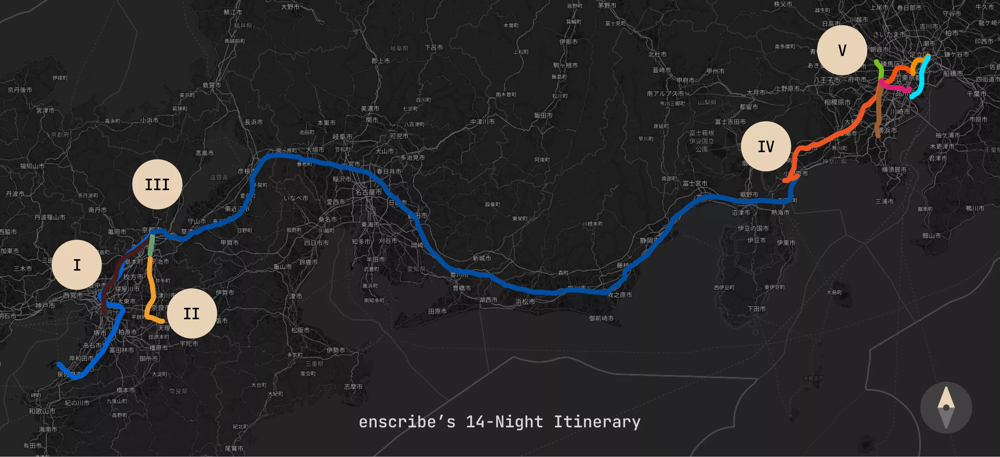

import Day0 from 'assets/day-0-map-2.webp'
import Day1 from 'assets/day-1.webp'
import Day2 from 'assets/day-2.webp'
import Day3 from 'assets/day-3.webp'
import Day4 from 'assets/day-4.webp'
import Day5 from 'assets/day-5-map-1.webp'
import Day6 from 'assets/day-6-map-1.webp'
import Day7 from 'assets/day-7.webp'
import Day8 from 'assets/day-8.webp'
import Day9 from 'assets/day-9.webp'
import Day10 from 'assets/day-10.webp'
import Day11 from 'assets/day-11.webp'
import Day12 from 'assets/day-12.webp'
import Day13 from 'assets/day-13.webp'
import Day14 from 'assets/day-14.webp'
import { Icon } from 'astro-icon/components'

export const days = [
  {
    day: 0,
    title: 'Day 0',
    description: 'Kansai Airport',
    image: Day0.src,
  },
  {
    day: 1,
    title: 'Day 1',
    description: 'Osaka Day Trip',
    image: Day1.src,
  },
  {
    day: 2,
    title: 'Day 2',
    description: 'Nara Day Trip',
    image: Day2.src,
  },
  {
    day: 3,
    title: 'Day 3',
    description: 'East Kyoto',
    image: Day3.src,
  },
  {
    day: 4,
    title: 'Day 4',
    description: 'West/Central Kyoto',
    image: Day4.src,
  },
  {
    day: 5,
    title: 'Day 5',
    description: 'Fushimi-Inari Taisha',
    image: Day5.src,
  },
  {
    day: 6,
    title: 'Day 6',
    description: 'Hakone-Yumoto',
    image: Day6.src,
  },
  {
    day: 7,
    title: 'Day 7',
    description: 'Hakone Round Course',
    image: Day7.src,
  },
  {
    day: 8,
    title: 'Day 8',
    description: 'Shinjuku, Kabukichō',
    image: Day8.src,
  },
  {
    day: 9,
    title: 'Day 9',
    description: 'Yokohama, Shibuya',
    image: Day9.src,
  },
  {
    day: 10,
    title: 'Day 10',
    description: 'Rest Day',
    image: Day10.src,
  },
  {
    day: 11,
    title: 'Day 11',
    description: 'Akihabara',
    image: Day11.src,
  },
  {
    day: 12,
    title: 'Day 12',
    description: 'Asakusa, Odaiba',
    image: Day12.src,
  },
  {
    day: 13,
    title: 'Day 13',
    description: 'Kamakura Day Trip',
    image: Day13.src,
  },
  {
    day: 14,
    title: 'Day 14',
    description: 'Haneda Airport',
    image: Day14.src,
  },
]

### Intro

This is going to be a little different from the posts I typically make on this site!

During my senior year of high school, I was given the behemoth task of planning a trip to Japan for my immediate family of four. The idea was my Mom's——I was given absolutely nothing to work with, except for the general time interval which was feasible (the summer of 2023) alongside the guttural desire to go. Although I happily obliged, since I was the most "knowledgeable" about internet research and the culture, I quickly realized that being the one to plan came with both responsibilities and accountability. I would be the one to:

- Plan the entire itinerary, from start to finish (which stipulated deciding on the cities we'd visit, the attractions we'd see, and the general pathing between them)
- Book all flights, accommodations (hotels, ryokans/inns, etc.), and transportation (shinkansen/bullet trains, buses, subways, etc.)
- Be the primary navigator, a.k.a. figuring out how the public transportation system works as a suburban Angeleno who had never taken a bus (let alone the subway) in his life

Although I was blatantly overwhelmed, the overall excitement which came with the idea of the trip itself was enough to keep me going. For the next few months, I spent many days and nights dealing with the planning process, and I can say with confidence that it was one of the most rewarding experiences of my life. I'd like to share some of the process, alongside a daily log of the entire trip. This is the longest blog post I've ever written, so I hope you enjoy it (despite it being different from my usual posts).

## Fundamentals

Before getting into the nitty-gritty of the itinerary and planning process, I'll cover some of the fundamental aspects of traveling to Japan, as a prerequisite knowledge floor for terminology, cities, and transportation absolutely exists. Of course, I'll assume that you know of the country's existence alongside its general culture:

1. Japan has a bullet train system called the [Shinkansen](https://en.wikipedia.org/wiki/Shinkansen), which connects many of its major cities together at insanely high speeds. The Shinkansen, alongside many other trains, are owned by a central authority called the [Japan Railways Group](https://en.wikipedia.org/wiki/Japan_Railways_Group) (JR). Although you could purchase one-way tickets for JR-owned rail, it's recommended you purchase a [JR Pass](https://japanrailpass.net/en/) _if and only if_ you take the Shinkansen a lot. The JR Pass allows unlimited, economic travel on JR rail (e.g. Shinkansen) for the duration of the pass (offered in 7, 14, and 21-day varieties). The JR Pass is only available to tourists and must be purchased before you arrive in Japan. For reference, here's a map of the Shinkansen network:

<figure>
  
  <figcaption class="text-center text-muted-foreground">
    Map courtesy of [Japan Station](https://www.japanstation.com)
  </figcaption>
</figure>

2. Within metropolitan areas, you can and should use rechargeable public transportation cards called [IC Cards](https://www.japan-guide.com/e/e2359_003.html) (e.g. Suica/Pasmo in Tokyo, Icoca in the Kansai region) to utilize subways, trains, buses, and even purchase items at convenience stores. You can top up the balance of these cards at every station, and you can even check its balance with NFC-based phone apps! Here is a map of IC card coverage across Japan; note that all are compatible with each other, except in very rare cases:

<figure>
  
  <figcaption class="text-center text-muted-foreground">
    Map courtesy of [Japan Guide](https://www.japan-guide.com)
  </figcaption>
</figure>

3. There are many forms of accommodation in Japan. Although there is the typical Western-style hotel from big-name chains, you can experience traditional Japanese hospitality and culture by staying at a [ryokan](https://en.wikipedia.org/wiki/Ryokan) (a traditional Japanese inn) or a [minshuku](https://en.wikipedia.org/wiki/Minshuku) (a Japanese bed and breakfast).
4. Although [Tokyo](https://en.wikipedia.org/wiki/Tokyo), [Kyoto](https://en.wikipedia.org/wiki/Kyoto) and [Osaka](https://en.wikipedia.org/wiki/Osaka) are the most popular cities to visit (and obviously for good reason), we also choose to book accommodation in [Hakone](https://en.wikipedia.org/wiki/Hakone). It's less known than the three aforementioned cities, but still insanely popular and built for tourists. I'll explain why later!

## The Itinerary

Itinerary-making for a destination like Japan would be described as, at best, a clusterfuck. The moment you Googled ["2-week japan itinerary"](https://www.google.com/search?q=2-week+japan+itinerary) you get back a bunch of self-proclaimed travel warlords who sell you surface-level bullet points and mediocre locations. You can see for yourself how plans can change drastically over time; I kept a Google Doc throughout the entire process:

Amidst all of this noise, I found a couple of credible and consistent sources which, although were still overwhelming, provided some semblance of "I know what I'm doing, I'm not going to be a stupid tourist." Those were:

- [japan-guide.com](https://www.japan-guide.com/): Seriously phenomenal itineraries. A lot of my day trips and main destinations were suggested by this site!
- [r/JapanTravel](https://www.reddit.com/r/JapanTravel/): I read through dozens of "Itinerary Check" (a user sends in their itinerary, and it gets reviewed by others to see what's feasible, things to change, recommendations, etc.) and "Trip Report" (a user sends in their specific experiences and recommendations) posts. Although you still have to use some internet fluency to discern what's good advice and what's not, I found some lovely ideas here, and decided to add them to our own itinerary based on vibes and family preferences.
- Friends! Please ask people who've been (or who live there) for recommendations. I ended up skipping some of the places shilled by the internet because of personal anecdotes from friends.

Since the itinerary-making process was super iterative and went through multiple revisions, I'll only be showing the final product here. This was the final pathing that we decided on:

The colors of the lines themselves are slightly for show (they're the colors used for transit lines and should be ignored), but each roman numeral here represents a particular city. We can create a calendar to see how our time would be designated across these cities:

A lot of thought was put into this particular order and spacing, but I'll only provide a high-level overview here for brevity's sake:

- Lodging in Kyoto immediately after landing in Kansai International (KIX) facilitates "day trips" (lodging in one location but spending the entire day in another) to Osaka and [Nara](<https://en.wikipedia.org/wiki/Nara_(city)>), which are both feasible and recommended. As such, we won't need to book additional accommodations nor carry our luggage around in these cities.
- No backtracking! A lot of itineraries make you land at Haneda Airport in Tokyo, explore Tokyo a couple days, go way west to the Kansai region, and then make you wrap all the way back. That's a lot of Shinkansen money (forcing you to buy JR passes) and carrying around luggage. If you end up splurging in Tokyo at the very beginning, you'd have to either carry that around the entire trip, do [Takuhaibin](https://www.japan-guide.com/e/e2278.html) (luggage forwarding) which is a hassle, or rent out a coin locker, also a hassle. My routing only makes you take the Shinkansen _a single time_, from Kyoto Station to Odawara Station.
- Hakone is known for its ryokans and [onsen](https://en.wikipedia.org/wiki/Onsen), which are relaxing segues between the insane juxtapositions of Kyoto and Tokyo. I chose to do two nights here so that we could explore the entirety of Hakone whilst enjoying the in-room dinner services that ryokans provide.
- Saving Tokyo for last prevents burnout. Since we'd be buying the most things in Tokyo (courtesy of the weak JPY) we could just box it up and check it out at the airport.

For accommodations, I chose them strategically based on location——for example, they needed to be within walking distance of a bus stop or major train station:

- In Kyoto, I chose an apartment-style accommodation that sat right atop the [Karasuma Line](https://en.wikipedia.org/wiki/Karasuma_Line) and was a 10-minute walk from [Shijō Station](https://en.wikipedia.org/wiki/Shij%C5%8D_Station). I opted for an apartment-style accommodation because we would be staying there the longest and would need to do laundry.
- In Hakone, I chose a ryokan that was a 5-minute walk to [Hakone-Yumoto Station](https://en.wikipedia.org/wiki/Hakone-Yumoto_Station), which connects Hakone with the rest of the world.
- In Tokyo, I chose a Western-style hotel that was walking distance to the east entrance of [Shinjuku Station](https://en.wikipedia.org/wiki/Shinjuku_Station) and was sat right in the middle of [Kabukichō](https://en.wikipedia.org/wiki/Kabukich%C5%8D). Shinjuku Station is the busiest train station in the world, and would evidently be connected to almost every major attraction in Tokyo. In hindsight, Kabukichō is not that good of a location for a family (it's a red-light district), but it was the most strategic option at the time.

Finally, for the actual attractions themselves, I kept a [Wanderlog](https://wanderlog.com/), which is a tool specifically designed for travel planning:

With all of this in mind, we finalized our bookings and were ready to go! I'll be covering in detail all of our individual experiences.

## Daily Log

Let's first introduce our four travelers:

Since I'll of course be redacting me and my family's faces, at least these cute little avatars will give you an idea of who's who in the frame!

  <a 
    href="/blog/japan-retrospective/day-0"
    class="group relative flex flex-col overflow-hidden rounded-xl border bg-card hover:bg-accent/10 hover:border-primary/50 transition-all duration-300"
  >
    

### Day 0: Kansai Airport

    

    

      
    

    

      <h3 class="text-xl font-semibold tracking-tight mb-1" id="day-0">Day 0</h3>
      
Kansai Airport

      

        <Icon name="lucide:arrow-right" class="h-4 w-4" />
      

    

  </a>

  <a 
    href="/blog/japan-retrospective/day-1"
    class="group relative flex flex-col overflow-hidden rounded-xl border bg-card hover:bg-accent/10 hover:border-primary/50 transition-all duration-300"
  >
    

### Day 1: Osaka Day Trip

    

    

      
    

    

      <h3 class="text-xl font-semibold tracking-tight mb-1" id="day-1">Day 1</h3>
      
Osaka Day Trip

      

        <Icon name="lucide:arrow-right" class="h-4 w-4" />
      

    

  </a>

  <a 
    href="/blog/japan-retrospective/day-2"
    class="group relative flex flex-col overflow-hidden rounded-xl border bg-card hover:bg-accent/10 hover:border-primary/50 transition-all duration-300"
  >
    

### Day 2: Nara Day Trip

    

    

      
    

    

      <h3 class="text-xl font-semibold tracking-tight mb-1" id="day-2">Day 2</h3>
      
Nara Day Trip

      

        <Icon name="lucide:arrow-right" class="h-4 w-4" />
      

    

  </a>

  <a 
    href="/blog/japan-retrospective/day-3"
    class="group relative flex flex-col overflow-hidden rounded-xl border bg-card hover:bg-accent/10 hover:border-primary/50 transition-all duration-300"
  >
    

### Day 3: East Kyoto

    

    

      
    

    

      <h3 class="text-xl font-semibold tracking-tight mb-1" id="day-3">Day 3</h3>
      
East Kyoto

      

        <Icon name="lucide:arrow-right" class="h-4 w-4" />
      

    

  </a>

  <a 
    href="/blog/japan-retrospective/day-4"
    class="group relative flex flex-col overflow-hidden rounded-xl border bg-card hover:bg-accent/10 hover:border-primary/50 transition-all duration-300"
  >
    

### Day 4: West/Central Kyoto

    

    

      
    

    

      <h3 class="text-xl font-semibold tracking-tight mb-1" id="day-4">Day 4</h3>
      
West/Central Kyoto

      

        <Icon name="lucide:arrow-right" class="h-4 w-4" />
      

    

  </a>

  <a 
    href="/blog/japan-retrospective/day-5"
    class="group relative flex flex-col overflow-hidden rounded-xl border bg-card hover:bg-accent/10 hover:border-primary/50 transition-all duration-300"
  >
    

### Day 5: Fushimi-Inari Taisha

    

    

      
    

    

      <h3 class="text-xl font-semibold tracking-tight mb-1" id="day-5">Day 5</h3>
      
Fushimi-Inari Taisha

      

        <Icon name="lucide:arrow-right" class="h-4 w-4" />
      

    

  </a>

  <a 
    href="/blog/japan-retrospective/day-6"
    class="group relative flex flex-col overflow-hidden rounded-xl border bg-card hover:bg-accent/10 hover:border-primary/50 transition-all duration-300"
  >
    

### Day 6: Hakone-Yumoto

    

    

      
    

    

      <h3 class="text-xl font-semibold tracking-tight mb-1" id="day-6">Day 6</h3>
      
Hakone-Yumoto

      

        <Icon name="lucide:arrow-right" class="h-4 w-4" />
      

    

  </a>

  <a 
    href="/blog/japan-retrospective/day-7"
    class="group relative flex flex-col overflow-hidden rounded-xl border bg-card hover:bg-accent/10 hover:border-primary/50 transition-all duration-300"
  >
    

### Day 7: Hakone Round Course

    

    

      
    

    

      <h3 class="text-xl font-semibold tracking-tight mb-1" id="day-7">Day 7</h3>
      
Hakone Round Course

      

        <Icon name="lucide:arrow-right" class="h-4 w-4" />
      

    

  </a>

  <a 
    href="/blog/japan-retrospective/day-8"
    class="group relative flex flex-col overflow-hidden rounded-xl border bg-card hover:bg-accent/10 hover:border-primary/50 transition-all duration-300"
  >
    

### Day 8: Shinjuku, Kabukichō

    

    

      
    

    

      <h3 class="text-xl font-semibold tracking-tight mb-1" id="day-8">Day 8</h3>
      
Shinjuku, Kabukichō

      

        <Icon name="lucide:arrow-right" class="h-4 w-4" />
      

    

  </a>

  <a 
    href="/blog/japan-retrospective/day-9"
    class="group relative flex flex-col overflow-hidden rounded-xl border bg-card hover:bg-accent/10 hover:border-primary/50 transition-all duration-300"
  >
    

### Day 9: Yokohama, Shibuya

    

    

      
    

    

      <h3 class="text-xl font-semibold tracking-tight mb-1" id="day-9">Day 9</h3>
      
Yokohama, Shibuya

      

        <Icon name="lucide:arrow-right" class="h-4 w-4" />
      

    

  </a>

  <a 
    href="/blog/japan-retrospective/day-10"
    class="group relative flex flex-col overflow-hidden rounded-xl border bg-card hover:bg-accent/10 hover:border-primary/50 transition-all duration-300"
  >
    

### Day 10: Rest Day

    

    

      
    

    

      <h3 class="text-xl font-semibold tracking-tight mb-1" id="day-10">Day 10</h3>
      
Rest Day

      

        <Icon name="lucide:arrow-right" class="h-4 w-4" />
      

    

  </a>

  <a 
    href="/blog/japan-retrospective/day-11"
    class="group relative flex flex-col overflow-hidden rounded-xl border bg-card hover:bg-accent/10 hover:border-primary/50 transition-all duration-300"
  >
    

### Day 11: Akihabara

    

    

      
    

    

      <h3 class="text-xl font-semibold tracking-tight mb-1" id="day-11">Day 11</h3>
      
Akihabara

      

        <Icon name="lucide:arrow-right" class="h-4 w-4" />
      

    

  </a>

  <a 
    href="/blog/japan-retrospective/day-12"
    class="group relative flex flex-col overflow-hidden rounded-xl border bg-card hover:bg-accent/10 hover:border-primary/50 transition-all duration-300"
  >
    

### Day 12: Asakusa, Odaiba

    

    

      
    

    

      <h3 class="text-xl font-semibold tracking-tight mb-1" id="day-12">Day 12</h3>
      
Asakusa, Odaiba

      

        <Icon name="lucide:arrow-right" class="h-4 w-4" />
      

    

  </a>

  <a 
    href="/blog/japan-retrospective/day-13"
    class="group relative flex flex-col overflow-hidden rounded-xl border bg-card hover:bg-accent/10 hover:border-primary/50 transition-all duration-300"
  >
    

### Day 13: Kamakura Day Trip

    

    

      
    

    

      <h3 class="text-xl font-semibold tracking-tight mb-1" id="day-13">Day 13</h3>
      
Kamakura Day Trip

      

        <Icon name="lucide:arrow-right" class="h-4 w-4" />
      

    

  </a>

  <a 
    href="/blog/japan-retrospective/day-14"
    class="group relative flex flex-col overflow-hidden rounded-xl border bg-card hover:bg-accent/10 hover:border-primary/50 transition-all duration-300"
  >
    

### Day 14: Haneda Airport

    

    

      
    

    

      <h3 class="text-xl font-semibold tracking-tight mb-1" id="day-14">Day 14</h3>
      
Haneda Airport

      

        <Icon name="lucide:arrow-right" class="h-4 w-4" />
      

    

  </a>

## Retrospective

Looking back at this entire trip, there are several key lessons and observations that I've learned worth highlighting:

### Planning and Logistics

The months spent planning this trip were absolutely worth it. Some key strategies we did that paid off:

- Getting to the most popular attractions (particularly the nature-oriented ones, such as Fushimi Inari and Kiyomizu-dera) at the brink of dawn made an incomprehensible difference in the experience. Having essentially the entire place to ourselves brings a level of serenity and immersion that can't be understood without experiencing it.
- Strategic accommodation was important, and having such easy access to large hubs of public transportation was crucial for preventing long walks with heavy baggage.
- The "no backtracking" route design proved efficient since we only had to deal with our luggage whenever we transferred accommodations, which was only twice.

However, there were some key oversights that I made:

- Not researching about the public transportation system at all resulted in the "Kansai Faregate Incident" on Day 0, which would have bled into Day 1 if not for the wonderful train station staff member who helped us out.
- I greatly overestimated our enthusiasm for going to temples and shrines, and the "shrine sickness" was really bad by the end of Kyoto. This is not to disrespect the importance of these sacred sites or to call them "all the same," but I'm just saying that you can get burned out on them after a while.
- In Hakone, I made my family take the Old Tokaido Highway without realizing how intensive of a hike it was. This was a mistake, and I should have done more research on the hiking trails in the area.
- We didn't account for the regional price differences. Tokyo's inflation and higher costs meant that we should have done more shopping in Kyoto and Osaka, where the same items were cheaper.

### Dining and Cuisine

Just for fun, here's a table of all of the dining experiences we had throughout the trip alongside my ratings for them (of course I'm using "American" rating and not "Tabelog" rating). I excluded meals that were self-prepared, from convenience stores, or those simply not worth mentioning:

| Day | Location | Restaurant                                                                             | Type           | Meal      | My Rating                                  |
| --- | -------- | -------------------------------------------------------------------------------------- | -------------- | --------- | ------------------------------------------ |
| 1   | Kyoto    | [Yayoi-ken Shijō-Karasuma](https://tabelog.com/en/kyoto/A2601/A260201/26011748/)       | Teishoku       | Breakfast | 3.5/5 |
| 1   | Osaka    | [Kushikatsu to Odashi Kushiemon](https://tabelog.com/en/osaka/A2701/A270206/27135045/) | Kushikatsu     | Lunch     | 2/5      |
| 1   | Osaka    | [Ichiran](https://en.wikipedia.org/wiki/Ichiran)                                       | Ramen          | Dinner    | 4.5/5  |
| 2   | Kyoto    | [Shijō Nishinotōin Shokudō](https://tabelog.com/en/kyoto/A2601/A260201/26017600/)      | Teishoku       | Breakfast | 4/5    |
| 2   | Nara     | [Mamejica Kitchen](https://tabelog.com/en/nara/A2901/A290101/29011358/)                | Ice Cream      | Snack     | 4.5/5  |
| 2   | Nara     | [Maguro Koya](https://tabelog.com/en/nara/A2901/A290101/29000802/)                     | Tuna Specialty | Lunch     | 5/5    |
| 3   | Kyoto    | [MACCHA HOUSE](https://tabelog.com/en/kyoto/A2601/A260301/26030960/)                   | Cafe           | Snack     | 4.5/5  |
| 3   | Kyoto    | [Honkaku Yakiniku Chifaja](https://tabelog.com/en/kyoto/A2601/A260201/26021071/)       | Yakiniku       | Dinner    | 3.5/5 |
| 4   | Kyoto    | [Katsukura](https://tabelog.com/en/kyoto/A2601/A260101/26001923/)                      | Tonkatsu       | Lunch     | 4/5    |
| 5   | Kyoto    | [nana's green tea](https://tabelog.com/en/kyoto/A2601/A260201/26032210/)               | Cafe           | Snack     | 3/5   |
| 5   | Kyoto    | [Ramen Sen-no-Kaze](https://tabelog.com/en/kyoto/A2601/A260202/26016307/)              | Ramen          | Dinner    | 4/5    |
| 5   | Kyoto    | [Nishiki Market](https://www.japan-guide.com/e/e3931.html)                             | Street Food    | Snack     | 3/5   |
| 6   | Hakone   | Ryokan In-House Dinner                                                                 | Kaiseki        | Dinner    | 5/5    |
| 7   | Hakone   | Ryokan In-House Breakfast                                                              | Traditional    | Breakfast | 4/5    |
| 7   | Hakone   | [Amazake Chaya](https://tabelog.com/en/kanagawa/A1410/A141001/14001260/)               | Tea House      | Snack     | 4.5/5  |
| 7   | Hakone   | [Hakone Butter SUN SAN D](https://sunsan-d.com/)                                       | Ice Cream      | Snack     | 5/5    |
| 7   | Hakone   | Ryokan In-House Dinner                                                                 | Kaiseki        | Dinner    | 5/5    |
| 8   | Hakone   | Ryokan In-House Breakfast                                                              | Traditional    | Breakfast | 4/5    |
| 8   | Tokyo    | [CoCo Ichibanya](https://tabelog.com/en/tokyo/A1304/A130401/13126200/)                 | Curry          | Brunch    | 3.5/5 |
| 8   | Tokyo    | [Kim Cafe](https://tabelog.com/en/tokyo/A1304/A130401/13278125/)                       | Korean         | Dinner    | 3.5/5 |
| 9   | Yokohama | Cup Noodles Museum Food Court                                                          | International  | Lunch     | 3/5   |
| 9   | Tokyo    | [Shabu Yo](https://tabelog.com/en/tokyo/A1303/A130301/13207838/)                       | Shabu-shabu    | Dinner    | 4.5/5  |
| 10  | Tokyo    | Tsukiji Market                                                                         | Seafood        | Lunch     | 3/5   |
| 10  | Tokyo    | [Tsurutontan](https://tabelog.com/tokyo/A1304/A130401/13024799/)                       | Udon           | Dinner    | 4.5/5  |
| 11  | Tokyo    | [PHO THIN](https://tabelog.com/en/tokyo/A1304/A130401/13257231/)                       | Vietnamese     | Brunch    | 4/5    |
| 11  | Tokyo    | [maidreamin](https://tabelog.com/en/tokyo/A1311/A131101/13050366/)                     | Maid Cafe      | Lunch     | 2/5      |
| 11  | Tokyo    | [Hakata Furyu](https://tabelog.com/en/tokyo/A1311/A131101/13096267/)                   | Ramen          | Dinner    | 5/5    |
| 12  | Tokyo    | [Shinshu Sojibo](https://tabelog.com/en/tokyo/A1313/A131306/13188484/)                 | Soba           | Lunch     | 3/5   |
| 12  | Tokyo    | [Yomenya Goemon](https://en.yomenya-goemon.com/)                                       | Pasta          | Dinner    | 4.5/5  |
| 13  | Tokyo    | [Ippudo](https://tabelog.com/en/tokyo/A1304/A130401/13274333/)                         | Ramen          | Dinner    | 3.5/5 |
| 14  | Tokyo    | [Setagaya](https://tabelog.com/en/tokyo/A1315/A131504/13117591/)                       | Ramen          | Lunch     | 4/5    |
| 14  | Tokyo    | [Saryo Itoen](https://tabelog.com/en/tokyo/A1315/A131504/13174290/)                    | Cafe           | Snack     | 4/5    |

Some observations and overall thoughts, since none of these restaurants/establishments were planned or researched beforehand:
- In terms of price-value dynamics, chain restaurants offered significantly better value than their US. counterparts.
- Our most memorable meals always came from moderately-priced to affordable restaurants, and sometimes came from spontaneous discoveries and walking into establishments we found interesting on the exterior.
- Tourist-heavy areas always had noticable price markups, but it doesn't necessarily mean that they're bad. Similarly, just because something is considered "authentic" doesn't mean it's good.
- Online ratings were generally indicative of how much we'd personally enjoy the meal, but not always.
- We did get slightly tired of Japanese food after a while and started craving other cultural cuisines.
- Don't sleep on food in department stores and shopping malls, they're nothing like those in the US. Also don't sleep on chain restaurants, as they maintain a high standard of quality.
- We didn't try any extremely fancy restaurants that required booking reservations ahead of time. Maybe we should have done that.
- We made the massive mistake of using Google Maps rather than Tabelog to find restaurants. Use Tabelog while keeping its very harsh rating system in mind.

### Future Considerations

For future trips or similar experiences:

- Allocate more time for periods of rest and relaxation, and don't make excursions too long or walk-intensive, even though it may be tempting to do so out of excitement or fear of missing out. These periods don't necessarily have to be entire days.
- Research the sasonal factors more thoroughly. It was blistering hot and humid the entire time we were there.
- Balance the "tourist must-sees" with more local experiences, even if they may not be as accommodating to foreigners.
- Plan shopping based on regional pricing and inflation rather than the availablility of goods.

Overall, while the intensive planning created a solid framework for our trip, no amount of planning could prepare us for the unplanned moments and discoveries that often proved most memorable. The trip succeeded in its primary goal——providing a comprehensive first-time experience for the family——while also teaching me valuable lessons about responsibility, adaptability, and the delicate balance between preparation and spontaneity that makes travel truly meaningful.
