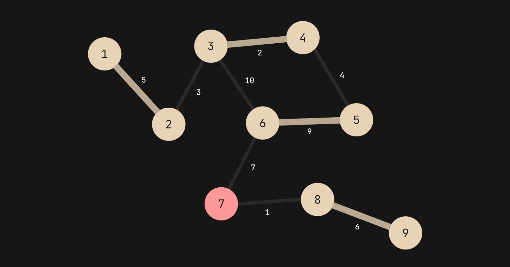
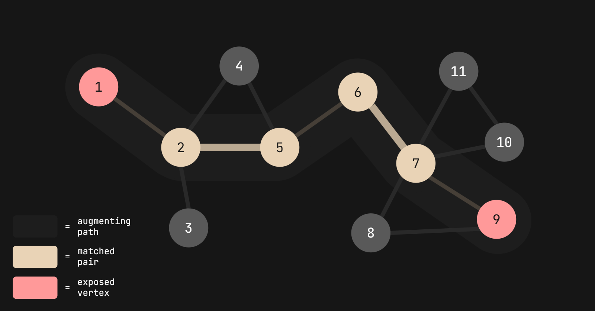
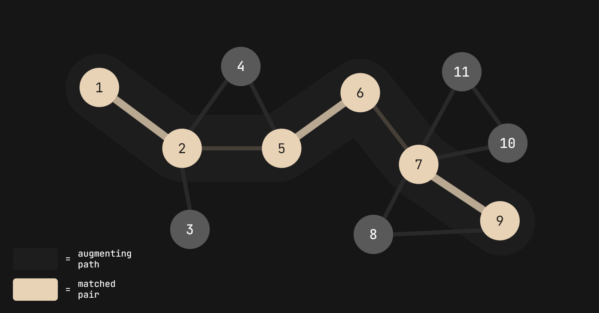
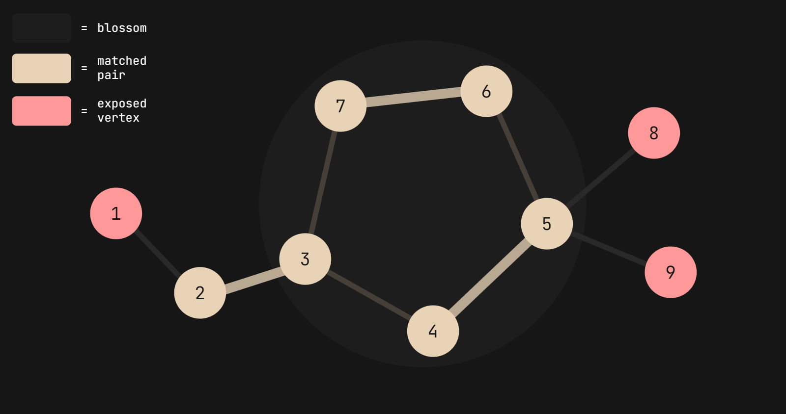
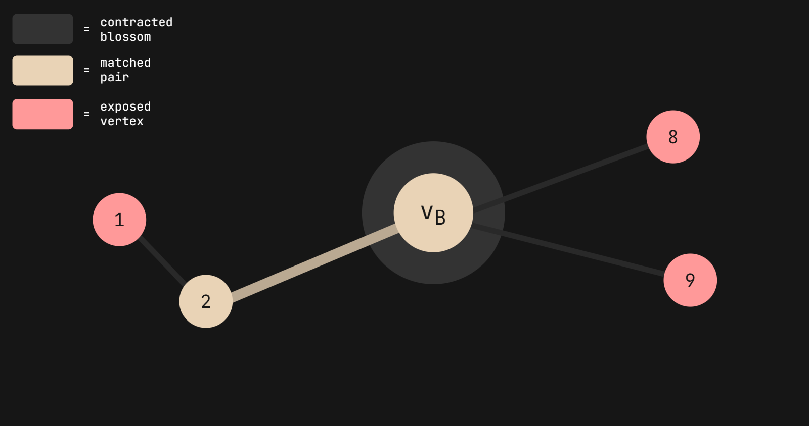
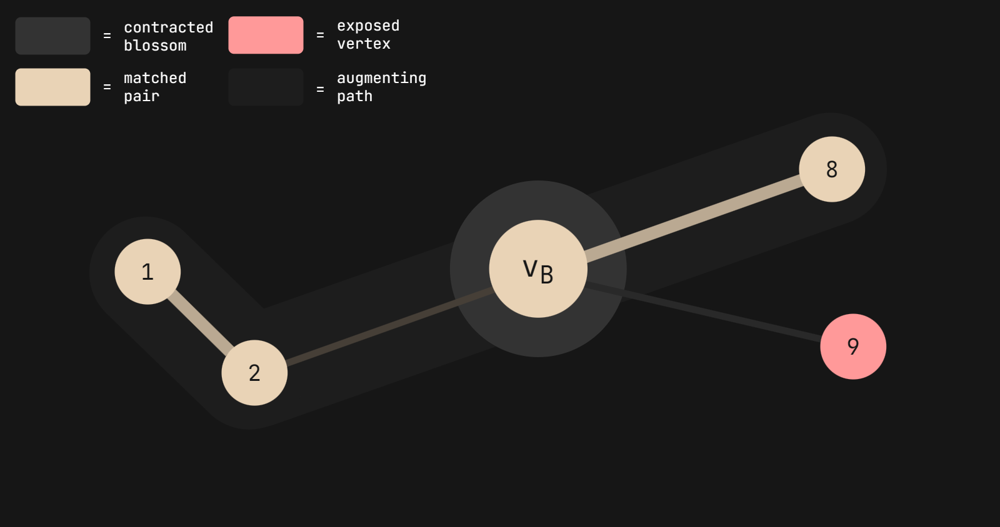
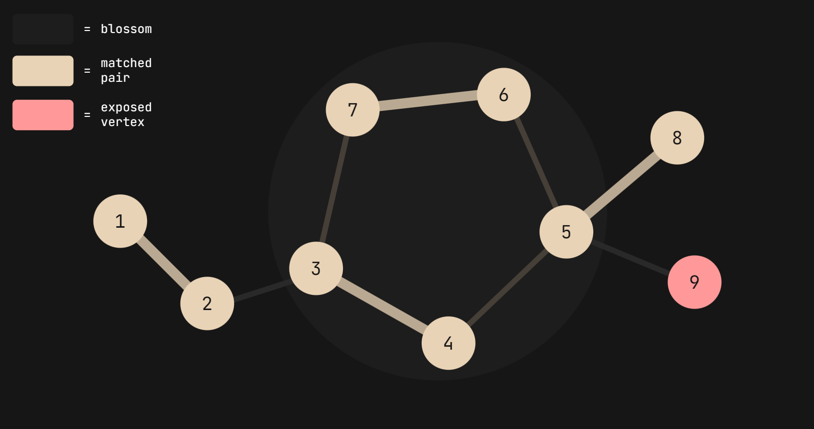
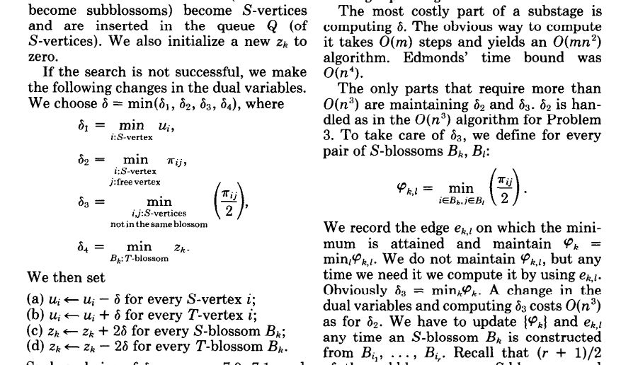
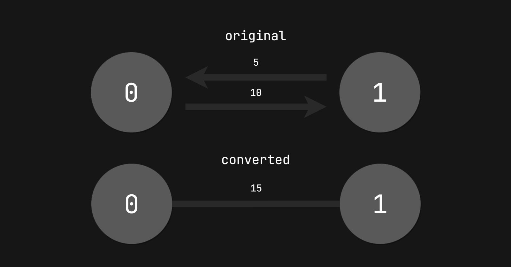

import { Code } from 'astro-expressive-code/components'
import Callout from '@/components/mdx/Callout.astro'
import Challenge from '@/components/mdx/Challenge.astro'

## Introduction

I was recently invited by the academic team "DN" (the name, surprisingly, has no inappropriate connotation) to compete in Mentor High School's second CTF iteration, [MHSCTF 2023](https://ctftime.org/event/1861). Although the competition ran for 15 days, we maxed out their 11 challenges in **just under 16 hours** (ignoring solve resets) and managed to take first place. This writeup was part of the verification process, which came with prize-receiving — enjoy!

<div class="invisible h-0! [&+*]:mt-0 [&+*_*]:mt-0">
## Matchmaker
</div>

<Challenge
  title="Matchmaker"
  solvers={[
    {
      name: 'flocto',
      href: 'https://github.com/flocto',
      avatar: 'https://github.com/flocto.png',
    },
    {
      name: 'enscribe',
      href: 'https://github.com/jktrn',
      avatar: 'https://github.com/jktrn.png',
    },
  ]}
  authors={["0xmmalik"]}
  category="PPC"
  points={9}
  remote="nc 0.cloud.chals.io [PORT]"
  flag="valentine{l0V3_i5_1n_7he_4ir}"
>
  I've just had the most brilliant idea 😮 I want to write a program that takes all the students and how much they like each other to pair them up so I can maximize the total love in the classroom! Of course, when I say "I," I really mean... "you" 😉
</Challenge>

<Callout variant="warning">
Discrete math, graph theory, and combinatorial optimization ahead! If you're unfamiliar with the mathematical symbols used in this writeup, reference this dropdown:

<Callout variant="notation" title="Complicated Math Symbols" defaultOpen={false}>
-   $$\sum$$ - Summation
-   $$\in$$ - Element of
-   $$\notin$$ - Not an element of
-   $$\subset$$ - Proper subset of
-   $$\subseteq$$ - Subset of
-   $$\emptyset$$ - Empty set
-   $$\forall$$ - For all
-   $$\exists$$ - There exists
-   $$\nexists$$ - There does not exist
-   $$\in$$ - Element of
-   $$\notin$$ - Not an element of
-   $$\ni$$ - Contains as member
-   $$\not\ni$$ - Does not contain as member
-   $$\setminus$$ - Set minus (drop)
-   $$\oplus$$ - Direct sum
-   $$\cup$$ - Union
-   $$\cap$$ - Intersection
-   $$x'$$ - Prime
</Callout>
</Callout>

**First blood!** Here are the notes the author provided alongside the challenge description, abridged for brevity:

<Callout>
- The connection times out after 60 seconds, and there will be 3 iterations.
- The input will be given in $N$ lines, where $N$ represents the number of students. The first line represents the zeroth student, the second line represents the first student, and so on ($50 < N < 100$, $N \bmod 2 = 0$).
- Each line of input contains $N - 1$ integers $R$ (ranged $0 < R < 100$, inclusive); $R$ represents a student's rating of another student at that index, repeated for everybody but themselves.
</Callout>

I've cut the notes provided in half to make it a bit more digestable. Before we continue, let's see some sample input from the server for context:

import Code1 from './assets/1.txt?raw'

<Code code={Code1} lang="py" title="matchmaker.py" />

import Code2 from './assets/2.txt?raw'

<Code code={Code2} lang="ansi" />

We can do a bit of analysis on what we've received so far.

<div className="flex">
    <div className="flex-1 [&>p]:mt-0 [&>ul]:mb-0">
        The first line, `86 60 67...`, can be translated into:
        <ul>
            <li>Student 0 -&gt; Student 1 = 86</li>
            <li>Student 0 -&gt; Student 2 = 60</li>
            <li>Student 0 -&gt; Student 3 = 67</li>
        </ul>
    </div>
    <div className="flex-1 [&>p]:mt-0 [&>ul]:mb-0">
        Let's do the same thing for the second line, `76 0 74...`:
        <ul>
            <li>Student 1 -&gt; Student 0 = 76</li>
            <li>Student 1 -&gt; Student 2 = 0</li>
            <li>Student 1 -&gt; Student 3 = 74</li>
        </ul>
    </div>
</div>

Notice how the student will always skip their own index, which aligns with the author's notes detailing how the integers "represent the students ratings of everybody but themselves." Let's continue with the rest of the notes:

<Callout>
- Determine the pairings that maximize the students' ratings for each other
- **Example**: If Student 1 -> Student 7 = 98 and Student 7 -> Student 1 = 87, and Students 1 and 7 are paired, the *score* of this pairing would be $98 + 87 = 185$
- The output should list all maximized pairs (including duplicates; order of the pairs does not matter)
- **Example**: If Student 0 -> Student 3, Student 1 -> Student 2, and Student 4 -> Student 5, the desired output is: `0,3;1,2;2,1;3,0;4,5;5,4`
- The connection will close if the output is incorrect, and reiterate if correct
</Callout>

Let's crack on with the actual algorithm which will be used for solving this!

### Graph Theory Fundamentals

This challenge is a classic example of a concept called "maximum weight matching," which is fundamental in **graph theory** and **discrete mathematics**. Although there is a relatively high prerequisite knowledge floor for understanding these concepts, I'll explain them as best as I can.

Firstly, let's define a **graph**:

<Callout variant="definition" title="Graph">
A graph is a set of **vertices** (or nodes), which are connected by **edges**. Not to be confused with the [Cartesian coordinate system](https://en.wikipedia.org/wiki/Cartesian_coordinate_system), graphs are represented by the [ordered pair](https://en.wikipedia.org/wiki/Ordered_pair) $G = (V,\ E)$ in which $V$ is a [set](<https://en.wikipedia.org/wiki/Set_(mathematics)>) of vertices and $E$ is a set of edges.
</Callout>

This is a simple graph:


<Callout variant="definition" title="Edges and Endpoints">
A set of edges $E$ is defined as:
```math
E \subset \{(x, y)\ |\ (x, y) \in V^2 \textrm{ and } x \neq y\}
```
By this definition, $x$ and $y$ are the vertices that are connected to the edge $e$, called the **endpoints**. It can also be said that $e$ is **incident** to $x$ and $y$.
</Callout>

We can create a **matching** $M \subseteq E$ within the graph $G$, in which $M$ is a collection of edges such that every vertex $v$ of $V$ is incident to at <u>most</u> one edge of $M$ (meaning two edges cannot share the same vertex). When the highest possible **cardinality** (number of matches) of $G$ is reached, the matching is considered **maximum**, and any vertex $v$ not incident to any edge in $M$ is considered **exposed**.

<Callout variant="definition" title="Maximum Matching">
Formally, a matching $M$ is said to be **maximum** if for any other matching $M'$, $|M| \geq |M'|$. In other words, $M$ is the largest matching possible.
</Callout>

For example, the following is a maximum matching performed on the graph above:


<Callout variant="definition" title="Perfect Matching">
Since there is an exposed vertex in this graph (and because the size of $V$ is odd), $G$ is not considered **perfect**. A **perfect maximum matching** occurs when the size of $V$ is even (or $|V|/2 = |E|$) and there are no exposed vertices.
</Callout>

Now, let's put **weights** into consideration (i.e. the students' ratings). With a **weighted graph** $G = (V,\ E,\ w)$, we can attribute a function $w$ that assigns a weight $w(e)$ to each edge $e \in E$ (defining $w : E \rightarrow \mathbb{N}$):



The total weight of a matching $M$, written as $w(M)$, can be defined as:

```math
w(M) = \sum_{e \in M}w(e)
```

Solving for $w(M)$ in the example graph above:

```math
w(M) = w((1, 2)) + w((3, 4)) + w((5, 6)) + w((8, 9)) \\\\
w(M) = 5 + 2 + 9 + 6 = 22
```

Our goal is to maximize $w(M)$ — it is _definitely_ not maximized above, since $W(M)$ is not at its highest possible value. We will be tackling it with a combination of two different concepts: [Edmonds' blossom algorithm](https://en.wikipedia.org/wiki/Blossom_algorithm), and the [primal-dual method](<https://en.wikipedia.org/wiki/Duality_(optimization)>). Although the blossom algorithm is typically meant for [maximum cardinality matching](https://en.wikipedia.org/wiki/Maximum_cardinality_matching) (maximizing the size of $M$ itself, and running in $\mathcal{O}(|E||V|^2)$ time), utilizing it as a subroutine alongside the primal-dual method of linear programming creates a [maximum weight matching](https://en.wikipedia.org/wiki/Maximum_weight_matching) (and running in $\mathcal{O}(|V|^3)$ time).

Firstly, let's get started with how it works.

### The Blossom Algorithm

The core idea behind the blossom algorithm itself involves two concepts: **augmenting paths** and **blossoms** (alongside **blossom contraction**).

#### Augmenting Paths

Given a graph $G = (V,\ E)$, a path $P$ in $G$ can be considered an **alternating path** if edges in the path are alternatively <u>in</u> $M$ and <u>not in</u> $M$. **Augmenting paths** are a type of alternating, odd-length path that starts and ends with two exposed vertices:



As we can see, $P$ is considered an augmenting path because it ends with two exposed vertices. Augmenting paths are special in that they can **augment** ("to improve", as per the name) the size of $M$ by one edge. To do so, simply swap the edges in $P$ that are <u>in</u> $M$ with the edges that are <u>not in</u> $M$:



<Callout variant="definition" title="Matching Augmentation">
A **matching augmentation** along an augmenting path $P$ is a process by which $M$ is replaced by $M'$, defined as such:

```math
M' = M \oplus P = (M \setminus P) \cup (P \setminus M)
```

This implies that $|M \oplus P| = |M| + 1$.
</Callout>

The reason why augmenting paths are so fundamental to the blossom algorithm is that it directly computes a maximum matching — we can reiterate the process of finding augmenting paths until no more are available in $G$. This is described well with [Berge's Theorem](https://en.wikipedia.org/wiki/Berge%27s_theorem):

<Callout variant="theorem" title="Berge's Theorem">
A matching $M$ in a graph $G$ is maximum <u>if and only if</u> there is no $M$-augmenting path in $G$.
</Callout>

Here is high-level pseudocode which describes this recursive iteration:

import Code3 from './assets/3.txt?raw'

<Code code={Code3} lang="ansi" />

<Callout variant="remark" title="Augmenting Paths">
Under the context of the above pseudocode, `find_augmenting_path(G, M){:ansi}` will always start at an exposed vertex, running a [breadth-first search](https://en.wikipedia.org/wiki/Breadth-first_search) to find an augmenting path.
</Callout>

Therefore, the blossom algorithm will always terminate with a maximum matching.

#### Blossoms (and Blossom Contraction)

The second concept that we need to understand are **blossoms**. Given a graph $G$ and a matching $M$, a blossom $B$ is a "cycle" within $G$ which consists of $2k + 1$ edges, of which exactly $k$ belong to $M$ (a blossom with two matches would have $2(2) + 1 = 5$ edges).

Let's say the algorithm created matchings in a graph with a blossom — although it isn't the maximum matching possible, we cannot augment it any further because the technically available augmenting path is longer than the shortest available path, therefore terminating subotimally:



This is where **blossom contraction** comes in. The idea is to contract the blossom $B$ into a single "super-vertex" $v_B$, and to treat it as a single vertex in the graph:



From there, we can find valid augmenting paths to augment $M$:



Finally, we can expand the blossom $B$ back into its original form, to reveal the maximum matching:



<Callout variant="theorem" title="Blossoms Theorem">
  If $G'$ a the graph formed after contraction of a blossom $B$ in $G$, then $G$ has an augmenting path <u>if and only if</u> $G'$ has an augmenting path.  
</Callout>

With the fundamental concepts of this beautiful algorithm covered, the only thing we need to wrap our heads around is how to adopt this with weighted graphs. I'll be referencing Galil's [Efficient Algorithms for Finding Maximum Matching in Graphs](http://www.cs.kent.edu/~dragan/GraphAn/p23-galil.pdf) for this section.

### Primal-Dual Method

So... the primal-dual method. I've been personally studying this topic (alongside linear programming in general, from which this method is derived from) for the past couple days after I solved the challenge, and let's just say that I absolutely have no clue what is going on:



I'll just sweep it under the rug right now, since we'll simply be "borrowing" an implementation of the above algorithm to solve this challenge. Let me know if you are knowledgable in this area and would like to contribute to this section!

### "Borrowing" an Implementation

Yes, the blossom algorithm is the most elegant thing I've ever seen. No, I am absolutely never going to implement it from scratch. I'm not even going to try. Yes, it's super fun to visualize and understand the concepts, but could you even imagine trying to implement this in code, and deal with "neighbors" and "forests" and "visited nodes?" I can't.

Currently, we have tried two implementations which work for this challenge in Python3.9: [van Rantwijk's](http://jorisvr.nl/article/maximum-matching), and the [NetworkX](https://networkx.org/documentation/stable/reference/algorithms/generated/networkx.algorithms.matching.max_weight_matching.html) Python library. Both run in $\mathcal{O}(n^3)$ time, which is still reasonable for our range of $50 < N < 100$, $N \bmod 2 = 0$. [Duan and Pettie](https://web.eecs.umich.edu/~pettie/papers/ApproxMWM-JACM.pdf) overview an approximate method for maximum weight matching, which runs in linear time.

We'll begin by parsing the input.

#### Parsing Input

Let's start with a quick recap of what the netcat server gave us. We have $N$ lines, with $N$ representing the amount of students in the classroom (in addition to being an even amount). Each line will contain $N - 1$ integers $w$ representing the rating that student has for the individual at that index (accommodating for the skipped index representing themselves).

We can pass the input into a variable `data{:py}` with [`pwntools{:py}`](https://docs.pwntools.com/en/stable/tubes.html#pwnlib.tubes.tube.tube.recvuntilS)'s `recvuntilS{:py}` method, which will receive data until it sees the specified string. We'll use `b'> '{:py}` as the string to stop at, since that's the prompt the server gives us.

Once we have the data, let's convert it into something we can work with — we'll make a 2x2 matrix so we can access both the student and their rating of another. We should also insert a 0 at the index which the student skipped themselves so the matchings don't get screwed up:

import Code4 from './assets/4.txt?raw'

<Code code={Code4} lang="py" title="matchmaker.py" />

Let's do some premature optimization and type hinting because I'm a nerd:

import Code5 from './assets/5.txt?raw'

<Code code={Code5} lang="py" title="matchmaker.py" />

Testing the script:

import Code6 from './assets/6.txt?raw'

<Code code={Code6} lang="ansi" />

Nice. Let's move on to the actual algorithm.

#### Maximum Weight Matching

This solve utilizes the [NetworkX](https://networkx.org/) library's [`algorithms.matching.max_weight_matching`](https://networkx.org/documentation/stable/reference/algorithms/generated/networkx.algorithms.matching.max_weight_matching.html) function, which takes a NetworkX `Graph` class as input (the equivalent of $G$) and returns a set of tuples (e.g. `{(29, 14), (48, 21), (0, 39), (23, 19), ...}{:py}`) representing the endpoints of the edges in $M$.

We'll import `networkx.algorithms.matching{:py}` as `matching{:py}` for our blossom algorithm wrapper, and `networkx{:py}` as `nx{:py}` for our `Graph{:py}` class. In terms of weight, we need to convert the students' ratings into "biweights" (e.g. $w(0, 1) + w(1, 0)$) because the ratings they have for each other aren't necessarily symmetric:



Each "biweight" now represents the total score of the match, which was mentioned in the author's notes. We'll be able to pass this into the `max_weight_matching(){:py}` function as the `weight{:py}` parameter.

To test the algorithm, we'll use the following dummy input (note that inverse repetition is allowed):

import Code7 from './assets/7.txt?raw'

<Code code={Code7} lang="yml" />

In theory, the following script should pair the zeroth student with the third student, and the first student with the second:

import Code8 from './assets/8.txt?raw'

<Code
  code={Code8}
  lang="py"
  title="matchmaker.py"
  showLineNumbers
  ins={{ range: "2-3,13-17" }}
  del={{ range: "1,11-12,18" }}
/>

Testing the script:

import Code9 from './assets/9.txt?raw'

<Code code={Code9} lang="ansi" />

The script works locally! Let's alter it to include the three iterations (alongside the correct formatting, e.g. `0,3;1,2;2,1;3,0;4,5;5,4{:py}`) so that it can work with the remote server:

import Code10 from './assets/10.txt?raw'

<Code
  code={Code10}
  lang="py"
  title="matchmaker.py"
  showLineNumbers
  ins={{ range: "1,11-12,14,18,20,22" }}
  del={{ range: "13,19" }}
/>

Running the script:

import Code11 from './assets/11.txt?raw'

<Code code={Code11} lang="ansi" mark="valentine{l0V3_i5_1n_7he_4ir}" />

We've successfully performed a maximum weight matching utilizing the blossom algorithm and the primal-dual method!

## Afterword

Wow, this challenge was definitely a rabbit hole. Even though the author never actually intended for us to go this deep into the math behind it (and for me to skip out on my Calculus classes to learn graph theory and discrete math), I really don't like ignoring concepts (or in this case, a wrapper function) simply because their prerequisite knowledge floors are either too high or too intimidating. Obviously I was a lost sheep when I was initially researching the blossom algorithm (as this is my first algo challenge, ever), but I just love the feeling when you tear through all the layers abstractions and finally get to the juicy, low-level bits.

I'm glad that our team was able to get first blood one this one, and I'm glad this beautiful algorithm was the first one I've learned. I hope you enjoyed this writeup, and I hope you learned something new!

### References

| Author(s) | Title | Year |
|-----------|-------|------|
| Anstee (UBC) | [MATH 523: Primal-Dual Maximum Weight Matching Algorithm](https://personal.math.ubc.ca/~anstee/math523/523Matching.pdf) | 2012 |
| Bader (TUM) | [Fundamental Algorithms, Chapter 9: Weighted Graphs](https://www5.in.tum.de/lehre/vorlesungen/fundalg/WS11/fundalg09.pdf) | 2011 |
| Brilliant | [Blossom Algorithm](https://brilliant.org/wiki/blossom-algorithm/) | - |
| Wikipedia | [Blossom Algorithm](https://en.wikipedia.org/wiki/Blossom_algorithm) | - |
| Chakrabarti (Dartmouth) | [Maximum Matching](https://www.cs.dartmouth.edu/~ac/Teach/CS105-Winter05/Notes/kavathekar-scribe.pdf) | 2005 |
| Duan, Pettie | [Linear-Time Approximation for Maximum Weight Matching](https://web.eecs.umich.edu/~pettie/papers/ApproxMWM-JACM.pdf) | 2014 |
| Galil | [Efficient Algorithms for Finding Maximum Matching in Graphs](http://www.cs.kent.edu/~dragan/GraphAn/p23-galil.pdf) | 1986 |
| Goemans (MIT) | [1. Lecture notes on bipartite matching](https://math.mit.edu/~goemans/18433S09/matching-notes.pdf) | 2009 |
| Goemans (MIT) | [2. Lecture notes on non-bipartite matching](https://math.mit.edu/~goemans/18433S15/matching-nonbip-notes.pdf) | 2015 |
| Karp (UC Berkeley) | [Edmonds's Non-Bipartite Matching Algorithm](https://web.archive.org/web/20081230183603/http://www.cs.berkeley.edu/~karp/greatalgo/lecture05.pdf) | 2006 |
| Monogon | [Blossom Algorithm for General Matching in O(n^3)](https://codeforces.com/blog/entry/92339) | 2021 |
| NetworkX | [Documentation](https://networkx.org/documentation/stable/reference/algorithms/matching.html) | - |
| Radcliffe (CMU) | [Math 301: Matchings in Graphs](https://www.math.cmu.edu/~mradclif/teaching/301F15/Matchings.pdf) | - |
| Shoemaker, Vare | [Edmonds' Blossom Algorithm](https://stanford.edu/~rezab/classes/cme323/S16/projects_reports/shoemaker_vare.pdf) | 2016 |
| Sláma | [The Blossom algorithm](https://www.youtube.com/watch?v=3roPs1Bvg1Q) | 2021 |
| Stein (Columbia) | [Handouts - Matchings](http://www.columbia.edu/~cs2035/courses/ieor6614.S16/index.html) | 2016 |
| Vazirani (UC Berkeley) | [Lecture 3: Maximum Weighted Matchings](https://people.eecs.berkeley.edu/~satishr/cs270/sp11/rough-notes/matching.pdf) | - |
| van Rantwijk | [Maximum Weighted Matching](http://jorisvr.nl/article/maximum-matching) | 2008 |
