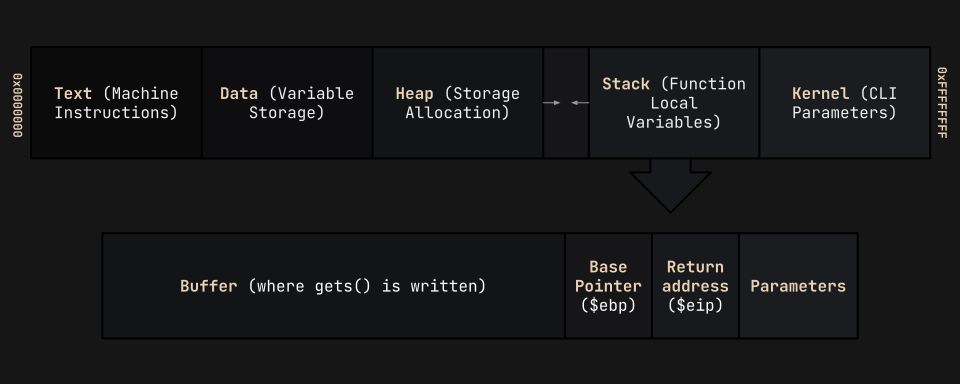

import { Code } from 'astro-expressive-code/components'
import Callout from '@/components/mdx/Callout.astro'
import Challenge from '@/components/mdx/Challenge.astro'

## Buffer overflow 1

<Challenge
  title="Buffer overflow 1"
  solvers={[
    {
      name: 'enscribe',
      href: 'https://github.com/jktrn',
      avatar: 'https://github.com/jktrn.png',
    },
  ]}
  authors={['Sanjay C.', 'Lt. "Syreal" Jones']}
  category="pwn"
  points={300}
  files={['vuln', 'vuln.c']}
  remote="$ nc saturn.picoctf.net [PORT]"
  flag="picoCTF{ov3rfl0ws_ar3nt_that_bad_[REDACTED]}"
>
  Control the return address.  
  Now we're cooking! You can overflow the buffer and return to the flag function in the program.
</Challenge>

<Callout variant="warning">
  This is an **instance-based** challenge. Port info will be redacted alongside the last eight characters of the flag, as they are dynamic.
</Callout>

import Code5 from './assets/5.txt?raw'

<Code code={Code5} lang="ansi" />

Let's check out our source code:

import Code6 from './assets/6.txt?raw'

<Code code={Code6} lang="c" title="vuln.c" />

In the `vuln(){:c}` function, we see that once again, the `gets(){:c}` function is being used. However, instead of triggering a segmentation fault like Buffer overflow 0, we will instead utilize its vulnerability to write our own addresses onto the stack, changing the return address to `win(){:c}` instead.

### I: Explaining the Stack

Before we get into the code, we need to figure out how to write our own addresses to the stack. Let's start with a visual:

Whenever we call a function, multiple items will be "pushed" onto the **top** of the stack (in the diagram, that will be on the right-most side). It will include any parameters, a return address back to `main(){:c}`, a base pointer, and a buffer. Note that the stack grows **downwards**, towards lower memory addresses, but the buffer is written **upwards**, towards higher memory addresses.

We can "smash the stack" by exploiting the `gets(){:c}` function. If we pass in a large enough input, it will overwrite the entire buffer and start overflowing into the base pointer and return address within the stack:

If we are deliberate of the characters we pass into `gets(){:c}`, we will be able to insert a new address to overwrite the return address to `win(){:c}`. Let's try!

### II: Smashing the Stack

To start, we first need to figure out our "offset". The offset is the distance, in characters, between the beginning of the buffer and the position of the `$eip{:ansi}`. This can be visualized with the `gdb-gef` utility by setting a breakpoint (a place to pause the runtime) in the `main(){:c}` function:

import Code7 from './assets/7.txt?raw'

<Code code={Code7} lang="ansi" mark="0x80492d7" />

Analyzing this breakpoint, if we look at the arrow on the assembly code, we can see that its address is the exact same as the `$eip{:ansi}` (`0x80492d7{:ansi}`). Let's try overflowing this register by passing an unhealthy amount of `A`s into the program:

import Code8 from './assets/8.txt?raw'

<Code code={Code8} lang="ansi" mark="0x41414141" />

Look what happened: our program threw a SIGSEGV (segmentation) fault, as it is trying to reference the address `0x41414141{:ansi}`, which doesn't exist! This is because our `$eip{:ansi}` was overwritten by all our `A`s (`0x41` in hex = `A` in ASCII).

### III: Finessing the Stack

Although we've managed to smash the stack, we still don't know the offset (**how many** `A`s we need to pass in order to reach the `$eip`). To solve this problem, we can use the pwntools `cyclic` command, which creates a string with a recognizable cycling pattern for it to identify:

import Code9 from './assets/9.txt?raw'

<Code code={Code9} lang="ansi" mark="0x6161616c" />

We can see that `$eip{:ansi}` is currently overflowed with the pattern `0x6161616c{:ansi}` (`"laaa"{:ansi}`). let's search for this pattern using `pattern search`:

import Code10 from './assets/10.txt?raw'

<Code code={Code10} lang="ansi" mark="0x6161616c" />

To figure out which offset we need to use, we can use `readelf` to analyze header of the `vuln` executable:

import Code11 from './assets/11.txt?raw'

<Code code={Code11} lang="ansi" />

Our binary is in little endian, we know that 44 `A`s are needed in order to reach the `$eip{:ansi}`. The only thing we need now before we create our exploit is the address of the `win(){:c}` function, which will be appended to the end of our buffer to overwrite the `$eip{:ansi}` on the stack:

import Code12 from './assets/12.txt?raw'

<Code code={Code12} lang="ansi" />

Win is at `0x80491f6{:ansi}`, but we need to convert it to the little endian format. You can do this with the pwntools `p32(){:c}` command, which results in `\xf6\x91\x04\x08{:ansi}`.
Let's make a final visual of our payload:

Let's write our payload and send it to the remote server with Python3/pwntools:

import Code13 from './assets/13.txt?raw'

<Code code={Code13} lang="py" title="solve.py" />

Let's try running the script on the server:

import Code14 from './assets/14.txt?raw'

<Code code={Code14} lang="ansi" mark="picoCTF{addr3ss3s_ar3_3asy_[REDACTED]}" />

We have completed our first `ret2win` buffer overflow on a x32 binary! Yet, this is just the beginning. How about we spice things up a little bit?

### IV: Automating the Stack

Although the concept of buffer overflows can seem daunting to newcomers, experienced pwners will often find these sorts of challenges trivial, and don't want to spend the effort manually finding offsets and addresses just to send the same type of payload. This is where our best friend comes in: **pwntools** helper functions and automation! Let's start with the first part - the `$eip{:ansi}` offset for x32 binaries.

The main helper we will be using is [`pwnlib.elf.corefile`](https://docs.pwntools.com/en/stable/elf/corefile). It can parse [core dump](https://www.ibm.com/docs/en/aix/7.1?topic=formats-core-file-format) files, which are generated by Linux whenever errors occur during a running process. These files take an **image** of the process when the error occurs, which may assist the user in the debugging process. Remember when we sent a large `cyclic` pattern which was used to cause a segmentation fault? We'll be using the core dump to view the state of the registers during that period, without needing to step through it using GDB. We'll be using the coredump to eventually find the offset!

<Callout>
  Many Linux systems do not have core dumps properly configured. For bash, run `ulimit -c unlimited` to generate core dumps of unlimited size. For tsch, run `limit coredumpsize unlimited`. By default, cores are dumped into either the current directory or `/var/lib/systemd/coredump`.
</Callout>

Before we start, let's work through the steps with command-line Python. First, let's import the pwntools global namespace and generate an `elf` object using pwntool's `ELF(){:py}`:

import Code15 from './assets/15.txt?raw'

<Code code={Code15} lang="ansi" />

We can then generate a `cyclic(){:py}` payload and start a local process referencing the aforementioned `elf` object. Sending the payload and using the [`.wait(){:py}`](https://www.educba.com/python-wait/) method will throw an exit code -11, which signals a segmentation fault and generates a core dump.

import Code16 from './assets/16.txt?raw'

<Code code={Code16} lang="ansi" mark={12} />

We can now create a corefile object and freely reference registers! To find the offset, we can simply call the object key within `cyclic_find(){:py}`.

import Code17 from './assets/17.txt?raw'

<Code code={Code17} lang="ansi" mark="0x6161616c" />

Now that we know how ELF objects and core dumps work, let's apply them to our previous script. Another cool helper I would like to implement is [`flat(){:py}`](https://docs.pwntools.com/en/stable/util/packing.html) (which has a great tutorial [here](https://www.youtube.com/watch?v=AMDbbuLaXfk), referred to by the legacy alias `fit(){:py}`), which flattens arguments given in lists, tuples, or dictionaries into a string with `pack(){:py}`. This will help us assemble our payload without needing to concatenate seemingly random strings of `A`s and little-endian addresses, increasing readability.

This is my final, completely automated script:

import Code18 from './assets/18.txt?raw'

<Code code={Code18} lang="py" title="solve.py" />

Let's run the script on the server:

import Code19 from './assets/19.txt?raw'

<Code code={Code19} lang="ansi" mark="picoCTF{addr3ss3s_ar3_3asy_[REDACTED]}" />

We've successfully automated a solve on a simple x32 buffer overflow!