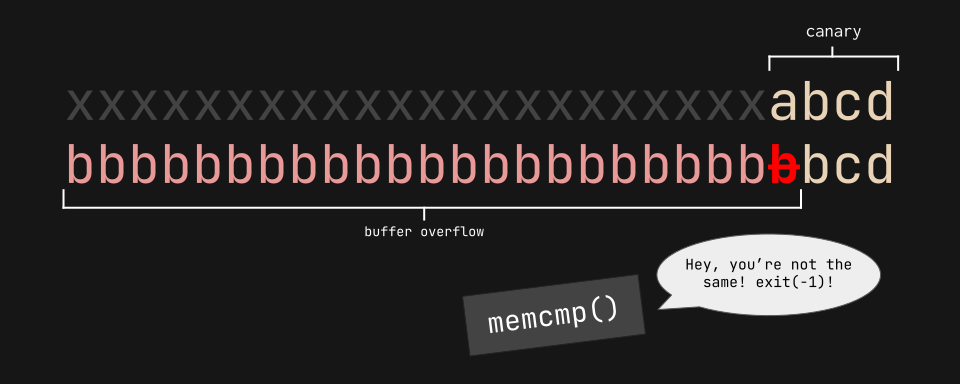
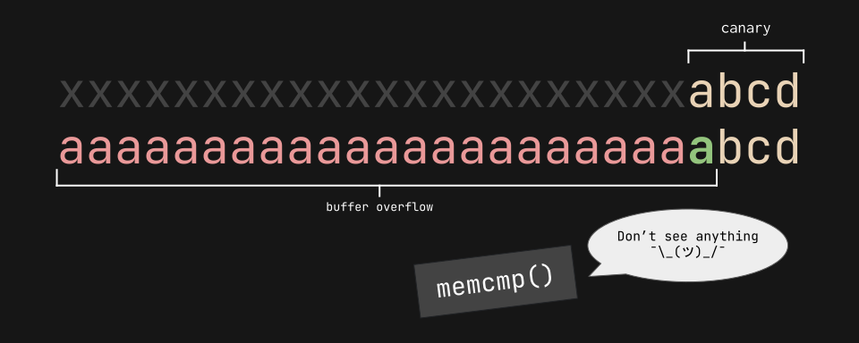
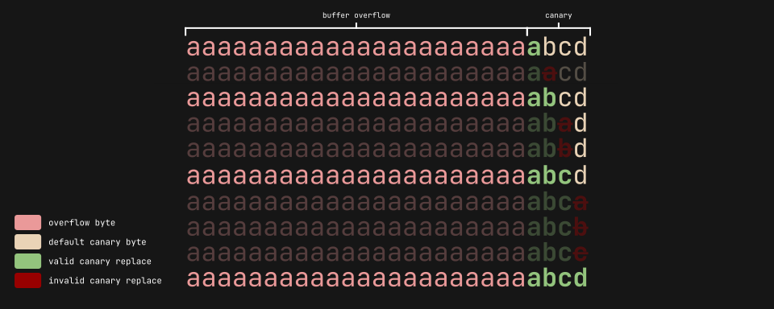

import { Code } from 'astro-expressive-code/components'
import Challenge from '@/components/mdx/Challenge.astro'
import Callout from '@/components/mdx/Callout.astro'

## Buffer overflow 3

<Challenge
  title="Buffer overflow 3"
  solvers={[
    {
      name: 'jktrn',
      href: 'https://github.com/jktrn',
      avatar: 'https://github.com/jktrn.png',
    },
  ]}
  authors={['Sanjay C.', 'Palash Oswal']}
  category="Binary Exploitation (pwn)"
  points={300}
  files={['vuln', 'vuln.c']}
  remote="$ nc saturn.picoctf.net [PORT]"
  flag="picoCTF{Stat1C_c4n4r13s_4R3_b4D_[REDACTED]}"
>
  Do you think you can bypass the protection and get the flag? It looks like Dr. Oswal added a stack canary to this program to protect against buffer overflows. Connect with it using: `$ nc saturn.picoctf.net [PORT]{:ansi}`
</Challenge>

<Callout variant="warning">
  Warning: This is an **instance-based** challenge. Port info will be redacted alongside the last eight characters of the flag, as they are dynamic.
</Callout>

import Code28 from './assets/28.txt?raw'

<Code code={Code28} lang="ansi" mark={5} />

### I: Finding the Canary

So, Dr. Oswal apparently implemented a [stack canary](https://www.sans.org/blog/stack-canaries-gingerly-sidestepping-the-cage/), which is just a **dynamic value** appended to binaries during compilation. It helps detect and mitigate stack smashing attacks, and programs can terminate if they detect the canary being overwritten. Yet, `checksec` didn't find a canary. That's a bit suspicious... but let's check out our source code first:

import Code29 from './assets/29.txt?raw'

<Code code={Code29} lang="c" title="vuln.c" />

If you look closely, you might be able to see why `checksec` didn't find a stack canary. That's because it's actually a static variable, being read from a `canary.txt` on the host machine. Canaries that aren't implemented by the compiler are not really canaries!

Knowing that the canary will be four bytes long (defined by `CANARY_SIZE{:c}`) and immediately after the 64-byte buffer (defined by `BUFSIZE{:c}`), we can write a brute forcing script that can determine the correct canary with a simple trick: **by not fully overwriting the canary the entire time!** Check out this segment of source code:

import Code30 from './assets/30.txt?raw'

<Code code={Code30} lang="c" title="vuln.c" startLineNumber={60} />

This uses `memcmp(){:c}` to determine if the current canary is the same as the global canary. If it's different, then the program will run `exit(-1){:c}`, which is a really weird/invalid exit code and represents "[abnormal termination](https://softwareengineering.stackexchange.com/questions/314563/where-did-exit-1-come-from)":

However, if we theoretically overwrite the canary with a single correct byte, `memcmp(){:c}` won't detect anything!:

### II: Bypassing the Canary

We can now start writing our script! My plan is to loop through all printable characters for each canary byte, which can be imported from `string{:c}`. Let's include that in our pwn boilerplate alongside a simple function that allows us to swap between a local and remote instance:

import Code31 from './assets/31.txt?raw'

<Code code={Code31} lang="py" title="solve.py" />

Here's the big part: the `get_canary(){:py}` function. I'll be using [`pwnlib.log{:py}`](https://docs.pwntools.com/en/stable/log.html) for some spicy status messages. My general process for the brute force is visualized here if you're having trouble:

I'll be initially sending 64 + 1 bytes, and slowly appending the correct canary to the end of my payload until the loop has completed four times:

import Code32 from './assets/32.txt?raw'

<Code code={Code32} lang="py" title="solve.py" collapse="1-14" />

The final thing we need to figure out is the offset between the canary to ``$eip{:ansi}``, the pointer register, which we will repopulate with the address of `win(){:c}`. We can do this by appending a cyclic pattern to the end of our current payload (64 + 4 canary bytes) and reading the Corefile's crash location, which will be the ``$eip{:ansi}``:

<Callout>
  My canary is `abcd` because I put that in my `canary.txt`. It will be different on the remote server!
</Callout>

import Code33 from './assets/33.txt?raw'

<Code code={Code33} lang="ansi" mark={21} />

The offset is 16, so we'll have to append that amount of bytes to the payload followed by the address of `win(){:c}`. I'll combine all sections of our payload together with `flat(){:py}`, and then hopefully read the flag from the output:

import Code34 from './assets/34.txt?raw'

<Code code={Code34} lang="py" title="solve.py" collapse="1-31" />

Here is my final script with all of its components put together:

import Code35 from './assets/35.txt?raw'

<Code code={Code35} lang="py" title="solve.py" />

Running the script:

import Code36 from './assets/36.txt?raw'

<Code code={Code36} lang="ansi" mark={9} />

We've successfully performed a brute force on a vulnerable static canary!
