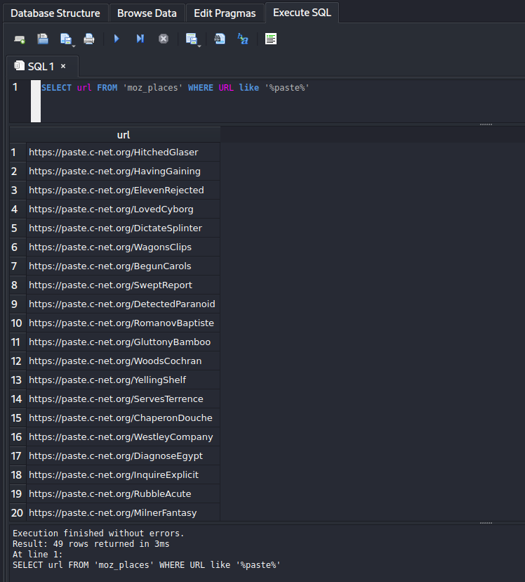

import { Code } from 'astro-expressive-code/components'
import Callout from '@/components/mdx/Callout.astro'
import Challenge from '@/components/mdx/Challenge.astro'

<div class="invisible h-0! [&+*]:mt-0 [&+*_*]:mt-0">
## Blind Infection 1
</div>

<Challenge
  title="Blind Infection 1"
  authors={["Battlemonger"]}
  category="Forensics"
  points={470}
  solves={23}
  files={["chall.zip"]}
  flag="SEKAI{R3m3b3r_k1Dz_@lway5_84cKUp}"
>
  *Investigator*: It looks like your files were encrypted — do you have a backup?  
  *Me*: Online, yes, but even the backup links got encrypted. Can you help me find anything?  
</Challenge>

<Callout variant="warning">
    **Warning**: This payload contains ransomware. Consider using a fresh virtual machine, as you may risk losing your data. Although surface analysis is safe (and the ransomware is user-triggered), proceed with caution.
</Callout>

### Reconnaissance

import Code1 from './assets/1.txt?raw'

<Code code={Code1} lang="ansi" />

Unzipping the provided `.zip` provides us with four Linux directories: `etc/`, `home/`, `root/`, and `snap/`. Let's start off with a little bit of reconnaissance.

A good habit with these types of challenges is to check `etc/passwd`, a list of system accounts. If we `grep{:sh}` for those with root permission, we find that the user `sekaictf` was a superuser:

import Code2 from './assets/2.txt?raw'

<Code code={Code2} lang="ansi" />

Although it isn't necessarily pertinent to the challenge, make sure you check `home/sekaictf/.bash_history` alongside `grep -r "SEKAI{{:sh}` - they can be pretty handy sometimes!

### Document Recovery

Next, we'll look for user files. The `Documents/` and `Pictures/` folder of the `sekaictf` user has them, but everything seems to be encrypted with no indication of the encryption method used.

The description talks about having a backup for the encrypted files in the form of **links**, meaning we should be looking for browser-related content (i.e. search history). Ubuntu 22 stores Firefox as a `SnapCraft` app in `snap/` by default — we can also grep for the term `'firefox'{:sh}` for its location:

import Code3 from './assets/3.txt?raw'

<Code code={Code3} lang="ansi" />

Firefox is located in `home/sekaictf/snap/firefox/`, while the profile information of the user is located at `firefox/common/.mozilla/firefox/p3zapakd.default/`. `p3zapakd` is the name of the user.

Firefox stores your visit history in the `places.sqlite` SQLite database (read more about how Firefox stores your information [here](https://support.mozilla.org/en-US/kb/profiles-where-firefox-stores-user-data)). You can use an [online tool](https://inloop.github.io/sqlite-viewer/) or [`sqlite3`](https://www.npmjs.com/package/sqlite3) to view it! The table we need is `moz_places{:sql}`, which is a hefty piece of work with more than 750+ URLs:


Yes, it's super meticulous, but a true forensics investigator would champ it through! Scrolling through the table, we notice that the user follows a certain trend, as following:

1. The user searches about a topic on Google
2. The user visits that appear in the search results
3. The user visits the URL https://paste.c-net.org with a subdirectory consisting of two random words (possibly to bookmark them for later)

Visiting any of these pastes and recognizing that the content should be the same as encrypted files in the `Documents/` folder is key to Part 1. This is further facilitated by the fact that names of the encrypted files in `Documents/` are very descriptive:

import Code4 from './assets/4.txt?raw'

<Code code={Code4} lang="ansi" />

Instinctively, we would want to visit all these pastes.

There are 50 instances of the URL https://paste.c-net.org in the table and visiting them one-by-one isn't very 1337 h4xx0r. We can execute some simple SQL on the table to extract all instances:

```sql
SELECT url FROM 'moz_places' WHERE URL like '%paste%'
```



Let's write a simple `curl` script with Python:

import Code5 from './assets/5.txt?raw'

<Code code={Code5} lang="py" title="solve.py" />

Running the script:

import Code6 from './assets/6.txt?raw'

<Code code={Code6} lang="ansi" mark="SEKAI{R3m3b3r_k1Dz_@lway5_84cKUp}" />
