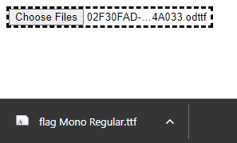
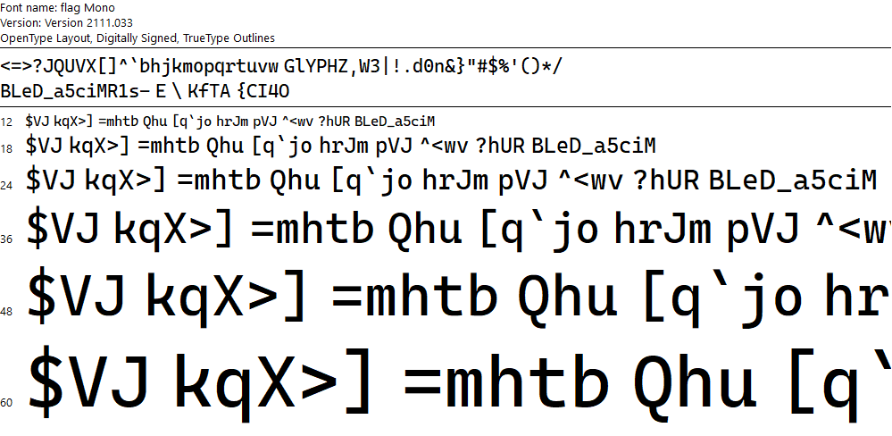
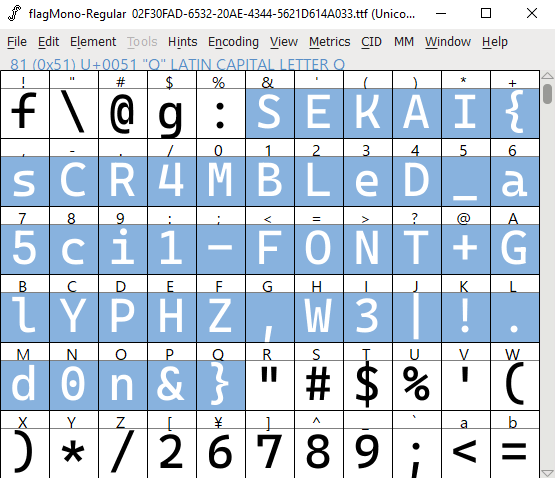

import { Code } from 'astro-expressive-code/components'
import Callout from '@/components/mdx/Callout.astro'
import Challenge from '@/components/mdx/Challenge.astro'

## Broken Converter

<Challenge
  title="Broken Converter"
  authors={["blueset"]}
  category="Forensics"
  points={100}
  solves={94}
  files={["Assignment-broken.xps"]}
  flag="SEKAI{sCR4MBLeD_a5ci1-FONT+GlYPHZ,W3|!.d0n&}"
>
  Miku has finally finished her assignment and is ready to submit - but for some reason, the school requires all assignments to be submitted as `.xps` files. Miku found a converter online and used the converted file for submission. The file looked good at first, but it seems as if there's something broken in the converter. Can you help her figure out what's wrong?
</Challenge>

<Callout>
  This challenge shares the same file as *flag Mono*.
</Callout>

Reading the Wikipedia page for [Open XML Paper Specification](https://en.wikipedia.org/wiki/Open_XML_Paper_Specification)/`.xps` files, we can see that `Assignment-broken.xps` is actually a `.zip` archive:

> An XPS file is a [ZIP](<https://en.wikipedia.org/wiki/ZIP_(file_format)> 'ZIP (file format)') archive using the [Open Packaging Conventions](https://en.wikipedia.org/wiki/Open_Packaging_Conventions 'Open Packaging Conventions'), containing the files which make up the document. These include an XML markup file for each page, text, [embedded fonts](https://en.wikipedia.org/wiki/Odttf 'Odttf'), raster images, 2D [vector graphics](https://en.wikipedia.org/wiki/Vector_graphics 'Vector graphics'), as well as the [digital rights management](https://en.wikipedia.org/wiki/Digital_rights_management 'Digital rights management') information. The contents of an XPS file can be examined by opening it in an application which supports ZIP files.

Renaming the file extension to `.zip` will provide us with some files:

In `Resources/` we can find `02F30FAD-6532-20AE-4344-5621D614A033.odttf`, which is an "Obfuscated OpenType" file:

The ODTTF [Wikipedia](https://en.wikipedia.org/wiki/ODTTF) page states that `.odttf` files are obfuscated by performing a XOR operation on the first 32 bytes of the font file, using its GUID (or the filename) as the key:

> According to the source code of [Okular](https://en.wikipedia.org/wiki/Okular 'Okular') (see function `parseGUID(){:c}` and method `XpsFile::loadFontByName(){:c}`), the first 32 bytes of the font file are obfuscated by XOR using the font file name (a GUID). The rest of the file is normal OpenType.

This is also mentioned in section 9.1.7.3 of the [XPS Standard](https://www.ecma-international.org/wp-content/uploads/XPS-Standard.pdf):

> Perform an XOR operation on the first 32 bytes of the binary data of the obfuscated font part with the array consisting of the bytes referred to by the placeholders B37, B36, B35, B34, B33, B32, B31, B30, B20, B21, B10, B11, B00, B01, B02, and B03, in that order and repeating the array once. The result is a non-obfuscated font.

Although you can totally create a XOR script and perform it manually, you can also find scripts online. [odttf2ttf](https://github.com/somanchiu/odttf2ttf) provides an online demo [here](https://somanchiu.github.io/odttf2ttf/js/demo), which is a simple drag-and-drop with instant conversion:

Now that it's deobfuscated, we can open the file in Windows Font Viewer. The phrase `GlYPHZ,W3|!.d0n&}` is visible at the top, but the rest of the flag isn't properly ordered:

However, opening the `.ttf` file in programs that sort by ASCII, such as [FontForge](https://fontforge.org/) or [FontDrop!](https://fontdrop.info/), will yield a flag:

