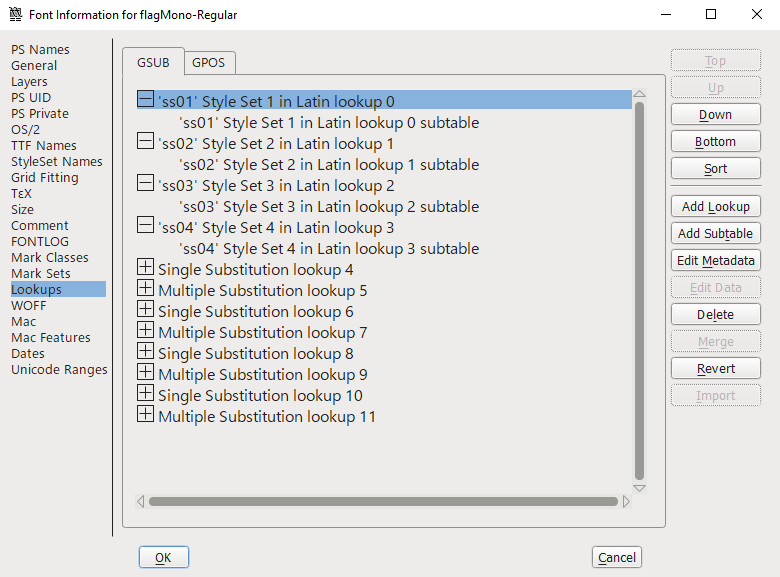
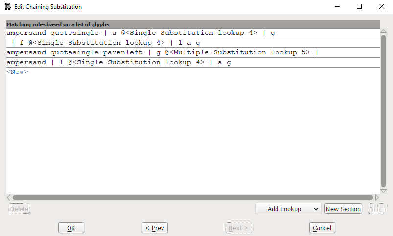
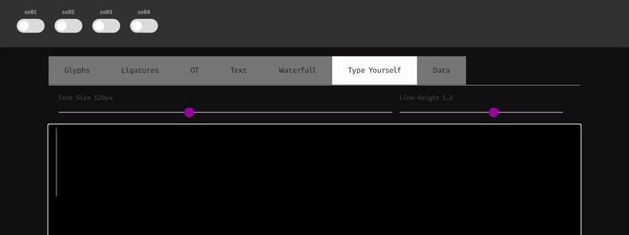

import Callout from '@/components/mdx/Callout.astro'
import Challenge from '@/components/mdx/Challenge.astro'

## flag Mono

<Challenge
  title="flag Mono"
  authors={["blueset"]}
  category="Forensics"
  points={368}
  solves={47}
  files={["Assignment-broken.xps"]}
  flag="SEKAI{OpenTypeMagicGSUBIsTuringComplete}"
>
  When writing the assignment, Miku used a font called **flag Mono**. Despite it looking just like a regular monospaced font, it claims itself to be **stylistic** in various ways.  
  "Perhaps there is something special about it", Miku thought.
</Challenge>

<Callout>
  This challenge shares the same file as *Broken Converter*.
</Callout>

If you inspect the font info in [FontForge](https://fontforge.org/) with <kbd>Ctrl</kbd> + <kbd>Shift</kbd> + <kbd>F</kbd>, you can see in the Lookup tab that four different "Style Sets" have been implemented into this font:

These are called "OpenType Stylistic Sets." According to its official Microsoft [documentation](https://docs.microsoft.com/en-us/typography/opentype/spec/features_pt#ssxx):

> In addition to, or instead of, stylistic alternatives of individual glyphs [...], some fonts may contain sets of stylistic variant glyphs corresponding to portions of the character set, e.g. multiple variants for lowercase letters in a Latin font.

In FontForge you can actually view the ruleset for these styles with the `Edit Data` button. This is the ruleset for `ss01`:

> ampersand quotesingle | a @&lt;Single Substitution lookup 4&gt; | g  
> | f @&lt;Single Substitution lookup 4&gt; | l a g  
> ampersand quotesingle parenleft | g @&lt;Multiple Substitution lookup 5&gt; |  
> ampersand | l @&lt;Single Substitution lookup 4&gt; | a g

Let's test out typing `flag` on [FontDrop!](https://fontdrop.info/) and changing the stylistic set:

