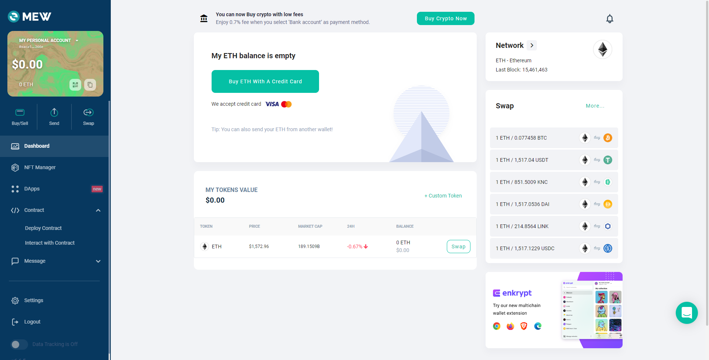
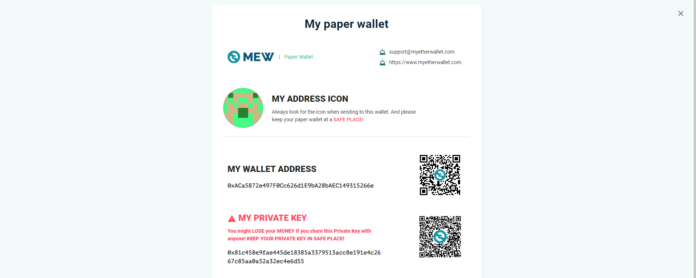

import { Code } from 'astro-expressive-code/components'
import Callout from '@/components/mdx/Callout.astro'
import Challenge from '@/components/mdx/Challenge.astro'

## Symbolic Needs 2

<Challenge
  title="Symbolic Needs 2"
  authors={["Battlemonger"]}
  category="Forensics"
  points={482}
  solves={18}
  files={["memdump"]}
  flag="SEKAI{0x81c458e9fae445de18385a3379513acc8e191e4c2667c85aa0a52a32ec4e6d55}"
>
  Recover the private key of the wallet address `0xACa5872e497F0Cc626d1E9bA28bAEC149315266e`.  
  Submit the key wrapped with `SEKAI{}`.
</Challenge>

Let's follow up from the last proglem with the `linux.psaux` plugin, to gather and display all processes:

import Code16 from './assets/16.txt?raw'

<Code code={Code16} lang="ansi" />

It looks like the scammer was serving some base32 through Netcat. We also notice that it's piped into a `.pyc` file, which is Python bytecode.

Run the command `echo [PUT YOUR BASE32 HERE] | base32 -d > file.pyc` to convert this base32 into a binary. Let's run the `.pyc` with Python3:

import Code17 from './assets/17.txt?raw'

<Code code={Code17} lang="ansi" />

Passing a random argument results in a `FileNotFoundError`:

import Code18 from './assets/18.txt?raw'

<Code code={Code18} lang="ansi" />

We can find this wordlist in the [bitcoin/bips](https://github.com/bitcoin/bips/blob/master/bip-0039/english.txt) repository. If you run the binary again with the same argument it just outputs "Wrong." We'll need to disassemble this.

Disassemble the bytecode with the `dis` module:

import Code19 from './assets/19.txt?raw'

<Code code={Code19} lang="py" title="disassembled.py" />

import Code20 from './assets/20.txt?raw'

<Code code={Code20} lang="ansi" />

Let's analyze this:

1. The program loads the [`bip39`](https://github.com/bitcoin/bips/blob/master/bip-0039/english.txt) wordlist. It's a standard wordlist used to secure crypto wallets with a mnemonic.
2. It then stores a hardcoded integer in the variable `code`, converts to binary and `zfill`s it so that length is multiple of 12.
3. Next, it converts each 12 bits to decimal, and subtracts one. This number is used as an index, and appends the corresponding word from `bip39` in an array called `mnemonic`.
4. No matter what, the code will always print "Wrong"! :D

Let's write a simple script to find the mnemonics with this information:

import Code21 from './assets/21.txt?raw'

<Code code={Code21} lang="py" title="mnemonic.py" />

Running the script:

import Code22 from './assets/22.txt?raw'

<Code code={Code22} lang="ansi" />

Looks like we've got our mnemonic!

Now we can visit [MyEtherWallet](https://www.myetherwallet.com/wallet/access/software?type=mnemonic) and enter the 24-word mnemonic phrase. Look for the `0xACa5872e497F0Cc626d1E9bA28bAEC149315266e` wallet and gain access to the dashboard:

To access the private key, go to `My personal account` -> `View paper wallet`:

The flag is `SEKAI{0x81c458e9fae445de18385a3379513acc8e191e4c2667c85aa0a52a32ec4e6d55}`.