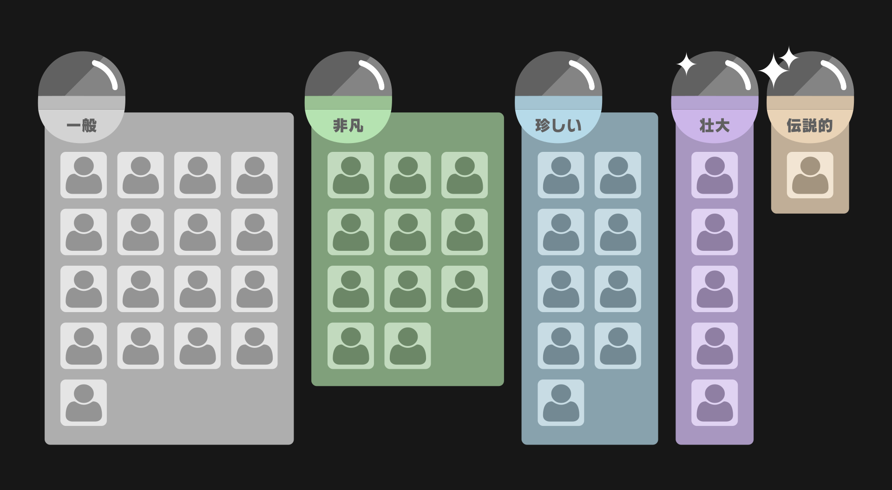
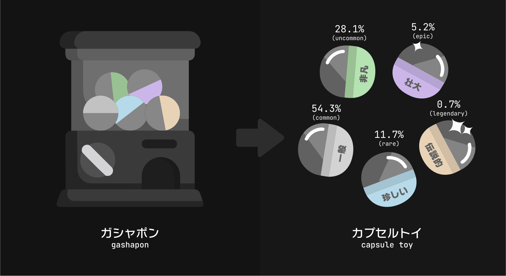
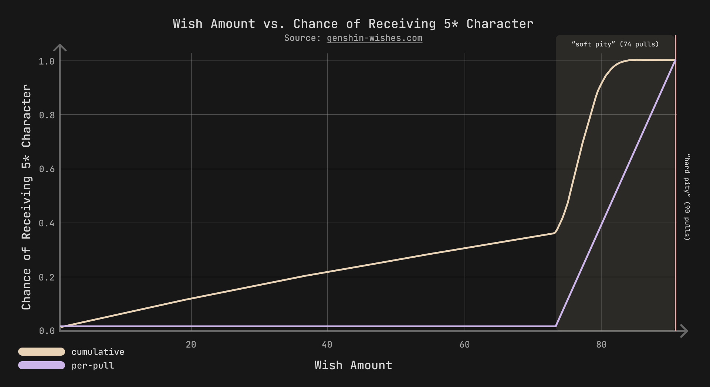
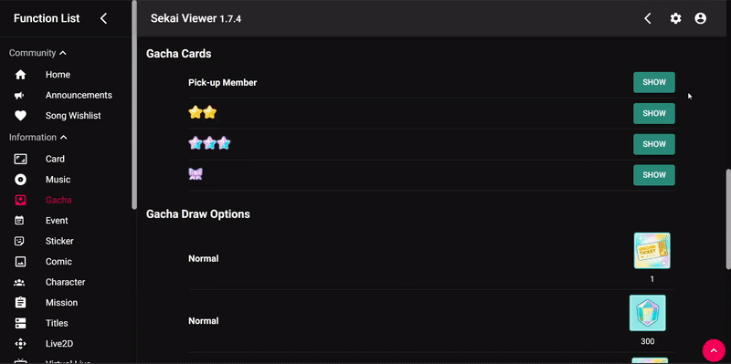
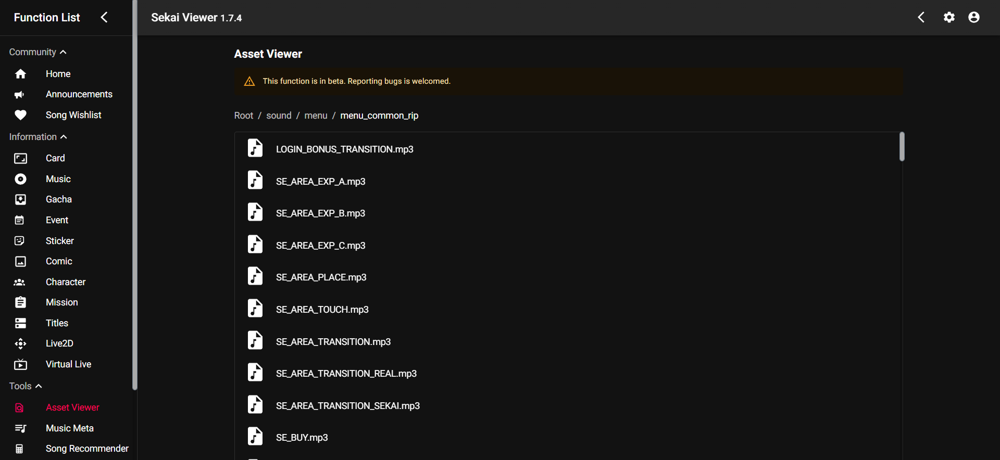
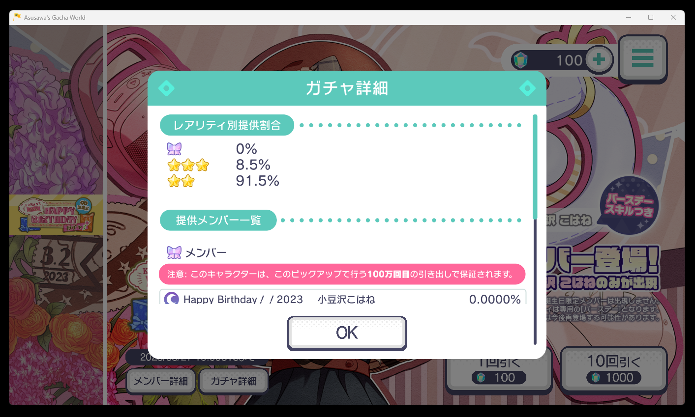
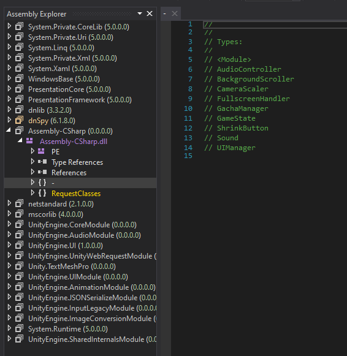

import Challenge from '@/components/mdx/Challenge.astro'
import StaticTweet from '@/components/mdx/StaticTweet.astro'
import VideoPreview from './assets/preview.mp4'

## Intro

This blog post details my design process for a beginner-friendly reverse-engineering challenge that I authored this year for [SekaiCTF 2023](https://ctftime.org/event/1923/)——a fully functional, hackable replica of Project Sekai's "gacha" system. Here is a snippet of the challenge, featured in the CTF's first teaser:

<StaticTweet
  avatar="https://pbs.twimg.com/profile_images/1516810637858545668/UKYxlCqh_400x400.jpg"
  username="Project Sekai CTF"
  handle="ProjectSEKAIctf"
  date="August 7, 2023"
  src="https://twitter.com/ProjectSEKAIctf/status/1688745825504268288"
  video={VideoPreview}
>
  Come play SekaiCTF 2023, where we have... Wait, this is a CTF challenge?!
  [#SekaiCTF](https://twitter.com/hashtag/SekaiCTF)
  [#Teaser](https://twitter.com/hashtag/Teaser)
</StaticTweet>

Dubbed "Azusawa's Gacha World," this challenge took heavy theming inspiration from a team friend with the handle [@stypr](https://github.com/stypr), who singlehandedly spent around USD$20,000 on [Project Sekai](https://projectsekai.fandom.com/wiki/Project_SEKAI_COLORFUL_STAGE!) (the mobile rhythm game). He also runs a website called [azusawa.world](https://azusawa.world), which features his experiences with a character named [Kohane Azsuawa](https://projectsekai.fandom.com/wiki/Azusawa_Kohane) (小豆沢こはね)——this challenge is part of the recurring meme with the character.

However, before we get into the challenge itself, let's talk first about the game and genre that inspired it.

### The "Gacha Game" Model

In the context of video games, a **gacha game** is a model which implements a "random vending machine" mechanic as a method of obtaining rare characters, cards, or other collectible items (collectively referred to as "**drops**" for the rest of this blog post, for brevity). The name originates from the Japanese word _gashapon_ (ガチャポン), an onomatopoeia for the act of cranking the vending machine's handle (and Bandai's trademark name). The term is also used as a verb to describe the act of "rolling" or "pulling" for a desired drop (e.g. "I'm going to gacha for this character").

The gacha mechanic is most commonly found in free-to-play mobile games, and is often implemented as a monetization strategy. Players are incentivized to exchange their in-game currency to "pull," "spin," "roll," etc. on specific "banners" which feature a particular **pool** of drops. In most cases, drops are assigned various tiers of arbitrary rarity, with the highest tier rarities having the lowest percentage drop rates. This creates opportunity for players to spend money on in-game currency for the highest chance of obtaining the rarest items.

Gacha pools often look something like this, with similar semantic colors representing each of the rarities:



Rolling on this banner provides a chance to receive a drop from each of the rarity tiers:



This transformation from a simple toy capsule game catered towards younger children into a fully fledged business model has been subject to countless scrutiny and controversy, mainly due to its predatory monetization system and potential to develop gambling addictions within its playerbase. Many legal jurisdictions require gacha games to disclose the probability of obtaining each rarity tier (which will be important later in the challenge).

### "Pity" Mechanics

Let's also explain an important aspect of my challenge that's a common pattern in gacha games: "pity."

In a multitude of different gacha games, a "guaranteed drop" mechanic, colloquially referred to as a "pity," exists for unlucky players who have rolled a certain amount of times without obtaining their desired drop. There are three types of pity systems that are typically used in gacha games: **soft pity**, **hard pity**, and **soft/hard pity**. In soft pity, the chance to obtain a drop of the highest rarity increases with each pull. In hard pity, the player is guaranteed to obtain a drop of the highest rarity once the pull counter reaches a certain threshold. Soft/hard pity is a hybrid of both of these mechanics.

Let's take the gacha system of a popular gacha game as of writing, [Genshin Impact](https://en.wikipedia.org/wiki/Genshin_Impact), as an example. As banners in this game utilize the soft/hard pity system, the player is guaranteed to obtain a 5-star character after 90 pulls (hard pity), and the chance to obtain a 5-star character increases with each pull after 74 pulls (soft pity):



By increasing the chance to obtain a 5-star character with each pull, the player is more likely to obtain a 5-star character before the hard pity threshold is reached.

However, Project Sekai doesn't utilize this system. It uses the simple "hard pity" system, with a small change: your pulls add to a "gacha bonus points" counter, which guarantees a 4-star and "pick-up" (featured character) 4-star at 50 and 100 pulls, respectively. You get 0.5 points for a pull using free currency, and 1 point for a pull using paid currency, illustrated as such in this diagram:


For the sake of simplicity within the challenge, I decided to implement a **pure hard pity** system, where the rate of rolling characters is static, and a 4-star character is guaranteed after a certain amount of pulls.

### Considering Challenge Difficulty

Learning from feedback in our survey last year, we ([Project SEKAI CTF](https://sekai.team/)) discovered that a lot of our players were actually beginners——over half of the playerbase that took the survey had less than 5 CTFs worth of experience under their belt:


Combined with the fact we occasionally attract players from the Project Sekai community (a community which has absolutely nothing to do with cybersecurity), we decided that it would be best to design a beginner-friendly, eye-candy challenge that would attract a newer playerbase to register for our CTF and try the introductory challenges. This was a perfect opportunity for us to clone an aspect of the game that inspired our entire CTF theme, and to implement it in a way that would be engaging and educational for newer players. A Unity reverse engineering challenge would be the perfect fit, as plenty of Unity game-hacking resources exist online, and compiled Unity bundles are trivial to reverse-engineer and modify.

## Designing the Challenge: Brainstorming

Although "cloning" the game and its functionality might not be too brain-rotting of a process, we still have to design the challenge to be reverse-engineerable. Me and [@sahuang](https://twitter.com/sahuang97) ended up creating a design document which overviewed the challenge's functionality, and the general path needed to take in order to solve it; here's a TL;DR of the key points with some visuals.

> The challenge will provide users with a Unity game bundle. The game will be a Project Sekai gacha emulator, and the goal is to pull a special 4\* card (`Happy Birthday！！2023 - こはね 小豆沢`) to receive the flag.


> Here are some basic details:
>
> 1. When starting the gacha, the player will have 100 crystals. There are two options available for the player to pick, but only one is available to them: the one-pull and the ten-pull (the available one being the former).
> 2. All of the characters available in the gacha pool will be the 2* and 3* variations of Kohane Azusawa.
> 3. The player can "hack" the game by modifying the crystal amount to continue rolling. However, the desired drop (`Happy Birthday！！2023 - こはね 小豆沢`) is **rigged to be 0%**. The only way to get the character is to pull 1,000,000 (one million) times to guarantee a drop through the "hard pity" system. Since this is evidently a time-inefficient process, they will need to find a way to change their pity counter.


> There will be a secret endpoint IP (obfuscated through simple base64) in one of the C# scripts. Each gacha 10-pull will actually send a `POST` request to the server with a payload. The players will need to both recognize this obfuscation and realize that a `POST` request is being made through reading the code.
> The generic structure of the request includes:
>
> - A custom agent `SekaiCTF`
> - The following JSON data:
>
> ```json
> {
>   "crystals": 5000, // number of in-hand crystals
>   "pulls": 2, // number of pulls made in this game instance
>   "numPulls": 10 // meaning the user has selected a ten-pull
> }
> ```
>
> The endpoint will return:
>
> - A key-value pair `characters` containing an array of ten characters
> - If the character is the four-star rate-up character, an additional `flag: "[FLAG_IMAGE_HERE]"` key-value pair will be sent, containing a base64 encoding of an image containing the flag

Here's a verbose `curl` which demonstrates the request and response (of course, made after the challenge was deployed for the sake of demonstration):

```ansi
$ curl -v -X POST -H "Content-Type: application/json" -H "User-Agent: SekaiCTF" -d '{"crystals": 3000, "pulls": 10, "numPulls": 10}' http://172.86.64.89:3000/gacha
Note: Unnecessary use of -X or --request, POST is already inferred.
*   Trying 172.86.64.89:3000...
* Connected to 172.86.64.89 (172.86.64.89) port 3000 (#0)
> POST /gacha HTTP/1.1
> Host: 172.86.64.89:3000
> Accept: */*
> Content-Type: application/json
> User-Agent: SekaiCTF
> Content-Length: 47
>
* Mark bundle as not supporting multiuse
< HTTP/1.1 200 OK
< Content-Type: application/json
< Date: Mon, 21 Aug 2023 03:48:32 GMT
< Connection: keep-alive
< Keep-Alive: timeout=5
< Content-Length: 1729
<
{"characters":[{"name":"こはね 小豆沢","cardName":"あったかキャンプスタイル","rarity":"2*","attribute":"Cute","splashArt":"warm-camping-style","avatar":"warm-camping-style-icon"},{"name":"こはね 小豆沢","cardName":"憂いの夜","rarity":"3*","attribute":"Pure","splashArt":"gloomy-night","avatar":"gloomy-night-icon"},{"name":"こはね 小豆沢","cardName":"プリティ
ブライズメイド","rarity":"2*","attribute":"Happy","splashArt":"pretty-bridesmaid","avatar":"pretty-bridesmaid-icon"},{"name":"こはね 小豆沢","cardName":"Vivid BAD SQUAD","rarity":"2*","attribute":"Mysterious","splashArt":"vivid-bad-squad","avatar":"vivid-bad-squad-icon"},{"name":"こはね 小豆沢","cardName":"あったかキャンプスタイル","rarity":"2*","attribute":"Cute","splashArt":"warm-camping-style","avatar":"warm-camping-style-icon"},{"name":"こはね 小豆沢","cardName":"プリティブライズメイド","rarity":"2*","attribute":"Happy","splashArt":"pretty-bridesmaid","avatar":"pretty-
* Connection #0 to host 172.86.64.89 left intact
bridesmaid-icon"},{"name":"こはね 小豆沢","cardName":"Vivid BAD SQUAD","rarity":"2*","attribute":"Mysterious","splashArt":"vivid-bad-squad","avatar":"vivid-bad-squad-icon"},{"name":"こはね 小豆沢","cardName":"あったかキャンプスタイル","rarity":"2*","attribute":"Cute","splashArt":"warm-camping-style","avatar":"warm-camping-style-icon"},{"name":"こはね 小豆沢","cardName":"Vivid BAD SQUAD","rarity":"2*","attribute":"Mysterious","splashArt":"vivid-bad-squad","avatar":"vivid-bad-squad-icon"},{"name":"こはね 小豆沢","cardName":"あったかキャンプスタイル","rarity":"2*","attribute":"Cute","splashArt":"warm-camping-style","avatar":"warm-camping-style-icon"}]}
```

> We will hint in the description that a million pulls is needed to achieve the goal through a "pity" system. To complete the challenge, the player can do either of these strategies:
>
> - Change the client-side value of either `pulls` or `crystals` to hit the 1,000,000 pity counter on the server
> - Send a `POST` request themselves to the obfuscated endpoint with the appropriate structure
>
> The flag will be printed on the screen after a million pulls, regardless of whether or not the user modified the JSON or actually pulled a million times. If the user sends a `POST` request on their own, they will need to decode the image themselves.

This was all of the planning and designing that went into the actual challenge structure itself. It's purposefully simple to make the reverse-engineering process as straightforward as possible, and to make the challenge more beginner-friendly. We can now go over how I created the backend server for the challenge.

## Implementing the Challenge: Backend

Since I'm really comfortable with vanilla TypeScript, I decided that it'd be best to use it to write the backend server (contrary to the typical Python Flask server in CTFs).

I created a `gacha.json`, which contains the entire pool of characters that we used. Since the entire challenge is themed around Kohane Azusawa, I utilized the pool from her 2023 birthday banner——the drop rates and characters are fully available on [sekai.best](https://sekai.best/gacha/302)'s entry of the banner:



Manually going through every entry listed in the database, I created the following JSON file:

```json title="gacha.json" caption="Gacha pool structure" showLineNumbers
{
  "characters": [
    {
      "name": "こはね 小豆沢",
      "cardName": "Vivid BAD SQUAD",
      "rarity": "2*",
      "attribute": "Mysterious",
      "splashArt": "vivid-bad-squad",
      "avatar": "vivid-bad-squad-icon"
    },
    {
      "name": "こはね 小豆沢",
      "cardName": "想いをこめたシーグラス",
      "rarity": "2*",
      "attribute": "Cool",
      "splashArt": "sea-glass-full-of-feelings",
      "avatar": "sea-glass-full-of-feelings-icon"
    },
    {
      "name": "こはね 小豆沢",
      "cardName": "あったかキャンプスタイル",
      "rarity": "2*",
      "attribute": "Cute",
      "splashArt": "warm-camping-style",
      "avatar": "warm-camping-style-icon"
    },
    {
      "name": "こはね 小豆沢",
      "cardName": "プリティブライズメイド",
      "rarity": "2*",
      "attribute": "Happy",
      "splashArt": "pretty-bridesmaid",
      "avatar": "pretty-bridesmaid-icon"
    },
    {
      "name": "こはね 小豆沢",
      "cardName": "セカイで一息",
      "rarity": "3*",
      "attribute": "Cool",
      "splashArt": "a-quick-breather",
      "avatar": "a-quick-breather-icon"
    },
    {
      "name": "こはね 小豆沢",
      "cardName": "憂いの夜",
      "rarity": "3*",
      "attribute": "Pure",
      "splashArt": "gloomy-night",
      "avatar": "gloomy-night-icon"
    },
    {
      "name": "こはね 小豆沢",
      "cardName": "レモネードで一休み♪",
      "rarity": "3*",
      "attribute": "Happy",
      "splashArt": "lemonade-break",
      "avatar": "lemonade-break-icon"
    },
    {
      "name": "こはね 小豆沢",
      "cardName": "Happy Birthday！！2023",
      "rarity": "4*",
      "attribute": "Mysterious",
      "splashArt": "happy-birthday",
      "avatar": "happy-birthday-icon"
    }
  ]
}
```

The new TypeScript project I made utilized the [`jsynowiec/node-typescript-boilerplate`](https://github.com/jsynowiec/node-typescript-boilerplate) repository, which (after some of my own additions and removals) resulted in this project structure:

```ansi
$ git ls-tree -r --name-only HEAD | tree --fromfile
.
├── .editorconfig
├── .eslintignore
├── .eslintrc.json
├── .gitignore
├── .prettierrc
├── Dockerfile
├── __tests__
│   └── main.test.ts
├── cleanup.sh
├── jest.config.js
├── package-lock.json
├── package.json
├── src
│   ├── flag.png
│   ├── gacha.json
│   └── interfaces.ts
│   └── main.ts
├── start.sh
├── tsconfig.json
└── tsconfig.release.json
```

Here is `src/main.ts`, the main entrypoint of the server and the place where the pity system, gacha pool, and endpoint are implemented:

```ts title="src/main.ts" caption="Main backend script" showLineNumbers
import * as http from 'http'
import * as url from 'url'
import * as fs from 'fs'
import { GachaResponse } from './interfaces.js'

const PORT = 3000

const data = JSON.parse(fs.readFileSync('src/gacha.json', 'utf8'))
const characters = data.characters
const probabilities = [0, 0.915, 0.085, 0]

const server = http.createServer((req, res) => {
  if (req.url === undefined) {
    res.statusCode = 400
    res.setHeader('Content-Type', 'text/plain')
    res.end('Invalid URL')
    return
  }

  const reqUrl = url.parse(req.url, true)

  if (req.method === 'POST' && reqUrl.pathname === '/gacha') {
    if (req.headers['user-agent'] !== 'SekaiCTF') {
      res.statusCode = 400
      res.setHeader('Content-Type', 'text/plain')
      res.end('Invalid User-Agent')
      return
    }

    let body = ''
    req.on('data', (chunk) => {
      body += chunk.toString()
    })

    req.on('end', () => {
      const { crystals, pulls, numPulls } = JSON.parse(body)
      if (
        typeof crystals !== 'number' ||
        typeof pulls !== 'number' ||
        typeof numPulls !== 'number'
      ) {
        res.statusCode = 400
        res.setHeader('Content-Type', 'application/json')
        res.end(JSON.stringify({ error: 'ERROR: Invalid request body!' }))
        return
      }

      const costPerPull = 100
      const totalCost = costPerPull * numPulls
      if (crystals < totalCost) {
        res.statusCode = 400
        res.setHeader('Content-Type', 'application/json')
        res.end(JSON.stringify({ error: 'ERROR: Not enough crystals!' }))
        return
      }

      if (numPulls !== 1 && numPulls !== 10) {
        res.statusCode = 400
        res.setHeader('Content-Type', 'application/json')
        res.end(
          JSON.stringify({
            error: 'ERROR: numPulls can only be 1 or 10!',
          }),
        )
        return
      }

      const result: GachaResponse = {
        characters: [],
      }

      let totalPulls = pulls % 1000000

      for (let i = 0; i < numPulls; i++) {
        let rarity = 0

        totalPulls += 1

        if (totalPulls >= 1000000) {
          rarity = 4
          totalPulls -= 1000000

          const pool = characters.filter(
            (character) => character.rarity === `${rarity}*`,
          )

          const characterIndex = Math.floor(Math.random() * pool.length)

          const imageBuffer = fs.readFileSync('src/flag.png')

          result.characters.push({
            ...pool[characterIndex],
            flag: imageBuffer.toString('base64'),
          })

          continue
        } else {
          let rand = Math.random()
          let index = 0
          while (rand > probabilities[index]) {
            rand -= probabilities[index]
            index++
          }
          rarity = index + 1
        }

        const pool = characters.filter(
          (character) => character.rarity === `${rarity}*`,
        )

        const characterIndex = Math.floor(Math.random() * pool.length)

        result.characters.push(pool[characterIndex])
      }

      res.statusCode = 200
      res.setHeader('Content-Type', 'application/json')
      res.end(JSON.stringify(result))
    })
  } else {
    res.statusCode = 404
    res.setHeader('Content-Type', 'text/plain')
    res.end('Not Found')
  }
})

server.listen(PORT, () => {
  console.log(`Server listening on port ${PORT}`)
})

export default server
```

We can see that at exactly the one millionth pull sent to the server, the flag is sent back to the client in the form of a key-value pair (containing an image encoded with base64) within the special rate-up character's object.

Testing this endpoint was made buttery smooth with the help of [Jest](https://jestjs.io/); I made a test suite in `__tests__/main.test.ts` which sent a variety of different inputs, and made sure that a correct response was being outputted:

```ts title="__tests__/main.test.ts" caption="Backend test suite" showLineNumbers
import server from '../src/main.js'
import * as http from 'http'
import { GachaResponse } from '../src/interfaces.js'

describe('Gacha endpoint', () => {
  let req: http.ClientRequest

  afterAll(() => {
    server.close()
  })

  afterEach(() => {
    req.abort()
  })

  function testGachaEndpoint(
    crystals: number,
    pulls: number,
    numPulls: number,
  ): Promise<{ res: http.IncomingMessage; data: GachaResponse }> {
    const postData = JSON.stringify({ crystals, pulls, numPulls })
    const options = {
      hostname: 'localhost',
      port: 3000,
      path: '/gacha',
      method: 'POST',
      headers: {
        'Content-Type': 'application/json',
        'Content-Length': Buffer.byteLength(postData),
        'User-Agent': 'SekaiCTF',
      },
    }
    return new Promise<{ res: http.IncomingMessage; data: GachaResponse }>(
      (resolve) => {
        req = http.request(options, (res) => {
          let data = ''
          res.on('data', (chunk) => {
            data += chunk
          })
          res.on('end', () => {
            resolve({ res, data: JSON.parse(data) })
          })
        })
        req.write(postData)
        req.end()
      },
    )
  }

  it('should return a valid response for ten pulls', async () => {
    const { res, data } = await testGachaEndpoint(1000, 0, 10)
    expect(res.statusCode).toBe(200)
    expect(data).toBeDefined()
  })

  it('should return an array of ten characters if the user has enough gems for ten pulls', async () => {
    const { res, data } = await testGachaEndpoint(1000, 0, 10)
    expect(res.statusCode).toBe(200)
    expect(data.characters).toHaveLength(10)
  })

  it('should show the flag if the user has 1,000,000 pulls', async () => {
    const { res, data } = await testGachaEndpoint(1000, 999999, 1)
    expect(res.statusCode).toBe(200)
    expect(data.characters[0].flag).toBeDefined()
  })

  it('should return an error if numPulls is not either 1 or 10', async () => {
    const { res, data } = await testGachaEndpoint(1100, 0, 11)
    expect(res.statusCode).toBe(400)
    expect(data.error).toBe('ERROR: numPulls can only be 1 or 10!')
  })

  it('should return an error if the user does not have enough gems for ten pulls', async () => {
    const { res, data } = await testGachaEndpoint(999, 0, 10)
    expect(res.statusCode).toBe(400)
    expect(data.error).toBe('ERROR: Not enough crystals!')
  })

  it('should return an error if the return body is incomplete', async () => {
    const { res, data } = await testGachaEndpoint(1000, undefined, 10)
    expect(res.statusCode).toBe(400)
    expect(data.error).toBe('ERROR: Invalid request body!')
  })

  it('should return a valid response for a single pull', async () => {
    const { res, data } = await testGachaEndpoint(100, 0, 1)
    expect(res.statusCode).toBe(200)
    expect(data).toBeDefined()
  })

  it('should return an array of one character if the user has enough gems for a single pull', async () => {
    const { res, data } = await testGachaEndpoint(100, 0, 1)
    expect(res.statusCode).toBe(200)
    expect(data.characters).toHaveLength(1)
  })

  it('should return an error if the user does not have enough gems for a single pull', async () => {
    const { res, data } = await testGachaEndpoint(99, 0, 1)
    expect(res.statusCode).toBe(400)
    expect(data.error).toBe('ERROR: Not enough crystals!')
  })
})
```

These tests were a godsend after breaking changes to ensure code functionality was as expected:

```ansi
$ npm run test

> gacha-backend@0.0.0 test
> node --experimental-vm-modules node_modules/jest/bin/jest.js

  console.log
    Server listening on port 3000

      at Server.<anonymous> (src/main.ts:150:13)

PASS __tests__/main.test.ts
  Gacha endpoint
    √ should return a valid response for ten pulls (51 ms)
    √ should return an array of ten characters if the user has enough gems for ten pulls (6 ms)
    √ should show the flag if the user has 1,000,000 pulls (9 ms)
    √ should return an error if numPulls is not either 1 or 10 (7 ms)
    √ should return an error if the user does not have enough gems for ten pulls (6 ms)
    √ should return an error if the return body is incomplete (6 ms)
    √ should return a valid response for a single pull (7 ms)
    √ should return an array of one character if the user has enough gems for a single pull (5 ms)
    √ should return an error if the user does not have enough gems for a single pull (7 ms)

Test Suites: 1 passed, 1 total
Tests:       9 passed, 9 total
Snapshots:   0 total
Time:        2.118 s, estimated 3 s
Ran all test suites.
```

Beautiful! We finished off the backend by deploying to [Cloudzy](https://cloudzy.com/) (our captain had an egregious sum of free credits), which gave us a suspicious raw IP that surely would draw attention while looking through the challenge files.

Let's talk about the Unity graphics next.

## Replicating UI Elements with Figma

I wanted to make the game look as polished and as similar to the real product as possible, so I began by recreating and grabbing all of the assets that the game used in the gacha page. I found a bunch of YouTube videos which provided a nice overview of what the in-game screen looked like:


Unfortunately, there weren't any datamines/rips of Project Sekai that I could find which contained my desired UI elements, and I had to remake them from scratch in graphic design software——I used [Figma](https://figma.com) throughout this entire process.

Since this project was meant to replicate, not innovate, a lot of the design process was just me eyeballing the elements and trying to recreate them as accurately as possible——the hardest part, honestly, was finding the fonts which were used in-game. I scoured the internet for any available resources regarding this to no avail, and used various font detection/scanning software on in-game screenshots (which, of course, yielded incorrect results).

Luckily, [@blueset](https://github.com/blueset), my team's co-founder, happens to be a massive typography enjoyer, and quickly directed me to one of his old tweets:

<StaticTweet
  avatar="https://pbs.twimg.com/profile_images/1340744369976930304/tVcKoFVd_400x400.jpg"
  username="Eana Hufwe"
  handle="blueset"
  date="August 30, 2021"
  media="https://pbs.twimg.com/media/E-Fh71rXoAADJ4b?format=png&name=900x900"
>
  今回
  [#プロセカ](https://twitter.com/hashtag/%E3%83%97%E3%83%AD%E3%82%BB%E3%82%AB)
  の 1.9.0
  アップデートで追加された新機能カスタムプロフィールで使用可能なフォントを調べてみました。全
  10 種類、どれも Fontworks の書体です。  
  [fontworks.co.jp](https://fontworks.co.jp)
  
  > **Translation**: I checked out the fonts available for the new Custom Profile feature added in the 1.9.0 update of [#Proseka](https://twitter.com/hashtag/%E3%83%97%E3%83%AD%E3%82%BB%E3%82%AB). There are 10 typefaces in total, all from Fontworks.  
  > [fontworks.co.jp](https://fontworks.co.jp)

</StaticTweet>

The first font on this list, ロダン NTLG DB (Rodin New Type Labo Gothic), was the font used for nearly all UI-based text elements in-game:


Of course, the [Internet Archive](https://archive.org/download/Fontworks/) has a directory listing of almost every Fontworks font, which I used to grab Rodin's `.otf`. With this knowledge in-hand, I was able to recreate the UI elements with ease:


All elements that I were unable to recreate due to complexity (like the character attribute icons, star rarities, banner logos, etc.) I grabbed from online wikis (e.g. [Fandom](https://projectsekai.fandom.com/wiki/Project_SEKAI_Wiki), [Sekaipedia](https://www.sekaipedia.org/wiki/Category:Game_assets)) of the game. With this undoubtedly important step out of the way, let's talk about the Unity game itself.

## Implementing the Challenge: Unity

Of course, I'm no professional Unity game developer——I've only ever made a few major 2D projects in the past, and I've only touched the engine's 3D components before once (my Unity challenge from last year, [reverse/Perfect Match X-treme](https://github.com/project-sekai-ctf/sekaictf-2022/tree/main/reverse/perfect-match-xtreme/Challenge)). However, I was confident that I would be able to emulate the appearance and functionality of the gacha system with a bit of graphic design knowledge and some janky code.

My Unity 2D (2021.3.29f1) project was honestly just a bunch of Canvas elements layered on top of each other. Of course, there's a million better ways to do this (e.g. the new Unity UI Toolkit with dynamic modals/buttons), but since this challenge was never meant to be long-term/scalable I didn't want to overcomplexify. Here is the hierarchy structure from within the editor:


You can easily observe which GameObjects become visible/invisible throughout play; I created a GIF to demonstrate this in action:


For this section of the blog post, I'll be going over each individual script located within `Assets/Scripts`——conveniently, structuring the post in this manner actually fleshes out a lot of my challenge's functionality, and places the various scripts in context for later when we talk about reverse-engineering. Each script will have its own dedicated section, ordered by how important I believe they are. Let's get started!

---

### `GachaManager.cs`

Of course, in order for the entire gacha system to function, we needed a script which would facilitate interacting with the backend server. This script is responsible for crafting and sending the proper `POST` request to the server, and delegating the parsed response to the `UIManager.cs` script for display. We first define a `RequestClasses{:cs}` namespace, which defines the structure of the JSON payloads that we will be sending/receiving:

```cs title="Assets/Scripts/RequestClasses.cs" showLineNumbers
namespace RequestClasses
{
    [System.Serializable]
    public class GachaRequest
    {
        public int crystals;
        public int pulls;
        public int numPulls;

        public GachaRequest(int crystals, int pulls, int numPulls)
        {
            this.crystals = crystals;
            this.pulls = pulls;
            this.numPulls = numPulls;
        }
    }

    [System.Serializable]
    public class GachaResponse
    {
        public Character[] characters;
    }

    [System.Serializable]
    public class Character
    {
        public string name;
        public string cardName;
        public string rarity;
        public string attribute;
        public string splashArt;
        public string avatar;
        public string flag;
    }
}
```

We can utilize these in the main script to create a new `GachaRequest{:cs}` object, which will be converted into a `UnityWebRequest{:cs}` and properly handled:

```cs title="Assets/Scripts/GachaManager.cs" showLineNumbers
using System.Collections;
using UnityEngine;
using UnityEngine.Networking;
using RequestClasses;
using System;

public class GachaManager : MonoBehaviour
{
    public UIManager uiManager;
    public GachaResponse lastGachaResponse;

    private GameState gameState;

    void Start()
    {
        gameState = FindObjectOfType<GameState>();
    }

    public void OnPullButtonClick(int cost, int numPulls)
    {
        if (gameState.crystals < cost)
        {
            return;
        }

        StartCoroutine(SendGachaRequest(numPulls));
    }

    public IEnumerator SendGachaRequest(int numPulls)
    {
        GachaRequest gachaRequest = new GachaRequest(gameState.crystals, gameState.pulls, numPulls);
        string json = JsonUtility.ToJson(gachaRequest);

        using (UnityWebRequest request = CreateGachaWebRequest(json))
        {
            yield return request.SendWebRequest();

            if (request.result == UnityWebRequest.Result.Success)
            {
                HandleGachaResponse(request.downloadHandler.text, numPulls);
                GachaResponse response = JsonUtility.FromJson<GachaResponse>(
                    request.downloadHandler.text
                );
                StartCoroutine(uiManager.DisplaySplashArt(response.characters));
            }
            else
            {
                uiManager.GenericModalHandler(
                    uiManager.failedConnectionModal,
                    uiManager.failedConnectionModalCloseButton
                );
                AudioController.Instance.PlaySFX("Open");
            }
        }
    }

    UnityWebRequest CreateGachaWebRequest(string json)
    {
        byte[] bodyRaw = System.Text.Encoding.UTF8.GetBytes(json);
        string requestUrl = "aHR0cDovLzE3Mi44Ni42NC44OTozMDAwL2dhY2hh";

        UnityWebRequest request = new UnityWebRequest(
            System.Text.Encoding.UTF8.GetString(Convert.FromBase64String(requestUrl)),
            "POST"
        );
        request.uploadHandler = new UploadHandlerRaw(bodyRaw);
        request.downloadHandler = new DownloadHandlerBuffer();
        request.SetRequestHeader("Content-Type", "application/json");
        request.SetRequestHeader("User-Agent", "SekaiCTF");

        return request;
    }

    void HandleGachaResponse(string responseText, int numPulls)
    {
        GachaResponse response = JsonUtility.FromJson<GachaResponse>(responseText);
        lastGachaResponse = response;

        gameState.SpendCrystals(numPulls);
        uiManager.UpdateUI();
        uiManager.splashArtCanvas.gameObject.SetActive(true);
        AudioController.Instance.FadeMusic("Pulling");
    }
}
```

Notice this extremely suspicious string near the bottom of the script:

```cs title="Assets/Scripts/GachaManager.cs" caption="Suspicious base64 string in CreateGachaWebRequest" highlight{60} showLineNumbers{57}
    UnityWebRequest CreateGachaWebRequest(string json)
    {
        byte[] bodyRaw = System.Text.Encoding.UTF8.GetBytes(json);
        string requestUrl = "aHR0cDovLzE3Mi44Ni42NC44OTozMDAwL2dhY2hh";

        UnityWebRequest request = new UnityWebRequest(
            System.Text.Encoding.UTF8.GetString(Convert.FromBase64String(requestUrl)),
            "POST"
        );
        request.uploadHandler = new UploadHandlerRaw(bodyRaw);
        request.downloadHandler = new DownloadHandlerBuffer();
        request.SetRequestHeader("Content-Type", "application/json");
        request.SetRequestHeader("User-Agent", "SekaiCTF");

        return request;
    }
```

This obvious base64 obfuscation is the endpoint IP that we talked about earlier, which is decoded before being passed into the `new UnityWebRequest{:cs}`. This is particularly catered towards newer players——it's honestly like a sore thumb sticking out of the script, meant to be noticed and questioned.

Other than this, the script is pretty straightforward——if the request fails (due to bad internet, downed server, malformed payload, etc.), `uiManager.GenericModalHandler(){:cs}` is called and displays `failedConnectionModal{:cs}`:

```cs title="Assets/Scripts/GachaManager.cs" caption="Failed request handling in HandleGachaResponse" showLineNumbers{46}
            else
            {
                uiManager.GenericModalHandler(
                    uiManager.failedConnectionModal,
                    uiManager.failedConnectionModalCloseButton
                );
                AudioController.Instance.PlaySFX("Open");
            }
```


> 接続エラー： サーバーに接続できませんでした (または不正なペイロー ドが送信されました!) 通貨は使われていません。  
> Connection Error: could not connect to the server (or an invalid payload was sent)! No currency was spent.

Otherwise, if the request succeeds, responsibility for the data is delegated to the `uiManager.DisplaySplashArt(){:cs}` coroutine:

```cs title="Assets/Scripts/GachaManager.cs" caption="Splash art display in DisplaySplashArt" showLineNumbers{38} highlight{44}
            if (request.result == UnityWebRequest.Result.Success)
            {
                HandleGachaResponse(request.downloadHandler.text, numPulls);
                GachaResponse response = JsonUtility.FromJson<GachaResponse>(
                    request.downloadHandler.text
                );
                StartCoroutine(uiManager.DisplaySplashArt(response.characters));
            }
// [!code skip:46:73]
    void HandleGachaResponse(string responseText, int numPulls)
    {
        GachaResponse response = JsonUtility.FromJson<GachaResponse>(responseText);
        lastGachaResponse = response;

        gameState.SpendCrystals(numPulls);
        uiManager.UpdateUI();
        uiManager.splashArtCanvas.gameObject.SetActive(true);
        AudioController.Instance.FadeMusic("Pulling");
    }
```

---

### `GameState.cs`

Although bite-sized in comparison to the other scripts, this script is responsible for maintaining the state of the game——the amount of crystals the player has and the amount of pulls they've made in the current session:

```cs title="Assets/Scripts/GameState.cs" showLineNumbers
using UnityEngine;

public class GameState : MonoBehaviour
{
    private const int OnePullCost = 100;
    private const int TenPullCost = 1000;

    public int crystals = 1000;
    public int pulls = 0;

    public void SpendCrystals(int numPulls)
    {
        crystals -= numPulls == 1 ? OnePullCost : TenPullCost;
        pulls += numPulls;
    }
}
```

Think about it: how will the player be able to manipulate the in-game pity counter? More to come.

---

### `UIManager.cs`

It is with honor I introduce to you this 549-line BEHEMOTH of a script!

```cs title="Assets/Scripts/UIManager.cs" showLineNumbers
using System.Collections.Generic;
using System.Collections;
using UnityEngine;
using UnityEngine.UI;
using TMPro;
using RequestClasses;
using UnityEngine.EventSystems;

public class UIManager : MonoBehaviour
{
    [Header("Main Gacha")]
    public TextMeshProUGUI crystalText;
    public Button onePullButton;
    public Button tenPullButton;
    public Button characterDetailsButton;
    public Button gachaDetailsButton;
    public Button addCrystalsButton;
    public Button menuButton;

    [Header("Info Modals")]
    public GameObject dimmedBackground;
    public GameObject gachaDetailsModal;
    public Button gachaDetailsModalCloseButton;
    public GameObject characterDetailsModal;
    public Button characterDetailsModalCloseButton;
    public GameObject failedConnectionModal;
    public Button failedConnectionModalCloseButton;
    public GameObject tryHarderModal;
    public Button tryHarderModalCloseButton;
    public GameObject pullConfirmationModal;
    public TextMeshProUGUI pullConfirmationText;
    public TextMeshProUGUI requiredCrystalsText;
    public TextMeshProUGUI currentCrystalsText;
    public Button pullConfirmationContinueButton;
    public Button pullConfirmationCloseButton;
    public GameObject menuModal;
    public Button menuModalCloseButton;
    public Slider musicSlider;
    public TextMeshProUGUI musicSliderValue;
    public Slider sfxSlider;
    public TextMeshProUGUI sfxSliderValue;
    public Button exitGameButton;

    [Header("Splash Art")]
    public Canvas splashArtCanvas;
    public TextMeshProUGUI cardNameText;
    public Image splashArtBackground;
    public Image backgroundTint;
    public Image splashArtImage;
    public Image splashArtImageMask;
    public Image threeStarSplash;
    public Image silhouetteImage;
    public Image namecardMask;
    public Image flagImage;
    public GameObject stars;
    public RawImage movingTriangles;
    public Button skipButton;

    [Header("Gacha Overview")]
    public Canvas gachaOverviewCanvas;
    public GridLayoutGroup gridLayoutGroup;
    public GameObject avatarPrefab;
    public Button nextButton;
    public Button returnButton;
    public Button pullAgainButton;

    private GameState gameState;
    private GachaManager gachaManager;
    private List<GameObject> avatarObjects = new List<GameObject>();
    private bool skipClicked = false;
    private bool isAnimating = false;
    private float oldMusicVolume;
    private float oldSFXVolume;
    private float timeSinceLastSFX = 0f;
    private float sfxCooldown = 0.05f;

    void Start()
    {
        gameState = FindObjectOfType<GameState>();
        gachaManager = FindObjectOfType<GachaManager>();
        UpdateUI();

        onePullButton.onClick.AddListener(() => OnPullButtonClick(100, 1));
        tenPullButton.onClick.AddListener(() => OnPullButtonClick(1000, 10));
        skipButton.onClick.AddListener(OnSkipButtonClick);
        nextButton.onClick.AddListener(OnNextButtonClick);
        returnButton.onClick.AddListener(OnNextButtonClick);
        pullAgainButton.onClick.AddListener(OnPullAgainButtonClick);
        gachaDetailsButton.onClick.AddListener(OnGachaDetailsButtonClick);
        addCrystalsButton.onClick.AddListener(() =>
        {
            GenericModalHandler(tryHarderModal, tryHarderModalCloseButton);
        });
        characterDetailsButton.onClick.AddListener(() =>
        {
            GenericModalHandler(characterDetailsModal, characterDetailsModalCloseButton);
        });
        menuButton.onClick.AddListener(() =>
        {
            GenericModalHandler(menuModal, menuModalCloseButton);
        });
    }

    public void UpdateUI()
    {
        crystalText.text = gameState.crystals.ToString();
    }

    public void MusicVolume()
    {
        if (Time.time - timeSinceLastSFX >= sfxCooldown)
        {
            if (musicSlider.value > oldMusicVolume)
            {
                AudioController.Instance.PlaySFX("Up");
                timeSinceLastSFX = Time.time;
            }
            else if (musicSlider.value < oldMusicVolume)
            {
                AudioController.Instance.PlaySFX("Down");
                timeSinceLastSFX = Time.time;
            }
        }
        AudioController.Instance.MusicVolume(musicSlider.value);
        musicSliderValue.text = musicSlider.value.ToString();
        oldMusicVolume = musicSlider.value;
    }

    public void SFXVolume()
    {
        if (Time.time - timeSinceLastSFX >= sfxCooldown)
        {
            if (sfxSlider.value > oldSFXVolume)
            {
                AudioController.Instance.PlaySFX("Up");
                timeSinceLastSFX = Time.time;
            }
            else if (sfxSlider.value < oldSFXVolume)
            {
                AudioController.Instance.PlaySFX("Down");
                timeSinceLastSFX = Time.time;
            }
        }
        AudioController.Instance.SFXVolume(sfxSlider.value);
        sfxSliderValue.text = sfxSlider.value.ToString();
        oldSFXVolume = sfxSlider.value;
    }

    public void ExitGame()
    {
        Application.Quit();
    }

    public void OnPullButtonClick(int cost, int numPulls)
    {
        dimmedBackground.SetActive(true);
        Animation pullConfirmationModalAnimation = pullConfirmationModal.GetComponent<Animation>();

        pullConfirmationText.text =
            $"クリスタル<color=#FF679A>{cost.ToString()}個</color>を消費して<color=#FF679A>{numPulls.ToString()}回</color>\n「[小豆沢こはね] HAPPY BIRTHDAY2023ガチャ」を引\nきます。\nよろしいですか?";

        requiredCrystalsText.text = cost.ToString();
        currentCrystalsText.text = gameState.crystals.ToString();
        pullConfirmationContinueButton.GetComponent<ShrinkButton>().enabled = true;
        pullConfirmationContinueButton.interactable = true;

        if (gameState.crystals < cost)
        {
            pullConfirmationContinueButton.GetComponent<ShrinkButton>().enabled = false;
            pullConfirmationContinueButton.interactable = false;
            currentCrystalsText.text = $"<color=#FF679A>{gameState.crystals.ToString()}</color>";
        }

        pullConfirmationModal.SetActive(true);
        pullConfirmationModalAnimation.Play("ZoomIn");

        pullConfirmationContinueButton.onClick.RemoveAllListeners();
        pullConfirmationCloseButton.onClick.RemoveAllListeners();

        pullConfirmationContinueButton.onClick.AddListener(() =>
        {
            dimmedBackground.SetActive(false);
            pullConfirmationModal.SetActive(false);
            StartCoroutine(gachaManager.SendGachaRequest(numPulls));
        });

        pullConfirmationCloseButton.onClick.AddListener(() =>
        {
            dimmedBackground.SetActive(false);
            pullConfirmationModalAnimation.Play("ZoomOut");
            StartCoroutine(SetInactiveAfterDelay(pullConfirmationModal, 0.1f));
        });
    }

    public void GenericModalHandler(GameObject modal, Button closeButton)
    {
        dimmedBackground.SetActive(true);
        Animation modalAnimation = modal.GetComponent<Animation>();

        modal.SetActive(true);
        modalAnimation.Play("ZoomIn");
        closeButton.onClick.RemoveAllListeners();
        closeButton.onClick.AddListener(() =>
        {
            dimmedBackground.SetActive(false);
            modalAnimation.Play("ZoomOut");
            StartCoroutine(SetInactiveAfterDelay(modal, 0.1f));
        });
    }

    public IEnumerator DisplaySplashArt(Character[] characters)
    {
        for (int i = 0; i < characters.Length; i++)
        {
            if (skipClicked)
            {
                skipClicked = false;
                break;
            }

            if (characters[i].rarity == "4*")
            {
                StartCoroutine(DisplayFourStarCharacter(characters[i]));
            }
            else if (characters[i].rarity == "3*")
            {
                StartCoroutine(DisplayThreeStarCharacter(characters[i]));
            }
            else
            {
                StartCoroutine(DisplayTwoStarCharacter(characters[i]));
            }

            yield return new WaitForEndOfFrame();
            yield return new WaitUntil(() => CheckForSkipOrClick(characters, i));

            if (!skipClicked)
            {
                AudioController.Instance.PlaySFX("Touch");
            }
        }

        DisplayGachaOverview();
    }

    private IEnumerator DisplayTwoStarCharacter(Character character)
    {
        ResetAnimations();
        cardNameText.text = character.cardName;
        UpdateSplashArtImage(character.splashArt, splashArtImage);
        UpdateSilhouetteImage(character.splashArt);

        Animation silhouetteImageAnimation = silhouetteImage.GetComponent<Animation>();
        Animation splashArtBackgroundAnimation = splashArtBackground.GetComponent<Animation>();
        Animation backgroundTintAnimation = backgroundTint.GetComponent<Animation>();
        Animation splashArtImageMaskAnimation = splashArtImageMask.GetComponent<Animation>();
        Animation movingTrianglesAnimation = movingTriangles.GetComponent<Animation>();
        Animation starsAnimation = stars.GetComponent<Animation>();
        Animation namecardMaskAnimation = namecardMask.GetComponent<Animation>();

        isAnimating = true;
        silhouetteImageAnimation.Play();
        splashArtBackgroundAnimation.Play();

        yield return new WaitForSeconds(1f);

        movingTrianglesAnimation.Play();
        splashArtImageMaskAnimation.Play();
        starsAnimation.Play("TwoStarRarity");
        AudioController.Instance.PlaySFX("TwoStar");

        yield return new WaitForSeconds(0.5f);

        namecardMaskAnimation.Play();

        yield return new WaitForSeconds(1f);

        backgroundTintAnimation.Play();

        yield return new WaitUntil(
            () =>
                !splashArtBackgroundAnimation.isPlaying
                && !backgroundTintAnimation.isPlaying
        );

        isAnimating = false;
    }

    private IEnumerator DisplayThreeStarCharacter(Character character)
    {
        ResetAnimations();
        cardNameText.text = character.cardName;
        UpdateSplashArtImage(character.splashArt, threeStarSplash);
        threeStarSplash.gameObject.SetActive(true);

        Animation threeStarSplashAnimation = threeStarSplash.GetComponent<Animation>();
        Animation starsAnimation = stars.GetComponent<Animation>();
        Animation namecardMaskAnimation = namecardMask.GetComponent<Animation>();

        isAnimating = true;
        threeStarSplashAnimation.Play();

        yield return new WaitForSeconds(1f);

        starsAnimation.Play("ThreeStarRarity");
        AudioController.Instance.PlaySFX("ThreeStar");

        yield return new WaitForSeconds(1f);

        namecardMaskAnimation.Play();

        yield return new WaitUntil(() => !threeStarSplashAnimation.isPlaying);

        isAnimating = false;
        yield break;
    }

    private IEnumerator DisplayFourStarCharacter(Character character)
    {
        ResetAnimations();
        cardNameText.text = character.cardName;
        UpdateSplashArtImage(character.splashArt, threeStarSplash);
        threeStarSplash.gameObject.SetActive(true);

        Animation threeStarSplashAnimation = threeStarSplash.GetComponent<Animation>();
        Animation starsAnimation = stars.GetComponent<Animation>();
        Animation namecardMaskAnimation = namecardMask.GetComponent<Animation>();

        string flag = character.flag;

        if (flag != null)
        {
            byte[] imageBytes = System.Convert.FromBase64String(flag);
            Texture2D flagTexture = new Texture2D(2, 2);
            flagTexture.LoadImage(imageBytes);

            Rect rect = new Rect(0, 0, flagTexture.width, flagTexture.height);
            Vector2 pivot = new Vector2(0.5f, 0.5f);
            Sprite flagSprite = Sprite.Create(flagTexture, rect, pivot);

            flagImage.sprite = flagSprite;
        }

        isAnimating = true;
        threeStarSplashAnimation.Play();

        yield return new WaitForSeconds(1f);

        AudioController.Instance.PlaySFX("FourStar");
        starsAnimation.Play("FourStarRarity");

        flagImage.gameObject.SetActive(true);
        namecardMaskAnimation.Play();

        yield return new WaitUntil(() => !threeStarSplashAnimation.isPlaying);

        isAnimating = false;
        yield break;
    }

    private IEnumerator SetInactiveAfterDelay(GameObject gameObject, float delay)
    {
        yield return new WaitForSeconds(delay);
        gameObject.gameObject.SetActive(false);
    }

    private void UpdateSplashArtImage(string splashArt, Image image)
    {
        string imagePath = "Gacha/" + splashArt;
        Texture2D texture = Resources.Load<Texture2D>(imagePath);
        image.sprite = Sprite.Create(
            texture,
            new Rect(0, 0, texture.width, texture.height),
            new Vector2(0.5f, 0.5f)
        );
    }

    private void UpdateSilhouetteImage(string splashArt)
    {
        string imagePath = "Gacha/" + splashArt;
        Texture2D texture = Resources.Load<Texture2D>(imagePath);

        Texture2D silhouetteTexture = new Texture2D(texture.width, texture.height);
        Color[] pixels = texture.GetPixels();
        for (int i = 0; i < pixels.Length; i++)
        {
            if (pixels[i].a > 0)
            {
                pixels[i] = new Color(1, 103 / 255f, 154 / 255f, pixels[i].a);
            }
        }
        silhouetteTexture.SetPixels(pixels);
        silhouetteTexture.Apply();
        silhouetteImage.sprite = Sprite.Create(
            silhouetteTexture,
            new Rect(0, 0, texture.width, texture.height),
            new Vector2(0.5f, 0.5f)
        );
    }

    private void DisplayAvatars(Character[] characters)
    {
        foreach (GameObject avatarObject in avatarObjects)
        {
            Destroy(avatarObject);
        }

        avatarObjects.Clear();

        foreach (Character character in characters)
        {
            GameObject avatarObject = Instantiate(avatarPrefab, gridLayoutGroup.transform);
            avatarObjects.Add(avatarObject);

            Image avatarImage = avatarObject.GetComponent<Image>();
            string imagePath = "Gacha/" + character.avatar;
            Texture2D texture = Resources.Load<Texture2D>(imagePath);
            avatarImage.sprite = Sprite.Create(
                texture,
                new Rect(0, 0, texture.width, texture.height),
                new Vector2(0.5f, 0.5f)
            );
        }
    }

    private void SetImageOpacity(MaskableGraphic image, float targetOpacity)
    {
        Color imageColor = image.color;
        imageColor.a = targetOpacity;
        image.color = imageColor;
    }

    private void DisplayGachaOverview()
    {
        if (gameState.crystals < 1000)
        {
            pullAgainButton.GetComponent<ShrinkButton>().enabled = false;
            pullAgainButton.interactable = false;
        }
        else
        {
            pullAgainButton.GetComponent<ShrinkButton>().enabled = true;
            pullAgainButton.interactable = true;
        }
        splashArtCanvas.gameObject.SetActive(false);
        AudioController.Instance.FadeMusic("Gacha");
        DisplayAvatars(gachaManager.lastGachaResponse.characters);
        AudioController.Instance.PlaySFX("Award");
        gachaOverviewCanvas.gameObject.SetActive(true);
    }

    private void OnSkipButtonClick()
    {
        skipClicked = true;
        StopAllCoroutines();
        ResetAnimations();
        DisplayGachaOverview();
    }

    private void OnNextButtonClick()
    {
        gachaOverviewCanvas.gameObject.SetActive(false);
    }

    private void OnPullAgainButtonClick()
    {
        StartCoroutine(gachaManager.SendGachaRequest(10));
        StartCoroutine(SetInactiveAfterDelay(gachaOverviewCanvas.gameObject, 0.5f));
    }

    private void OnGachaDetailsButtonClick()
    {
        dimmedBackground.SetActive(true);
        Animation gachaDetailsModalAnimation = gachaDetailsModal.GetComponent<Animation>();

        ScrollRect scrollRect = gachaDetailsModal.transform
            .Find("GachaDetailsContent")
            .GetComponent<ScrollRect>();

        gachaDetailsModal.SetActive(true);
        gachaDetailsModalAnimation.Play("ZoomIn");
        scrollRect.verticalNormalizedPosition = 1.05f;
        gachaDetailsModalCloseButton.onClick.RemoveAllListeners();
        gachaDetailsModalCloseButton.onClick.AddListener(() =>
        {
            dimmedBackground.SetActive(false);
            gachaDetailsModalAnimation.Play("ZoomOut");
            StartCoroutine(SetInactiveAfterDelay(gachaDetailsModal, 0.1f));
        });
    }

    private void ResetAnimations()
    {
        Animation silhouetteImageAnimation = silhouetteImage.GetComponent<Animation>();
        Animation starsAnimation = stars.GetComponent<Animation>();
        silhouetteImageAnimation.Stop();
        starsAnimation.Stop();

        RectTransform splashArtImageMaskRectTransform =
            splashArtImageMask.GetComponent<RectTransform>();
        splashArtImageMaskRectTransform.sizeDelta = new Vector2(
            splashArtImageMaskRectTransform.sizeDelta.x,
            0.0f
        );

        RectTransform namecardMaskRectTransform = namecardMask.GetComponent<RectTransform>();
        namecardMaskRectTransform.sizeDelta = new Vector2(
            namecardMaskRectTransform.sizeDelta.x,
            0.0f
        );

        SetImageOpacity(silhouetteImage.GetComponent<Image>(), 0f);
        SetImageOpacity(backgroundTint.GetComponent<Image>(), 0f);
        SetImageOpacity(movingTriangles.GetComponent<RawImage>(), 0f);

        foreach (Transform child in stars.transform)
        {
            Image childImage = child.GetComponent<Image>();
            SetImageOpacity(childImage, 0f);
        }

        flagImage.gameObject.SetActive(false);
    }

    private bool CheckForSkipOrClick(Character[] characters, int index)
    {
        if (skipClicked)
        {
            threeStarSplash.gameObject.SetActive(false);
            return true;
        }
        if (Input.GetMouseButtonDown(0))
        {
            if (
                !isAnimating
                && EventSystem.current.currentSelectedGameObject != skipButton.gameObject
            )
            {
                if (characters[index].rarity == "3*" || characters[index].rarity == "4*")
                {
                    threeStarSplash.gameObject.SetActive(false);
                }

                return true;
            }
        }
        return false;
    }
}
```

I know this looks intensely overwhelming, but it's just because all of these different, uncorrelated methods are all thrown into single file because they all have to do with UI; it's not actually that bad if you chunk it up to make it more digestible. I'll attempt to briefly explain each of these methods with a table (which is just... sheer ridiculousness 🤣):

| Method Name                                            | Functionality                                                                                                                                                                                                                                                                                                                                                                                                                                                                                                                                                                                                                                                                                                                                                                                                                                                            |
| ------------------------------------------------------ | ------------------------------------------------------------------------------------------------------------------------------------------------------------------------------------------------------------------------------------------------------------------------------------------------------------------------------------------------------------------------------------------------------------------------------------------------------------------------------------------------------------------------------------------------------------------------------------------------------------------------------------------------------------------------------------------------------------------------------------------------------------------------------------------------------------------------------------------------------------------------ |
| `public void Start(){:cs}`                             | We can totally ignore [`MonoBehaviour.Start(){:cs}`](https://docs.unity3d.com/ScriptReference/MonoBehaviour.Start.html) because it just consists of a bunch of `AddListener(){:cs}` calls to the various buttons in the game. I could have mitigated this by using the Unity GUI's `OnClick(){:cs}` functionality for buttons to directly call the appropriate methods, but out of personal preference I chose to do it this way.                                                                                                                                                                                                                                                                                                                                                                                                                                        |
| `public void UpdateUI(){:cs}`                          | Genuinely just a one-liner. The only reason why it's its own public method is because `GachaManager{:cs}` calls it when it finishes up a successful request.                                                                                                                                                                                                                                                                                                                                                                                                                                                                                                                                                                                                                                                                                                             |
| `public void MusicVolume(){:cs}`                       | Used in the volume sliders in `menuModal{:cs}`. Utilizes the `AudioController{:cs}` (which we'll go over later) to adjust sounds:  Also plays a little sound effect which changes pitch depending on the direction the slider is moving. Of course, since we don't want the sound effect to be spammed per tick of the slider, I added a cooldown.                                                                                                                                                                                                                                                                                                                                                                                                                                                                                  |
| `public void SFXVolume(){:cs}`                         | Same thing as `MusicVolume(){:cs}` except for SFX.                                                                                                                                                                                                                                                                                                                                                                                                                                                                                                                                                                                                                                                                                                                                                                                                                       |
| `public void ExitGame(){:cs}`                          | Also a one-liner: `Application.Quit(){:cs}`.                                                                                                                                                                                                                                                                                                                                                                                                                                                                                                                                                                                                                                                                                                                                                                                                                             |
| `public void OnPullButtonClick(){:cs}`                 | **Parameters**: `int cost{:cs}`, `int numPulls{:cs}`<br />Opens the `pullConfirmationModal{:cs}` and changes the various TextMeshPro objects inside to be accurate (changes the color of `currentCrystalsText{:cs}` to red and disables `pullConfirmationContinueButton{:cs}` if the user doesn't have enough crystals):                                                                                                                                                                                                                                                                                                                                                                                                                                                                                                           |
| `public void GenericModalHandler(){:cs}`               | **Parameters**: `GameObject modal{:cs}`, `Button closeButton{:cs}`<br />Plays the default zoom-in/zoom-out animations, sound effects, and enables darkened background whenever a modal is opened via button:                                                                                                                                                                                                                                                                                                                                                                                                                                                                                                                                                                                                                                 |
| `public IEnumerator DisplaySplashArt(){:cs}`           | **Parameters**: `Character[] characters{:cs}`<br />Whenever you pull for characters in Project Sekai, a "carousel" of "splash art" representing each character appears one-by-one on your screen until you've cycled through everything you've pulled. This method handles the entire process by cycling through the `Character[]{:cs}` array and calling the following `Display____StarCharacter(){:cs}` coroutines (will be referred to as "splash art coroutines" from here for brevity). It pauses the iteration through the loop (via `WaitUntil(() => CheckForSkipOrClick(characters, i)){:cs}`) until the user clicks after the aforementioned coroutine is completed.                                                                                                                                                                                            |
| `private IEnumerator DisplayTwoStarCharacter(){:cs}`   | **Parameters**: `Character character{:cs}`<br />Handles the animations and sound effects for a two-star splash art. Since I chose to animate using the seriously outdated legacy Animation component (I was too lazy to learn the new Animator), I had to trigger the animations through code. It's seriously ugly, but for such a small use case like this I didn't find it necessary:  The script replaces every pixel in the initial splash art with a static color representing the character (Kohane's is `#FF679A{:cs}`) to create a silhouette, and uses a moving mask to achieve a "wiping" animation on top of the silhouette. The silhouette then moves diagonally to create a shadow. The background triangle movement was achieved using the `BackgroundScroller.cs{:cs}` file, which will be overviewed later. |
| `private IEnumerator DisplayThreeStarCharacter(){:cs}` | **Parameters**: `Character character{:cs}`<br />Handles three-star splash art. Since splash art for this rarity takes up the entire screen instead of using a small silhouette, I had to give it different treatment (and therefore different animations):                                                                                                                                                                                                                                                                                                                                                                                                                                                                                                                                                              |
| `private IEnumerator DisplayFourStarCharacter(){:cs}`  | **Parameters**: `Character character{:cs}`<br />Will be revealed when solving the challenge!                                                                                                                                                                                                                                                                                                                                                                                                                                                                                                                                                                                                                                                                                                                                                                             |
| `private IEnumerator SetInactiveAfterDelay(){:cs}`     | **Parameters**: `GameObject gameObject{:cs}`, `float delay{:cs}`<br />Just a simple utility method which is typically called when closing a modal. Since we want the closing animation to play (rather than disabling the modal immediately), we wait a little bit before setting it to inactive.                                                                                                                                                                                                                                                                                                                                                                                                                                                                                                                                                                               |
| `private void UpdateSplashArtImage(){:cs}`             | **Parameters**: `string splashArt{:cs}`, `Image image{:cs}`<br />Changes the image after each iteration through the splash art carousel, called at the beginning of every splash art coroutine.                                                                                                                                                                                                                                                                                                                                                                                                                                                                                                                                                                                                                                                                                 |
| `private void UpdateSilhouetteImage(){:cs}`            | **Parameters**: `string splashArt{:cs}`<br />Replaces each pixel within a splash art to create a silhouette of solid color. Called in `DisplayTwoStarCharacter(){:cs}`.                                                                                                                                                                                                                                                                                                                                                                                                                                                                                                                                                                                                                                                                                                  |
| `private void DisplayAvatars(){:cs}`                   | **Parameters**: `Character[] characters{:cs}`<br />Handles the instantiation/destruction of `avatarImages{:cs}` within the Grid Layout Group component of `gachaOverviewCanvas{:cs}`:                                                                                                                                                                                                                                                                                                                                                                                                                                                                                                                                                                                                                                               |
| `private void SetImageOpacity(){:cs}`                  | **Parameters**: `MaskableGraphic image{:cs}`, `float targetOpacity{:cs}`<br />Utility method exclusively for `ResetAnimations(){:cs}`. Used to set transparency to 0 when resetting animations.                                                                                                                                                                                                                                                                                                                                                                                                                                                                                                                                                                                                                                                                                 |
| `private void DisplayGachaOverview(){:cs}`             | Disables and enables all the appropriate layers and plays the correct sound effects during the transition to the gacha overview page (the grid layout screen with avatars of all the characters you've pulled). Fades the looping music in the background into a different song.                                                                                                                                                                                                                                                                                                                                                                                                                                                                                                                                                                                         |
| `private void OnSkipButtonClick(){:cs}`                | Skips the splash art carousel (via `StopAllCoroutines(){:cs}`) and goes straight to the gacha overview screen.                                                                                                                                                                                                                                                                                                                                                                                                                                                                                                                                                                                                                                                                                                                                                           |
| `private void OnNextButtonClick(){:cs}`                | A one-liner which disables the gacha overview once the user is finished observing it.                                                                                                                                                                                                                                                                                                                                                                                                                                                                                                                                                                                                                                                                                                                                                                                    |
| `private void OnPullAgainButtonClick(){:cs}`           | Starts the entire backend request -> splash art carousel event chain once again, as long as the user has enough crystals. Is disabled/greyed out if otherwise.                                                                                                                                                                                                                                                                                                                                                                                                                                                                                                                                                                                                                                                                                                           |
| `private void OnGachaDetailsButtonClick(){:cs}`        | Dedicated listener for the `gachaDetailsModal{:cs}` instead of using `GenericModalHandler(){:cs}`. For some reason, the Scroll Rect component's area was bugging out whenever it interacted with my zoom-in/zoom-out animations, with the scrollable area seemingly moving on its own whenever the modal is opened/closed. This method resets the `verticalNormalizedPosition{:cs}` of the Scroll Rect each time to prevent this.                                                                                                                                                                                                                                                                                                                                                                                                                                        |
| `private void ResetAnimations(){:cs}`                  | Resets every animation at the start of each iteration (e.g. moving the mask back to its place, changing opacities/colors back to normal).                                                                                                                                                                                                                                                                                                                                                                                                                                                                                                                                                                                                                                                                                                                                |
| `private bool CheckForSkipOrClick(){:cs}`              | **Parameters**: `Character[] characters{:cs}`, `int index{:cs}`<br />An isolated part of the `DisplaySplashArt(){:cs}` coroutine, which checks to see if the user has clicked on the screen to iterate through the carousel.                                                                                                                                                                                                                                                                                                                                                                                                                                                                                                                                                                                                                                                    |

And we're done! See, it wasn't _too_ bad, right?

---

### `AudioController.cs`

An extremely undervalued aspect of video games which give them that beautiful polish is sound design. Of course, I'm not the one creating the sound effects themselves; that's an entirely different universe. For sound effects in this challenge, I scoured through some online asset rips of the official game: [sekai.best](https://sekai.best/asset_viewer/sound/system/)'s asset viewer, and the [pjsek.ai](https://pjsek.ai/assets) database:




Any SFX assets I weren't able to find I ended up taking from the game itself——I ended up taking a screen recording of me pulling the gacha and cutting out the various sound effects I heard (with the music volume at 0%). From this, alongside recordings of people fiddling with the gacha system on YouTube, I was able to deduce which sound effects needed to be triggered when. I finished off the recordings with a bit of post-processing in Audacity:


The `AudioController.cs` itself first needs a class `Sound{:cs}`, which defines an `AudioClip{:cs}` with a name:

```cs title="Assets/Scripts/Sound.cs" showLineNumbers
using UnityEngine;

[System.Serializable]
public class Sound
{
    public string name;
    public AudioClip clip;
}
```

We can now define the audio controller to take an array of `Sound[]{:cs}`s and two floats for their respective volumes. The audio controller will have a plethora of useful methods to call throughout our other scripts:

```cs title="Assets/Scripts/AudioController.cs" showLineNumbers
using System.Collections;
using System.Collections.Generic;
using UnityEngine;
using System;

public class AudioController : MonoBehaviour
{
    public static AudioController Instance;
    private UIManager uiManager;
    public Sound[] musicSounds,
        sfxSounds;
    public AudioSource musicSource,
        sfxSource;
    public float fadeTime = 1.0f;

    private bool isFading = false;

    private void Awake()
    {
        if (Instance == null)
        {
            Instance = this;
            DontDestroyOnLoad(gameObject);
        }
        else
        {
            Debug.LogWarning($"Duplicate {gameObject.name} found, destroying...");
            Destroy(gameObject);
        }
    }

    private void Start()
    {
        PlayMusic("Gacha");
    }

    public void PlayMusic(string name)
    {
        Sound sound = System.Array.Find(musicSounds, sound => sound.name == name);
        if (sound == null)
        {
            Debug.LogWarning($"Sound {name} not found!");
            return;
        }

        musicSource.clip = sound.clip;
        musicSource.Play();
    }

    public void FadeMusic(string name)
    {
        if (isFading)
        {
            StopAllCoroutines();
            AudioSource[] audioSources = GetComponents<AudioSource>();
            foreach (AudioSource audioSource in audioSources)
            {
                if (audioSource != musicSource && audioSource != sfxSource)
                {
                    audioSource.Stop();
                    Destroy(audioSource);
                }
            }
            isFading = false;
        }

        StartCoroutine(Fade(name));
    }

    IEnumerator Fade(string name)
    {
        isFading = true;

        Sound sound = System.Array.Find(musicSounds, sound => sound.name == name);
        if (sound == null)
        {
            Debug.LogWarning($"Sound {name} not found!");
            yield break;
        }

        AudioSource newMusicSource = gameObject.AddComponent<AudioSource>();
        newMusicSource.clip = sound.clip;
        newMusicSource.loop = true;
        newMusicSource.Play();
        newMusicSource.volume = 0.0f;

        float startVolume1 = musicSource.volume;
        float startVolume2 = newMusicSource.volume;
        float currentTime = 0.0f;

        uiManager = FindObjectOfType<UIManager>();
        float endVolume = uiManager.musicSlider.value / 100.0f;

        while (currentTime < fadeTime)
        {
            currentTime += Time.deltaTime;
            musicSource.volume = Mathf.Lerp(startVolume1, 0.0f, currentTime / fadeTime);
            newMusicSource.volume = Mathf.Lerp(startVolume2, endVolume, currentTime / fadeTime);
            yield return null;
        }

        musicSource.volume = 0.0f;
        newMusicSource.volume = endVolume;

        musicSource.Stop();
        Destroy(musicSource);
        musicSource = newMusicSource;

        isFading = false;
    }

    public void PlaySFX(string name)
    {
        Sound sound = System.Array.Find(sfxSounds, sound => sound.name == name);
        if (sound == null)
        {
            Debug.LogWarning($"Sound {name} not found!");
            return;
        }

        sfxSource.PlayOneShot(sound.clip);
    }

    public void MusicVolume(float volume)
    {
        musicSource.volume = volume / 100.0f;
    }

    public void SFXVolume(float volume)
    {
        sfxSource.volume = volume / 100.0f;
    }
}
```

With this, we can now freely drag audio clips into the audio controller, rename them, and call them on a whim from any of our other scripts, like our `UIManager.cs`:


```cs title="Assets/Scripts/UIManager.cs" caption="Audio Controller Usage" showLineNumbers{433} highlight{437,439}
    private void DisplayGachaOverview()
    {
// [!code skip:435:444]
        splashArtCanvas.gameObject.SetActive(false);
        AudioController.Instance.FadeMusic("Gacha");
        DisplayAvatars(gachaManager.lastGachaResponse.characters);
        AudioController.Instance.PlaySFX("Award");
        gachaOverviewCanvas.gameObject.SetActive(true);
    }
```

---

### `BackgroundScroller.cs`

This script is responsible for the diagonal movement in the background of the splash art carousel and the gacha overview screen. It's a simple script which moves the background `RawImage{:cs}`'s UV Rect diagonally:

```cs title="Assets/Scripts/BackgroundScroller.cs" caption="Background Scroller Script" showLineNumbers
using UnityEngine;
using UnityEngine.UI;

public class BackgroundScroller : MonoBehaviour
{
    public RawImage image;
    public float x,
        y;

    void Update()
    {
        image.uvRect = new Rect(
            image.uvRect.position + new Vector2(x, y) * Time.deltaTime,
            image.uvRect.size
        );
    }
}
```


This only works if the image asset itself has a Wrap Mode of "Repeat" (instead of "Clamp").

---

### `ShrinkButton.cs`

The [Prefab](https://docs.unity3d.com/Manual/Prefabs.html) system was utilized to create a reusable component for every button, containing interactive transition colors and a script which handled the button's shrinking/expanding animations on-click:


```cs title="Assets/Scripts/ShrinkButton.cs" caption="Shrink Button Script" showLineNumbers
using System.Collections;
using UnityEngine;
using UnityEngine.UI;
using UnityEngine.EventSystems;

public class ShrinkButton : MonoBehaviour, IPointerDownHandler, IPointerUpHandler
{
    public Button button;
    public float shrinkFactor = 0.95f;
    public float shrinkTime = 0.07f;
    public string clickSoundEffect;

    private Vector3 originalScale;

    void Start()
    {
        originalScale = transform.localScale;
    }

    public void OnPointerDown(PointerEventData eventData)
    {
        StopAllCoroutines();
        StartCoroutine(Shrink());
    }

    public void OnPointerUp(PointerEventData eventData)
    {
        StopAllCoroutines();
        AudioController.Instance.PlaySFX(clickSoundEffect);
        StartCoroutine(Grow());
    }

    IEnumerator Shrink()
    {
        Vector3 targetScale = originalScale * shrinkFactor;
        float currentTime = 0.0f;

        do
        {
            transform.localScale = Vector3.Lerp(
                originalScale,
                targetScale,
                currentTime / shrinkTime
            );
            currentTime += Time.deltaTime;
            yield return null;
        } while (currentTime <= shrinkTime);

        transform.localScale = targetScale;
    }

    IEnumerator Grow()
    {
        Vector3 targetScale = originalScale;
        float currentTime = 0.0f;

        do
        {
            transform.localScale = Vector3.Lerp(
                transform.localScale,
                targetScale,
                currentTime / shrinkTime
            );
            currentTime += Time.deltaTime;
            yield return null;
        } while (currentTime <= shrinkTime);

        transform.localScale = targetScale;
    }
}
```

This is the resulting behavior:


---

### `CameraScaler.cs`, `FullscreenHandler.cs`

These two scripts were adopted from the [`wmjoers/CameraScaler`](https://github.com/wmjoers/CameraScaler) repository, which provided fixes to bad aspect ratios on standalone 2D unity bundles. Think of it as converting an image in CSS from `object-fit: cover{:css}` to `object-fit: contain{:css}`, so that the game camera itself preserves its aspect ratio even when the game window is altered:


```cs title="Assets/Scripts/CameraScaler.cs" caption="Camera Scaler Script" showLineNumbers
using UnityEngine;

[RequireComponent(typeof(Camera))]
public class CameraScaler : MonoBehaviour
{
    [SerializeField] protected int targetWidth = 1920;
    [SerializeField] protected int targetHeight = 1080;

    [SerializeField] protected int dynamicMaxWidth = 2560;
    [SerializeField] protected int dynamicMaxHeight = 1440;

    [SerializeField] protected bool useDynamicWidth = false;
    [SerializeField] protected bool useDynamicHeight = false;

    private Camera cam;
    private int lastWidth = 0;
    private int lastHeight = 0;

    private float orthoSize;

    protected void Awake()
    {
        cam = GetComponent<Camera>();
        orthoSize = cam.orthographicSize;
    }

    protected void Update()
    {
        if (Screen.width != lastWidth || Screen.height != lastHeight)
        {
            UpdateCamSize();
            lastWidth = Screen.width;
            lastHeight = Screen.height;
        }
    }

    private void UpdateCamSize()
    {
        float targetAspect;
        float screenAspect = (float)Screen.width / (float)Screen.height;
        float ortoScale = 1f;

        if (useDynamicWidth)
        {
            float minTargetAspect = (float)targetWidth / (float)targetHeight;
            float maxTargetAspect = (float)dynamicMaxWidth / (float)targetHeight;
            targetAspect = Mathf.Clamp(screenAspect, minTargetAspect, maxTargetAspect);
        }
        else
        {
            targetAspect = (float)targetWidth / (float)targetHeight;
        }

        float scaleValue = screenAspect / targetAspect;

        Rect rect = new();
        if (scaleValue < 1f)
        {
            if (useDynamicHeight)
            {
                float minTargetAspect = (float)targetWidth / (float)dynamicMaxHeight;
                if (screenAspect < minTargetAspect)
                {
                    scaleValue = screenAspect / minTargetAspect;
                    ortoScale = minTargetAspect / targetAspect;
                }
                else
                {
                    ortoScale = scaleValue;
                    scaleValue = 1f;
                }
            }

            rect.width = 1;
            rect.height = scaleValue;
            rect.x = 0;
            rect.y = (1 - scaleValue) / 2;
        }
        else
        {
            scaleValue = 1 / scaleValue;
            rect.width = scaleValue;
            rect.height = 1;
            rect.x = (1 - scaleValue) / 2;
            rect.y = 0;
        }

        cam.orthographicSize = orthoSize / ortoScale;
        cam.rect = rect;
    }
}
```

```cs title="Assets/Scripts/FullscreenHandler.cs" caption="Fullscreen Handler Script" showLineNumbers
using System.Collections;
using System.Collections.Generic;
using UnityEngine;

public class FullscreenHandler : MonoBehaviour
{
    private bool lastFullscreen;
    private int lastResolutionWidth = 0;
    private int lastResolutionHeight = 0;

    protected void Awake()
    {
        lastResolutionWidth = Screen.currentResolution.width;
        lastResolutionHeight = Screen.currentResolution.height;
        lastFullscreen = Screen.fullScreen;
    }

    void Update()
    {
        if (Screen.fullScreen != lastFullscreen)
        {
            if (Screen.fullScreen)
            {
                Screen.SetResolution(lastResolutionWidth, lastResolutionHeight, true);
            }
            lastFullscreen = Screen.fullScreen;
        }

        if (!Screen.fullScreen && (Screen.currentResolution.width != lastResolutionWidth || Screen.currentResolution.height != lastResolutionHeight))
        {
            lastResolutionWidth = Screen.currentResolution.width;
            lastResolutionHeight = Screen.currentResolution.height;
        }
    }
}
```

---

Since we have a lot of context now on how the game is made and the various scripts that we need to exploit/manipulate, we can now trivially reverse-engineer the game and hack in the 4\* character. Let's get started!

## Writeup

<Challenge
  title="Azusawa's Gacha World"
  authors={["enscribe"]}
  points={100}
  category="Reverse"
  solves={250}
  files={["dist.zip"]}
>

<h3>Description 1</h3>

> https://azusawa.world/#/2023/03/02
>
> ❖ **Note**  
> The website only contains the challenge description, and is not needed to solve the challenge.

<h3>Description 2</h3>

> <h4>Mar 2, 2023</h4>I am completely, utterly, unconditionally infatuated with
> Kohane Azusawa. Today, her birthday banner just dropped.
>
> I've topped out all my credit cards.  
> I've cashed out on my index funds and sold my car.  
> I've sacrificed my vitamins, my social life, my sanity—all for a glimpse of that sweet, sweet **「Happy Birthday！！2023 - こはね 小豆沢」** limited-edition birthday card.
>
> But alas, it's never enough. The odds are miniscule, the rates are rigged, the gacha system is a predatory sham.
> It feels like I've pulled a million times and I still haven't gotten her! Do the gacha gods not pity me?!
>
> 

</Challenge>

We're initially provided with a `dist/` folder with the following structure:


Opening up the executable in Windows will reveal a video game titled "Azusawa's Gacha World", which is revealed to be generated by Unity from the splash image that appears on-load:


It's... an entirely Japanese gacha game! We can totally pull on the gacha with our 100 crystals to start off with, but we quickly realize that this entire system is rigged from the second button on the bottom left (which reads ガチャ詳細 -> "Gacha Details"):



We can see that we were provided a list of percentages, which indicate the chance that each rarity of character will be dropped. The top rarity, the bow icon, indicates a "special" rarity of character that has a 0% chance of dropping from the pool.

Check out that emphasized text in pink, however. Although players are meant to OCR the text for translation (or just know Japanese), I'll skip the notion and just translate it:

> 注意: このキャラクターは、このピックアップで行う**100 万回目**の引き出しで保証されます。  
> NOTE: This character is guaranteed on the **1,000,000th** withdrawal made in this pickup.

Of course, this means that we would need to pull a million times to get our desired character. That's no fun——so how are we going to manipulate this game to make it think that we've already pulled a million times?

Let's use [dnSpy v6.1.8](https://github.com/dnSpy/dnSpy) to our advantage here to reverse engineer the game. Since all Unity-compiled C# code goes into an `Assembly-CSharp.dll` within the `dist/Asusawa's Gacha World_Data/Managed` directory, we should be analyzing this file first and foremost. Opening dnSpy and dragging the DLL into the program will reveal the following structure:



Sifting through the code, the most relevant script out of all seems to be a `GachaManager.cs`, which creates `POST` requests to a backend server of some kind. We find a suspicious string near the top of the `CreateGachaWebRequest(){:cs}` method:


Deobfuscating this string with a simple base64 decoder reveals the following IP address, which is the endpoint that the game is sending requests to:


Let's figure out the structure that the game is sending to the server. Let's take a closer look at the `CreateGachaWebRequest(){:cs}` method:

```cs title="Assembly-CSharp.dll" caption="CreateGachaWebRequest Method" showLineNumbers{51} highlight{59-60}
	// Token: 0x06000016 RID: 22 RVA: 0x0000259C File Offset: 0x0000079C
	private UnityWebRequest CreateGachaWebRequest(string json)
	{
		byte[] bytes = Encoding.UTF8.GetBytes(json);
		string s = "aHR0cDovLzE3Mi44Ni42NC44OTozMDAwL2dhY2hh";
		UnityWebRequest unityWebRequest = new UnityWebRequest(Encoding.UTF8.GetString(Convert.FromBase64String(s)), "POST");
		unityWebRequest.uploadHandler = new UploadHandlerRaw(bytes);
		unityWebRequest.downloadHandler = new DownloadHandlerBuffer();
		unityWebRequest.SetRequestHeader("Content-Type", "application/json");
		unityWebRequest.SetRequestHeader("User-Agent", "SekaiCTF");
		return unityWebRequest;
	}
```

We can see that `SetRequestHeader(){:cs}` is being called to add some custom headers to the web request: `User-Agent: SekaiCTF{:yml}` and `Content-Type: application/json{:yml}`. The contents of the JSON payload itself can be reversed from the `SendGachaRequest(){:cs}` class:

```cs title="Assembly-CSharp.dll" caption="SendGachaRequest Method" showLineNumbers{27} highlight{30}
	// Token: 0x06000015 RID: 21 RVA: 0x00002585 File Offset: 0x00000785
	public IEnumerator SendGachaRequest(int numPulls)
	{
		string json = JsonUtility.ToJson(new GachaRequest(this.gameState.crystals, this.gameState.pulls, numPulls));
		using (UnityWebRequest request = this.CreateGachaWebRequest(json))
		{
			yield return request.SendWebRequest();
			if (request.result == UnityWebRequest.Result.Success)
			{
				this.HandleGachaResponse(request.downloadHandler.text, numPulls);
				GachaResponse gachaResponse = JsonUtility.FromJson<GachaResponse>(request.downloadHandler.text);
				base.StartCoroutine(this.uiManager.DisplaySplashArt(gachaResponse.characters));
			}
			else
			{
				this.uiManager.GenericModalHandler(this.uiManager.failedConnectionModal, this.uiManager.failedConnectionModalCloseButton);
				AudioController.Instance.PlaySFX("Open");
			}
		}
		UnityWebRequest request = null;
		yield break;
		yield break;
	}
```

We can see that a new `GachaRequest{:cs}` is being created with the parameters `this.gameState.crystals{:cs}`, `this.gameState.pulls{:cs}`, and `numPulls{:cs}`. Since we can edit and recompile assemblies with dnSpy, let's change the parameters being sent to `GachaRequest{:cs}` to something static. We can change the `this.gameState.crystals{:cs}` parameter to something large, like 10,000,000, and the `this.gameState.pulls{:cs}` parameter to something close to 1,000,000——let's say 999,999. Right click the method and click "Edit Method (C#)..." to change the parameters:


```cs title="Assembly-CSharp.dll" caption="Modifying GachaRequest Parameters" showLineNumbers add{14} remove{13,30-32}
using System;
using System.Collections;
using RequestClasses;
using UnityEngine;
using UnityEngine.Networking;

// Token: 0x0200000A RID: 10
public partial class GachaManager : MonoBehaviour
{
	// Token: 0x06000021 RID: 33
	public IEnumerator SendGachaRequest(int numPulls)
	{
        string json = JsonUtility.ToJson(new GachaRequest(this.gameState.crystals, this.gameState.pulls, numPulls));
		string json = JsonUtility.ToJson(new GachaRequest(10000000, 999999, numPulls));
		using (UnityWebRequest request = this.CreateGachaWebRequest(json))
		{
			yield return request.SendWebRequest();
			if (request.result == UnityWebRequest.Result.Success)
			{
				this.HandleGachaResponse(request.downloadHandler.text, numPulls);
				GachaResponse gachaResponse = JsonUtility.FromJson<GachaResponse>(request.downloadHandler.text);
				base.StartCoroutine(this.uiManager.DisplaySplashArt(gachaResponse.characters));
			}
			else
			{
				this.uiManager.GenericModalHandler(this.uiManager.failedConnectionModal, this.uiManager.failedConnectionModalCloseButton);
				AudioController.Instance.PlaySFX("Open");
			}
		}
		UnityWebRequest request = null;
		yield break;
		yield break;
	}
}
```

After fixing some minor errors, we can recompile the DLL and save it over the original one, which will successfully modify our in-game parameters. Let's try pulling again:


---

## Afterword

That's about all there is left to cover in terms of the Unity project! Honestly, for a 1\* (baby difficulty) reverse-engineering challenge which could probably be solved in less than 5 minutes by an experienced reverse player, a lot of sweat and tears were put into this entire process——a total of 29 hours (via [WakaTime](https://wakatime.com/)) over the course of 3 weeks were spent designing, programming, and polishing. I'm really proud of the final product that I've created; you can genuinely see the overall growth from last year's challenge. I hope you enjoyed reading about the process as much as I enjoyed making it!

Special thanks to:

- [@sahuang](https://twitter.com/sahuang97) for helping me design the challenge, testing, and deploying backend
- [@blueset](https://github.com/blueset) for helping me identify fonts and for assets from the [Luna for CTFd](https://1a23.com/works/open-source/luna-for-ctfd/) theme
- [@stypr](https://twitter.com/brokenpacifist) for graciously allowing us to put the challenge description in his website

Here are the various databases, wikis, and websites I utilized during this challenge:

- [Sekai.best](https://sekai.best/asset_viewer/sound/system/)
- [PJSekai](https://pjsek.ai/assets)
- [Sekaipedia](https://www.sekaipedia.org/wiki/Category:Game_assets)
- [Project Sekai Wiki](https://projectsekai.fandom.com/wiki/Project_SEKAI_Wiki)
- [Fontworks (Internet Archive)](https://archive.org/download/Fontworks/)
